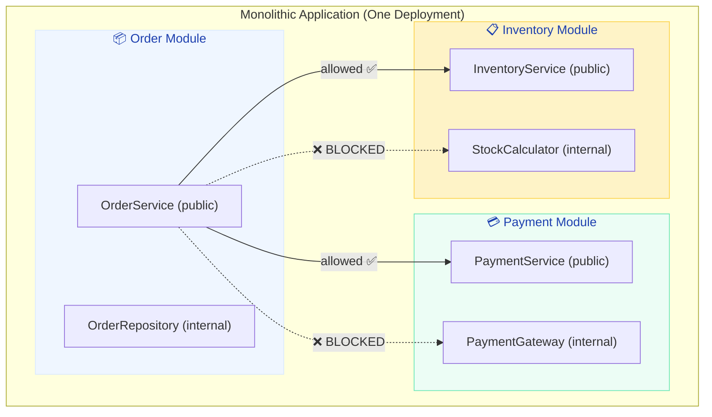
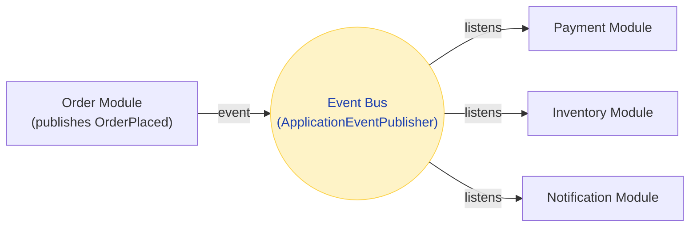

# Spring Modulith — The Modular Monolith

> **Get the simplicity of a monolith with the clean boundaries of microservices — decompose later when you actually need to, not because of hype.**

---

!!! abstract "Real-World Analogy"
    Spring Modulith is like a **well-designed office building**. Each floor (module) has its own purpose — accounting on floor 3, engineering on floor 5 — with clear receptions (public APIs) and restricted areas (internal implementation). Everyone shares the same building infrastructure (database, lobby, elevators), but floor 5 can't just walk into accounting's back office. When a floor grows too big, you can move it to a separate building (microservice) without redesigning the others.



---

## Why Modular Monolith?

### The Microservices Trap

| Stage | Team Size | Right Architecture |
|-------|-----------|-------------------|
| Startup (1-5 devs) | Small | Monolith |
| Growing (5-20 devs) | Medium | **Modular Monolith** |
| Scale (20-100+ devs) | Large | Microservices (extract as needed) |

!!! warning "The Industry Lesson"
    Netflix, Uber, and Amazon all started as monoliths. They decomposed into microservices AFTER hitting scaling problems, not before. Spotify, Shopify, and Basecamp run modular monoliths at massive scale TODAY. The question isn't "monolith or microservices?" — it's "how well-structured is your monolith?"

### Modular Monolith Advantages

| vs Pure Monolith | vs Microservices |
|------------------|-----------------|
| Clear module boundaries | Single deployment (simple ops) |
| Enforced encapsulation | Local method calls (no network) |
| Module-level testing | Shared transactions (ACID) |
| Documentation of dependencies | One codebase (easy debugging) |
| Easy extraction to microservice later | No distributed system complexity |

---

## Getting Started

### Dependencies

```xml
<dependency>
    <groupId>org.springframework.modulith</groupId>
    <artifactId>spring-modulith-starter-core</artifactId>
</dependency>
<dependency>
    <groupId>org.springframework.modulith</groupId>
    <artifactId>spring-modulith-starter-test</artifactId>
    <scope>test</scope>
</dependency>
```

### Package Structure = Module Structure

```
com.example.shop/
├── ShopApplication.java                  ← main class
├── order/                                ← 📦 Order Module
│   ├── OrderService.java                 ← PUBLIC (accessible by other modules)
│   ├── OrderController.java              ← PUBLIC
│   ├── Order.java                        ← PUBLIC (shared type)
│   └── internal/                         ← INTERNAL (only this module can access)
│       ├── OrderRepository.java
│       ├── OrderValidator.java
│       └── OrderMapper.java
├── payment/                              ← 💳 Payment Module
│   ├── PaymentService.java              ← PUBLIC
│   └── internal/
│       ├── StripeGateway.java
│       └── PaymentRepository.java
├── inventory/                            ← 📋 Inventory Module
│   ├── InventoryService.java            ← PUBLIC
│   └── internal/
│       ├── StockCalculator.java
│       └── WarehouseClient.java
└── shared/                               ← 🔗 Shared kernel (used by all)
    ├── Money.java
    └── DomainEvent.java
```

!!! info "Convention"
    - Top-level package under a module = **public API** (other modules can use)
    - `internal` sub-package = **private implementation** (module-internal only)
    - Spring Modulith enforces this at test time!

---

## Architecture Verification

### Module Boundary Tests

```java
@SpringBootTest
class ModularityTests {

    @Test
    void verifyModuleStructure() {
        ApplicationModules modules = ApplicationModules.of(ShopApplication.class);
        modules.verify();  // 💥 FAILS if any module accesses another's internals!
    }

    @Test
    void documentModules() {
        ApplicationModules modules = ApplicationModules.of(ShopApplication.class);
        // Generates docs/modulith-components.puml (architecture diagram!)
        new Documenter(modules)
            .writeModulesAsPlantUml()
            .writeIndividualModulesAsPlantUml();
    }
}
```

If `OrderService` tries to import `payment.internal.StripeGateway`, the test **FAILS**:

```
Module 'order' depends on non-exposed type 
  payment.internal.StripeGateway 
in module 'payment'!
```

---

## Event-Based Module Communication

Instead of direct method calls between modules (which creates coupling), use **application events**:

```java
// Order module publishes an event
@Service
@RequiredArgsConstructor
public class OrderService {

    private final ApplicationEventPublisher events;
    private final OrderRepository orderRepository;

    @Transactional
    public Order placeOrder(OrderRequest request) {
        Order order = orderRepository.save(new Order(request));

        // Publish event — decoupled from payment/inventory!
        events.publishEvent(new OrderPlaced(
            order.getId(), order.getCustomerId(), order.getTotal()
        ));

        return order;
    }
}

// The event (in order module's public API)
public record OrderPlaced(String orderId, String customerId, Money total) {}
```

```java
// Payment module listens (no import of order internals!)
@Service
public class PaymentEventHandler {

    @ApplicationModuleListener  // Spring Modulith's enhanced listener
    public void onOrderPlaced(OrderPlaced event) {
        paymentService.processPayment(event.orderId(), event.total());
    }
}

// Inventory module also listens
@Service
public class InventoryEventHandler {

    @ApplicationModuleListener
    public void onOrderPlaced(OrderPlaced event) {
        inventoryService.reserveStock(event.orderId());
    }
}
```



---

## Event Externalization (Bridge to Microservices)

When you're ready to extract a module into a separate service, Spring Modulith can externalize events to Kafka/RabbitMQ without changing your code:

```java
// Same code as before — just add @Externalized
@Externalized("orders.placed")  // published to Kafka topic "orders.placed"
public record OrderPlaced(String orderId, String customerId, Money total) {}
```

```yaml
spring:
  modulith:
    events:
      externalization:
        enabled: true
    kafka:
      topic-prefix: shop
```

Now `OrderPlaced` is published both locally (for in-process listeners) AND to Kafka (for external services). This is the smooth migration path:

1. Start with in-process events
2. Extract a module into a separate service
3. The external service listens on Kafka
4. Remove the in-process listener
5. No event schema changes needed

---

## Module Testing (Isolation)

```java
// Test a single module in isolation (fast, focused)
@ApplicationModuleTest
class OrderModuleTest {

    @Autowired
    private OrderService orderService;

    @Test
    void shouldCreateOrder(Scenario scenario) {
        // Given/When
        OrderRequest request = new OrderRequest("cust-1", List.of(item));

        // Execute and verify the published event
        scenario.stimulate(() -> orderService.placeOrder(request))
            .andWaitForEventOfType(OrderPlaced.class)
            .matchingMappedValue(OrderPlaced::customerId, "cust-1")
            .toArrive();
    }
}
```

---

## When to Extract to Microservice

| Signal | Action |
|--------|--------|
| Module needs independent scaling | Extract + HPA |
| Module needs different release cadence | Extract + separate CI/CD |
| Module needs different tech stack | Extract + polyglot |
| Module's team grows beyond 2-pizza size | Extract + team ownership |
| Module has no shared transactions with others | Safe to extract |
| Module still shares DB tables with others | NOT ready — decouple data first |

---

## Interview Questions

??? question "What's the difference between a modular monolith and microservices?"

    **Answer:** Both have clear module/service boundaries. The key differences:
    
    | Aspect | Modular Monolith | Microservices |
    |--------|-----------------|---------------|
    | Deployment | Single unit | Independent per service |
    | Communication | In-process method calls/events | Network (HTTP, gRPC, messaging) |
    | Transactions | ACID (shared DB) | Eventual consistency (Saga) |
    | Complexity | Application complexity | Operational complexity |
    | Team coupling | Shared codebase, separate modules | Separate codebases |
    
    The modular monolith is the **middle ground** — you get boundary enforcement without distributed system complexity.

??? question "When would you choose a modular monolith over microservices?"

    **Answer:** When:
    
    - Team is < 20 developers
    - Domain boundaries are still being discovered (wrong microservice boundaries are expensive to fix)
    - You need strong consistency (transactions across modules)
    - Operational maturity is low (no K8s, no service mesh, no distributed tracing yet)
    - Time to market matters more than independent scaling
    
    Rule of thumb: start modular monolith, extract to microservices only when you hit concrete scaling or team-autonomy problems.

??? question "How does Spring Modulith enforce boundaries at compile time vs runtime?"

    **Answer:** Spring Modulith enforces boundaries at **test time** (via `ApplicationModules.verify()`), not compile time. Java's package visibility (`package-private`) provides some compile-time protection, but isn't granular enough for module boundaries. The `verify()` test analyzes the dependency graph and fails if any module imports another module's `internal` package. This is similar to ArchUnit but integrated with Spring's module detection.
