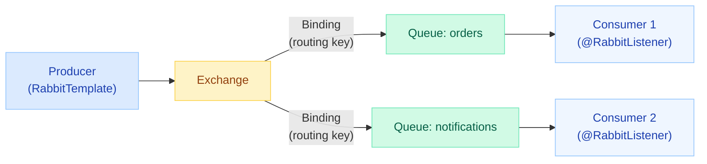
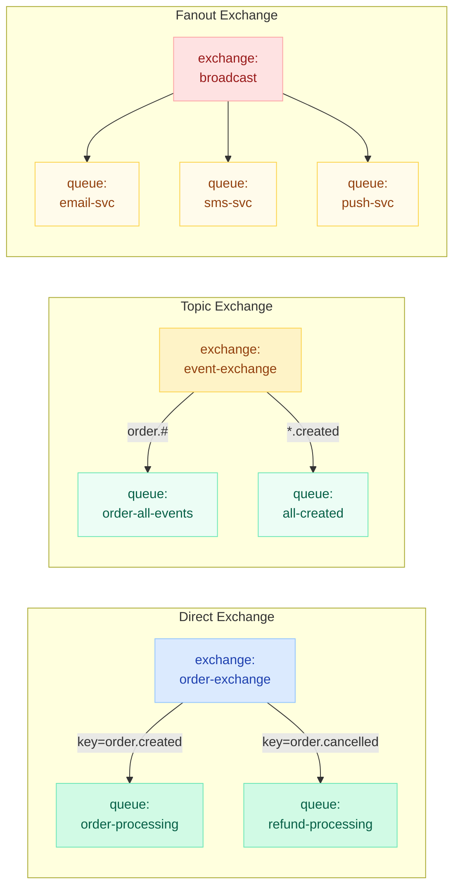
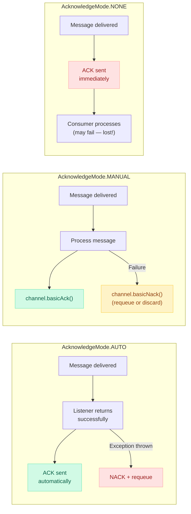
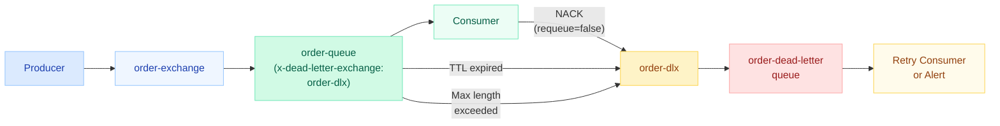
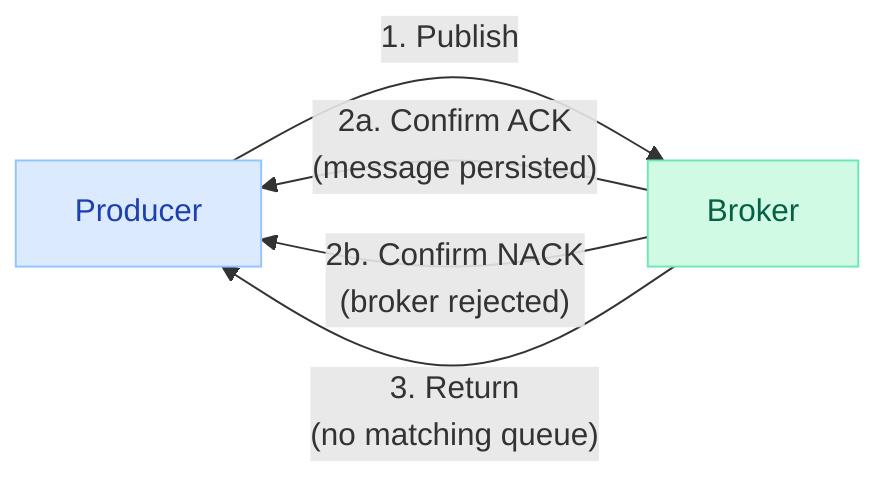

# Spring AMQP & RabbitMQ

> **Reliable messaging with RabbitMQ and Spring Boot — exchanges, bindings, publisher confirms, dead-letter exchanges, and production-grade error handling.**

---

!!! danger "Real Incident: Messages Lost Because Producer Did Not Wait for Broker ACK"
    A checkout service published order events using fire-and-forget mode (no publisher confirms). Under high load the broker experienced a brief network hiccup — 1,200 messages were silently dropped because the producer assumed sends succeeded. Meanwhile the fulfillment queue overflowed its `x-max-length` of 10,000 messages and started discarding from the head. Two failure modes stacked: no delivery guarantee on the publish side AND no overflow protection on the consume side. The fix: enable publisher confirms + returns, add a dead-letter exchange for overflow, and implement retry with back-off.

---

## RabbitMQ Core Concepts



| Concept | Purpose | Analogy |
|---|---|---|
| **Producer** | Publishes messages to an exchange | Mail sender |
| **Exchange** | Routes messages to queues based on rules | Post office sorting facility |
| **Binding** | Rule connecting exchange to queue (routing key or headers) | Forwarding rule |
| **Queue** | Stores messages until consumed | Mailbox |
| **Consumer** | Reads and processes messages | Mail recipient |
| **Virtual Host** | Logical isolation boundary (multi-tenancy) | Separate post offices |

!!! info "AMQP 0-9-1 Protocol"
    RabbitMQ implements AMQP 0-9-1. Messages are never sent directly to queues — they always pass through an exchange. The exchange type + binding rules determine routing. This decouples producers from consumers completely.

---

## Exchange Types



| Exchange Type | Routing Logic | Use Case |
|---|---|---|
| **Direct** | Exact routing key match | Command dispatch, task queues |
| **Topic** | Wildcard pattern match (`*` = one word, `#` = zero or more words) | Event fan-out by category |
| **Fanout** | Broadcast to ALL bound queues (ignores routing key) | Notifications, cache invalidation |
| **Headers** | Match on message headers (not routing key) | Complex multi-attribute routing |

### Routing Examples

```text
# Direct — exact match
routing_key = "order.created" → only queue bound with "order.created" receives it

# Topic — wildcards
routing_key = "order.created.us" 
  → "order.#"         ✓ matches (# = zero or more words)
  → "order.*.us"      ✓ matches (* = exactly one word)
  → "order.created"   ✗ no match (missing third word)

# Fanout — ignores routing key entirely
routing_key = "anything" → ALL bound queues receive the message
```

---

## Spring Boot Configuration

```yaml
spring:
  rabbitmq:
    host: localhost
    port: 5672
    username: guest
    password: ${RABBITMQ_PASSWORD:guest}
    virtual-host: /
    # Publisher confirms (Section 8)
    publisher-confirm-type: correlated
    publisher-returns: true
    # Connection pool
    connection-timeout: 5000
    requested-heartbeat: 30
    # Listener defaults
    listener:
      simple:
        acknowledge-mode: manual
        concurrency: 3
        max-concurrency: 10
        prefetch: 10
        retry:
          enabled: true
          initial-interval: 1000
          max-attempts: 3
          multiplier: 2.0
```

### Declaring Exchanges, Queues, and Bindings

```java
@Configuration
public class RabbitMQConfig {

    public static final String ORDER_EXCHANGE = "order-exchange";
    public static final String ORDER_QUEUE = "order-processing";
    public static final String ORDER_ROUTING_KEY = "order.created";

    @Bean
    public DirectExchange orderExchange() {
        return ExchangeBuilder.directExchange(ORDER_EXCHANGE)
            .durable(true)
            .build();
    }

    @Bean
    public Queue orderQueue() {
        return QueueBuilder.durable(ORDER_QUEUE)
            .withArgument("x-dead-letter-exchange", "order-dlx")
            .withArgument("x-dead-letter-routing-key", "order.dead")
            .withArgument("x-max-length", 50000)
            .build();
    }

    @Bean
    public Binding orderBinding(Queue orderQueue, DirectExchange orderExchange) {
        return BindingBuilder
            .bind(orderQueue)
            .to(orderExchange)
            .with(ORDER_ROUTING_KEY);
    }

    // Topic exchange example
    @Bean
    public TopicExchange eventExchange() {
        return ExchangeBuilder.topicExchange("event-exchange")
            .durable(true)
            .build();
    }

    @Bean
    public Queue allOrderEventsQueue() {
        return QueueBuilder.durable("order-all-events").build();
    }

    @Bean
    public Binding allOrderEventsBinding() {
        return BindingBuilder
            .bind(allOrderEventsQueue())
            .to(eventExchange())
            .with("order.#");
    }
}
```

---

## RabbitTemplate — Producing Messages

The primary abstraction for sending messages to RabbitMQ.

### convertAndSend

```java
@Service
@RequiredArgsConstructor
public class OrderEventPublisher {

    private final RabbitTemplate rabbitTemplate;

    // Simple send — uses configured MessageConverter
    public void publishOrderCreated(OrderEvent event) {
        rabbitTemplate.convertAndSend(
            "order-exchange",      // exchange
            "order.created",       // routing key
            event                  // payload (auto-converted to JSON)
        );
    }

    // Send with message post-processor (add headers)
    public void publishWithHeaders(OrderEvent event) {
        rabbitTemplate.convertAndSend("order-exchange", "order.created", event,
            message -> {
                message.getMessageProperties().setHeader("event-type", "ORDER_CREATED");
                message.getMessageProperties().setCorrelationId(event.getOrderId());
                message.getMessageProperties().setExpiration("60000"); // TTL 60s
                return message;
            });
    }

    // Send raw Message object
    public void publishRawMessage(OrderEvent event) {
        MessageProperties props = new MessageProperties();
        props.setContentType(MessageProperties.CONTENT_TYPE_JSON);
        props.setDeliveryMode(MessageDeliveryMode.PERSISTENT);
        props.setPriority(5);

        Message message = rabbitTemplate.getMessageConverter()
            .toMessage(event, props);
        rabbitTemplate.send("order-exchange", "order.created", message);
    }
}
```

### sendAndReceive (RPC Pattern)

```java
// Synchronous RPC — sends request, blocks for reply
public OrderValidationResult validateOrder(OrderRequest request) {
    Object response = rabbitTemplate.convertSendAndReceive(
        "validation-exchange",
        "order.validate",
        request
    );
    return (OrderValidationResult) response;
}

// Async RPC with AsyncRabbitTemplate
@Bean
public AsyncRabbitTemplate asyncRabbitTemplate(RabbitTemplate rabbitTemplate) {
    return new AsyncRabbitTemplate(rabbitTemplate);
}

public CompletableFuture<OrderValidationResult> validateOrderAsync(OrderRequest req) {
    RabbitConverterFuture<OrderValidationResult> future =
        asyncRabbitTemplate.convertSendAndReceive(
            "validation-exchange", "order.validate", req);
    return future.toCompletableFuture();
}
```

### Message Converters

```java
@Bean
public MessageConverter messageConverter() {
    Jackson2JsonMessageConverter converter = new Jackson2JsonMessageConverter();
    // Configure ObjectMapper if needed
    converter.setCreateMessageIds(true);
    return converter;
}

@Bean
public RabbitTemplate rabbitTemplate(ConnectionFactory connectionFactory,
                                     MessageConverter messageConverter) {
    RabbitTemplate template = new RabbitTemplate(connectionFactory);
    template.setMessageConverter(messageConverter);
    template.setExchange("order-exchange");
    template.setRoutingKey("order.created");
    return template;
}
```

---

## @RabbitListener — Consuming Messages

### Basic Listener

```java
@Component
@Slf4j
public class OrderEventConsumer {

    // Simple — auto-acknowledge on return
    @RabbitListener(queues = "order-processing")
    public void handleOrderCreated(OrderEvent event) {
        log.info("Received order: {}", event.getOrderId());
        orderService.processOrder(event);
    }

    // Access full Message + Channel for manual ack
    @RabbitListener(queues = "order-processing")
    public void handleWithManualAck(OrderEvent event, Channel channel,
                                     @Header(AmqpHeaders.DELIVERY_TAG) long tag) {
        try {
            orderService.processOrder(event);
            channel.basicAck(tag, false);  // false = only this message
        } catch (Exception e) {
            channel.basicNack(tag, false, true);  // requeue
        }
    }

    // Multiple queues
    @RabbitListener(queues = {"order-processing", "order-priority"})
    public void handleMultipleQueues(OrderEvent event) {
        orderService.processOrder(event);
    }
}
```

### containerFactory and Concurrency

```java
@Configuration
public class ListenerConfig {

    @Bean
    public SimpleRabbitListenerContainerFactory highThroughputFactory(
            ConnectionFactory connectionFactory,
            MessageConverter messageConverter) {
        SimpleRabbitListenerContainerFactory factory =
            new SimpleRabbitListenerContainerFactory();
        factory.setConnectionFactory(connectionFactory);
        factory.setMessageConverter(messageConverter);
        factory.setConcurrentConsumers(5);
        factory.setMaxConcurrentConsumers(20);
        factory.setPrefetchCount(25);
        factory.setAcknowledgeMode(AcknowledgeMode.MANUAL);
        return factory;
    }
}

@RabbitListener(
    queues = "high-volume-queue",
    containerFactory = "highThroughputFactory",
    concurrency = "5-20"  // min 5, max 20 consumer threads
)
public void handleHighVolume(OrderEvent event, Channel channel,
                              @Header(AmqpHeaders.DELIVERY_TAG) long tag)
        throws IOException {
    orderService.processOrder(event);
    channel.basicAck(tag, false);
}
```

### Declarative Queue/Binding via @RabbitListener

```java
@RabbitListener(bindings = @QueueBinding(
    value = @Queue(value = "notification-queue", durable = "true"),
    exchange = @Exchange(value = "event-exchange", type = ExchangeTypes.TOPIC),
    key = "notification.#"
))
public void handleNotification(NotificationEvent event) {
    notificationService.send(event);
}
```

---

## Message Acknowledgment



| Mode | Behavior | When to Use |
|---|---|---|
| **AUTO** | ACK after listener returns without exception. NACK + requeue on exception. | Default — good for most cases |
| **MANUAL** | You call `channel.basicAck()` / `basicNack()` yourself | When you need fine-grained control (batch ack, conditional requeue) |
| **NONE** | Broker removes message immediately on delivery (fire-and-forget) | Only for non-critical messages you can afford to lose |

!!! warning "AUTO Mode Gotcha"
    With `AUTO`, if your listener throws an exception, the message is requeued and redelivered immediately — potentially causing an infinite retry loop. Always pair `AUTO` mode with retry configuration or a dead-letter exchange.

---

## Dead Letter Exchange (DLX) — Retry Pattern with TTL

A DLX captures messages that cannot be processed — rejected, expired, or queue-overflowed.



### Retry with TTL + DLX (Delayed Retry Pattern)

Messages that fail are sent to a wait queue with a TTL. After the TTL expires, they route back to the original queue for reprocessing.

```java
@Configuration
public class RetryConfig {

    // Main queue — points to DLX on failure
    @Bean
    public Queue orderQueue() {
        return QueueBuilder.durable("order-queue")
            .withArgument("x-dead-letter-exchange", "order-retry-exchange")
            .withArgument("x-dead-letter-routing-key", "order.retry")
            .build();
    }

    // Wait queue — messages sit here for TTL then route back
    @Bean
    public Queue orderRetryQueue() {
        return QueueBuilder.durable("order-retry-queue")
            .withArgument("x-dead-letter-exchange", "order-exchange")
            .withArgument("x-dead-letter-routing-key", "order.created")
            .withArgument("x-message-ttl", 30000)  // 30 seconds wait
            .build();
    }

    // Final dead letter queue — after max retries
    @Bean
    public Queue orderDeadLetterQueue() {
        return QueueBuilder.durable("order-dead-letter").build();
    }

    @Bean
    public DirectExchange retryExchange() {
        return new DirectExchange("order-retry-exchange");
    }

    @Bean
    public Binding retryBinding() {
        return BindingBuilder
            .bind(orderRetryQueue())
            .to(retryExchange())
            .with("order.retry");
    }
}
```

### Consumer with Retry Count Header

```java
@RabbitListener(queues = "order-queue")
public void handleOrder(OrderEvent event, Channel channel,
                         @Header(AmqpHeaders.DELIVERY_TAG) long tag,
                         @Header(name = "x-retry-count",
                                 required = false,
                                 defaultValue = "0") int retryCount)
        throws IOException {
    try {
        orderService.processOrder(event);
        channel.basicAck(tag, false);
    } catch (TransientException e) {
        if (retryCount < 3) {
            // Send to retry queue with incremented count
            rabbitTemplate.convertAndSend("order-retry-exchange", "order.retry", event,
                msg -> {
                    msg.getMessageProperties().setHeader("x-retry-count", retryCount + 1);
                    return msg;
                });
            channel.basicAck(tag, false);  // ack original
        } else {
            // Max retries exceeded — send to dead letter
            channel.basicNack(tag, false, false);  // don't requeue
        }
    }
}
```

---

## Publisher Confirms and Returns

Publisher confirms ensure the broker received your message. Returns notify you when a message cannot be routed to any queue.



### Configuration

```java
@Configuration
public class PublisherConfirmConfig {

    @Bean
    public RabbitTemplate rabbitTemplate(ConnectionFactory connectionFactory,
                                         MessageConverter messageConverter) {
        RabbitTemplate template = new RabbitTemplate(connectionFactory);
        template.setMessageConverter(messageConverter);
        template.setMandatory(true);  // enable returns for unroutable messages

        // Confirm callback — broker ACK/NACK
        template.setConfirmCallback((correlationData, ack, cause) -> {
            if (ack) {
                log.debug("Message confirmed: {}", correlationData);
            } else {
                log.error("Message NACK'd: {} reason: {}", correlationData, cause);
                // Trigger retry or alert
            }
        });

        // Return callback — message could not be routed
        template.setReturnsCallback(returned -> {
            log.error("Message returned: exchange={}, routingKey={}, replyCode={}, replyText={}",
                returned.getExchange(),
                returned.getRoutingKey(),
                returned.getReplyCode(),
                returned.getReplyText());
            // Store for retry or send to fallback queue
        });

        return template;
    }
}
```

### Sending with Correlation Data

```java
public void publishWithConfirm(OrderEvent event) {
    CorrelationData correlationData = new CorrelationData(event.getOrderId());

    rabbitTemplate.convertAndSend("order-exchange", "order.created",
        event, correlationData);

    // Optionally wait for confirm (blocking)
    try {
        CorrelationData.Confirm confirm =
            correlationData.getFuture().get(5, TimeUnit.SECONDS);
        if (!confirm.isAck()) {
            log.error("Publish not confirmed for order: {}", event.getOrderId());
            // Handle failure
        }
    } catch (TimeoutException e) {
        log.error("Confirm timeout for order: {}", event.getOrderId());
    }
}
```

!!! tip "Publisher Confirms vs Transactions"
    Transactions (`channel.txSelect()` / `txCommit()`) are 250x slower than confirms. Always prefer publisher confirms for production workloads. Transactions are only useful when you need atomic publish of multiple messages in a single batch.

---

## Error Handling: RetryTemplate and RepublishMessageRecoverer

### RetryTemplate (Spring Retry)

Retries within the consumer thread before giving up.

```java
@Bean
public SimpleRabbitListenerContainerFactory retryContainerFactory(
        ConnectionFactory connectionFactory,
        MessageConverter messageConverter) {
    SimpleRabbitListenerContainerFactory factory =
        new SimpleRabbitListenerContainerFactory();
    factory.setConnectionFactory(connectionFactory);
    factory.setMessageConverter(messageConverter);
    factory.setAdviceChain(retryInterceptor());
    return factory;
}

@Bean
public RetryOperationsInterceptor retryInterceptor() {
    return RetryInterceptorBuilder.stateless()
        .maxAttempts(3)
        .backOffOptions(1000, 2.0, 10000)  // initial, multiplier, max
        .recoverer(republishMessageRecoverer())
        .build();
}
```

### RepublishMessageRecoverer

After all retries are exhausted, republish to an error exchange instead of losing the message.

```java
@Bean
public RepublishMessageRecoverer republishMessageRecoverer() {
    return new RepublishMessageRecoverer(
        rabbitTemplate,
        "error-exchange",        // target exchange
        "error.order-processing" // routing key
    );
}
```

The recoverer automatically adds these headers to the republished message:

| Header | Content |
|---|---|
| `x-exception-message` | Exception message text |
| `x-exception-stacktrace` | Full stack trace |
| `x-original-exchange` | Where the message was originally published |
| `x-original-routingKey` | Original routing key |

### Custom Error Handler

```java
@Bean
public SimpleRabbitListenerContainerFactory customFactory(
        ConnectionFactory connectionFactory) {
    SimpleRabbitListenerContainerFactory factory =
        new SimpleRabbitListenerContainerFactory();
    factory.setConnectionFactory(connectionFactory);
    factory.setErrorHandler(new ConditionalRejectingErrorHandler(
        new CustomFatalExceptionStrategy()));
    return factory;
}

public class CustomFatalExceptionStrategy
        extends ConditionalRejectingErrorHandler.DefaultExceptionStrategy {

    @Override
    public boolean isFatal(Throwable t) {
        // Don't retry these — they will never succeed
        return t.getCause() instanceof JsonParseException
            || t.getCause() instanceof ValidationException;
    }
}
```

---

## Spring Cloud Stream with RabbitMQ Binder

Spring Cloud Stream abstracts the messaging middleware behind functional interfaces.

```yaml
spring:
  cloud:
    stream:
      bindings:
        orderProcessor-in-0:
          destination: order-events
          group: order-service
          consumer:
            max-attempts: 3
            back-off-initial-interval: 1000
        orderProcessor-out-0:
          destination: order-processed-events
      rabbit:
        bindings:
          orderProcessor-in-0:
            consumer:
              acknowledge-mode: manual
              prefetch: 10
              exchange-type: topic
              binding-routing-key: "order.#"
```

### Functional Consumers and Suppliers

```java
@Configuration
public class StreamConfig {

    // Consumer — receives from "order-events" topic
    @Bean
    public Function<OrderEvent, ProcessedOrderEvent> orderProcessor() {
        return event -> {
            log.info("Processing order: {}", event.getOrderId());
            // transform and forward to output binding
            return new ProcessedOrderEvent(event.getOrderId(), "PROCESSED");
        };
    }

    // Consumer only (no output)
    @Bean
    public Consumer<NotificationEvent> notificationConsumer() {
        return event -> notificationService.send(event);
    }

    // Supplier — produces messages on a schedule
    @Bean
    public Supplier<Flux<HeartbeatEvent>> heartbeatProducer() {
        return () -> Flux.interval(Duration.ofSeconds(30))
            .map(i -> new HeartbeatEvent("order-service", Instant.now()));
    }
}
```

### Benefits over Raw Spring AMQP

| Feature | Spring AMQP | Spring Cloud Stream |
|---|---|---|
| Broker coupling | Tightly coupled to RabbitMQ | Binder abstraction (swap Kafka/RabbitMQ) |
| Configuration | Programmatic beans | Declarative YAML |
| Consumer groups | Manual | Built-in |
| Partitioning | Manual | Built-in support |
| Error channels | Manual setup | Automatic |
| Testing | TestRabbitTemplate | TestChannelBinder |

---

## Testing

### Unit Testing with @RabbitListenerTest

```java
@SpringBootTest
@RabbitListenerTest(capture = true)
class OrderEventConsumerTest {

    @Autowired
    private RabbitListenerTestHarness harness;

    @Autowired
    private RabbitTemplate rabbitTemplate;

    @Test
    void shouldProcessOrderEvent() throws Exception {
        OrderEvent event = new OrderEvent("ORD-123", "CREATED");

        rabbitTemplate.convertAndSend("order-exchange", "order.created", event);

        // Get the invocation result from the listener
        InvocationData invocation = harness
            .getNextInvocationDataFor("orderListener", 5, TimeUnit.SECONDS);

        assertThat(invocation).isNotNull();
        assertThat(invocation.getArguments()[0]).isEqualTo(event);
    }
}

// The listener must have an id:
@RabbitListener(id = "orderListener", queues = "order-processing")
public void handleOrder(OrderEvent event) { ... }
```

### Integration Testing with Testcontainers

```java
@SpringBootTest
@Testcontainers
class RabbitMQIntegrationTest {

    @Container
    static RabbitMQContainer rabbit = new RabbitMQContainer("rabbitmq:3.12-management")
        .withExposedPorts(5672, 15672);

    @DynamicPropertySource
    static void configure(DynamicPropertyRegistry registry) {
        registry.add("spring.rabbitmq.host", rabbit::getHost);
        registry.add("spring.rabbitmq.port", rabbit::getAmqpPort);
        registry.add("spring.rabbitmq.username", () -> "guest");
        registry.add("spring.rabbitmq.password", () -> "guest");
    }

    @Autowired
    private RabbitTemplate rabbitTemplate;

    @Autowired
    private OrderRepository orderRepository;

    @Test
    void endToEnd_orderCreatedEvent_persistsOrder() {
        OrderEvent event = new OrderEvent("ORD-456", "CREATED");

        rabbitTemplate.convertAndSend("order-exchange", "order.created", event);

        // Wait for async consumer to process
        await().atMost(Duration.ofSeconds(5)).untilAsserted(() -> {
            Optional<Order> order = orderRepository.findById("ORD-456");
            assertThat(order).isPresent();
            assertThat(order.get().getStatus()).isEqualTo("PROCESSED");
        });
    }

    @Test
    void poisonMessage_routedToDeadLetter() {
        // Send invalid payload
        rabbitTemplate.convertAndSend("order-exchange", "order.created",
            "not-a-valid-json-object");

        await().atMost(Duration.ofSeconds(10)).untilAsserted(() -> {
            Message dlqMessage = rabbitTemplate.receive("order-dead-letter", 1000);
            assertThat(dlqMessage).isNotNull();
            assertThat(dlqMessage.getMessageProperties().getHeaders())
                .containsKey("x-exception-message");
        });
    }
}
```

---

## Quick Recall

| Topic | Key Point |
|---|---|
| Exchange types | Direct (exact key), Topic (wildcard), Fanout (broadcast), Headers (attributes) |
| RabbitTemplate | `convertAndSend()` for fire-and-send, `convertSendAndReceive()` for RPC |
| @RabbitListener | `queues`, `containerFactory`, `concurrency`, `bindings` for inline declaration |
| Ack modes | AUTO (default, ack on success), MANUAL (you control), NONE (fire-and-forget) |
| DLX | Configure `x-dead-letter-exchange` on queue. Captures rejected/expired/overflow |
| TTL retry | Wait queue with TTL routes back to main queue via DLX chain |
| Publisher confirms | Broker ACKs back to producer. Use `CorrelationData` for tracking |
| Returns | Notification when message is unroutable (no matching queue) |
| RepublishMessageRecoverer | After retries exhausted, republish to error exchange with exception headers |
| Spring Cloud Stream | Functional binder abstraction — swap RabbitMQ/Kafka via config |
| Prefetch | Controls how many unacknowledged messages a consumer holds. Lower = fairer distribution |
| Connection vs Channel | One TCP connection, many lightweight channels. Don't create connections per publish |

---

## Interview Prep Template

??? question "1. How does RabbitMQ routing work?"
    Messages always go to an exchange, never directly to a queue. The exchange type determines routing: Direct requires exact routing key match. Topic uses wildcard patterns (`*` = one word, `#` = zero or more). Fanout broadcasts to all bound queues. Headers matches on message header attributes. Bindings are the rules connecting exchanges to queues.

??? question "2. What is the difference between publisher confirms and transactions?"
    Publisher confirms are asynchronous — the broker ACKs each message after persisting it. They are lightweight and production-ready. Transactions (`txSelect/txCommit`) are synchronous and 250x slower. Transactions guarantee atomic publish of a batch. Confirms guarantee individual message delivery. Always prefer confirms unless you need atomic batch semantics.

??? question "3. How do you prevent message loss end-to-end?"
    Three guarantees needed: (1) Publisher confirms ensure the broker received and persisted the message. (2) Durable queues and persistent messages survive broker restarts. (3) Manual acknowledgment ensures the consumer only ACKs after successful processing. Additionally, set `mandatory=true` with a returns callback to detect unroutable messages.

??? question "4. Explain the Dead Letter Exchange pattern."
    A DLX is a normal exchange configured as the `x-dead-letter-exchange` argument on a queue. Messages are routed there when: consumer rejects with `requeue=false`, message TTL expires, or queue max-length is exceeded. Common pattern: DLX routes to a dead-letter queue for monitoring/alerting, or to a retry queue with TTL for delayed reprocessing.

??? question "5. What is prefetch and how does it affect throughput?"
    Prefetch (`basic.qos`) controls how many unacknowledged messages the broker sends to a consumer. Low prefetch (1) = fair distribution, higher latency. High prefetch (100+) = better throughput, risk of uneven load. With `AUTO` ack mode, messages are ACK'd after listener returns — high prefetch is safe. With `MANUAL`, unacknowledged messages count against the limit.

??? question "6. How does Spring Cloud Stream differ from Spring AMQP?"
    Spring Cloud Stream provides a binder abstraction. You write functional beans (`Function`, `Consumer`, `Supplier`). The binder handles exchange/queue creation, serialization, consumer groups, and error channels. You can swap RabbitMQ for Kafka by changing a dependency and config — no code changes. Trade-off: less fine-grained control over RabbitMQ-specific features.

??? question "7. How do you implement delayed retry with RabbitMQ?"
    Use a DLX chain: Main queue DLXs to a retry exchange which routes to a wait queue. The wait queue has a TTL (e.g., 30s) and its own DLX pointing back to the main exchange. Failed messages bounce between main and wait queues with increasing TTL. Track retry count in a custom header. After max retries, route to a final dead-letter queue.

??? question "8. When should you choose RabbitMQ over Kafka?"
    RabbitMQ: complex routing (topic, headers, priority queues), RPC pattern, per-message acknowledgment, low-latency delivery to specific consumers. Kafka: massive throughput, event sourcing, replay/rewind, long-term storage, stream processing. RabbitMQ is a message broker (smart routing). Kafka is a distributed log (dumb broker, smart consumers).

??? question "9. What happens if the consumer throws an exception with AUTO ack mode?"
    The message is NACK'd and requeued by default. Without retry limits or a DLX, this creates an infinite loop: deliver, fail, requeue, deliver, fail. Fix: configure `spring.rabbitmq.listener.simple.retry` to limit attempts, or add a DLX so rejected messages go to a dead-letter queue after max redeliveries.

??? question "10. How do you ensure ordering in RabbitMQ?"
    Within a single queue with a single consumer and prefetch=1, messages are processed in FIFO order. Multiple consumers on the same queue break ordering. Topic exchanges with multiple bound queues break ordering. For strict ordering: use a single consumer per queue, or partition by routing key to dedicated queues. Trade-off: ordering limits throughput.
