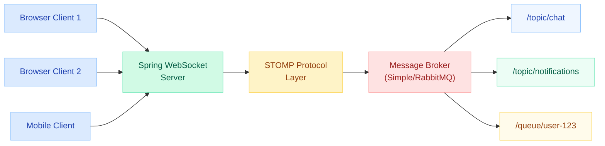
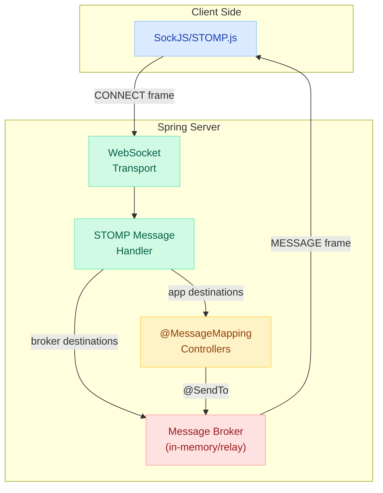
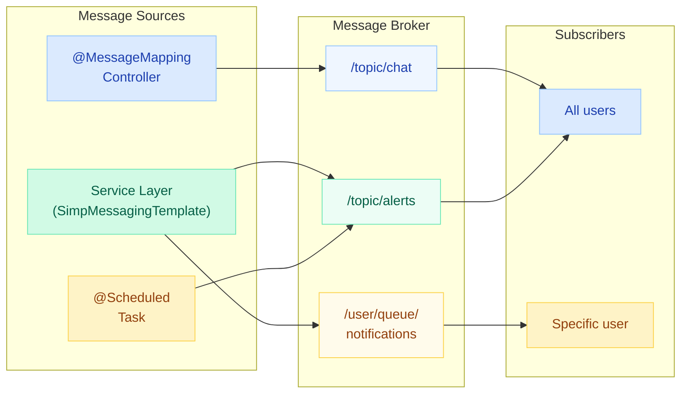
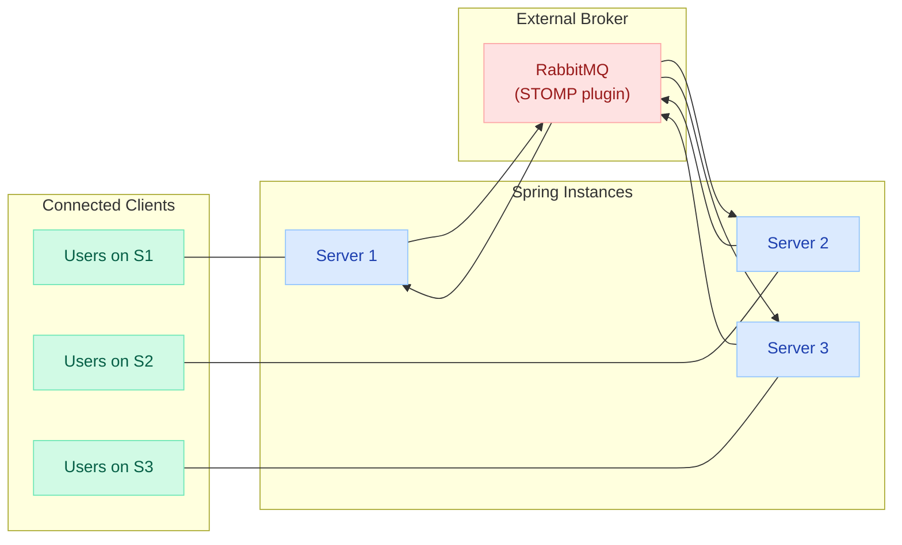
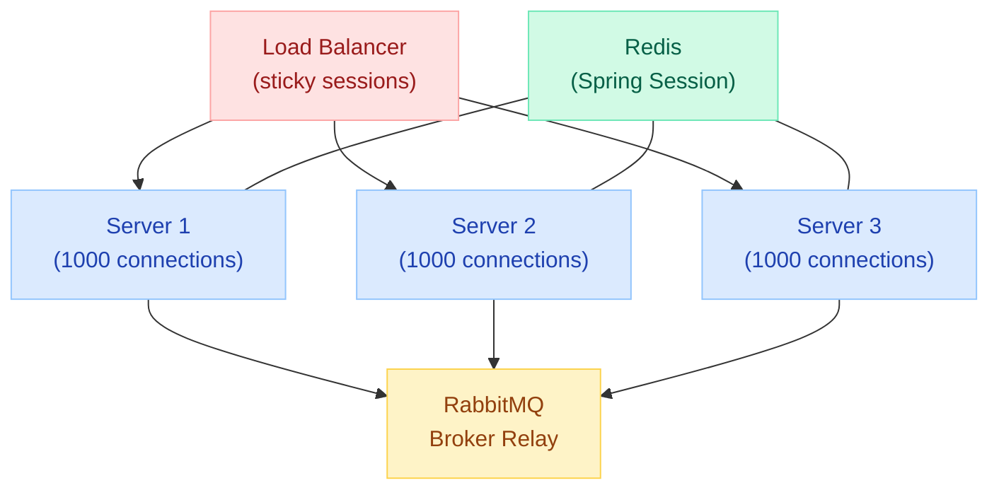

# Spring WebSocket & Real-Time Communication

> **Full-duplex, persistent connections for real-time features — chat, notifications, live dashboards, collaborative editing. One TCP connection replaces thousands of HTTP polls.**

---

!!! danger "Real Incident: Polling-Based Chat Costing 10x More Than WebSocket"
    A SaaS team built their chat feature using HTTP polling every 2 seconds per user. With 50,000 concurrent users, that was 25,000 requests/second hitting API servers — each requiring full HTTP handshake, authentication, database query, and response serialization. Monthly AWS bill: $47,000. After migrating to WebSocket with STOMP, the same traffic ran on 3 servers instead of 30. Monthly bill dropped to $4,200. Polling creates O(users x frequency) load; WebSocket creates O(messages) load.



---

## WebSocket vs HTTP Polling vs SSE

| Feature | HTTP Polling | Server-Sent Events | WebSocket |
|---|---|---|---|
| **Direction** | Client-to-server only | Server-to-client only | Full-duplex (both) |
| **Connection** | New per request | Persistent (one-way) | Persistent (two-way) |
| **Overhead** | High (headers every request) | Low (single HTTP) | Very low (2-byte frame) |
| **Latency** | Polling interval delay | Real-time push | Real-time both ways |
| **Use case** | Simple status checks | Live feeds, notifications | Chat, gaming, collaboration |
| **Protocol** | HTTP | HTTP | `ws://` or `wss://` |

---

## Raw WebSocket (WebSocketHandler)

Low-level API for when you need full control over the WebSocket lifecycle. No messaging abstractions — just raw frames.

### When to Use Raw WebSocket

- Binary protocols (file uploads, streaming media)
- Custom sub-protocols not based on STOMP
- Minimal overhead / high-frequency updates (gaming, IoT)
- You need control over every frame

### Configuration

```java
@Configuration
@EnableWebSocket
public class WebSocketConfig implements WebSocketConfigurer {

    @Override
    public void registerWebSocketHandlers(WebSocketHandlerRegistry registry) {
        registry.addHandler(chatHandler(), "/ws/chat")
                .setAllowedOrigins("https://myapp.com")
                .addInterceptors(new HttpSessionHandshakeInterceptor());
    }

    @Bean
    public WebSocketHandler chatHandler() {
        return new ChatWebSocketHandler();
    }
}
```

### Handler Implementation

```java
public class ChatWebSocketHandler extends TextWebSocketHandler {

    private final Set<WebSocketSession> sessions = 
        ConcurrentHashMap.newKeySet();

    @Override
    public void afterConnectionEstablished(WebSocketSession session) {
        sessions.add(session);
        log.info("Connected: {} (total: {})", 
            session.getId(), sessions.size());
    }

    @Override
    protected void handleTextMessage(WebSocketSession session, 
                                     TextMessage message) throws Exception {
        String payload = message.getPayload();
        ChatMessage msg = objectMapper.readValue(payload, ChatMessage.class);
        
        // Broadcast to all connected clients
        TextMessage broadcast = new TextMessage(
            objectMapper.writeValueAsString(msg));
        for (WebSocketSession s : sessions) {
            if (s.isOpen()) {
                s.sendMessage(broadcast);
            }
        }
    }

    @Override
    public void afterConnectionClosed(WebSocketSession session, 
                                      CloseStatus status) {
        sessions.remove(session);
        log.info("Disconnected: {} (reason: {})", 
            session.getId(), status.getReason());
    }

    @Override
    public void handleTransportError(WebSocketSession session, 
                                     Throwable exception) {
        log.error("Transport error for {}: {}", 
            session.getId(), exception.getMessage());
        sessions.remove(session);
    }
}
```

!!! warning "Raw WebSocket Limitations"
    You must handle: message routing, user tracking, reconnection, heartbeats, and serialization yourself. For most applications, STOMP over WebSocket is the better choice.

---

## STOMP over WebSocket

STOMP (Simple Text Oriented Messaging Protocol) adds messaging semantics on top of WebSocket — destinations, subscriptions, headers, and message acknowledgment.



### STOMP Configuration

```java
@Configuration
@EnableWebSocketMessageBroker
public class WebSocketStompConfig 
        implements WebSocketMessageBrokerConfigurer {

    @Override
    public void configureMessageBroker(MessageBrokerRegistry config) {
        // Enable simple in-memory broker for /topic and /queue prefixes
        config.enableSimpleBroker("/topic", "/queue")
              .setHeartbeatValue(new long[]{10000, 10000})
              .setTaskScheduler(heartbeatScheduler());
        
        // Prefix for messages bound for @MessageMapping methods
        config.setApplicationDestinationPrefixes("/app");
        
        // Prefix for user-specific destinations
        config.setUserDestinationPrefix("/user");
    }

    @Override
    public void registerStompEndpoints(StompEndpointRegistry registry) {
        registry.addEndpoint("/ws")
                .setAllowedOriginPatterns("https://*.myapp.com")
                .withSockJS(); // Fallback for non-WebSocket browsers
    }

    @Bean
    public TaskScheduler heartbeatScheduler() {
        ThreadPoolTaskScheduler scheduler = new ThreadPoolTaskScheduler();
        scheduler.setPoolSize(1);
        scheduler.setThreadNamePrefix("ws-heartbeat-");
        return scheduler;
    }
}
```

---

## @MessageMapping, @SendTo, @SubscribeMapping

### @MessageMapping — Handling Incoming Messages

```java
@Controller
public class ChatController {

    // Client sends to: /app/chat.send
    // Response goes to: /topic/chat (broadcast)
    @MessageMapping("/chat.send")
    @SendTo("/topic/chat")
    public ChatMessage sendMessage(ChatMessage message) {
        message.setTimestamp(Instant.now());
        return message; // Returned object is sent to /topic/chat
    }

    // With SimpMessageHeaderAccessor for metadata
    @MessageMapping("/chat.send")
    @SendTo("/topic/chat")
    public ChatMessage sendWithHeaders(
            ChatMessage message,
            SimpMessageHeaderAccessor headerAccessor) {
        
        String sessionId = headerAccessor.getSessionId();
        String user = headerAccessor.getUser().getName();
        message.setSender(user);
        return message;
    }

    // Multiple destinations
    @MessageMapping("/order.create")
    @SendTo({"/topic/orders", "/topic/admin.orders"})
    public OrderEvent createOrder(OrderRequest request) {
        Order order = orderService.create(request);
        return new OrderEvent("CREATED", order);
    }
}
```

### @SendToUser — User-Specific Messages

```java
@Controller
public class NotificationController {

    // Client subscribes to: /user/queue/errors
    // Only the sending user receives this response
    @MessageMapping("/trade.execute")
    @SendToUser("/queue/errors")
    public TradeError handleTrade(TradeRequest request) {
        if (!validationService.isValid(request)) {
            return new TradeError("Invalid trade parameters");
        }
        // Normal path — don't return error
        tradeService.execute(request);
        return null; // null = no message sent
    }
}
```

### @SubscribeMapping — Reply on Subscription

```java
@Controller
public class DataController {

    // When client subscribes to /app/initial-data,
    // immediately send current state (no broker involved)
    @SubscribeMapping("/initial-data")
    public List<ChatMessage> onSubscribe() {
        return chatService.getRecentMessages(50);
    }
}
```

!!! info "Destination Routing Rules"
    - `/app/**` — routed to `@MessageMapping` controller methods
    - `/topic/**` — broadcast to all subscribers (pub/sub)
    - `/queue/**` — point-to-point (typically user-specific)
    - `/user/**` — resolved to user-specific queue

---

## SimpMessagingTemplate

Programmatic message sending — from any Spring bean, not just controllers.

```java
@Service
@RequiredArgsConstructor
public class NotificationService {

    private final SimpMessagingTemplate messagingTemplate;

    // Broadcast to all subscribers of a topic
    public void broadcastAlert(SystemAlert alert) {
        messagingTemplate.convertAndSend("/topic/alerts", alert);
    }

    // Send to a specific user (requires user authentication)
    public void notifyUser(String username, Notification notification) {
        messagingTemplate.convertAndSendToUser(
            username,           // Spring Security principal name
            "/queue/notifications",  // Destination
            notification        // Payload
        );
    }

    // Send with custom headers
    public void sendWithHeaders(String destination, Object payload) {
        SimpMessageHeaderAccessor accessor = 
            SimpMessageHeaderAccessor.create(SimpMessageType.MESSAGE);
        accessor.setHeader("priority", "HIGH");
        accessor.setLeaveMutable(true);

        messagingTemplate.convertAndSend(
            destination, payload, accessor.getMessageHeaders());
    }

    // Send from async/scheduled task
    @Scheduled(fixedRate = 5000)
    public void pushLiveMetrics() {
        Metrics metrics = metricsService.getCurrentMetrics();
        messagingTemplate.convertAndSend("/topic/metrics", metrics);
    }
}
```



---

## Message Broker: Simple vs External Relay

### Simple In-Memory Broker

```java
// Default — good for development and single-instance deployments
config.enableSimpleBroker("/topic", "/queue");
```

| Pros | Cons |
|---|---|
| Zero setup | No persistence — messages lost on restart |
| Low latency | Single server only — no horizontal scaling |
| No external dependencies | No guaranteed delivery |
| Great for dev/test | No message acknowledgment |

### External Broker Relay (RabbitMQ / ActiveMQ)

```java
@Override
public void configureMessageBroker(MessageBrokerRegistry config) {
    config.enableStompBrokerRelay("/topic", "/queue")
          .setRelayHost("rabbitmq.internal")
          .setRelayPort(61613)           // STOMP port
          .setClientLogin("app-user")
          .setClientPasscode("secret")
          .setSystemLogin("system-user")
          .setSystemPasscode("system-secret")
          .setSystemHeartbeatSendInterval(10000)
          .setSystemHeartbeatReceiveInterval(10000);

    config.setApplicationDestinationPrefixes("/app");
    config.setUserDestinationPrefix("/user");
}
```



| Feature | Simple Broker | External Relay |
|---|---|---|
| **Multi-instance** | No | Yes |
| **Persistence** | No | Yes (configurable) |
| **Guaranteed delivery** | No | Yes |
| **Message acknowledgment** | No | Yes |
| **Scalability** | Single JVM | Horizontally scalable |
| **Dependencies** | None | RabbitMQ/ActiveMQ |
| **Production ready** | No | Yes |

---

## SockJS Fallback

SockJS provides transparent fallback transports when WebSocket is unavailable (corporate proxies, old browsers, misconfigured firewalls).

### Fallback Transport Order

1. **WebSocket** — native `ws://` connection
2. **XHR Streaming** — long-lived HTTP response
3. **XHR Polling** — repeated HTTP requests
4. **IFrame-based** — for older browsers

### Server Configuration

```java
@Override
public void registerStompEndpoints(StompEndpointRegistry registry) {
    registry.addEndpoint("/ws")
            .setAllowedOriginPatterns("*")
            .withSockJS()
            .setStreamBytesLimit(512 * 1024)     // 512KB
            .setHttpMessageCacheSize(1000)
            .setDisconnectDelay(30 * 1000)       // 30 seconds
            .setHeartbeatTime(25000);            // 25 seconds
}
```

### Client (JavaScript)

```javascript
import SockJS from 'sockjs-client';
import { Client } from '@stomp/stompjs';

const client = new Client({
    webSocketFactory: () => new SockJS('/ws'),
    reconnectDelay: 5000,
    heartbeatIncoming: 10000,
    heartbeatOutgoing: 10000,

    onConnect: (frame) => {
        console.log('Connected:', frame);

        // Subscribe to broadcast topic
        client.subscribe('/topic/chat', (message) => {
            const chatMsg = JSON.parse(message.body);
            displayMessage(chatMsg);
        });

        // Subscribe to user-specific queue
        client.subscribe('/user/queue/notifications', (message) => {
            showNotification(JSON.parse(message.body));
        });
    },

    onStompError: (frame) => {
        console.error('Broker error:', frame.headers['message']);
    }
});

// Send message
function sendMessage(content) {
    client.publish({
        destination: '/app/chat.send',
        body: JSON.stringify({ content, sender: currentUser })
    });
}

client.activate();
```

!!! tip "SockJS vs Native WebSocket"
    If you only support modern browsers and don't have proxy issues, you can skip SockJS and use native WebSocket directly. SockJS adds ~100KB to your client bundle.

---

## Security

### WebSocket Authentication

WebSocket connections start with an HTTP upgrade handshake — authentication happens there.

```java
@Configuration
@EnableWebSocketMessageBroker
public class WebSocketSecurityConfig 
        implements WebSocketMessageBrokerConfigurer {

    @Override
    public void configureClientInboundChannel(ChannelRegistration reg) {
        reg.interceptors(new ChannelInterceptor() {
            @Override
            public Message<?> preSend(Message<?> message, 
                                      MessageChannel channel) {
                StompHeaderAccessor accessor = 
                    MessageHeaderAccessor.getAccessor(
                        message, StompHeaderAccessor.class);
                
                if (StompCommand.CONNECT.equals(accessor.getCommand())) {
                    String token = accessor
                        .getFirstNativeHeader("Authorization");
                    
                    // Validate JWT and set principal
                    Authentication auth = 
                        jwtService.validateToken(token);
                    accessor.setUser(auth);
                }
                return message;
            }
        });
    }
}
```

### Message-Level Authorization

```java
@Configuration
@EnableWebSocketSecurity
public class WebSocketAuthzConfig {

    @Bean
    AuthorizationManager<Message<?>> messageAuthorizationManager(
            MessageMatcherDelegatingAuthorizationManager.Builder messages) {
        
        messages
            .simpDestMatchers("/app/**").authenticated()
            .simpSubscribeDestMatchers("/topic/admin/**").hasRole("ADMIN")
            .simpSubscribeDestMatchers("/user/**").authenticated()
            .simpSubscribeDestMatchers("/topic/**").authenticated()
            .anyMessage().denyAll();

        return messages.build();
    }
}
```

### Same-Origin Policy & CSRF

```java
@Override
public void registerStompEndpoints(StompEndpointRegistry registry) {
    registry.addEndpoint("/ws")
            // Restrict origins (NEVER use "*" in production)
            .setAllowedOriginPatterns("https://*.myapp.com")
            .withSockJS();
}
```

!!! warning "CSRF Considerations"
    - WebSocket handshake is a regular HTTP request — CSRF applies
    - SockJS uses cookies, so include CSRF token in handshake headers
    - Token-based auth (JWT in STOMP CONNECT frame) avoids CSRF entirely
    - Spring Security 6 disables CSRF for WebSocket by default when using `@EnableWebSocketSecurity`

---

## Scaling WebSocket Applications

### The Sticky Session Problem

WebSocket connections are stateful and long-lived. A client connected to Server A cannot receive messages routed through Server B.



### Scaling Strategies

| Strategy | How It Works | Tradeoff |
|---|---|---|
| **Sticky sessions** | Load balancer routes same client to same server | Uneven load distribution |
| **External broker relay** | All servers relay through RabbitMQ/ActiveMQ | Extra infrastructure |
| **Redis pub/sub** | Servers broadcast via Redis | Custom implementation |
| **Spring Session + Redis** | Share session state across instances | Adds latency |

### Spring Session Integration

```java
@Configuration
@EnableRedisWebSession
public class SessionConfig {

    @Bean
    public LettuceConnectionFactory connectionFactory() {
        return new LettuceConnectionFactory("redis.internal", 6379);
    }
}
```

```java
// Ensure WebSocket handshake picks up the HTTP session
@Override
public void registerStompEndpoints(StompEndpointRegistry registry) {
    registry.addEndpoint("/ws")
            .setHandshakeHandler(new DefaultHandshakeHandler())
            .addInterceptors(new HttpSessionHandshakeInterceptor())
            .withSockJS();
}
```

### Connection Limits & Backpressure

```java
@Override
public void configureWebSocketTransport(
        WebSocketTransportRegistration registration) {
    registration
        .setMessageSizeLimit(128 * 1024)      // 128KB max message
        .setSendBufferSizeLimit(512 * 1024)   // 512KB send buffer
        .setSendTimeLimit(20 * 1000);         // 20s send timeout
}
```

---

## Testing WebSocket Endpoints

### Integration Test with WebSocketStompClient

```java
@SpringBootTest(webEnvironment = SpringBootTest.WebEnvironment.RANDOM_PORT)
class ChatWebSocketTest {

    @LocalServerPort
    private int port;

    private WebSocketStompClient stompClient;

    @BeforeEach
    void setup() {
        stompClient = new WebSocketStompClient(
            new StandardWebSocketClient());
        stompClient.setMessageConverter(
            new MappingJackson2MessageConverter());
    }

    @Test
    void shouldBroadcastChatMessage() throws Exception {
        // Connect
        StompSession session = stompClient
            .connectAsync(
                "ws://localhost:" + port + "/ws",
                new StompSessionHandlerAdapter() {})
            .get(5, TimeUnit.SECONDS);

        // Subscribe and capture messages
        BlockingQueue<ChatMessage> messages = new LinkedBlockingQueue<>();
        session.subscribe("/topic/chat", new StompFrameHandler() {
            @Override
            public Type getPayloadType(StompHeaders headers) {
                return ChatMessage.class;
            }

            @Override
            public void handleFrame(StompHeaders headers, Object payload) {
                messages.offer((ChatMessage) payload);
            }
        });

        // Send message
        ChatMessage outgoing = new ChatMessage("Hello!", "testUser");
        session.send("/app/chat.send", outgoing);

        // Verify
        ChatMessage received = messages.poll(5, TimeUnit.SECONDS);
        assertThat(received).isNotNull();
        assertThat(received.getContent()).isEqualTo("Hello!");
        assertThat(received.getSender()).isEqualTo("testUser");
    }

    @AfterEach
    void teardown() {
        stompClient.stop();
    }
}
```

### Unit Testing Controllers

```java
@ExtendWith(MockitoExtension.class)
class ChatControllerTest {

    @InjectMocks
    private ChatController chatController;

    @Test
    void sendMessage_shouldSetTimestamp() {
        ChatMessage input = new ChatMessage("Hi", "user1");
        
        ChatMessage result = chatController.sendMessage(input);
        
        assertThat(result.getTimestamp()).isNotNull();
        assertThat(result.getContent()).isEqualTo("Hi");
    }
}
```

### Testing with SimpMessagingTemplate

```java
@SpringBootTest
class NotificationServiceTest {

    @Autowired
    private NotificationService notificationService;

    @MockBean
    private SimpMessagingTemplate messagingTemplate;

    @Test
    void shouldSendToSpecificUser() {
        Notification notification = new Notification("New order");
        
        notificationService.notifyUser("john", notification);
        
        verify(messagingTemplate).convertAndSendToUser(
            eq("john"),
            eq("/queue/notifications"),
            eq(notification)
        );
    }
}
```

---

## Quick Recall

| Concept | Key Point |
|---|---|
| **Raw WebSocket** | `TextWebSocketHandler`, manual routing, binary support |
| **STOMP** | Sub-protocol adding destinations, subscriptions, headers |
| **@MessageMapping** | Routes `/app/**` to controller methods |
| **@SendTo** | Broadcasts return value to topic/queue |
| **@SendToUser** | Sends only to the authenticated sender |
| **@SubscribeMapping** | Immediate reply on subscription (no broker) |
| **SimpMessagingTemplate** | Programmatic send from any bean |
| **Simple broker** | In-memory, single instance, dev/test only |
| **Broker relay** | RabbitMQ/ActiveMQ via STOMP plugin, production-ready |
| **SockJS** | Fallback when WebSocket is blocked |
| **Sticky sessions** | Required unless using external broker |
| **Spring Session** | Redis-backed sessions for multi-instance |
| **Security** | Auth at CONNECT frame, authz per destination |
| **Heartbeats** | Detect dead connections, configurable interval |

---

## Interview Template

??? tip "What is WebSocket and how does it differ from HTTP?"
    WebSocket is a full-duplex communication protocol over a single TCP connection. Unlike HTTP (request-response), WebSocket allows both server and client to send messages independently at any time after the initial handshake. The connection stays open, eliminating repeated handshake overhead.

??? tip "What is STOMP and why use it with WebSocket?"
    STOMP (Simple Text Oriented Messaging Protocol) is a messaging sub-protocol that adds structure to raw WebSocket: destinations (like topics/queues), subscriptions, headers, and acknowledgment. Without it, you would need to build your own routing and subscription management.

??? tip "Explain @MessageMapping vs @RequestMapping"
    `@RequestMapping` handles HTTP requests via DispatcherServlet. `@MessageMapping` handles WebSocket/STOMP messages — it routes based on STOMP destination (e.g., `/app/chat.send`) rather than HTTP URL. The return value goes to the message broker (via `@SendTo`) instead of HTTP response body.

??? tip "How do you send a message to a specific user?"
    Two approaches: (1) `@SendToUser("/queue/errors")` — sends to the authenticated user who sent the original message. (2) `SimpMessagingTemplate.convertAndSendToUser("username", "/queue/notifications", payload)` — sends to any user from any bean. Both resolve to `/user/{username}/queue/...` internally.

??? tip "How do you scale WebSocket applications horizontally?"
    WebSocket connections are stateful. Options: (1) Sticky sessions at load balancer — routes same client to same server. (2) External message broker relay (RabbitMQ with STOMP plugin) — all servers relay through shared broker, so messages reach any connected client regardless of which server they are on. (3) Redis pub/sub for cross-server communication.

??? tip "What is SockJS and when do you need it?"
    SockJS is a JavaScript library providing WebSocket-like semantics with transparent fallback transports (XHR streaming, XHR polling, iframe) when native WebSocket is unavailable. Needed when clients sit behind corporate proxies or firewalls that block WebSocket upgrades.

??? tip "How do you secure WebSocket endpoints?"
    Three layers: (1) Origin checking — restrict `setAllowedOrigins` to trusted domains. (2) Authentication — validate JWT/session during STOMP CONNECT frame via `ChannelInterceptor`. (3) Authorization — use `@EnableWebSocketSecurity` with destination-based rules (e.g., `/topic/admin/**` requires ADMIN role).

??? tip "Simple broker vs external broker relay — when to use which?"
    Simple broker: in-memory, single-instance, zero dependencies — use for development and prototypes. External relay (RabbitMQ/ActiveMQ): persistence, guaranteed delivery, multi-instance support, message acknowledgment — use for production. The relay communicates with the broker via STOMP protocol on port 61613.
