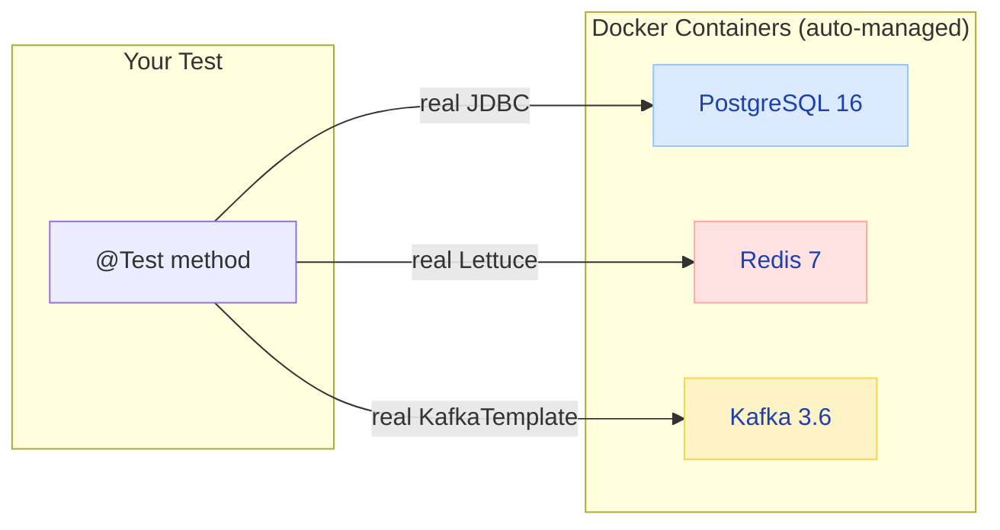
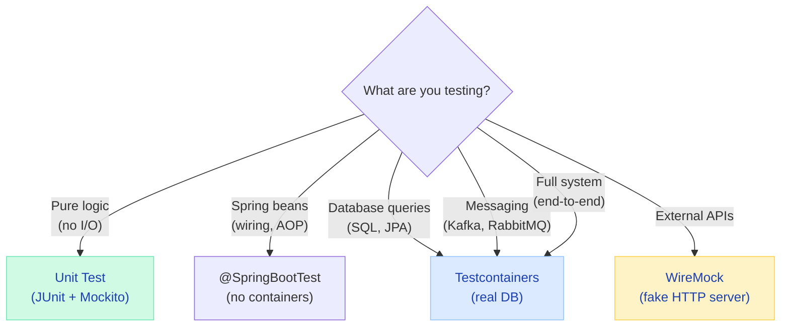

# Testcontainers — Real Integration Tests

> **Stop mocking databases. Spin up real PostgreSQL, Redis, Kafka in Docker during tests — same as production, zero flaky mocks.**

---

!!! abstract "Real-World Analogy"
    Testcontainers is like a **pop-up restaurant kitchen** for your tests. Instead of pretending to cook (mocking), you spin up a real kitchen with real ovens (containers), cook real food (queries), and tear it down after the meal (test). The food is guaranteed to taste the same in production because you used the same equipment.



---

## Why Testcontainers?

| Approach | Reliability | Speed | Catches Real Bugs? |
|----------|------------|-------|-------------------|
| H2 in-memory DB | Flaky (dialect differences) | Fast | No — SQL differences hide bugs |
| Mocked repositories | Very fast | Very fast | No — tests pass, prod breaks |
| Shared dev database | Unreliable (state leaks) | Medium | Sometimes |
| **Testcontainers** | Production-like | Medium | **Yes — same DB engine as prod** |

!!! danger "The H2 Trap"
    "Tests pass with H2, fails in PostgreSQL" is one of the most common issues in Spring Boot apps. H2 doesn't support PostgreSQL-specific features like `JSONB`, `ON CONFLICT`, array types, or window functions. With Testcontainers, you test against the REAL database.

---

## Setup

### Dependencies

```xml
<dependency>
    <groupId>org.springframework.boot</groupId>
    <artifactId>spring-boot-testcontainers</artifactId>
    <scope>test</scope>
</dependency>
<dependency>
    <groupId>org.testcontainers</groupId>
    <artifactId>postgresql</artifactId>
    <scope>test</scope>
</dependency>
<dependency>
    <groupId>org.testcontainers</groupId>
    <artifactId>kafka</artifactId>
    <scope>test</scope>
</dependency>
```

---

## Spring Boot 3.1+ — The Simple Way

### Using @ServiceConnection (Recommended)

```java
@SpringBootTest
@Testcontainers
class OrderServiceIntegrationTest {

    @Container
    @ServiceConnection  // auto-configures spring.datasource.* properties!
    static PostgreSQLContainer<?> postgres = new PostgreSQLContainer<>("postgres:16-alpine");

    @Container
    @ServiceConnection
    static GenericContainer<?> redis = new GenericContainer<>("redis:7-alpine")
        .withExposedPorts(6379);

    @Autowired
    private OrderService orderService;

    @Autowired
    private OrderRepository orderRepository;

    @Test
    void shouldCreateOrderAndPersist() {
        OrderRequest request = new OrderRequest("user-1", List.of(
            new OrderItem("SKU-001", 2, BigDecimal.valueOf(29.99))
        ));

        Order created = orderService.createOrder(request);

        assertThat(created.getId()).isNotNull();
        assertThat(created.getStatus()).isEqualTo(OrderStatus.PENDING);

        // Verify it's actually in PostgreSQL (not a mock!)
        Order fromDb = orderRepository.findById(created.getId()).orElseThrow();
        assertThat(fromDb.getItems()).hasSize(1);
        assertThat(fromDb.getTotal()).isEqualByComparingTo(BigDecimal.valueOf(59.98));
    }

    @Test
    void shouldHandleConcurrentOrdersForSameItem() {
        // This test would PASS with mocks but FAIL without proper DB locking
        // Testcontainers catches the real concurrency bug!
        ExecutorService executor = Executors.newFixedThreadPool(10);
        List<Future<Order>> futures = IntStream.range(0, 10)
            .mapToObj(i -> executor.submit(() -> orderService.createOrder(request)))
            .toList();

        // Verify inventory was decremented correctly (no overselling)
        long successCount = futures.stream()
            .filter(f -> !f.get().getStatus().equals(OrderStatus.FAILED))
            .count();
        assertThat(successCount).isLessThanOrEqualTo(availableInventory);
    }
}
```

### Shared Container (Faster Tests — Reuse Across Test Classes)

```java
// Define once, share across all tests
public abstract class BaseIntegrationTest {

    @Container
    @ServiceConnection
    protected static final PostgreSQLContainer<?> postgres =
        new PostgreSQLContainer<>("postgres:16-alpine")
            .withDatabaseName("testdb")
            .withUsername("test")
            .withPassword("test")
            .withReuse(true);  // reuse container between test runs!

    @Container
    @ServiceConnection
    protected static final KafkaContainer kafka =
        new KafkaContainer(DockerImageName.parse("confluentinc/cp-kafka:7.5.0"));
}

// All test classes extend this — same container instance
class OrderServiceTest extends BaseIntegrationTest { ... }
class PaymentServiceTest extends BaseIntegrationTest { ... }
```

---

## Testing with Kafka

```java
@SpringBootTest
@Testcontainers
class OrderEventTest {

    @Container
    @ServiceConnection
    static KafkaContainer kafka = new KafkaContainer(
        DockerImageName.parse("confluentinc/cp-kafka:7.5.0")
    );

    @Autowired
    private KafkaTemplate<String, OrderEvent> kafkaTemplate;

    @Autowired
    private OrderEventConsumer consumer;

    @Test
    void shouldPublishAndConsumeOrderCreatedEvent() {
        OrderEvent event = new OrderEvent("order-123", "CREATED", Instant.now());

        kafkaTemplate.send("orders", event.orderId(), event);

        // Wait for async consumption
        await().atMost(Duration.ofSeconds(10)).untilAsserted(() ->
            assertThat(consumer.getProcessedEvents()).contains("order-123")
        );
    }
}
```

---

## Testing with Redis

```java
@SpringBootTest
@Testcontainers
class CacheServiceTest {

    @Container
    @ServiceConnection
    static GenericContainer<?> redis = new GenericContainer<>("redis:7-alpine")
        .withExposedPorts(6379);

    @Autowired
    private ProductService productService;

    @Autowired
    private CacheManager cacheManager;

    @Test
    void shouldCacheProductLookup() {
        Product product = productService.findById("SKU-001");  // hits DB
        Product cached = productService.findById("SKU-001");   // hits cache

        assertThat(cached).isEqualTo(product);
        // Verify cache was populated in real Redis
        Cache.ValueWrapper wrapper = cacheManager.getCache("products").get("SKU-001");
        assertThat(wrapper).isNotNull();
    }
}
```

---

## Dev Services — Local Development

Spring Boot 3.1+ can auto-start containers for local development too (not just tests):

```yaml
# application-dev.yml — automatically starts a PostgreSQL container!
spring:
  docker:
    compose:
      enabled: true
      file: docker-compose-dev.yml
```

```yaml
# docker-compose-dev.yml
services:
  postgres:
    image: postgres:16-alpine
    ports:
      - "5432:5432"
    environment:
      POSTGRES_DB: myapp
      POSTGRES_USER: dev
      POSTGRES_PASSWORD: dev
  redis:
    image: redis:7-alpine
    ports:
      - "6379:6379"
```

---

## Performance Tips

| Tip | Impact | How |
|-----|--------|-----|
| Use `.withReuse(true)` | 10x faster test suite | Container survives between runs |
| Share containers across classes | Less startup overhead | Abstract base class |
| Use Alpine images | Faster pull | `postgres:16-alpine` vs `postgres:16` |
| Parallel tests with separate containers | Speed up CI | `@Testcontainers(parallel = true)` |
| Use `@DynamicPropertySource` for custom containers | Flexible | Map any container port to Spring property |

---

## When to Use Testcontainers vs Other Approaches



---

## Interview Questions

??? question "Why use Testcontainers instead of H2 for integration tests?"

    **Answer:** H2 is a different database engine with a different SQL dialect. Tests pass with H2 but fail in production because:
    
    - PostgreSQL-specific features (`JSONB`, `ON CONFLICT`, array types) don't exist in H2
    - Query performance characteristics differ (index behavior, query plans)
    - Transaction isolation behavior differs
    - Stored procedures/functions are incompatible
    
    Testcontainers runs the SAME database engine as production, so if tests pass, you have much higher confidence the code works in prod.

??? question "How do you keep Testcontainers tests fast in CI?"

    **Answer:**
    
    1. **Reusable containers** — `withReuse(true)` keeps the container alive between test runs
    2. **Shared containers** — one PostgreSQL container for all test classes (abstract base class)
    3. **Parallel execution** — separate containers per thread, run tests in parallel
    4. **Lightweight images** — Alpine variants are 3-5x smaller
    5. **Layer caching** — CI caches Docker layers between builds
    6. **Selective testing** — only run integration tests when relevant code changes (CI optimization)
