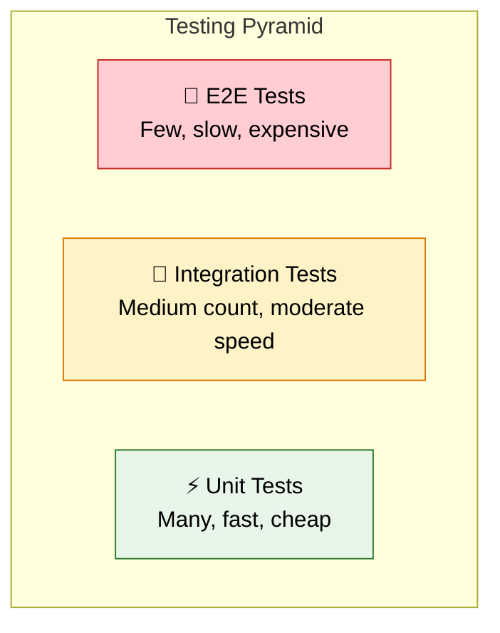
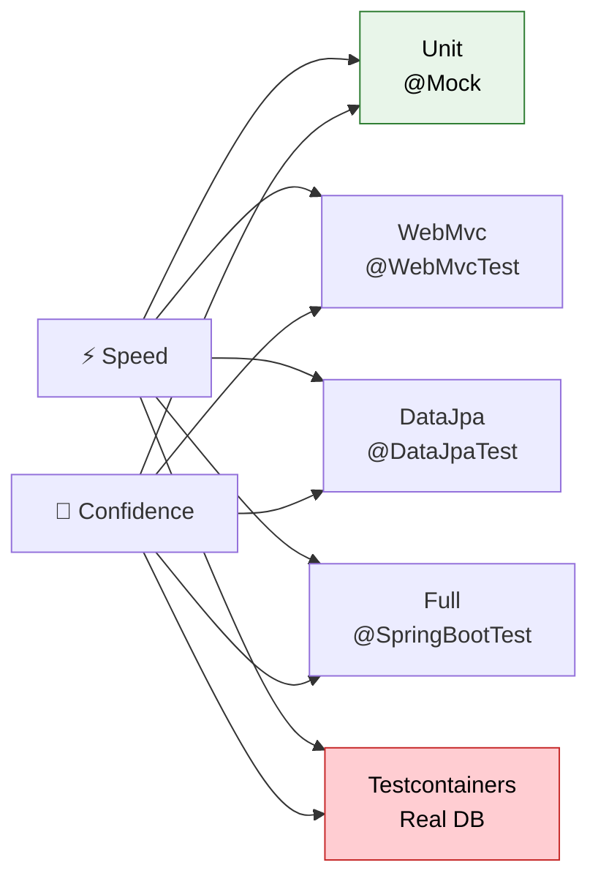

# 🧪 Spring Boot Testing

> **Write tests that give you confidence — from fast unit tests to full integration tests that prove your app works end-to-end.**

---

!!! abstract "Real-World Analogy"
    Think of **quality control in a car factory**. **Unit tests** = testing individual parts (does the brake pad grip?). **Integration tests** = testing assembled systems (does the braking system work?). **End-to-end tests** = test driving the complete car (does it stop when you press the brake pedal at 60mph?). You need all three levels.



---

## ⚡ Unit Tests (Fast, Isolated)

Test a single class in isolation. Mock all dependencies.

```java
@ExtendWith(MockitoExtension.class)
class OrderServiceTest {

    @Mock
    private OrderRepository orderRepository;

    @Mock
    private PaymentService paymentService;

    @InjectMocks
    private OrderService orderService;

    @Test
    void createOrder_shouldSaveAndReturnOrder() {
        // Given
        OrderRequest request = new OrderRequest("user-1", List.of("item-1"), BigDecimal.TEN);
        Order expectedOrder = new Order("order-1", "user-1", BigDecimal.TEN);
        when(orderRepository.save(any(Order.class))).thenReturn(expectedOrder);

        // When
        Order result = orderService.createOrder(request);

        // Then
        assertThat(result.getId()).isEqualTo("order-1");
        assertThat(result.getAmount()).isEqualTo(BigDecimal.TEN);
        verify(orderRepository).save(any(Order.class));
        verify(paymentService).reserve(eq("order-1"), eq(BigDecimal.TEN));
    }

    @Test
    void createOrder_whenPaymentFails_shouldThrowException() {
        // Given
        OrderRequest request = new OrderRequest("user-1", List.of("item-1"), BigDecimal.TEN);
        when(paymentService.reserve(any(), any()))
            .thenThrow(new PaymentException("Insufficient funds"));

        // When / Then
        assertThatThrownBy(() -> orderService.createOrder(request))
            .isInstanceOf(PaymentException.class)
            .hasMessage("Insufficient funds");

        verify(orderRepository, never()).save(any());
    }
}
```

---

## 🔧 Integration Tests (@SpringBootTest)

Load the full application context. Test real interactions.

```java
@SpringBootTest(webEnvironment = SpringBootTest.WebEnvironment.RANDOM_PORT)
@ActiveProfiles("test")
class OrderIntegrationTest {

    @Autowired
    private TestRestTemplate restTemplate;

    @Autowired
    private OrderRepository orderRepository;

    @BeforeEach
    void setup() {
        orderRepository.deleteAll();
    }

    @Test
    void createOrder_shouldReturn201AndPersist() {
        // Given
        OrderRequest request = new OrderRequest("user-1", List.of("pizza"), new BigDecimal("29.99"));

        // When
        ResponseEntity<Order> response = restTemplate.postForEntity(
            "/api/orders", request, Order.class);

        // Then
        assertThat(response.getStatusCode()).isEqualTo(HttpStatus.CREATED);
        assertThat(response.getBody().getId()).isNotNull();
        assertThat(orderRepository.count()).isEqualTo(1);
    }

    @Test
    void getOrder_whenNotFound_shouldReturn404() {
        ResponseEntity<ErrorResponse> response = restTemplate.getForEntity(
            "/api/orders/999", ErrorResponse.class);

        assertThat(response.getStatusCode()).isEqualTo(HttpStatus.NOT_FOUND);
    }
}
```

---

## 🌐 Web Layer Tests (@WebMvcTest)

Test only the controller layer — fast, no database:

```java
@WebMvcTest(OrderController.class)
class OrderControllerTest {

    @Autowired
    private MockMvc mockMvc;

    @MockBean
    private OrderService orderService;

    @Test
    void getOrder_shouldReturnOrder() throws Exception {
        Order order = new Order("order-1", "user-1", BigDecimal.TEN);
        when(orderService.findById("order-1")).thenReturn(order);

        mockMvc.perform(get("/api/orders/order-1"))
            .andExpect(status().isOk())
            .andExpect(jsonPath("$.id").value("order-1"))
            .andExpect(jsonPath("$.amount").value(10));
    }

    @Test
    void createOrder_withInvalidBody_shouldReturn400() throws Exception {
        String invalidJson = """
            { "userId": "", "items": [], "amount": -5 }
            """;

        mockMvc.perform(post("/api/orders")
                .contentType(MediaType.APPLICATION_JSON)
                .content(invalidJson))
            .andExpect(status().isBadRequest())
            .andExpect(jsonPath("$.validationErrors.userId").exists());
    }
}
```

---

## 🗄️ Data Layer Tests (@DataJpaTest)

Test repositories with an embedded database:

```java
@DataJpaTest
@ActiveProfiles("test")
class OrderRepositoryTest {

    @Autowired
    private OrderRepository orderRepository;

    @Autowired
    private TestEntityManager entityManager;

    @Test
    void findByUserId_shouldReturnUserOrders() {
        // Given
        Order order1 = new Order(null, "user-1", new BigDecimal("10.00"));
        Order order2 = new Order(null, "user-1", new BigDecimal("20.00"));
        Order order3 = new Order(null, "user-2", new BigDecimal("30.00"));
        entityManager.persist(order1);
        entityManager.persist(order2);
        entityManager.persist(order3);
        entityManager.flush();

        // When
        List<Order> result = orderRepository.findByUserId("user-1");

        // Then
        assertThat(result).hasSize(2);
        assertThat(result).extracting(Order::getUserId).containsOnly("user-1");
    }
}
```

---

## 🐳 Testcontainers (Real Database in Tests)

Use real PostgreSQL/Redis/Kafka in Docker during tests:

```java
@SpringBootTest
@Testcontainers
@ActiveProfiles("test")
class OrderServiceIntegrationTest {

    @Container
    static PostgreSQLContainer<?> postgres = new PostgreSQLContainer<>("postgres:16")
        .withDatabaseName("testdb")
        .withUsername("test")
        .withPassword("test");

    @DynamicPropertySource
    static void configureProperties(DynamicPropertyRegistry registry) {
        registry.add("spring.datasource.url", postgres::getJdbcUrl);
        registry.add("spring.datasource.username", postgres::getUsername);
        registry.add("spring.datasource.password", postgres::getPassword);
    }

    @Autowired
    private OrderService orderService;

    @Test
    void shouldPersistOrderInRealDatabase() {
        Order order = orderService.createOrder(
            new OrderRequest("user-1", List.of("item-1"), BigDecimal.TEN));

        assertThat(order.getId()).isNotNull();
    }
}
```

---

## 📊 Test Annotation Cheat Sheet

| Annotation | What it loads | Speed | Use for |
|---|---|---|---|
| `@ExtendWith(MockitoExtension.class)` | Nothing (plain JUnit) | ⚡ Fastest | Service/logic unit tests |
| `@WebMvcTest` | Web layer only | 🚀 Fast | Controller tests |
| `@DataJpaTest` | JPA + embedded DB | 🚀 Fast | Repository tests |
| `@SpringBootTest` | Full context | 🐢 Slow | Integration tests |
| `@SpringBootTest` + Testcontainers | Full + real DB | 🐌 Slowest | End-to-end tests |



---

## 🎯 Interview Questions

??? question "1. What's the difference between @MockBean and @Mock?"
    `@Mock` (Mockito) — creates a mock in plain unit tests, no Spring context loaded. `@MockBean` (Spring) — creates a mock and puts it in the Spring application context, replacing the real bean. Use `@Mock` for unit tests, `@MockBean` for `@WebMvcTest` / `@SpringBootTest`.

??? question "2. When would you use @WebMvcTest vs @SpringBootTest?"
    `@WebMvcTest` — only loads the web layer (controllers, filters, advice). Fast. Use when testing HTTP behavior (request mapping, validation, serialization). `@SpringBootTest` — loads the entire context. Slower. Use when you need the full stack (service → repository → DB).

??? question "3. What is Testcontainers?"
    A library that runs real Docker containers (PostgreSQL, Redis, Kafka) during tests. Unlike H2, you test against the actual database your production uses. Start containers with `@Container`, wire them up with `@DynamicPropertySource`.

??? question "4. How do you test exception handling?"
    In unit tests: use `assertThatThrownBy()`. In controller tests with `MockMvc`: perform the request and assert `status().isNotFound()` or check the error response body. Integration tests: use `TestRestTemplate` and assert the status code.

??? question "5. What testing strategy do you recommend?"
    Follow the testing pyramid: **many unit tests** (fast, isolated, test logic), **some integration tests** (test beans working together), **few E2E tests** (test complete flows with real infra). Unit tests catch logic bugs; integration tests catch wiring bugs; E2E tests catch system bugs.

