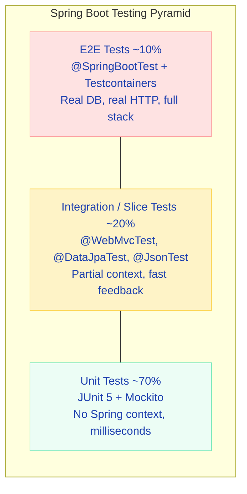
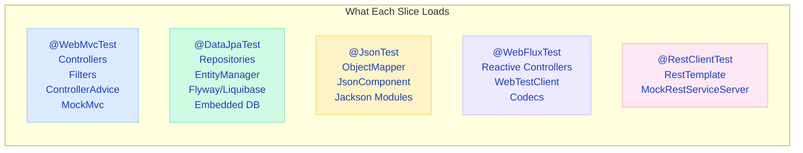
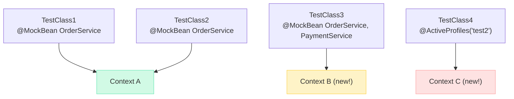
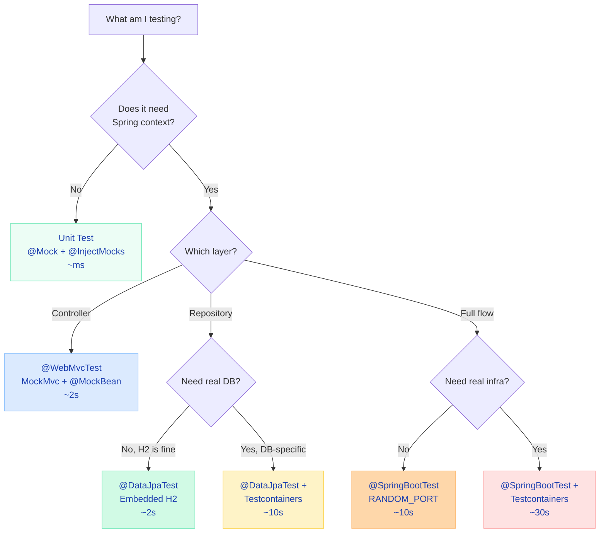

# Spring Boot Testing

Testing in Spring Boot is where most engineers either over-engineer or under-engineer. I've seen teams with 95% coverage that still have production bugs (they test implementation, not behavior). And teams with 30% coverage that deploy fearlessly (they test the right things). Let me show you what to test, how to test it, and most importantly — what NOT to waste time testing.

---

## The Testing Pyramid in Spring Boot

!!! tip "One-liner for interviews"
    "Unit tests validate logic, slice tests validate integration with the framework, and @SpringBootTest validates the whole system wires together correctly."



| Level | Annotation | What Loads | Speed | Catches |
|---|---|---|---|---|
| Unit | `@ExtendWith(MockitoExtension.class)` | Nothing — plain Java | ~ms | Logic bugs, edge cases, null handling |
| Slice | `@WebMvcTest`, `@DataJpaTest` | Partial context (web OR data) | ~1-3s | Wiring, validation, query bugs |
| Full Integration | `@SpringBootTest` | Entire application context | ~5-15s | Configuration, startup, full flows |
| E2E | `@SpringBootTest` + Testcontainers | Full app + real infrastructure | ~20-60s | System integration, DB-specific behavior |

!!! example "Interview Tip"
    When asked "how do you decide what level to test at?" — answer with the **feedback loop**: "If the bug lives in one method, unit test it. If it lives in how beans interact with the framework, slice test it. If it lives in how the full system wires together, integration test it. I optimize for the fastest test that catches the bug."

---

## Unit Testing — No Spring, No Waiting

This is your bread and butter. 70% of your tests should be here. No application context. No classpath scanning. No bean wiring. Just your class, its dependencies mocked, and pure logic verification.

**What it tests:** Business logic in services, utility methods, domain objects.
**When to use:** Always the default. Only escalate to slice/integration when you need framework behavior.
**What it loads:** Nothing. Pure JUnit 5 + Mockito.
**Speed:** Milliseconds per test.

```java
@ExtendWith(MockitoExtension.class)
class OrderServiceTest {

    @Mock
    private OrderRepository orderRepository;

    @Mock
    private PaymentGateway paymentGateway;

    @Mock
    private InventoryService inventoryService;

    @InjectMocks
    private OrderService orderService;

    @Test
    void should_createOrder_when_paymentSucceeds() {
        // Given
        OrderRequest request = new OrderRequest("user-1", List.of("SKU-001", "SKU-002"), 
            new BigDecimal("149.99"));
        when(inventoryService.checkAvailability(anyList())).thenReturn(true);
        when(paymentGateway.authorize(any(), any()))
            .thenReturn(new PaymentResult("pay-123", PaymentStatus.AUTHORIZED));
        when(orderRepository.save(any(Order.class)))
            .thenAnswer(inv -> {
                Order o = inv.getArgument(0);
                o.setId("order-001");
                return o;
            });

        // When
        Order result = orderService.createOrder(request);

        // Then
        assertThat(result.getId()).isEqualTo("order-001");
        assertThat(result.getStatus()).isEqualTo(OrderStatus.CONFIRMED);
        verify(paymentGateway).authorize(eq("user-1"), eq(new BigDecimal("149.99")));
        verify(inventoryService).reserve(eq(List.of("SKU-001", "SKU-002")));
    }

    @Test
    void should_throwException_when_paymentDeclined() {
        // Given
        OrderRequest request = new OrderRequest("user-1", List.of("SKU-001"), BigDecimal.TEN);
        when(inventoryService.checkAvailability(anyList())).thenReturn(true);
        when(paymentGateway.authorize(any(), any()))
            .thenReturn(new PaymentResult(null, PaymentStatus.DECLINED));

        // When / Then
        assertThatThrownBy(() -> orderService.createOrder(request))
            .isInstanceOf(PaymentDeclinedException.class)
            .hasMessageContaining("Payment declined for user: user-1");

        verify(orderRepository, never()).save(any());
        verify(inventoryService, never()).reserve(anyList());
    }

    @Test
    void should_throwException_when_itemsOutOfStock() {
        // Given
        OrderRequest request = new OrderRequest("user-1", List.of("SKU-999"), BigDecimal.TEN);
        when(inventoryService.checkAvailability(List.of("SKU-999"))).thenReturn(false);

        // When / Then
        assertThatThrownBy(() -> orderService.createOrder(request))
            .isInstanceOf(OutOfStockException.class);

        verify(paymentGateway, never()).authorize(any(), any());
    }
}
```

### ArgumentCaptor — When You Need to Inspect What Was Passed

```java
@Test
void should_saveOrderWithCorrectTimestamp() {
    // Given
    OrderRequest request = new OrderRequest("user-1", List.of("SKU-001"), BigDecimal.TEN);
    when(inventoryService.checkAvailability(anyList())).thenReturn(true);
    when(paymentGateway.authorize(any(), any()))
        .thenReturn(new PaymentResult("pay-1", PaymentStatus.AUTHORIZED));
    when(orderRepository.save(any())).thenAnswer(inv -> inv.getArgument(0));

    ArgumentCaptor<Order> orderCaptor = ArgumentCaptor.forClass(Order.class);

    // When
    orderService.createOrder(request);

    // Then
    verify(orderRepository).save(orderCaptor.capture());
    Order savedOrder = orderCaptor.getValue();
    assertThat(savedOrder.getCreatedAt()).isCloseTo(Instant.now(), within(1, ChronoUnit.SECONDS));
    assertThat(savedOrder.getUserId()).isEqualTo("user-1");
    assertThat(savedOrder.getItems()).containsExactly("SKU-001");
}
```

!!! danger "What breaks"
    **Using `@SpringBootTest` for unit tests.** I've seen test suites go from 30 seconds to 12 minutes because every service test loaded the full application context. If you're testing `OrderService.createOrder()` logic, you don't need Spring. Use `@Mock` + `@InjectMocks`. Save `@SpringBootTest` for when you genuinely need the full context.

---

## @SpringBootTest — Full Integration Testing

**What it tests:** Full application startup, bean wiring, end-to-end request flows.
**When to use:** Verifying the app starts correctly, testing flows that cross multiple layers, smoke tests.
**How it works internally:** Starts component scanning from your `@SpringBootApplication` class, loads ALL auto-configurations, creates the entire `ApplicationContext`.
**What it loads:** EVERYTHING — controllers, services, repositories, security, caches, schedulers, message listeners.
**Speed:** 5-30 seconds depending on app complexity.

```java
@SpringBootTest(webEnvironment = SpringBootTest.WebEnvironment.RANDOM_PORT)
@ActiveProfiles("test")
class OrderFlowIntegrationTest {

    @Autowired
    private TestRestTemplate restTemplate;

    @Autowired
    private OrderRepository orderRepository;

    @BeforeEach
    void cleanup() {
        orderRepository.deleteAll();
    }

    @Test
    void should_createAndRetrieveOrder_fullFlow() {
        // Create order
        OrderRequest request = new OrderRequest("user-1", List.of("SKU-001"), 
            new BigDecimal("29.99"));

        ResponseEntity<Order> createResponse = restTemplate.postForEntity(
            "/api/orders", request, Order.class);

        assertThat(createResponse.getStatusCode()).isEqualTo(HttpStatus.CREATED);
        assertThat(createResponse.getBody().getId()).isNotNull();

        // Retrieve order
        String orderId = createResponse.getBody().getId();
        ResponseEntity<Order> getResponse = restTemplate.getForEntity(
            "/api/orders/" + orderId, Order.class);

        assertThat(getResponse.getStatusCode()).isEqualTo(HttpStatus.OK);
        assertThat(getResponse.getBody().getAmount()).isEqualByComparingTo("29.99");
        assertThat(getResponse.getBody().getStatus()).isEqualTo(OrderStatus.CONFIRMED);
    }
}
```

### WebEnvironment Modes

| Mode | What Happens | Use With | When |
|---|---|---|---|
| `MOCK` (default) | No real server. Servlet env mocked. | `MockMvc` | Controller testing without HTTP overhead |
| `RANDOM_PORT` | Real embedded server on random port | `TestRestTemplate`, `WebTestClient` | Full HTTP testing (cookies, redirects, headers) |
| `DEFINED_PORT` | Real server on `server.port` | `TestRestTemplate` | Avoid — port conflicts in CI |
| `NONE` | No web environment at all | Direct bean calls | Non-web services, batch jobs |

!!! warning "Production War Story"
    A team used `@SpringBootTest` for all 400 tests. CI took 45 minutes. After refactoring to slice tests where appropriate: 8 minutes. The secret? Spring caches application contexts — but `@MockBean` differences create new contexts. They had 47 unique context configurations because each test class mocked different beans.

---

## Slice Tests — The Sweet Spot

Slice tests are Spring Boot's killer feature for testing. They load ONLY the beans relevant to a specific layer. Fast startup, real framework behavior, no unnecessary baggage.



| Annotation | Loads | Does NOT Load | Typical Use |
|---|---|---|---|
| `@WebMvcTest` | Controllers, filters, `@ControllerAdvice`, converters, `MockMvc` | Services, repositories, data layer | HTTP mapping, validation, error handling |
| `@DataJpaTest` | JPA repos, `EntityManager`, embedded DB, Flyway/Liquibase | Controllers, services, web layer | Custom queries, entity mappings |
| `@WebFluxTest` | Reactive controllers, `WebTestClient`, codecs | Services, repositories | Reactive endpoint tests |
| `@JsonTest` | Jackson `ObjectMapper`, `@JsonComponent` | Everything else | Serialization contracts |
| `@RestClientTest` | `RestTemplateBuilder`, `MockRestServiceServer` | Everything else | External API client tests |
| `@DataMongoTest` | Mongo repositories, `MongoTemplate` | Everything else | MongoDB query tests |

---

## @WebMvcTest Deep Dive

**What it tests:** Your controller layer — request mapping, validation, serialization, error handling, security.
**When to use:** Testing HTTP behavior without starting a real server.
**How it works internally:** Creates a `WebApplicationContext` with only web-layer beans. Configures `MockMvc` automatically.
**What it loads:** The specified controller, all `@ControllerAdvice`, filters, converters, `WebMvcConfigurer`.
**Speed:** 1-3 seconds.

```java
@WebMvcTest(OrderController.class)
class OrderControllerTest {

    @Autowired
    private MockMvc mockMvc;

    @MockBean
    private OrderService orderService;

    // --- Happy Path ---

    @Test
    void should_returnOrder_when_exists() throws Exception {
        Order order = new Order("order-1", "user-1", new BigDecimal("49.99"));
        order.setStatus(OrderStatus.CONFIRMED);
        when(orderService.findById("order-1")).thenReturn(order);

        mockMvc.perform(get("/api/orders/order-1")
                .accept(MediaType.APPLICATION_JSON))
            .andExpect(status().isOk())
            .andExpect(jsonPath("$.id").value("order-1"))
            .andExpect(jsonPath("$.userId").value("user-1"))
            .andExpect(jsonPath("$.amount").value(49.99))
            .andExpect(jsonPath("$.status").value("CONFIRMED"));
    }

    @Test
    void should_returnPaginatedOrders_when_queryParams() throws Exception {
        Page<Order> page = new PageImpl<>(
            List.of(new Order("o-1", "user-1", BigDecimal.TEN)),
            PageRequest.of(0, 20), 1);
        when(orderService.findByUser(eq("user-1"), any(Pageable.class))).thenReturn(page);

        mockMvc.perform(get("/api/orders")
                .param("userId", "user-1")
                .param("page", "0")
                .param("size", "20"))
            .andExpect(status().isOk())
            .andExpect(jsonPath("$.content").isArray())
            .andExpect(jsonPath("$.content.length()").value(1))
            .andExpect(jsonPath("$.totalElements").value(1));
    }

    // --- Validation ---

    @Test
    void should_return400_when_requestBodyInvalid() throws Exception {
        String invalidBody = """
            {
                "userId": "",
                "items": [],
                "amount": -5
            }
            """;

        mockMvc.perform(post("/api/orders")
                .contentType(MediaType.APPLICATION_JSON)
                .content(invalidBody))
            .andExpect(status().isBadRequest())
            .andExpect(jsonPath("$.errors.userId").value("must not be blank"))
            .andExpect(jsonPath("$.errors.items").value("must not be empty"))
            .andExpect(jsonPath("$.errors.amount").value("must be greater than 0"));
    }

    // --- Error Handling ---

    @Test
    void should_return404_when_orderNotFound() throws Exception {
        when(orderService.findById("nope"))
            .thenThrow(new OrderNotFoundException("nope"));

        mockMvc.perform(get("/api/orders/nope"))
            .andExpect(status().isNotFound())
            .andExpect(jsonPath("$.message").value("Order not found: nope"))
            .andExpect(jsonPath("$.timestamp").exists());
    }

    @Test
    void should_return409_when_duplicateOrder() throws Exception {
        String body = """
            {"userId":"user-1","items":["SKU-001"],"amount":10.00}
            """;
        when(orderService.createOrder(any()))
            .thenThrow(new DuplicateOrderException("Idempotency key already used"));

        mockMvc.perform(post("/api/orders")
                .contentType(MediaType.APPLICATION_JSON)
                .content(body)
                .header("Idempotency-Key", "key-123"))
            .andExpect(status().isConflict());
    }

    // --- Response Headers ---

    @Test
    void should_returnLocationHeader_when_orderCreated() throws Exception {
        String body = """
            {"userId":"user-1","items":["SKU-001"],"amount":29.99}
            """;
        when(orderService.createOrder(any()))
            .thenReturn(new Order("order-new", "user-1", new BigDecimal("29.99")));

        mockMvc.perform(post("/api/orders")
                .contentType(MediaType.APPLICATION_JSON)
                .content(body))
            .andExpect(status().isCreated())
            .andExpect(header().string("Location", "/api/orders/order-new"));
    }
}
```

!!! tip "One-liner for interviews"
    "`@WebMvcTest` loads ONLY the web layer — controllers, filters, advice. You `@MockBean` all service dependencies. It gives you real validation, real serialization, real error handling — without loading the entire app."

---

## @DataJpaTest Deep Dive

**What it tests:** Repository queries, entity mappings, database constraints.
**When to use:** Testing custom `@Query` methods, native queries, derived query methods, entity lifecycle.
**How it works internally:** Configures an embedded database (H2 by default), runs Flyway/Liquibase migrations, wraps each test in a transaction that rolls back.
**What it loads:** JPA repositories, `EntityManager`, `TestEntityManager`, `DataSource`, Flyway/Liquibase.
**Speed:** 1-3 seconds.

```java
@DataJpaTest
@ActiveProfiles("test")
class OrderRepositoryTest {

    @Autowired
    private OrderRepository orderRepository;

    @Autowired
    private TestEntityManager entityManager;

    @Test
    void should_findOrdersByUserId() {
        // Given
        entityManager.persist(new Order(null, "user-1", new BigDecimal("10.00"), OrderStatus.CONFIRMED));
        entityManager.persist(new Order(null, "user-1", new BigDecimal("20.00"), OrderStatus.SHIPPED));
        entityManager.persist(new Order(null, "user-2", new BigDecimal("30.00"), OrderStatus.CONFIRMED));
        entityManager.flush();

        // When
        List<Order> orders = orderRepository.findByUserId("user-1");

        // Then
        assertThat(orders).hasSize(2);
        assertThat(orders).extracting(Order::getUserId).containsOnly("user-1");
    }

    @Test
    void should_findHighValueOrdersByStatus() {
        // Given — testing a custom @Query
        entityManager.persist(new Order(null, "user-1", new BigDecimal("500.00"), OrderStatus.CONFIRMED));
        entityManager.persist(new Order(null, "user-2", new BigDecimal("50.00"), OrderStatus.CONFIRMED));
        entityManager.persist(new Order(null, "user-3", new BigDecimal("1000.00"), OrderStatus.CANCELLED));
        entityManager.flush();

        // When
        List<Order> highValue = orderRepository.findByAmountGreaterThanAndStatus(
            new BigDecimal("100.00"), OrderStatus.CONFIRMED);

        // Then
        assertThat(highValue).hasSize(1);
        assertThat(highValue.get(0).getAmount()).isEqualByComparingTo("500.00");
    }

    @Test
    void should_enforceUniqueConstraint() {
        // Given
        entityManager.persist(new Order(null, "user-1", BigDecimal.TEN, OrderStatus.CONFIRMED));
        entityManager.flush();

        // When / Then — duplicate order reference
        Order duplicate = new Order(null, "user-1", BigDecimal.TEN, OrderStatus.CONFIRMED);
        duplicate.setReferenceId("REF-001"); // same as first order (set in @PrePersist)

        assertThatThrownBy(() -> {
            entityManager.persist(duplicate);
            entityManager.flush();
        }).isInstanceOf(PersistenceException.class);
    }
}
```

### Using @Sql for Test Data

```java
@DataJpaTest
@Sql(scripts = "/sql/orders-test-data.sql", executionPhase = Sql.ExecutionPhase.BEFORE_TEST_METHOD)
@Sql(scripts = "/sql/cleanup.sql", executionPhase = Sql.ExecutionPhase.AFTER_TEST_METHOD)
class OrderReportRepositoryTest {

    @Autowired
    private OrderRepository orderRepository;

    @Test
    void should_calculateRevenueByMonth() {
        // Test data loaded from SQL script — complex scenarios easier in SQL
        BigDecimal januaryRevenue = orderRepository.calculateRevenueForMonth(2025, 1);
        assertThat(januaryRevenue).isEqualByComparingTo("15249.97");
    }
}
```

!!! danger "What breaks"
    **Using H2 when your production DB is PostgreSQL.** H2 doesn't support JSONB columns, arrays, window functions, or many Postgres-specific features. Your tests pass on H2, then fail in production. Solution: use `@AutoConfigureTestDatabase(replace = NONE)` + Testcontainers for anything beyond basic CRUD.

---

## Testcontainers — Real Database, Real Behavior

**What it tests:** Database-specific behavior — JSONB, native queries, stored procedures, concurrency.
**When to use:** When H2 isn't good enough (which is more often than you think).
**How it works:** Spins up a real Docker container with your production database. Tests connect to it via JDBC.
**Speed:** First start ~10-20s (image pull), subsequent tests reuse the container.

### Basic Pattern

```java
@SpringBootTest
@Testcontainers
@ActiveProfiles("test")
class OrderServicePostgresTest {

    @Container
    static PostgreSQLContainer<?> postgres = new PostgreSQLContainer<>("postgres:16-alpine")
        .withDatabaseName("orders_test")
        .withUsername("test")
        .withPassword("test");

    @DynamicPropertySource
    static void configureDataSource(DynamicPropertyRegistry registry) {
        registry.add("spring.datasource.url", postgres::getJdbcUrl);
        registry.add("spring.datasource.username", postgres::getUsername);
        registry.add("spring.datasource.password", postgres::getPassword);
    }

    @Autowired
    private OrderService orderService;

    @Autowired
    private OrderRepository orderRepository;

    @Test
    void should_persistJsonbMetadata() {
        // This would FAIL on H2 — JSONB is Postgres-specific
        Order order = orderService.createOrderWithMetadata(
            new OrderRequest("user-1", List.of("SKU-001"), BigDecimal.TEN),
            Map.of("source", "mobile", "campaign", "summer-sale"));

        Order found = orderRepository.findById(order.getId()).orElseThrow();
        assertThat(found.getMetadata()).containsEntry("source", "mobile");
        assertThat(found.getMetadata()).containsEntry("campaign", "summer-sale");
    }

    @Test
    void should_handleConcurrentUpdates() {
        // Testing optimistic locking with real Postgres — H2 behaves differently
        Order order = orderRepository.save(
            new Order(null, "user-1", BigDecimal.TEN, OrderStatus.CONFIRMED));

        assertThatThrownBy(() -> orderService.concurrentUpdate(order.getId()))
            .isInstanceOf(OptimisticLockingFailureException.class);
    }
}
```

### Singleton Container Pattern — Shared Across Test Classes

Starting a container per test class is slow. Share one container across all integration tests:

```java
public abstract class AbstractIntegrationTest {

    static final PostgreSQLContainer<?> POSTGRES;
    static final GenericContainer<?> REDIS;

    static {
        POSTGRES = new PostgreSQLContainer<>("postgres:16-alpine")
            .withDatabaseName("testdb")
            .withUsername("test")
            .withPassword("test");
        POSTGRES.start();

        REDIS = new GenericContainer<>("redis:7-alpine")
            .withExposedPorts(6379);
        REDIS.start();
    }

    @DynamicPropertySource
    static void configureProperties(DynamicPropertyRegistry registry) {
        registry.add("spring.datasource.url", POSTGRES::getJdbcUrl);
        registry.add("spring.datasource.username", POSTGRES::getUsername);
        registry.add("spring.datasource.password", POSTGRES::getPassword);
        registry.add("spring.data.redis.host", REDIS::getHost);
        registry.add("spring.data.redis.port", () -> REDIS.getMappedPort(6379));
    }
}

// All test classes extend this — containers started once, reused everywhere
@SpringBootTest
class OrderServiceTest extends AbstractIntegrationTest { ... }

@SpringBootTest
class PaymentServiceTest extends AbstractIntegrationTest { ... }
```

### Kafka Testcontainer

```java
@SpringBootTest
@Testcontainers
class OrderEventPublisherTest {

    @Container
    static KafkaContainer kafka = new KafkaContainer(
        DockerImageName.parse("confluentinc/cp-kafka:7.5.0"));

    @DynamicPropertySource
    static void kafkaProperties(DynamicPropertyRegistry registry) {
        registry.add("spring.kafka.bootstrap-servers", kafka::getBootstrapServers);
    }

    @Autowired
    private OrderService orderService;

    @Autowired
    private KafkaTemplate<String, OrderEvent> kafkaTemplate;

    @Test
    void should_publishOrderCreatedEvent() {
        // Given
        Consumer<String, OrderEvent> consumer = createConsumer();
        consumer.subscribe(List.of("order-events"));

        // When
        orderService.createOrder(new OrderRequest("user-1", List.of("SKU-001"), BigDecimal.TEN));

        // Then
        ConsumerRecords<String, OrderEvent> records = consumer.poll(Duration.ofSeconds(10));
        assertThat(records).hasSize(1);
        assertThat(records.iterator().next().value().getType()).isEqualTo("ORDER_CREATED");
    }
}
```

!!! tip "One-liner for interviews"
    "Testcontainers spins up real infrastructure in Docker. I use `@DynamicPropertySource` to inject the container's random port/URL into Spring's property system. The singleton container pattern avoids starting a new container per test class."

---

## Mocking — @Mock vs @MockBean vs @SpyBean

This is one of the most asked interview questions, and most candidates get it wrong.

| | `@Mock` | `@MockBean` | `@SpyBean` |
|---|---|---|---|
| **Framework** | Mockito (plain) | Spring Boot Test | Spring Boot Test |
| **Context** | No Spring context | Replaces bean in context | Wraps real bean in context |
| **Speed** | Instant | Requires context startup | Requires context startup |
| **Use case** | Unit tests | Slice/integration tests | Verify calls on real bean |
| **Context cache** | No impact | Different combos = new context | Different combos = new context |

```java
// @Mock — Unit test, no Spring
@ExtendWith(MockitoExtension.class)
class OrderServiceTest {
    @Mock private PaymentGateway paymentGateway;
    @InjectMocks private OrderService orderService;
}

// @MockBean — Replace a real bean in Spring context
@WebMvcTest(OrderController.class)
class OrderControllerTest {
    @MockBean private OrderService orderService; // replaces real OrderService
}

// @SpyBean — Wrap real bean, selectively override
@SpringBootTest
class NotificationTest {
    @SpyBean private EmailService emailService; // real bean, but can verify/stub

    @Test
    void should_sendEmail_when_orderCreated() {
        orderService.createOrder(request);
        verify(emailService).sendOrderConfirmation(any()); // verify real bean was called
    }
}
```

!!! danger "What breaks"
    **@MockBean kills context caching.** Every unique set of `@MockBean` declarations creates a separate cached context. If you have 50 test classes each mocking different beans, Spring creates 50 application contexts. Your test suite takes 20 minutes instead of 3. Solution: standardize mock sets or use `@Mock` for unit tests.

### WireMock — Mocking External HTTP Services

When your service calls external APIs (payment providers, shipping APIs), use WireMock:

```java
@SpringBootTest(webEnvironment = RANDOM_PORT)
@WireMockTest(httpPort = 8089)
class PaymentIntegrationTest {

    @Test
    void should_handlePaymentGatewayTimeout() {
        // Simulate external service timeout
        stubFor(post(urlPathEqualTo("/api/payments/authorize"))
            .willReturn(aResponse()
                .withStatus(200)
                .withFixedDelay(5000))); // 5 second delay

        assertThatThrownBy(() -> orderService.createOrder(request))
            .isInstanceOf(PaymentTimeoutException.class);
    }

    @Test
    void should_retryOnGatewayError() {
        // First call fails, second succeeds
        stubFor(post(urlPathEqualTo("/api/payments/authorize"))
            .inScenario("retry")
            .whenScenarioStateIs(STARTED)
            .willReturn(aResponse().withStatus(503))
            .willSetStateTo("RECOVERED"));

        stubFor(post(urlPathEqualTo("/api/payments/authorize"))
            .inScenario("retry")
            .whenScenarioStateIs("RECOVERED")
            .willReturn(aResponse()
                .withStatus(200)
                .withBody("""
                    {"transactionId":"tx-123","status":"AUTHORIZED"}
                    """)));

        Order order = orderService.createOrder(request);
        assertThat(order.getPaymentId()).isEqualTo("tx-123");
    }
}
```

---

## Testing Security

Security testing is critical and often skipped. Spring Security Test provides annotations to simulate authenticated users without actually going through the auth flow.

### @WithMockUser

```java
@WebMvcTest(OrderController.class)
class OrderSecurityTest {

    @Autowired
    private MockMvc mockMvc;

    @MockBean
    private OrderService orderService;

    @Test
    @WithMockUser(username = "admin", roles = {"ADMIN"})
    void should_allowAdmin_toDeleteOrder() throws Exception {
        mockMvc.perform(delete("/api/orders/order-1"))
            .andExpect(status().isNoContent());
    }

    @Test
    @WithMockUser(username = "user", roles = {"USER"})
    void should_forbidUser_fromDeletingOrder() throws Exception {
        mockMvc.perform(delete("/api/orders/order-1"))
            .andExpect(status().isForbidden());
    }

    @Test
    void should_return401_when_unauthenticated() throws Exception {
        mockMvc.perform(get("/api/orders"))
            .andExpect(status().isUnauthorized());
    }

    @Test
    @WithMockUser(username = "user-1")
    void should_onlyReturnOwnOrders() throws Exception {
        // Testing method-level security: @PreAuthorize("#userId == authentication.name")
        when(orderService.findByUser("user-1", any())).thenReturn(Page.empty());

        mockMvc.perform(get("/api/orders").param("userId", "user-1"))
            .andExpect(status().isOk());

        mockMvc.perform(get("/api/orders").param("userId", "user-2"))
            .andExpect(status().isForbidden());
    }
}
```

### Testing JWT Authentication

```java
@SpringBootTest(webEnvironment = RANDOM_PORT)
class JwtSecurityTest {

    @Autowired
    private WebTestClient webTestClient;

    @Autowired
    private JwtEncoder jwtEncoder;

    @Test
    void should_acceptValidJwt() {
        String token = generateToken("user-1", "ROLE_USER");

        webTestClient.get().uri("/api/orders")
            .header("Authorization", "Bearer " + token)
            .exchange()
            .expectStatus().isOk();
    }

    @Test
    void should_reject_expiredJwt() {
        String expiredToken = generateExpiredToken("user-1");

        webTestClient.get().uri("/api/orders")
            .header("Authorization", "Bearer " + expiredToken)
            .exchange()
            .expectStatus().isUnauthorized();
    }

    private String generateToken(String subject, String... roles) {
        JwtClaimsSet claims = JwtClaimsSet.builder()
            .subject(subject)
            .claim("roles", List.of(roles))
            .issuedAt(Instant.now())
            .expiresAt(Instant.now().plus(1, ChronoUnit.HOURS))
            .build();
        return jwtEncoder.encode(JwtEncoderParameters.from(claims)).getTokenValue();
    }
}
```

### Custom Security Test Annotation

```java
@Retention(RetentionPolicy.RUNTIME)
@WithSecurityContext(factory = WithMockCustomUserSecurityContextFactory.class)
public @interface WithMockCustomUser {
    String username() default "testuser";
    String[] roles() default {"USER"};
    String tenant() default "default";
}

public class WithMockCustomUserSecurityContextFactory 
        implements WithSecurityContextFactory<WithMockCustomUser> {

    @Override
    public SecurityContext createSecurityContext(WithMockCustomUser annotation) {
        SecurityContext context = SecurityContextHolder.createEmptyContext();
        CustomUserPrincipal principal = new CustomUserPrincipal(
            annotation.username(), annotation.tenant());
        Authentication auth = new UsernamePasswordAuthenticationToken(
            principal, null, 
            Arrays.stream(annotation.roles())
                .map(r -> new SimpleGrantedAuthority("ROLE_" + r))
                .toList());
        context.setAuthentication(auth);
        return context;
    }
}

// Usage
@Test
@WithMockCustomUser(username = "admin", roles = {"ADMIN"}, tenant = "acme-corp")
void should_accessTenantData() throws Exception {
    mockMvc.perform(get("/api/tenant/orders"))
        .andExpect(status().isOk());
}
```

!!! question "Counter-questions"
    **Q: "How do you test method-level security (@PreAuthorize)?"**
    A: Use `@WithMockUser` with the appropriate roles. The security interceptor fires even in `@WebMvcTest`. Test both the happy path (correct role) and the forbidden path (wrong role). For SpEL expressions that reference method parameters, ensure your mock user's principal matches what the expression expects.

---

## Testing Async Operations

Async methods run in a separate thread. You can't just call them and assert — the result isn't ready yet.

### Awaitility — Poll Until Condition Met

```java
@SpringBootTest
class AsyncOrderProcessingTest {

    @Autowired
    private OrderService orderService;

    @Autowired
    private OrderRepository orderRepository;

    @Test
    void should_processOrderAsynchronously() {
        // Given
        Order order = orderRepository.save(
            new Order(null, "user-1", BigDecimal.TEN, OrderStatus.PENDING));

        // When — triggers @Async processing
        orderService.processOrderAsync(order.getId());

        // Then — poll until the async operation completes
        await()
            .atMost(Duration.ofSeconds(10))
            .pollInterval(Duration.ofMillis(500))
            .untilAsserted(() -> {
                Order processed = orderRepository.findById(order.getId()).orElseThrow();
                assertThat(processed.getStatus()).isEqualTo(OrderStatus.PROCESSED);
                assertThat(processed.getProcessedAt()).isNotNull();
            });
    }

    @Test
    void should_handleAsyncFailureGracefully() {
        // Given — order with invalid payment that will fail async processing
        Order order = orderRepository.save(
            new Order(null, "user-invalid", BigDecimal.TEN, OrderStatus.PENDING));

        // When
        orderService.processOrderAsync(order.getId());

        // Then
        await()
            .atMost(Duration.ofSeconds(10))
            .untilAsserted(() -> {
                Order failed = orderRepository.findById(order.getId()).orElseThrow();
                assertThat(failed.getStatus()).isEqualTo(OrderStatus.FAILED);
                assertThat(failed.getErrorMessage()).contains("Payment validation failed");
            });
    }
}
```

### CompletableFuture Testing

```java
@ExtendWith(MockitoExtension.class)
class AsyncServiceTest {

    @Mock
    private ExternalApiClient apiClient;

    @InjectMocks
    private AsyncPricingService pricingService;

    @Test
    void should_aggregatePricesFromMultipleSources() throws Exception {
        // Given
        when(apiClient.fetchPrice("source-1"))
            .thenReturn(CompletableFuture.completedFuture(new BigDecimal("99.99")));
        when(apiClient.fetchPrice("source-2"))
            .thenReturn(CompletableFuture.completedFuture(new BigDecimal("89.99")));
        when(apiClient.fetchPrice("source-3"))
            .thenReturn(CompletableFuture.failedFuture(new TimeoutException()));

        // When
        CompletableFuture<PriceResult> result = pricingService.getBestPrice("SKU-001");

        // Then
        PriceResult priceResult = result.get(5, TimeUnit.SECONDS);
        assertThat(priceResult.getBestPrice()).isEqualByComparingTo("89.99");
        assertThat(priceResult.getSourcesChecked()).isEqualTo(2); // one failed
    }
}
```

!!! danger "What breaks"
    **Using `@Transactional` on async test methods.** The `@Async` method runs in a different thread with a different transaction. If you wrap your test in `@Transactional`, the async method can't see your test data (read committed isolation). And the test's rollback doesn't clean up what the async method committed. Use explicit cleanup in `@AfterEach` instead.

---

## TestRestTemplate vs WebTestClient

=== "TestRestTemplate"

    ```java
    @SpringBootTest(webEnvironment = RANDOM_PORT)
    class OrderE2ETest {

        @Autowired
        private TestRestTemplate restTemplate;

        @Test
        void should_createOrder_andReturn201() {
            OrderRequest request = new OrderRequest("user-1", List.of("SKU-001"), BigDecimal.TEN);

            ResponseEntity<Order> response = restTemplate.postForEntity(
                "/api/orders", request, Order.class);

            assertThat(response.getStatusCode()).isEqualTo(HttpStatus.CREATED);
            assertThat(response.getHeaders().getLocation()).isNotNull();
            assertThat(response.getBody().getId()).isNotNull();
        }

        @Test
        void should_handleNotFound() {
            ResponseEntity<ErrorResponse> response = restTemplate.getForEntity(
                "/api/orders/nonexistent", ErrorResponse.class);

            assertThat(response.getStatusCode()).isEqualTo(HttpStatus.NOT_FOUND);
        }
    }
    ```

=== "WebTestClient"

    ```java
    @SpringBootTest(webEnvironment = RANDOM_PORT)
    class OrderE2ETest {

        @Autowired
        private WebTestClient webTestClient;

        @Test
        void should_createOrder_andReturn201() {
            webTestClient.post().uri("/api/orders")
                .bodyValue(new OrderRequest("user-1", List.of("SKU-001"), BigDecimal.TEN))
                .exchange()
                .expectStatus().isCreated()
                .expectHeader().exists("Location")
                .expectBody()
                .jsonPath("$.id").isNotEmpty()
                .jsonPath("$.status").isEqualTo("CONFIRMED");
        }

        @Test
        void should_handleNotFound() {
            webTestClient.get().uri("/api/orders/nonexistent")
                .exchange()
                .expectStatus().isNotFound()
                .expectBody()
                .jsonPath("$.message").value(containsString("not found"));
        }
    }
    ```

| Feature | TestRestTemplate | WebTestClient |
|---|---|---|
| Blocking/Reactive | Blocking only | Both |
| Server required | Yes (`RANDOM_PORT`) | No (can bind to `MockMvc`) |
| Fluent assertions | No (manual checks) | Yes (`.expectStatus().isOk()`) |
| Streaming | No | Yes |
| Preferred for | Legacy servlet apps | New projects (both stacks) |

---

## Test Configuration and Context Caching

### How Context Caching Works

Spring Test caches `ApplicationContext` instances between test classes. Two test classes share a context if they have the **exact same configuration**: same `@ActiveProfiles`, same `@MockBean` set, same `@TestPropertySource`, same context classes.



**What invalidates the cache (creates a new context):**

- Different `@MockBean` / `@SpyBean` declarations
- Different `@ActiveProfiles`
- Different `@TestPropertySource`
- `@DirtiesContext` on the previous test
- Different `@ContextConfiguration` classes

### application-test.yml

```yaml
# src/test/resources/application-test.yml
spring:
  datasource:
    url: jdbc:h2:mem:testdb;DB_CLOSE_DELAY=-1
  jpa:
    hibernate:
      ddl-auto: create-drop
    show-sql: true
  task:
    scheduling:
      enabled: false  # disable @Scheduled in tests
  mail:
    host: localhost
    port: 3025  # GreenMail or mock SMTP

logging:
  level:
    org.hibernate.SQL: DEBUG
    org.springframework.test: INFO
```

### @TestConfiguration for Test-Specific Beans

```java
@TestConfiguration
public class TestSecurityConfig {

    @Bean
    @Primary
    public PasswordEncoder testPasswordEncoder() {
        // Fast encoder for tests (bcrypt is intentionally slow)
        return NoOpPasswordEncoder.getInstance();
    }
}

@TestConfiguration
public class TestClockConfig {

    @Bean
    @Primary
    public Clock fixedClock() {
        return Clock.fixed(
            Instant.parse("2025-06-01T10:00:00Z"), 
            ZoneOffset.UTC);
    }
}

// Usage
@SpringBootTest
@Import({TestSecurityConfig.class, TestClockConfig.class})
class TimeBasedOrderTest {
    // tests run with fixed time — deterministic assertions
}
```

!!! warning "Production War Story"
    A team had intermittent test failures. Some tests passed in isolation but failed when run together. Root cause: one test used `@DirtiesContext` which destroyed the cached context. The next test expected a cached context with specific mock state — but got a fresh one. Fix: never rely on context cache ordering. Each test should set up its own state.

---

## Testing Best Practices

### Test Behavior, Not Implementation

```java
// BAD — tests implementation details
@Test
void should_callRepositorySaveThenPublishEvent() {
    orderService.createOrder(request);
    InOrder inOrder = inOrder(orderRepository, eventPublisher);
    inOrder.verify(orderRepository).save(any());
    inOrder.verify(eventPublisher).publish(any());
    // What if we refactor to use @TransactionalEventListener? Test breaks.
}

// GOOD — tests observable behavior
@Test
void should_persistOrderAndNotifyUser() {
    Order result = orderService.createOrder(request);
    
    assertThat(orderRepository.findById(result.getId())).isPresent();
    assertThat(notificationService.getNotificationsFor("user-1")).hasSize(1);
}
```

### Given-When-Then Structure

```java
@Test
void should_applyDiscount_when_orderExceedsThreshold() {
    // Given — setup
    OrderRequest request = OrderRequest.builder()
        .userId("user-1")
        .items(List.of("SKU-EXPENSIVE"))
        .amount(new BigDecimal("500.00"))
        .build();
    when(discountService.getActiveDiscount(any())).thenReturn(Optional.of(PERCENT_10));

    // When — action
    Order order = orderService.createOrder(request);

    // Then — assertion
    assertThat(order.getDiscount()).isEqualByComparingTo("50.00");
    assertThat(order.getFinalAmount()).isEqualByComparingTo("450.00");
}
```

### Test Naming Convention

```java
// Pattern: should_expectedBehavior_when_stateOrCondition
void should_createOrder_when_allItemsInStock()
void should_throwPaymentException_when_cardDeclined()
void should_applyFreeShipping_when_orderAbove100()
void should_return404_when_orderNotFound()
void should_retryPayment_when_gatewayTimesOut()
```

---

## Common Anti-Patterns

| Anti-Pattern | Why It's Bad | What To Do Instead |
|---|---|---|
| `@SpringBootTest` for everything | 30s+ per test class. 50 classes = 25 min suite | Use `@WebMvcTest`/`@DataJpaTest` for 80% of tests |
| Over-mocking | Testing that mocks return what you told them to | Mock boundaries, not internal collaborators |
| Testing framework code | Testing that `@Valid` works, that JPA `save()` saves | Trust the framework. Test YOUR logic. |
| Shared mutable test state | Tests pass alone, fail together | `@BeforeEach` cleanup, no static mutable fields |
| No negative test cases | 100% happy path coverage | Test errors, edge cases, boundary values |
| `@DirtiesContext` on every class | Destroys context cache, multiplies startup time | Manual cleanup or `@Transactional` rollback |
| Testing getters/setters | Zero value, pure noise | Only test code with logic |
| Asserting exact error messages | Brittle to wording changes | Assert exception type and key content |

!!! example "Interview Tip"
    When asked "what's your testing strategy?" — answer: "I follow the testing pyramid. 70% unit tests for business logic with Mockito (no Spring). 20% slice tests for framework integration (@WebMvcTest for controllers, @DataJpaTest for repos). 10% full integration tests with Testcontainers for critical flows. I test behavior, not implementation — so refactoring doesn't break tests."

---

## @JsonTest — Serialization Contracts

Often overlooked, but serialization bugs cause real production issues (especially with API versioning).

```java
@JsonTest
class OrderJsonTest {

    @Autowired
    private JacksonTester<Order> json;

    @Test
    void should_serializeOrder() throws Exception {
        Order order = new Order("order-1", "user-1", new BigDecimal("29.99"));
        order.setStatus(OrderStatus.CONFIRMED);
        order.setCreatedAt(Instant.parse("2025-06-01T10:00:00Z"));

        JsonContent<Order> result = json.write(order);

        assertThat(result).extractingJsonPathStringValue("$.id").isEqualTo("order-1");
        assertThat(result).extractingJsonPathNumberValue("$.amount").isEqualTo(29.99);
        assertThat(result).extractingJsonPathStringValue("$.status").isEqualTo("CONFIRMED");
        assertThat(result).extractingJsonPathStringValue("$.createdAt")
            .isEqualTo("2025-06-01T10:00:00Z");
        // Verify sensitive fields are NOT serialized
        assertThat(result).doesNotHaveJsonPath("$.internalNotes");
    }

    @Test
    void should_deserializeOrder() throws Exception {
        String content = """
            {
                "id": "order-1",
                "userId": "user-1",
                "amount": 29.99,
                "status": "CONFIRMED"
            }
            """;

        Order order = json.parse(content).getObject();
        assertThat(order.getId()).isEqualTo("order-1");
        assertThat(order.getAmount()).isEqualByComparingTo("29.99");
    }

    @Test
    void should_handleUnknownFieldsGracefully() throws Exception {
        // API evolution — client sends fields we don't know about
        String content = """
            {
                "id": "order-1",
                "userId": "user-1",
                "amount": 29.99,
                "newFieldFromV2": "something"
            }
            """;

        assertThatCode(() -> json.parse(content))
            .doesNotThrowAnyException();
    }
}
```

---

## @RestClientTest — Testing Your HTTP Clients

When your app consumes external APIs, test the client layer in isolation:

```java
@RestClientTest(PaymentGatewayClient.class)
class PaymentGatewayClientTest {

    @Autowired
    private PaymentGatewayClient client;

    @Autowired
    private MockRestServiceServer server;

    @Test
    void should_authorizePayment() {
        server.expect(requestTo("/api/payments/authorize"))
            .andExpect(method(HttpMethod.POST))
            .andExpect(jsonPath("$.amount").value(29.99))
            .andRespond(withSuccess("""
                {"transactionId":"tx-123","status":"AUTHORIZED"}
                """, MediaType.APPLICATION_JSON));

        PaymentResult result = client.authorize("user-1", new BigDecimal("29.99"));

        assertThat(result.getTransactionId()).isEqualTo("tx-123");
        assertThat(result.getStatus()).isEqualTo(PaymentStatus.AUTHORIZED);
        server.verify();
    }

    @Test
    void should_handleGatewayError() {
        server.expect(requestTo("/api/payments/authorize"))
            .andRespond(withServerError());

        assertThatThrownBy(() -> client.authorize("user-1", BigDecimal.TEN))
            .isInstanceOf(PaymentGatewayException.class);
    }
}
```

---

## Transactional Behavior in Tests

### @Transactional on Tests — Auto-Rollback

```java
@SpringBootTest
@Transactional  // every test rolls back — clean DB for each test
class OrderServiceTransactionTest {

    @Autowired
    private OrderService orderService;

    @Autowired
    private OrderRepository orderRepository;

    @Test
    void should_persistOrder() {
        Order order = orderService.createOrder(request);
        // Visible within same transaction
        assertThat(orderRepository.findById(order.getId())).isPresent();
    }
    // Automatically rolled back — no data leaks to next test
}
```

!!! danger "What breaks"
    **@Transactional hides LazyInitializationException.** When your test runs inside a transaction, the Hibernate session stays open. Lazy-loaded collections work fine. In production, without the wrapping transaction, you get `LazyInitializationException`. Remove `@Transactional` from the test to catch these bugs.

### @Sql — Load Test Data from Scripts

```java
@DataJpaTest
@Sql(scripts = "/sql/insert-orders.sql", executionPhase = BEFORE_TEST_METHOD)
@Sql(scripts = "/sql/cleanup.sql", executionPhase = AFTER_TEST_METHOD)
class OrderReportTest {

    @Autowired
    private OrderRepository orderRepository;

    @Test
    void should_calculateMonthlyRevenue() {
        BigDecimal revenue = orderRepository.sumAmountByMonth(2025, 6);
        assertThat(revenue).isEqualByComparingTo("15249.97");
    }
}
```

### @DirtiesContext — The Nuclear Option

```java
@SpringBootTest
@DirtiesContext(classMode = DirtiesContext.ClassMode.AFTER_CLASS)
class StatefulCacheTest {
    // Forces context destruction after this class
    // EVERY subsequent test class must rebuild the context
    // Use ONLY when a test irreversibly modifies a singleton bean's state
}
```

!!! warning "Production War Story"
    A developer added `@DirtiesContext` to fix a flaky test. It worked — but it added 12 seconds to every subsequent test class (context rebuild). With 80 test classes after it in the execution order, that's 16 minutes of wasted CI time. The real fix was to reset the mutable state in `@AfterEach`.

---

## Test Annotation Cheat Sheet

| Annotation | What It Loads | Speed | Use For |
|---|---|---|---|
| `@ExtendWith(MockitoExtension.class)` | Nothing (pure JUnit 5) | ~ms | Service logic, utilities |
| `@WebMvcTest(Controller.class)` | Web layer for one controller | ~1-3s | HTTP mapping, validation, errors |
| `@DataJpaTest` | JPA + embedded DB | ~1-3s | Repository queries, entities |
| `@JsonTest` | Jackson ObjectMapper | ~1s | Serialization contracts |
| `@WebFluxTest` | Reactive web layer | ~1-3s | Reactive endpoints |
| `@RestClientTest` | REST client + mock server | ~1-2s | HTTP client testing |
| `@DataMongoTest` | MongoDB + embedded/test Mongo | ~2-4s | Mongo repository queries |
| `@SpringBootTest(MOCK)` | Full context, mocked servlet | ~5-15s | Full flow without HTTP |
| `@SpringBootTest(RANDOM_PORT)` | Full context + real server | ~5-20s | Real HTTP testing |
| `@SpringBootTest` + Testcontainers | Full context + real DB | ~20-60s | Production-like E2E |

---

## Interview Questions

??? question "1. @SpringBootTest vs @WebMvcTest — when do you use each?"
    **@SpringBootTest:** Loads the entire application context. Use for end-to-end flow tests, verifying the app starts correctly, or testing interactions that span multiple layers. Slow — reserve for critical integration scenarios.

    **@WebMvcTest:** Loads ONLY the web layer (controllers, filters, advice). Mock all service dependencies with `@MockBean`. Use for testing HTTP mapping, request validation, error handling, security. Fast — this should be your go-to for controller tests.

    **Key insight:** If you're testing that `POST /api/orders` returns 400 when the body is invalid, you don't need a database, payment gateway, or message queue. `@WebMvcTest` gives you real validation behavior without the overhead.

??? question "2. How does Spring manage test transaction rollback?"
    When a test method (or class) is annotated with `@Transactional`, Spring Test wraps the test in a transaction and rolls it back after the test completes. This keeps the database clean between tests.

    **How it works internally:** `TransactionalTestExecutionListener` creates a `PlatformTransactionManager` transaction before the test, and calls `rollback()` after — regardless of test outcome.

    **Gotcha:** This only works if all operations happen in the same thread and same transaction. `@Async` methods, `REQUIRES_NEW` propagation, and methods that start their own transaction will commit independently and won't be rolled back.

??? question "3. How do you test a REST endpoint that requires authentication?"
    Three approaches:
    
    1. **@WithMockUser(roles = "ADMIN")** — Simplest. Injects a mock authentication into SecurityContext. Works with `@WebMvcTest`.
    2. **@WithUserDetails("admin")** — Loads a real `UserDetails` from your `UserDetailsService`. More realistic but requires the service bean.
    3. **Generate a real token** — For JWT apps, create a valid token in the test and pass it in the Authorization header. Most production-realistic.

    Always test BOTH the authorized AND unauthorized paths. Many teams only test the happy path and miss that their security config has gaps.

??? question "4. What is context caching and what invalidates it?"
    Spring Test caches `ApplicationContext` instances keyed by configuration (profiles, properties, mock beans, context classes). Two test classes with identical configuration share one context — saving startup time.

    **Invalidated by:**
    
    - Different `@MockBean`/`@SpyBean` sets
    - Different `@ActiveProfiles`
    - Different `@TestPropertySource`
    - `@DirtiesContext` on a previous test
    - Different context configuration classes
    
    **Impact:** A team with 50 test classes, each with a unique `@MockBean` combo, creates 50 contexts. Standardize your mocks to share contexts.

??? question "5. How do you test async methods?"
    Use the **Awaitility** library to poll for the expected outcome:
    ```java
    orderService.processAsync(orderId);
    await().atMost(10, SECONDS)
        .untilAsserted(() -> {
            Order order = orderRepository.findById(orderId).orElseThrow();
            assertThat(order.getStatus()).isEqualTo(PROCESSED);
        });
    ```
    
    **Key rules:**
    
    - Don't use `@Transactional` on the test (async runs in separate thread/transaction)
    - Ensure `@EnableAsync` is active in test context
    - For unit tests, use `CompletableFuture.get(timeout)` directly

??? question "6. @Mock vs @MockBean — what's the difference and when do you use each?"
    **@Mock (Mockito):** Plain mock object. No Spring context. Used with `@ExtendWith(MockitoExtension.class)` and `@InjectMocks`. Lightning fast. Use for unit tests.

    **@MockBean (Spring Boot):** Creates a mock and REPLACES the real bean in the Spring ApplicationContext. Used with `@WebMvcTest` or `@SpringBootTest`. Requires context startup. Use when you need the Spring framework (validation, security, HTTP layer) but need to mock a dependency.

    **Critical performance insight:** Every unique `@MockBean` combination creates a new cached context. 10 test classes with 10 different mock combinations = 10 context startups. Use `@Mock` wherever possible to avoid this.

??? question "7. How do you test database queries with real data (not H2)?"
    **Testcontainers.** Start a real PostgreSQL/MySQL in Docker:
    ```java
    @Container
    static PostgreSQLContainer<?> postgres = new PostgreSQLContainer<>("postgres:16");
    
    @DynamicPropertySource
    static void props(DynamicPropertyRegistry registry) {
        registry.add("spring.datasource.url", postgres::getJdbcUrl);
    }
    ```
    
    Use the **singleton container pattern** (static block, started once) to avoid a new container per test class. Add `@AutoConfigureTestDatabase(replace = NONE)` to prevent Spring from replacing your datasource with H2.

??? question "8. What does @DirtiesContext do and why should you avoid it?"
    It marks the ApplicationContext as "dirty," forcing Spring to destroy and rebuild it after the test. The next test class that would have shared this context must wait for a fresh startup.

    **When it's necessary:** A test irreversibly modifies a singleton bean's internal state (e.g., corrupts a cache, changes a feature flag).

    **Why to avoid:** Context startup takes 5-15 seconds. If used carelessly, it multiplies across your entire suite. Prefer `@Transactional` rollback, `@BeforeEach` cleanup, or `Mockito.reset()` instead.

??? question "9. How does @WebMvcTest handle @ControllerAdvice and validation?"
    `@WebMvcTest` auto-loads ALL `@ControllerAdvice` classes and enables Bean Validation (`@Valid`). This means:
    
    - Your global exception handlers work in tests — you can verify error response format
    - `@Valid` / `@Validated` annotations on controller parameters trigger validation
    - You get real 400 errors with field-level error messages
    
    This is why `@WebMvcTest` is the best tool for testing request validation — you get real Spring MVC behavior without loading services or databases.

??? question "10. How do you test @Scheduled methods?"
    Three approaches:
    
    1. **Unit test the method directly** — Call the scheduled method as a regular method. Verify side effects.
    2. **Awaitility with short interval** — Set `@Scheduled(fixedRate = 100)` in test profile, then await the expected outcome.
    3. **Disable scheduling, trigger manually** — Set `spring.task.scheduling.enabled=false` in test properties. Inject the bean and call the method directly.
    
    Don't test that Spring triggers the schedule — that's testing the framework. Test that YOUR method does the right thing when called.

??? question "11. What is @TestPropertySource and how does it differ from @ActiveProfiles?"
    **@ActiveProfiles("test")** — Activates `application-test.yml` (or `.properties`). A whole profile with many properties.

    **@TestPropertySource(properties = "payment.timeout=100ms")** — Overrides individual properties for a specific test class. Higher priority than profile properties.

    Use `@ActiveProfiles` for broad test configuration. Use `@TestPropertySource` for test-class-specific overrides (like reducing timeouts for faster tests).

??? question "12. How do you prevent @MockBean from destroying context caching?"
    1. **Standardize mock sets** — Create a base test class with common `@MockBean` declarations. All tests extending it share one context.
    2. **Use @Mock for unit tests** — Only use `@MockBean` when you actually need Spring framework behavior.
    3. **Minimize mock variation** — If TestA mocks `{OrderService}` and TestB mocks `{OrderService, PaymentService}`, that's two contexts. Consider mocking both in both classes even if one doesn't use `PaymentService`.
    4. **Profile-based test configuration** — Use `@TestConfiguration` with `@Primary` beans instead of `@MockBean` where possible.

---

## Complete Example — E-Commerce Test Suite Structure

Here's how a well-organized Spring Boot test suite looks for an e-commerce order service:

```
src/test/java/com/shop/orders/
├── unit/                              # 70% — No Spring
│   ├── OrderServiceTest.java          # @Mock + @InjectMocks
│   ├── PricingCalculatorTest.java     # Pure logic
│   ├── DiscountEngineTest.java        # Edge cases
│   └── OrderValidatorTest.java        # Validation logic
├── web/                               # 15% — @WebMvcTest
│   ├── OrderControllerTest.java       # HTTP mapping, validation
│   ├── OrderControllerSecurityTest.java # Auth/authz
│   └── OrderErrorHandlingTest.java    # Error responses
├── data/                              # 10% — @DataJpaTest
│   ├── OrderRepositoryTest.java       # Custom queries
│   └── OrderEntityMappingTest.java    # JPA mappings
├── integration/                       # 5% — @SpringBootTest
│   ├── OrderFlowIntegrationTest.java  # Full create-to-ship flow
│   └── PaymentIntegrationTest.java    # Real payment gateway (WireMock)
└── support/
    ├── AbstractIntegrationTest.java   # Shared Testcontainers
    ├── TestDataFactory.java           # Builder methods for test objects
    └── TestSecurityConfig.java        # Test-specific security beans
```

### TestDataFactory — Reduce Boilerplate

```java
public class TestDataFactory {

    public static OrderRequest validOrderRequest() {
        return new OrderRequest("user-1", List.of("SKU-001"), new BigDecimal("29.99"));
    }

    public static Order confirmedOrder() {
        Order order = new Order("order-1", "user-1", new BigDecimal("29.99"));
        order.setStatus(OrderStatus.CONFIRMED);
        order.setCreatedAt(Instant.now());
        return order;
    }

    public static Order orderWithAmount(String amount) {
        return new Order(UUID.randomUUID().toString(), "user-1", new BigDecimal(amount));
    }
}
```

---

## Quick Reference — What To Test At Each Layer

| Layer | What To Test | What NOT To Test |
|---|---|---|
| **Service** | Business logic, orchestration, edge cases, error handling | That Spring DI works, that mocks return what you told them |
| **Controller** | Request mapping, validation, status codes, error format, security | Business logic (mock the service) |
| **Repository** | Custom `@Query`, native queries, derived queries with complex predicates | `save()`, `findById()`, `deleteAll()` — these are JPA's job |
| **Config** | That the app starts, critical beans are wired, properties bind correctly | Every property binding (trust `@ConfigurationProperties`) |
| **Security** | Auth required, role-based access, JWT validation, endpoint protection | That Spring Security works internally |
| **Async** | That the operation eventually completes, failure handling | That `@Async` annotation triggers — that's Spring's job |

!!! tip "One-liner for interviews"
    "I don't test framework code. I don't test that `@Valid` validates, that JPA saves, or that `@Async` runs async. I test that MY code does the right thing when called by the framework."

---

## Summary — The Testing Decision Flowchart



The best test suite isn't the one with the highest coverage number. It's the one where every test earns its place — catching real bugs, running fast, and giving you confidence to deploy on Friday afternoon.
