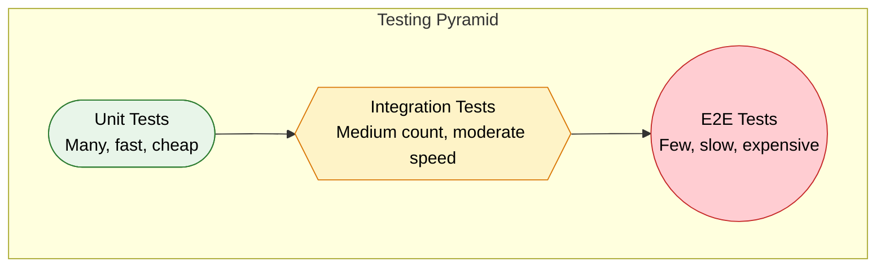
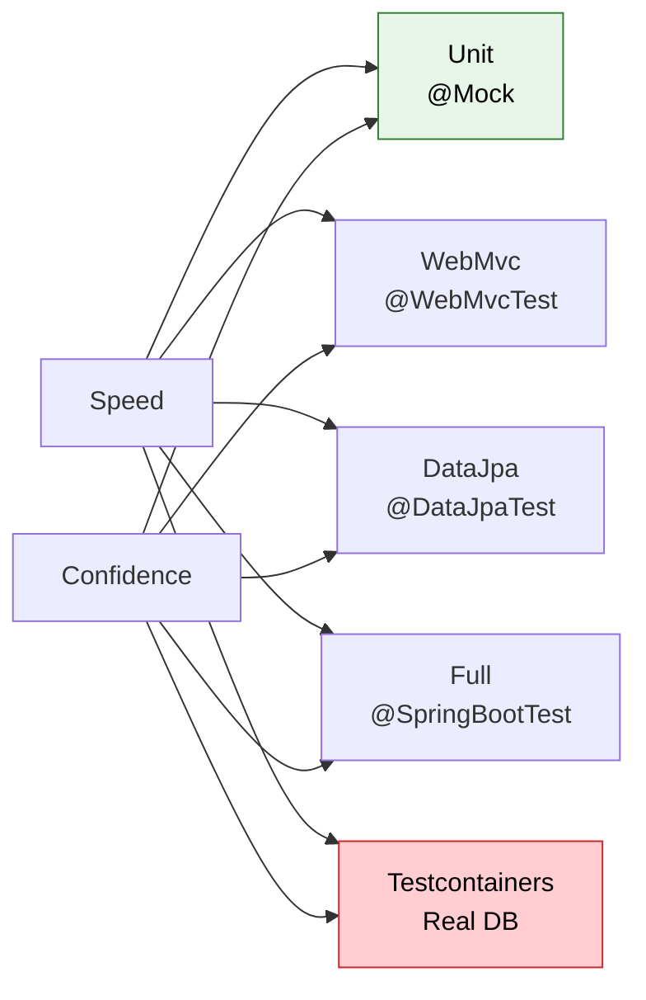

# Spring Boot Testing

> **Write tests that give you confidence — from fast unit tests to full integration tests that prove your app works end-to-end.**

---

!!! abstract "Testing Pyramid"
    **Unit tests** = test a single class in isolation. Fast. Cheap. Write many.  
    **Integration tests** = test beans wired together, real context. Moderate cost.  
    **E2E tests** = test full flows with real infrastructure. Slow. Expensive. Write few.  
    The pyramid: broad base of unit tests, thin top of E2E tests.



---

## When to Use Each Level

| Level | Scope | Dependencies | Speed | Catches |
|---|---|---|---|---|
| Unit | Single class | All mocked | ~ms | Logic bugs, edge cases |
| Integration | Multiple beans | Real context, embedded DB | ~seconds | Wiring bugs, config errors |
| E2E | Full stack | Real DB, real HTTP | ~10s+ | System bugs, protocol issues |

**Rule of thumb:** If the bug lives in one method, unit test it. If the bug lives in how beans interact, integration test it. If the bug lives in the full request lifecycle, E2E test it.

---

## Unit Tests — @Mock vs @MockBean

### @Mock (Mockito) — No Spring Context

Plain JUnit 5 + Mockito. No application context. Runs in milliseconds.

```java
@ExtendWith(MockitoExtension.class)
class OrderServiceTest {

    @Mock
    private OrderRepository orderRepository;

    @Mock
    private PaymentService paymentService;

    @InjectMocks
    private OrderService orderService;

    @Test
    void createOrder_shouldSaveAndReturnOrder() {
        // Given
        OrderRequest request = new OrderRequest("user-1", List.of("item-1"), BigDecimal.TEN);
        Order expectedOrder = new Order("order-1", "user-1", BigDecimal.TEN);
        when(orderRepository.save(any(Order.class))).thenReturn(expectedOrder);

        // When
        Order result = orderService.createOrder(request);

        // Then
        assertThat(result.getId()).isEqualTo("order-1");
        assertThat(result.getAmount()).isEqualTo(BigDecimal.TEN);
        verify(orderRepository).save(any(Order.class));
        verify(paymentService).reserve(eq("order-1"), eq(BigDecimal.TEN));
    }

    @Test
    void createOrder_whenPaymentFails_shouldThrowException() {
        // Given
        OrderRequest request = new OrderRequest("user-1", List.of("item-1"), BigDecimal.TEN);
        when(paymentService.reserve(any(), any()))
            .thenThrow(new PaymentException("Insufficient funds"));

        // When / Then
        assertThatThrownBy(() -> orderService.createOrder(request))
            .isInstanceOf(PaymentException.class)
            .hasMessage("Insufficient funds");

        verify(orderRepository, never()).save(any());
    }
}
```

### @MockBean — Replaces Bean in Spring Context

Used with `@WebMvcTest` or `@SpringBootTest`. Spring creates the full (or sliced) context, then replaces the specified bean with a Mockito mock.

!!! warning "Performance Cost"
    Every unique combination of `@MockBean` declarations creates a **new application context**. Spring cannot reuse cached contexts when mock sets differ. Prefer `@Mock` + `@InjectMocks` for pure logic tests.

### BDDMockito Style

More readable for BDD-style tests. Use `given()` instead of `when()`, `then()` instead of `verify()`.

```java
import static org.mockito.BDDMockito.*;

@Test
void shouldReturnOrderWhenExists() {
    // given
    given(orderRepository.findById("order-1"))
        .willReturn(Optional.of(new Order("order-1", "user-1", BigDecimal.TEN)));

    // when
    Order result = orderService.findById("order-1");

    // then
    then(orderRepository).should().findById("order-1");
    assertThat(result.getUserId()).isEqualTo("user-1");
}
```

| Mockito Standard | BDDMockito Equivalent |
|---|---|
| `when(...).thenReturn(...)` | `given(...).willReturn(...)` |
| `verify(mock).method()` | `then(mock).should().method()` |
| `doThrow(...).when(mock)` | `willThrow(...).given(mock)` |

---

## @SpringBootTest — Full Context

Loads the **entire** application context. All beans, all auto-configurations, all properties.

```java
@SpringBootTest(webEnvironment = SpringBootTest.WebEnvironment.RANDOM_PORT)
@ActiveProfiles("test")
class OrderIntegrationTest {

    @Autowired
    private TestRestTemplate restTemplate;

    @Autowired
    private OrderRepository orderRepository;

    @BeforeEach
    void setup() {
        orderRepository.deleteAll();
    }

    @Test
    void createOrder_shouldReturn201AndPersist() {
        OrderRequest request = new OrderRequest("user-1", List.of("pizza"), new BigDecimal("29.99"));

        ResponseEntity<Order> response = restTemplate.postForEntity(
            "/api/orders", request, Order.class);

        assertThat(response.getStatusCode()).isEqualTo(HttpStatus.CREATED);
        assertThat(response.getBody().getId()).isNotNull();
        assertThat(orderRepository.count()).isEqualTo(1);
    }
}
```

**What it loads:** Everything. Component scan, auto-configuration, embedded server (if `RANDOM_PORT`), database, caches, schedulers.

**Cost:** Slow startup. Use only when you need the full stack. For targeted tests, use slice annotations.

| WebEnvironment Option | Behavior |
|---|---|
| `MOCK` (default) | Servlet environment mocked. Use with `MockMvc`. |
| `RANDOM_PORT` | Real embedded server on random port. Use with `TestRestTemplate`. |
| `DEFINED_PORT` | Real server on `server.port`. Avoid — port conflicts in CI. |
| `NONE` | No web environment. For non-web tests. |

---

## Slice Tests — Load Only What You Need

### @WebMvcTest — Controller Layer Only

**Loads:** Controllers, `@ControllerAdvice`, `@JsonComponent`, converters, filters, `MockMvc`.  
**Does NOT load:** `@Service`, `@Repository`, `@Component`, `DataSource`, JPA, any non-web bean.

```java
@WebMvcTest(OrderController.class)
class OrderControllerTest {

    @Autowired
    private MockMvc mockMvc;

    @MockBean
    private OrderService orderService;

    @Test
    void getOrder_shouldReturnOrder() throws Exception {
        Order order = new Order("order-1", "user-1", BigDecimal.TEN);
        when(orderService.findById("order-1")).thenReturn(order);

        mockMvc.perform(get("/api/orders/order-1"))
            .andExpect(status().isOk())
            .andExpect(jsonPath("$.id").value("order-1"))
            .andExpect(jsonPath("$.amount").value(10));
    }

    @Test
    void createOrder_withInvalidBody_shouldReturn400() throws Exception {
        String invalidJson = """
            { "userId": "", "items": [], "amount": -5 }
            """;

        mockMvc.perform(post("/api/orders")
                .contentType(MediaType.APPLICATION_JSON)
                .content(invalidJson))
            .andExpect(status().isBadRequest())
            .andExpect(jsonPath("$.validationErrors.userId").exists());
    }
}
```

### @DataJpaTest — Repository Layer Only

**Loads:** JPA repositories, `EntityManager`, Flyway/Liquibase migrations, embedded database (H2 by default).  
**Does NOT load:** Controllers, services, web layer, security, caches.

```java
@DataJpaTest
@ActiveProfiles("test")
class OrderRepositoryTest {

    @Autowired
    private OrderRepository orderRepository;

    @Autowired
    private TestEntityManager entityManager;

    @Test
    void findByUserId_shouldReturnUserOrders() {
        entityManager.persist(new Order(null, "user-1", new BigDecimal("10.00")));
        entityManager.persist(new Order(null, "user-1", new BigDecimal("20.00")));
        entityManager.persist(new Order(null, "user-2", new BigDecimal("30.00")));
        entityManager.flush();

        List<Order> result = orderRepository.findByUserId("user-1");

        assertThat(result).hasSize(2);
        assertThat(result).extracting(Order::getUserId).containsOnly("user-1");
    }
}
```

!!! tip "@DataJpaTest is transactional by default"
    Each test method runs in a transaction that **rolls back** after the test. No cleanup needed.

### @WebFluxTest — Reactive Controller Layer

**Loads:** Reactive controllers, `WebFluxConfigurer`, `@ControllerAdvice`, codecs.  
**Does NOT load:** Services, repositories, non-reactive components.

```java
@WebFluxTest(OrderController.class)
class OrderReactiveControllerTest {

    @Autowired
    private WebTestClient webTestClient;

    @MockBean
    private OrderService orderService;

    @Test
    void getOrder_shouldReturnOrder() {
        when(orderService.findById("order-1"))
            .thenReturn(Mono.just(new Order("order-1", "user-1", BigDecimal.TEN)));

        webTestClient.get().uri("/api/orders/order-1")
            .exchange()
            .expectStatus().isOk()
            .expectBody()
            .jsonPath("$.id").isEqualTo("order-1");
    }
}
```

### @JsonTest — Serialization/Deserialization

**Loads:** `ObjectMapper`, `@JsonComponent`, Jackson modules.  
**Does NOT load:** Controllers, services, repositories, web layer.

```java
@JsonTest
class OrderJsonTest {

    @Autowired
    private JacksonTester<Order> json;

    @Test
    void shouldSerializeAmount() throws Exception {
        Order order = new Order("order-1", "user-1", new BigDecimal("29.99"));

        assertThat(json.write(order))
            .extractingJsonPathNumberValue("$.amount")
            .isEqualTo(29.99);
    }

    @Test
    void shouldDeserializeFromJson() throws Exception {
        String content = """
            {"id":"order-1","userId":"user-1","amount":29.99}
            """;

        assertThat(json.parse(content))
            .usingRecursiveComparison()
            .isEqualTo(new Order("order-1", "user-1", new BigDecimal("29.99")));
    }
}
```

### Slice Comparison Table

| Annotation | Loads | Typical Use |
|---|---|---|
| `@WebMvcTest` | Controllers, filters, MockMvc | HTTP mapping, validation, error handling |
| `@DataJpaTest` | JPA, EntityManager, embedded DB | Custom queries, entity mappings |
| `@WebFluxTest` | Reactive controllers, WebTestClient | Reactive endpoint tests |
| `@JsonTest` | Jackson ObjectMapper | Serialization contracts |
| `@RestClientTest` | RestTemplate/WebClient mocks | External API client tests |

---

## MockMvc — Testing Without a Server

MockMvc simulates HTTP requests against your controllers without starting a real server. No network, no port. Fast.

### Request Building and Response Assertions

```java
@WebMvcTest(OrderController.class)
class MockMvcDemoTest {

    @Autowired
    private MockMvc mockMvc;

    @MockBean
    private OrderService orderService;

    @Test
    void shouldHandleGetWithParams() throws Exception {
        given(orderService.findByUser("user-1", PageRequest.of(0, 10)))
            .willReturn(new PageImpl<>(List.of(
                new Order("o-1", "user-1", BigDecimal.TEN))));

        mockMvc.perform(get("/api/orders")
                .param("userId", "user-1")
                .param("page", "0")
                .param("size", "10")
                .header("X-Request-Id", "req-123")
                .accept(MediaType.APPLICATION_JSON))
            .andExpect(status().isOk())
            .andExpect(header().string("X-Request-Id", "req-123"))
            .andExpect(jsonPath("$.content").isArray())
            .andExpect(jsonPath("$.content.length()").value(1))
            .andExpect(jsonPath("$.content[0].id").value("o-1"))
            .andExpect(jsonPath("$.totalElements").value(1));
    }

    @Test
    void shouldTestPostWithBody() throws Exception {
        String body = """
            {"userId":"user-1","items":["pizza"],"amount":29.99}
            """;

        given(orderService.createOrder(any()))
            .willReturn(new Order("o-new", "user-1", new BigDecimal("29.99")));

        mockMvc.perform(post("/api/orders")
                .contentType(MediaType.APPLICATION_JSON)
                .content(body))
            .andExpect(status().isCreated())
            .andExpect(jsonPath("$.id").value("o-new"))
            .andExpect(jsonPath("$.amount").value(29.99));
    }

    @Test
    void shouldTestDeleteReturns204() throws Exception {
        mockMvc.perform(delete("/api/orders/order-1"))
            .andExpect(status().isNoContent())
            .andExpect(content().string(""));

        then(orderService).should().deleteOrder("order-1");
    }
}
```

---

## Testcontainers — Real Database Testing with Docker

Embedded databases (H2) differ from production databases. Testcontainers spins up real PostgreSQL, MySQL, Redis, or Kafka in Docker. Tests hit the actual database engine.

### PostgreSQL Example

```java
@SpringBootTest
@Testcontainers
@ActiveProfiles("test")
class OrderServiceIntegrationTest {

    @Container
    static PostgreSQLContainer<?> postgres = new PostgreSQLContainer<>("postgres:16")
        .withDatabaseName("testdb")
        .withUsername("test")
        .withPassword("test");

    @DynamicPropertySource
    static void configureProperties(DynamicPropertyRegistry registry) {
        registry.add("spring.datasource.url", postgres::getJdbcUrl);
        registry.add("spring.datasource.username", postgres::getUsername);
        registry.add("spring.datasource.password", postgres::getPassword);
    }

    @Autowired
    private OrderService orderService;

    @Autowired
    private OrderRepository orderRepository;

    @Test
    void shouldPersistOrderInRealPostgres() {
        Order order = orderService.createOrder(
            new OrderRequest("user-1", List.of("item-1"), BigDecimal.TEN));

        assertThat(order.getId()).isNotNull();
        assertThat(orderRepository.findById(order.getId())).isPresent();
    }

    @Test
    void shouldHandlePostgresSpecificFeatures() {
        // JSONB columns, array types, etc. work here but fail on H2
        Order order = orderService.createOrderWithMetadata(
            new OrderRequest("user-1", List.of("item-1"), BigDecimal.TEN),
            Map.of("source", "mobile", "version", "2.1"));

        Order found = orderRepository.findById(order.getId()).orElseThrow();
        assertThat(found.getMetadata()).containsEntry("source", "mobile");
    }
}
```

### Reusable Container Pattern

Avoid starting a new container per test class:

```java
public abstract class AbstractIntegrationTest {

    static final PostgreSQLContainer<?> POSTGRES;

    static {
        POSTGRES = new PostgreSQLContainer<>("postgres:16")
            .withDatabaseName("testdb")
            .withUsername("test")
            .withPassword("test");
        POSTGRES.start(); // started once, reused across all subclasses
    }

    @DynamicPropertySource
    static void configureProperties(DynamicPropertyRegistry registry) {
        registry.add("spring.datasource.url", POSTGRES::getJdbcUrl);
        registry.add("spring.datasource.username", POSTGRES::getUsername);
        registry.add("spring.datasource.password", POSTGRES::getPassword);
    }
}
```

---

## TestRestTemplate vs WebTestClient

| Feature | TestRestTemplate | WebTestClient |
|---|---|---|
| Blocking/Reactive | Blocking only | Both blocking and reactive |
| Server required | Yes (RANDOM_PORT) | No (can bind to MockMvc) |
| Fluent assertions | No (manual status checks) | Yes (`.expectStatus().isOk()`) |
| Streaming support | No | Yes |
| Use with | `@SpringBootTest(RANDOM_PORT)` | `@WebFluxTest` or `@SpringBootTest` |

=== "TestRestTemplate"

    ```java
    @SpringBootTest(webEnvironment = RANDOM_PORT)
    class OrderE2ETest {

        @Autowired
        private TestRestTemplate restTemplate;

        @Test
        void shouldCreateAndRetrieveOrder() {
            // Create
            ResponseEntity<Order> created = restTemplate.postForEntity(
                "/api/orders",
                new OrderRequest("user-1", List.of("pizza"), BigDecimal.TEN),
                Order.class);
            assertThat(created.getStatusCode()).isEqualTo(HttpStatus.CREATED);

            // Retrieve
            String id = created.getBody().getId();
            ResponseEntity<Order> fetched = restTemplate.getForEntity(
                "/api/orders/" + id, Order.class);
            assertThat(fetched.getBody().getAmount()).isEqualTo(BigDecimal.TEN);
        }
    }
    ```

=== "WebTestClient"

    ```java
    @SpringBootTest(webEnvironment = RANDOM_PORT)
    class OrderE2ETest {

        @Autowired
        private WebTestClient webTestClient;

        @Test
        void shouldCreateAndRetrieveOrder() {
            // Create
            Order created = webTestClient.post().uri("/api/orders")
                .bodyValue(new OrderRequest("user-1", List.of("pizza"), BigDecimal.TEN))
                .exchange()
                .expectStatus().isCreated()
                .expectBody(Order.class)
                .returnResult().getResponseBody();

            // Retrieve
            webTestClient.get().uri("/api/orders/" + created.getId())
                .exchange()
                .expectStatus().isOk()
                .expectBody()
                .jsonPath("$.amount").isEqualTo(10);
        }
    }
    ```

**When to use which:**

- Use `TestRestTemplate` for traditional servlet-based apps where you need simple request/response testing.
- Use `WebTestClient` for reactive apps, or when you want fluent assertion chaining. Works with both reactive and servlet stacks.

---

## Transactional Behavior, @Sql, and @DirtiesContext

### @Transactional in Tests

When a test method is annotated with `@Transactional`, Spring wraps it in a transaction and **rolls back** after the test. No data leaks between tests.

!!! danger "Gotcha: @Transactional hides real bugs"
    If your service expects to run **without** a wrapping transaction (e.g., calls `@Transactional(propagation = REQUIRES_NEW)`), wrapping the test in a transaction changes the behavior. The test passes but production fails.

```java
@SpringBootTest
@Transactional  // auto-rollback after each test
class OrderServiceTest {

    @Autowired
    private OrderService orderService;

    @Autowired
    private OrderRepository orderRepository;

    @Test
    void shouldPersistWithinTransaction() {
        orderService.createOrder(new OrderRequest("user-1", List.of("x"), BigDecimal.ONE));
        // visible within the same transaction
        assertThat(orderRepository.count()).isEqualTo(1);
    }
    // rolled back — DB is clean for next test
}
```

### @Sql — Load Test Data from SQL Scripts

```java
@SpringBootTest
@Sql(scripts = "/test-data/orders.sql", executionPhase = BEFORE_TEST_METHOD)
@Sql(scripts = "/cleanup.sql", executionPhase = AFTER_TEST_METHOD)
class OrderQueryTest {

    @Autowired
    private OrderRepository orderRepository;

    @Test
    void shouldFindHighValueOrders() {
        List<Order> results = orderRepository.findByAmountGreaterThan(new BigDecimal("100"));
        assertThat(results).hasSize(3); // as defined in orders.sql
    }
}
```

### @DirtiesContext — Nuclear Option

Forces Spring to destroy and recreate the application context after the test. Expensive. Use only when a test modifies shared state (e.g., changes a bean's internal state).

```java
@SpringBootTest
@DirtiesContext(classMode = AFTER_CLASS)
class StatefulServiceTest {
    // context is destroyed after all tests in this class
}
```

!!! warning "Avoid @DirtiesContext when possible"
    It kills the cached context. Subsequent tests must rebuild it from scratch. Use `@Transactional` rollback or manual cleanup instead.

---

## Test Configuration

### @TestConfiguration

Defines beans only for tests. Does not get picked up by the main application.

```java
@TestConfiguration
class TestClockConfig {

    @Bean
    public Clock clock() {
        return Clock.fixed(Instant.parse("2025-01-01T00:00:00Z"), ZoneOffset.UTC);
    }
}
```

### @Import — Pull Test Config Into a Test

```java
@SpringBootTest
@Import(TestClockConfig.class)
class TimeBasedServiceTest {

    @Autowired
    private TimeBasedService service;

    @Test
    void shouldUseFixedClock() {
        assertThat(service.getCurrentDate()).isEqualTo(LocalDate.of(2025, 1, 1));
    }
}
```

### @ActiveProfiles("test")

Activates `application-test.yml`. Common pattern: disable scheduled tasks, use embedded DB, reduce logging noise.

```yaml
# application-test.yml
spring:
  datasource:
    url: jdbc:h2:mem:testdb
  jpa:
    hibernate:
      ddl-auto: create-drop
  task:
    scheduling:
      enabled: false
```

---

## Gotchas and Pitfalls

| Gotcha | Explanation | Fix |
|---|---|---|
| `@MockBean` busts context cache | Different `@MockBean` combinations = different contexts | Standardize mock sets or use `@Mock` |
| `@Transactional` auto-rollback | Test data is never actually committed | Remove `@Transactional` for commit-verification tests |
| `@SpringBootTest` with `RANDOM_PORT` | Cannot use `MockMvc` — requires real HTTP client | Use `TestRestTemplate` or `WebTestClient` |
| `@DataJpaTest` uses H2 by default | Behavior differs from production DB (PostgreSQL) | Add `@AutoConfigureTestDatabase(replace = NONE)` + Testcontainers |
| Tests share application context | One test's `@MockBean` stub leaks to another | Use `Mockito.reset()` in `@BeforeEach` or isolate contexts |
| Lazy initialization in tests | Beans not loaded until first use — NPE in test | Add `spring.main.lazy-initialization=false` in test properties |

---

## TDD a REST Endpoint — Red to Green

Build a `GET /api/products/{id}` endpoint using TDD.

### Step 1: Red — Write the Failing Test

```java
@WebMvcTest(ProductController.class)
class ProductControllerTest {

    @Autowired
    private MockMvc mockMvc;

    @MockBean
    private ProductService productService;

    @Test
    void getProduct_shouldReturn200WithProduct() throws Exception {
        given(productService.findById("prod-1"))
            .willReturn(new Product("prod-1", "Keyboard", new BigDecimal("79.99")));

        mockMvc.perform(get("/api/products/prod-1"))
            .andExpect(status().isOk())
            .andExpect(jsonPath("$.id").value("prod-1"))
            .andExpect(jsonPath("$.name").value("Keyboard"))
            .andExpect(jsonPath("$.price").value(79.99));
    }

    @Test
    void getProduct_whenNotFound_shouldReturn404() throws Exception {
        given(productService.findById("nope"))
            .willThrow(new ProductNotFoundException("nope"));

        mockMvc.perform(get("/api/products/nope"))
            .andExpect(status().isNotFound())
            .andExpect(jsonPath("$.message").value("Product not found: nope"));
    }
}
```

**Run tests:** Both fail. `ProductController` does not exist yet.

### Step 2: Green — Write Minimal Implementation

```java
@RestController
@RequestMapping("/api/products")
public class ProductController {

    private final ProductService productService;

    public ProductController(ProductService productService) {
        this.productService = productService;
    }

    @GetMapping("/{id}")
    public Product getProduct(@PathVariable String id) {
        return productService.findById(id);
    }
}

@ResponseStatus(HttpStatus.NOT_FOUND)
public class ProductNotFoundException extends RuntimeException {
    public ProductNotFoundException(String id) {
        super("Product not found: " + id);
    }
}
```

**Run tests:** Both pass. Minimal code, maximum confidence.

### Step 3: Refactor

Add response wrapping, HATEOAS links, caching headers — tests protect you from regressions.

---

## Test Annotation Cheat Sheet

| Annotation | What it loads | Speed | Use for |
|---|---|---|---|
| `@ExtendWith(MockitoExtension.class)` | Nothing (plain JUnit) | Fastest | Service/logic unit tests |
| `@WebMvcTest` | Web layer only | Fast | Controller tests |
| `@DataJpaTest` | JPA + embedded DB | Fast | Repository tests |
| `@JsonTest` | Jackson ObjectMapper | Fast | Serialization tests |
| `@WebFluxTest` | Reactive web layer | Fast | Reactive controller tests |
| `@SpringBootTest` | Full context | Slow | Integration tests |
| `@SpringBootTest` + Testcontainers | Full + real DB | Slowest | End-to-end tests |



---

## Interview Questions

??? question "1. What is the difference between @MockBean and @Mock?"
    **@Mock** (Mockito): Creates a mock object in a plain unit test. No Spring context. Injected via `@InjectMocks`. Fast.  
    **@MockBean** (Spring Boot): Creates a mock and registers it in the Spring ApplicationContext, replacing the real bean. Used with `@WebMvcTest` or `@SpringBootTest`. Slower because it requires a context.  
    **Key gotcha:** Each unique `@MockBean` combination creates a new cached context. Overuse slows your suite.

??? question "2. Why is @DataJpaTest faster than @SpringBootTest?"
    `@DataJpaTest` only loads JPA-related beans: repositories, `EntityManager`, Flyway/Liquibase, and an embedded database. It skips controllers, services, security, caches, schedulers, and all other auto-configurations. `@SpringBootTest` loads everything. Fewer beans = faster startup.

??? question "3. How do you test @Transactional rollback?"
    Two approaches:  
    1. **Verify exception triggers rollback:** Call a service method that throws after a save. Assert the entity is not persisted (requires `REQUIRES_NEW` or a separate transaction to read).  
    2. **Use Testcontainers + no test-level @Transactional:** Let the real transaction commit or roll back, then query the DB in a separate transaction to verify state.  
    Never test rollback with `@Transactional` on the test method itself — it always rolls back, masking the real behavior.

??? question "4. @WebMvcTest — what does it NOT load?"
    It does NOT load: `@Service` beans, `@Repository` beans, `@Component` beans, `DataSource`, JPA/Hibernate, message listeners, schedulers, caches, or any non-web auto-configuration. You must `@MockBean` all dependencies your controller injects.

??? question "5. When would you use TestRestTemplate vs WebTestClient?"
    **TestRestTemplate:** Blocking. Requires a running server (`RANDOM_PORT`). Simple API. Good for traditional servlet apps.  
    **WebTestClient:** Non-blocking. Works with or without a running server (can bind directly to `RouterFunction` or `MockMvc`). Fluent assertions. Required for reactive apps. Preferred for new projects even on servlet stack.

??? question "6. What does @DirtiesContext do and why should you avoid it?"
    It marks the application context as dirty, forcing Spring to destroy and rebuild it after the test. This is expensive — context startup can take seconds. Use it only when a test irreversibly modifies shared state (e.g., changes a singleton bean's field). Prefer `@Transactional` rollback or `@BeforeEach` cleanup instead.

??? question "7. How does @DynamicPropertySource work with Testcontainers?"
    It is a static method annotated with `@DynamicPropertySource` that receives a `DynamicPropertyRegistry`. You register properties (like JDBC URL) that are resolved at runtime — after the container starts. This bridges the gap between container's random port/URL and Spring's property system.

??? question "8. What is @Sql used for in tests?"
    `@Sql` executes SQL scripts before or after a test method. Use it to insert test data (`BEFORE_TEST_METHOD`) or clean up (`AFTER_TEST_METHOD`). Alternative to programmatic setup with `TestEntityManager`. Useful for complex data scenarios that are tedious to build in Java.

??? question "9. How do you test a @RestControllerAdvice?"
    Write a `@WebMvcTest` that triggers the exception. The `@ControllerAdvice` is auto-loaded by the web slice. Perform a request that causes the controller (or its mock) to throw, then assert the response status and body match your error format.

??? question "10. What is the difference between MOCK and RANDOM_PORT in @SpringBootTest?"
    `MOCK` (default): No real server starts. Servlet environment is mocked. Use with `MockMvc` or `WebTestClient` bound to the application context.  
    `RANDOM_PORT`: A real embedded server starts on a random available port. Use with `TestRestTemplate` or `WebTestClient` over HTTP. Required for testing real HTTP behavior (redirects, cookies, HTTPS).

??? question "11. How do you avoid slow test suites with @MockBean?"
    1. Standardize `@MockBean` sets across test classes so Spring can reuse cached contexts.  
    2. Prefer `@Mock` + `@InjectMocks` for logic-only tests.  
    3. Use `@WebMvcTest(SpecificController.class)` to limit scanned controllers.  
    4. Share a base test class with common `@MockBean` declarations.

??? question "12. What is @TestConfiguration and when do you use it?"
    `@TestConfiguration` defines beans only available in tests. Unlike `@Configuration`, it is not picked up by component scan in the main application. Use it to override beans (e.g., provide a fixed `Clock`, a stub external client, or a test-specific `DataSource`). Import it with `@Import(MyTestConfig.class)`.

??? question "13. Can @Transactional on a test method hide bugs?"
    Yes. If the test is wrapped in a transaction, lazy-loaded entities remain accessible (session is open). In production, without the wrapping transaction, you get `LazyInitializationException`. Also, if your service uses `REQUIRES_NEW`, the test's outer transaction changes propagation semantics. Remove `@Transactional` from the test to catch these bugs.

??? question "14. How do you test async methods (@Async) in Spring Boot?"
    1. Use `Awaitility` library to poll for the expected result.  
    2. Ensure `@EnableAsync` is active in test context.  
    3. Do NOT use `@Transactional` on the test — async methods run in a separate thread with a separate transaction.  
    ```java
    @Test
    void shouldProcessAsync() {
        service.processAsync("order-1");
        await().atMost(5, SECONDS).until(() -> 
            orderRepository.findById("order-1").get().getStatus() == PROCESSED);
    }
    ```
