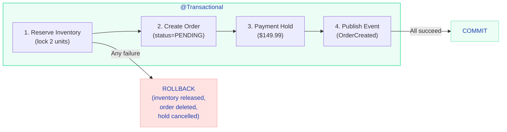
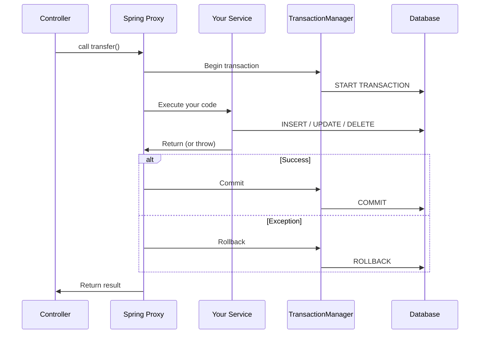
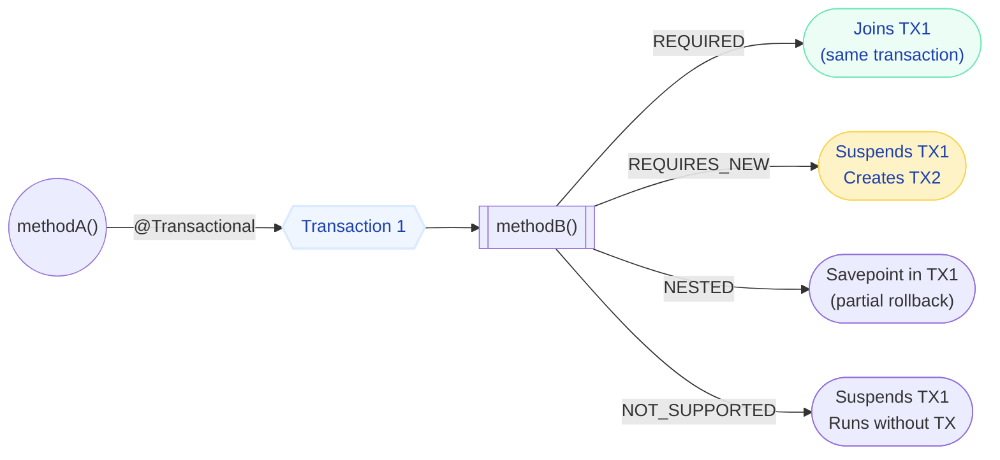
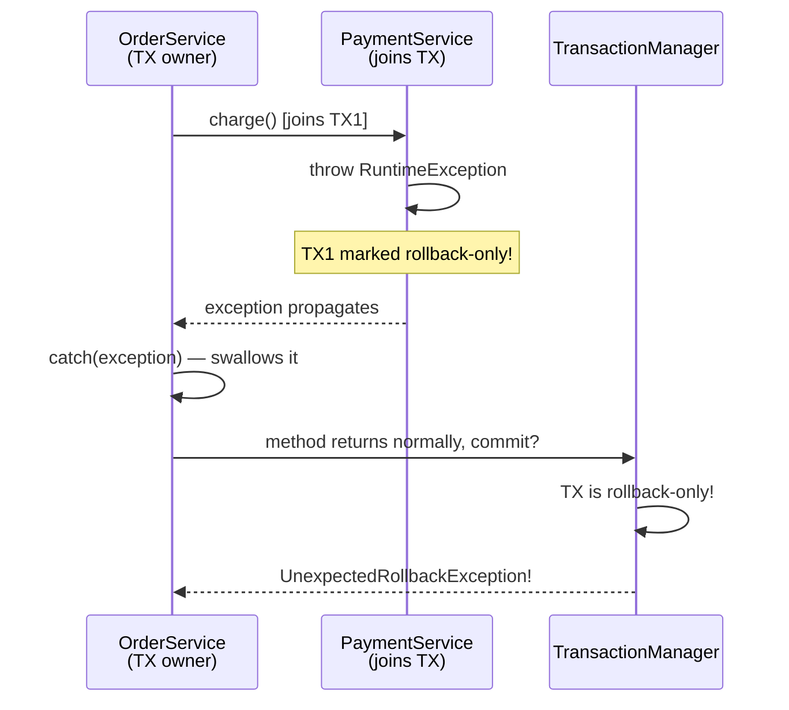
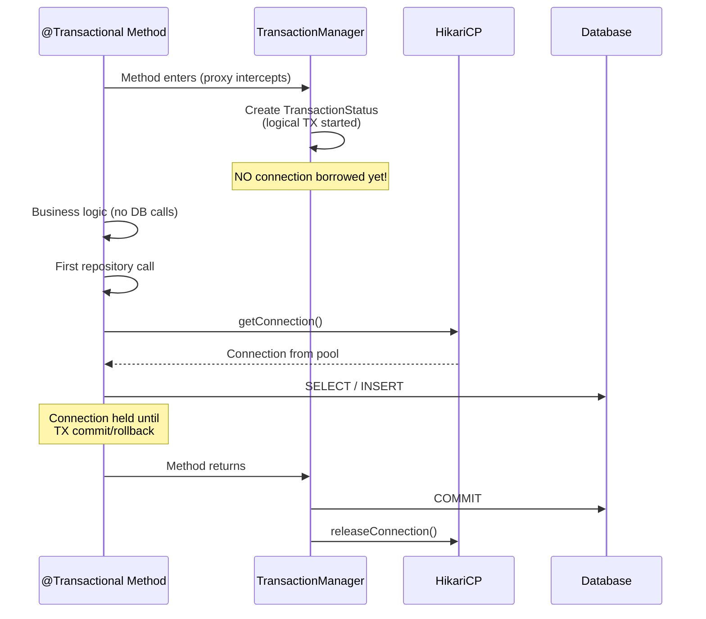
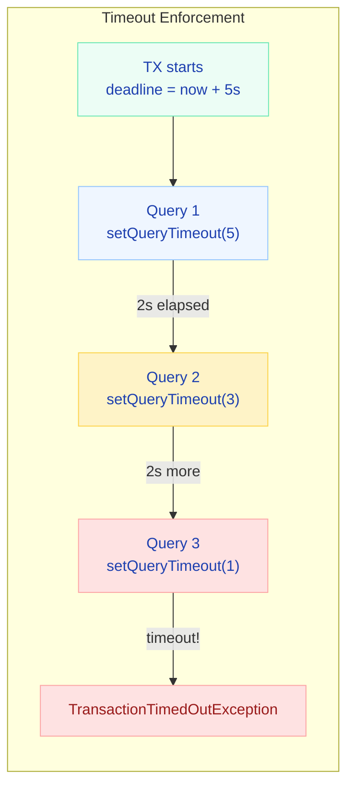
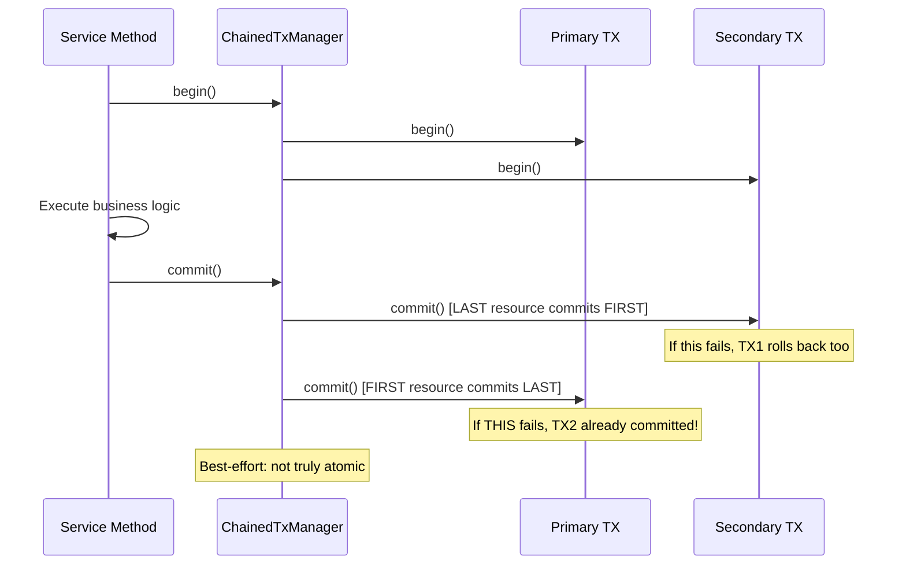

# Spring Boot @Transactional Deep Dive — Propagation, Isolation & Gotchas

> **One-liner for interviews:** "A transaction ensures all-or-nothing execution — either every database operation in a unit of work commits together, or none of them do, leaving the system in a consistent state."

---

## The Problem Transactions Solve

Imagine you're building a payment service for an e-commerce platform. A user clicks "Pay Rs.500". Your method does three things:

1. Deducts Rs.500 from the user's wallet
2. Creates an order record with status `CONFIRMED`
3. Sends a confirmation email via an external service

Here's what happens on a Friday evening deployment when the email service throws an exception after the wallet is already deducted:

**Without a transaction:** The wallet shows Rs.500 less, but there's no order. The user's money vanished into thin air. Your on-call gets paged at 2 AM on Saturday. You spend the weekend writing a reconciliation script.

**With a transaction:** The moment the email service throws, Spring rolls back the wallet deduction too. The user's balance is untouched. The system is exactly as it was before the method was called.

!!! abstract "Real-World Scenario: Multi-Line Order Fulfillment"
    At an e-commerce marketplace, placing an order requires FOUR operations: reserve inventory, create the order record, initiate the payment hold, and publish an event to the fulfillment service. If the system crashes after reserving inventory but before creating the order, you've locked stock that nobody can buy. If it crashes after payment hold but before the fulfillment event, the customer is charged but nothing ships. A transaction ensures either ALL four succeed or NONE do — the system never lands in a half-finished state.



---

## How @Transactional Works Internally

### What

`@Transactional` is a declarative way to wrap a method in a database transaction. Behind the scenes, Spring uses **proxy-based AOP** — it generates a wrapper class around your service that handles `BEGIN`, `COMMIT`, and `ROLLBACK` automatically.

### Why

Without it, you'd write try-catch-finally blocks around every database operation, manually managing connections and transactions. That's error-prone and verbose.

### When

Use `@Transactional` on any public method that performs database writes that must be atomic. Don't use it on private methods (it won't work) or on methods that only do external HTTP calls (you're holding a DB connection for no reason).

### How: The Proxy Creation Process

Here's what actually happens when Spring starts up:

1. Spring scans your classes for `@Transactional` annotations during bean initialization.
2. A `BeanPostProcessor` (specifically `InfrastructureAdvisorAutoProxyCreator`) wraps the target bean in a **proxy**.
3. The proxy is either a **JDK dynamic proxy** (if the bean implements an interface) or a **CGLIB subclass proxy** (if no interface — this is the common case).
4. The proxy holds a reference to the `TransactionInterceptor`, which contains all the transaction management logic.

Here's what Spring generates behind the scenes (simplified CGLIB proxy):

```java title="TransferService$$EnhancerBySpringCGLIB.java"
public class TransferService$$EnhancerBySpringCGLIB extends TransferService {

    private TransactionInterceptor txInterceptor;
    private TransferService target;

    @Override
    public void transfer(Long fromId, Long toId, BigDecimal amount) {
        TransactionInfo txInfo = txInterceptor.createTransactionIfNecessary();
        try {
            target.transfer(fromId, toId, amount);  // your actual method
            txInterceptor.commitTransactionAfterReturning(txInfo);
        } catch (Throwable ex) {
            txInterceptor.completeTransactionAfterThrowing(txInfo, ex);
            throw ex;
        }
    }
}
```

!!! tip "Key Insight"
    The caller never holds a reference to the real bean. It holds a reference to the **proxy**. Every method call goes through this proxy first. The proxy intercepts, manages the transaction, then delegates to the real bean. This is why self-invocation (`this.someMethod()`) skips the transaction — you're calling the real object directly, bypassing the proxy.

### Where This Fits



!!! example "Interview tip"
    When asked "How does @Transactional work internally?", start with: "Spring uses AOP proxies. When a bean has @Transactional methods, Spring replaces it with a CGLIB proxy that intercepts calls, begins a transaction, delegates to the real method, and commits or rolls back based on the outcome. The real object never knows about the transaction — it's handled by the proxy layer."

---

## Basic Usage (The Simple Version)

**For 1-2 years of experience — this is all you need to start:**

```java title="TransferService.java"
@Service
public class TransferService {

    @Transactional
    public void transfer(Long fromId, Long toId, BigDecimal amount) {
        Account from = accountRepository.findById(fromId).orElseThrow();
        Account to = accountRepository.findById(toId).orElseThrow();

        from.debit(amount);   // If this succeeds...
        to.credit(amount);    // ...but THIS throws an exception -> BOTH rolled back
    }
}
```

That's it. One annotation. Spring handles the rest. If anything throws a `RuntimeException` (unchecked), everything rolls back. If the method returns normally, everything commits.

---

## @Transactional Properties — The Full Picture

```java
@Transactional(
    propagation = Propagation.REQUIRED,      // Default — join or create
    isolation = Isolation.READ_COMMITTED,    // Default — see committed data only
    timeout = 30,                            // Seconds before timeout
    readOnly = false,                        // Optimization hint for reads
    rollbackFor = Exception.class,           // When to rollback
    noRollbackFor = BusinessWarning.class    // Don't rollback for this
)
```

Let's go deep on each one.

---

## Propagation Types

### What

Propagation defines how a `@Transactional` method behaves when it's called from within another transaction. Should it join the existing transaction? Start a new one? Run without any?

### Why

Imagine your `OrderService.placeOrder()` calls `AuditService.log()`. If the audit logging fails, should the entire order be rolled back? Propagation gives you control over this decision.

### When

- **REQUIRED** (default): 95% of the time. "I need a transaction. If one exists, I'll join it."
- **REQUIRES_NEW**: When the inner operation MUST commit independently. Audit logs, notifications.
- **NESTED**: When you want partial rollback within the same connection.
- **NOT_SUPPORTED**: External API calls that shouldn't hold a transaction.

### How



| Propagation | Behavior | Use Case |
|---|---|---|
| **REQUIRED** (default) | Join existing TX, or create new | Most service methods |
| **REQUIRES_NEW** | Always create new TX, suspend current | Audit logs that must persist even if main TX fails |
| **NESTED** | Savepoint within current TX | Partial rollback scenarios |
| **SUPPORTS** | Use TX if exists, else run without | Read-only operations |
| **NOT_SUPPORTED** | Suspend current TX, run without | External API calls |
| **MANDATORY** | Must run in existing TX, else throw | Methods that should never be called alone |
| **NEVER** | Must NOT have an active TX, else throw | Sanity check |

### Production Scenario: Payment Fails — What Happens to the Order?

=== "REQUIRED (default)"

    ```java
    @Service
    public class OrderService {
        @Transactional  // TX1 created here
        public void placeOrder(OrderRequest req) {
            orderRepo.save(new Order(req));        // part of TX1
            paymentService.charge(req.getAmount()); // joins TX1
        }
    }

    @Service
    public class PaymentService {
        @Transactional(propagation = Propagation.REQUIRED)  // joins TX1
        public void charge(BigDecimal amount) {
            paymentRepo.save(new Payment(amount));
            throw new InsufficientFundsException(); // TX1 rolls back EVERYTHING
        }
    }
    ```
    
    **Result:** Both order AND payment are rolled back. They share one transaction. One bad apple spoils the whole batch.

=== "REQUIRES_NEW"

    ```java
    @Service
    public class OrderService {
        @Transactional  // TX1 created here
        public void placeOrder(OrderRequest req) {
            orderRepo.save(new Order(req));         // part of TX1
            try {
                paymentService.charge(req.getAmount()); // TX2 — completely independent
            } catch (PaymentException e) {
                orderRepo.updateStatus(req.getId(), PAYMENT_FAILED);
            }
        }
    }

    @Service
    public class PaymentService {
        @Transactional(propagation = Propagation.REQUIRES_NEW)  // TX2 created
        public void charge(BigDecimal amount) {
            paymentRepo.save(new Payment(amount));
            throw new InsufficientFundsException(); // only TX2 rolls back
        }
    }
    ```
    
    **Result:** Payment rolls back in TX2. Order survives in TX1 (because you caught the exception). TX1 and TX2 are completely independent — different connections, different fates.

=== "NESTED"

    ```java
    @Service
    public class OrderService {
        @Transactional  // TX1
        public void placeOrder(OrderRequest req) {
            orderRepo.save(new Order(req));
            try {
                paymentService.charge(req.getAmount()); // savepoint inside TX1
            } catch (PaymentException e) {
                // savepoint rolled back, but TX1 continues
                notificationService.sendPaymentFailedEmail(req);
            }
        }
    }

    @Service
    public class PaymentService {
        @Transactional(propagation = Propagation.NESTED)  // savepoint in TX1
        public void charge(BigDecimal amount) {
            paymentRepo.save(new Payment(amount));
            throw new InsufficientFundsException(); // rolls back to savepoint only
        }
    }
    ```
    
    **Result:** Payment rolls back to the savepoint. Order remains. Unlike REQUIRES_NEW, everything runs on the **same physical connection**. If the outer TX later rolls back, the nested work is also lost.

### Going Deeper: REQUIRES_NEW + Audit Log

Here's a subtle bug that has bitten many production systems:

!!! danger "What Breaks: Exception propagation from REQUIRES_NEW"
    Even though `auditService.log()` runs in its own transaction, if it throws an exception, that exception propagates UP to the caller and rolls back the **outer** transaction too. The audit TX committed (or rolled back independently), but the exception kills the parent!

```java title="OrderService.java"
@Service
public class OrderService {

    @Transactional
    public void placeOrder(OrderRequest request) {
        Order order = orderRepository.save(new Order(request));
        paymentService.charge(order);  // If this fails, order rolls back

        // BUG: If audit throws, the order TX rolls back!
        auditService.log("ORDER_PLACED", order.getId());
    }
}

@Service
public class AuditService {

    @Transactional(propagation = Propagation.REQUIRES_NEW)
    public void log(String action, Long entityId) {
        auditRepository.save(new AuditLog(action, entityId));
        // If this throws (DB full, constraint violation, etc.)
        // The exception propagates to OrderService and kills the order!
    }
}
```

**The fix:** Always wrap REQUIRES_NEW calls in try-catch when the caller's transaction matters more:

```java title="OrderService.java — Fixed"
@Transactional
public void placeOrder(OrderRequest request) {
    Order order = orderRepository.save(new Order(request));
    paymentService.charge(order);

    // FIX: Audit failure should never kill the order
    try {
        auditService.log("ORDER_PLACED", order.getId());
    } catch (Exception e) {
        log.warn("Audit logging failed, order still committed", e);
    }
}
```

### Staff-level insight: Use @TransactionalEventListener Instead

The cleanest pattern for "do something after the main TX commits" is an event listener. This decouples audit from the business logic entirely and guarantees the audit only fires after a successful commit.

```java
@Service
public class OrderService {

    @Autowired private ApplicationEventPublisher eventPublisher;

    @Transactional
    public void placeOrder(OrderRequest request) {
        Order order = orderRepository.save(new Order(request));
        paymentService.charge(order);
        eventPublisher.publishEvent(new OrderPlacedEvent(order.getId()));
        // Event is held until commit — no risk to the main transaction
    }
}

@Component
public class AuditEventHandler {

    @TransactionalEventListener(phase = TransactionPhase.AFTER_COMMIT)
    public void onOrderPlaced(OrderPlacedEvent event) {
        auditRepository.save(new AuditLog("ORDER_PLACED", event.getOrderId()));
    }
}
```

!!! example "Interview tip"
    When discussing propagation, always mention the REQUIRES_NEW + exception propagation gotcha. It shows deep understanding. Say: "REQUIRES_NEW creates an independent transaction, but the exception from the inner method still propagates to the outer. You need a try-catch if the outer transaction should survive the inner failure."

**Counter-questions an interviewer will ask:**

- "When would NESTED deadlock but REQUIRES_NEW won't?" — NESTED uses the same connection, so no deadlock with itself. REQUIRES_NEW opens a second connection, which CAN deadlock if both try to lock the same row.
- "Why not always use REQUIRES_NEW?" — It opens a second database connection. With connection pool size 10 and 10 concurrent requests all using REQUIRES_NEW, you've doubled your connection demand to 20. Pool exhaustion.

---

## The UnexpectedRollbackException Trap

### What

`UnexpectedRollbackException` is thrown when Spring tries to commit a transaction that was already marked as "rollback-only" by an inner participant.

### Why This Exists

When two methods share a transaction (REQUIRED propagation) and the inner method throws, the `TransactionInterceptor` around that inner method marks the shared transaction as rollback-only. Even if the outer method catches the exception, the transaction is permanently poisoned.

### The "What Breaks" Story

You deploy on Thursday afternoon. Everything looks fine. Friday morning, the product team reports: "Orders with failed payments aren't getting the PAYMENT_FAILED status. They just... disappear."

You check the logs. You see your catch block executed. You see the log message "Payment failed, marking order as failed". But when you check the database — the order doesn't exist at all. Not with PAYMENT_FAILED status, not with any status.

What happened? The `paymentService.charge()` threw an `InsufficientFundsException`. Your catch block ran. But the transaction was already marked rollback-only. When your method returned, Spring tried to commit, found the rollback-only flag, and rolled back EVERYTHING — including the order creation AND the status update inside your catch block.

### The Sequence of Doom



### Code That Triggers It

```java title="BrokenOrderService.java"
@Service
public class OrderService {

    @Transactional  // TX1 starts here
    public void placeOrder(OrderRequest req) {
        orderRepo.save(new Order(req));
        
        try {
            // PaymentService also has @Transactional(propagation = REQUIRED)
            // It JOINS TX1 — same physical transaction
            paymentService.charge(req.getAmount());
        } catch (InsufficientFundsException e) {
            // Developer thinks: "I caught it, so TX1 should be fine"
            log.warn("Payment failed, marking order as failed");
            orderRepo.updateStatus(req.getId(), PAYMENT_FAILED);
        }
        // When this method returns, Spring tries to COMMIT TX1
        // But TX1 was already marked rollback-only by paymentService!
        // BOOM: UnexpectedRollbackException
    }
}

@Service
public class PaymentService {

    @Transactional  // REQUIRED = joins TX1
    public void charge(BigDecimal amount) {
        if (balance.compareTo(amount) < 0) {
            throw new InsufficientFundsException(); // marks TX1 as rollback-only
        }
        paymentRepo.save(new Payment(amount));
    }
}
```

### Why Catching the Exception Doesn't Help

Here's the timeline:

1. `PaymentService.charge()` throws `InsufficientFundsException`
2. The `TransactionInterceptor` AROUND `charge()` fires FIRST (before your catch)
3. The interceptor calls `rollbackOn(InsufficientFundsException.class)` — returns true (it's a RuntimeException)
4. The interceptor calls `status.setRollbackOnly()` on the shared transaction
5. NOW the exception propagates to your catch block
6. Your catch block runs — but the transaction is already poisoned
7. Your method returns normally
8. The outer `TransactionInterceptor` tries to commit
9. Finds `rollbackOnly = true` — throws `UnexpectedRollbackException`

### The Fix: Three Approaches

=== "Fix 1: REQUIRES_NEW (separate transaction)"

    ```java title="PaymentService.java"
    @Service
    public class PaymentService {

        @Transactional(propagation = Propagation.REQUIRES_NEW)  // own TX
        public void charge(BigDecimal amount) {
            if (balance.compareTo(amount) < 0) {
                throw new InsufficientFundsException();
                // Only TX2 rolls back. TX1 is untouched.
            }
            paymentRepo.save(new Payment(amount));
        }
    }
    ```
    
    **Trade-off:** Uses a second connection from the pool. Can deadlock if both transactions lock the same row.

=== "Fix 2: noRollbackFor on the inner method"

    ```java title="PaymentService.java"
    @Service
    public class PaymentService {

        @Transactional(noRollbackFor = InsufficientFundsException.class)
        public void charge(BigDecimal amount) {
            if (balance.compareTo(amount) < 0) {
                throw new InsufficientFundsException();
                // TX NOT marked rollback-only because of noRollbackFor
            }
            paymentRepo.save(new Payment(amount));
        }
    }
    ```
    
    **Trade-off:** The PaymentService now has knowledge of how callers handle its exceptions. Coupling.

=== "Fix 3: Return a result instead of throwing (Recommended)"

    ```java title="PaymentService.java"
    @Service
    public class PaymentService {

        @Transactional
        public PaymentResult charge(BigDecimal amount) {
            if (balance.compareTo(amount) < 0) {
                return PaymentResult.insufficientFunds();
                // No exception -> no rollback marking
            }
            paymentRepo.save(new Payment(amount));
            return PaymentResult.success();
        }
    }

    // In OrderService:
    PaymentResult result = paymentService.charge(amount);
    if (!result.isSuccess()) {
        orderRepo.updateStatus(req.getId(), PAYMENT_FAILED);
    }
    ```
    
    **Trade-off:** None really. This is the cleanest pattern. Reserve exceptions for truly exceptional situations.

!!! example "Interview tip"
    This is a FAVORITE interview question at senior level. Frame your answer as: "UnexpectedRollbackException occurs because Spring's TransactionInterceptor marks the transaction rollback-only BEFORE the exception reaches the caller's catch block. The interceptor fires at the proxy boundary, which is outside the catch. Once marked, the TX cannot be committed."

**Counter-questions an interviewer will ask:**

- "How do you detect if your transaction is already marked rollback-only?" — Call `TransactionAspectSupport.currentTransactionStatus().isRollbackOnly()`
- "What's the actual exception message?" — "Transaction silently rolled back because it has been marked as rollback-only"
- "What happens to the data in the catch block?" — Everything in the catch block is ALSO rolled back, because it's all in the same poisoned transaction.

---

## readOnly=true — What It Actually Does

### What

`readOnly = true` is an optimization hint that tells Spring and Hibernate: "This method only reads data. Don't bother with dirty checking, flushing, or write detection."

### Why

For a method that fetches 10,000 orders for a report, Hibernate normally takes a snapshot of every single entity (doubling memory usage), then at commit time compares each entity against its snapshot (O(n) CPU work). With `readOnly = true`, all of that is skipped. It's a significant performance win for read-heavy operations.

### When

Use it on every method that doesn't modify data. `getUser()`, `findOrders()`, `generateReport()`. Don't use it on methods that create, update, or delete.

### How — What Happens at Each Layer

```java
@Transactional(readOnly = true)
public List<Order> getRecentOrders() {
    return orderRepository.findByCreatedAtAfter(LocalDateTime.now().minusDays(7));
}
```

| Layer | Effect | Database-Dependent? |
|-------|--------|---------------------|
| **Hibernate** | Sets `FlushMode.MANUAL` — dirty checking skipped, no auto-flush | No |
| **Spring** | Sets `Connection.setReadOnly(true)` on the JDBC connection | Yes |
| **PostgreSQL** | `SET TRANSACTION READ ONLY` — writes throw error | PostgreSQL only |
| **MySQL** | Routes to read replica if using replication-aware driver | MySQL only |
| **Oracle** | No effect at connection level | Oracle |
| **HikariCP** | Sets `readOnly` flag on the connection object | Passes to driver |

### Gotcha 1: Writing in a readOnly Transaction (Silent Data Loss)

Here's a scenario that has caused production incidents because it produces NO error:

```java title="SneakyWriteService.java"
@Transactional(readOnly = true)
public void generateReport() {
    List<Order> orders = orderRepo.findAll();
    
    // You modify an entity — what happens?
    orders.get(0).setStatus("ARCHIVED");
    
    // With Hibernate: FlushMode.MANUAL means no auto-flush
    // The change is SILENTLY LOST — no exception, no error, no log!
    
    // With PostgreSQL: if you force a flush, you get:
    // ERROR: cannot execute UPDATE in a read-only transaction
}
```

!!! danger "What Breaks"
    **Hibernate alone**: Changes silently disappear. No exception. No warning. The developer tests it, sees no error, deploys it, and wonders why the data isn't updating. This is the worst kind of bug — the silent kind.

    **PostgreSQL**: If you manually call `em.flush()` or use a native query that modifies data, you get a hard SQL error. At least PostgreSQL fails loudly.

    **MySQL InnoDB**: Depends on configuration. Some drivers silently ignore readOnly. Your writes might actually succeed on MySQL but fail on PostgreSQL. Fun times in multi-database environments.

### Gotcha 2: Native Queries Don't See In-Memory Changes

```java title="ReportService.java"
@Transactional(readOnly = true)
public ReportData generateReport() {
    // Step 1: Modify an entity in memory
    Order order = orderRepo.findById(1L).orElseThrow();
    order.setReportGenerated(true);  // pending change in persistence context
    
    // Step 2: Execute a native query
    List<Object[]> results = em.createNativeQuery(
        "SELECT * FROM orders WHERE report_generated = true"
    ).getResultList();
    
    // SURPRISE: The native query does NOT see the in-memory change!
    // Because FlushMode.MANUAL means Hibernate does NOT auto-flush
    // before native queries
    
    // results will NOT contain the order you just modified!
    return buildReport(results);
}
```

### Gotcha 3: Which JDBC Drivers Actually Enforce readOnly

| JDBC Driver | `Connection.setReadOnly(true)` Behavior |
|-------------|----------------------------------------|
| PostgreSQL (pgjdbc) | Sets transaction to read-only at DB level. Writes throw error. |
| MySQL Connector/J | With `failoverReadOnly=true`, routes to replica. Otherwise, hint only. |
| Oracle JDBC | **Completely ignored.** No-op. |
| H2 | Enforced — writes throw exception. |
| SQL Server (mssql-jdbc) | Hint only — no enforcement. |

!!! example "Interview tip"
    When asked about readOnly, mention ALL THREE layers: (1) Hibernate skips dirty checking (FlushMode.MANUAL), (2) Spring sets the connection to readOnly, (3) the database may or may not enforce it. The key insight is: "readOnly doesn't prevent writes — it just doesn't flush them. Mutations are silently lost."

**Counter-questions:**

- "Can you write data in a readOnly transaction?" — Yes, in Hibernate the write is silently lost. In PostgreSQL with manual flush, you get an error. It depends on the driver.
- "Does readOnly help with read replicas?" — Yes, with `AbstractRoutingDataSource`, you can route readOnly transactions to a read replica.

---

## Connection Acquisition Timing

### What

This is about WHEN HikariCP actually gives your transaction a database connection from the pool. Spoiler: it's not when `@Transactional` fires.

### Why It Matters

If you have a pool size of 10 and 10 concurrent requests, each holding a connection for 3 seconds (including an HTTP call to an external service), your pool is exhausted. Understanding when the connection is acquired and released is critical for pool sizing.

### How It Works: Lazy Connection Acquisition



With `spring.jpa.open-in-view=false` and default `HibernateJpaDialect`, the JDBC connection is acquired **lazily** — only when the first SQL statement actually executes. The logical transaction starts immediately, but the physical connection is borrowed on-demand.

### Connection Holding Modes (Hibernate 5.2+)

| Mode | Connection Acquired | Connection Released | Use Case |
|------|--------------------|--------------------|----------|
| `DELAYED_ACQUISITION_AND_HOLD` | First SQL statement | Transaction end | Default. Best for methods with pre-DB logic. |
| `DELAYED_ACQUISITION_AND_RELEASE_AFTER_STATEMENT` | Each SQL statement | After each statement | Connection-per-statement. Requires aggressive re-acquisition. |
| `IMMEDIATE_ACQUISITION_AND_HOLD` | Transaction start | Transaction end | Legacy mode. Wastes connections on methods with non-DB preamble. |

### The "What Breaks" Story: Connection Pool Exhaustion

You deploy a new feature: "Enrich orders with external logistics data." Here's the innocent-looking code:

```java title="SlowService.java"
@Transactional
public void processWithExternalCall(Long orderId) {
    Order order = orderRepo.findById(orderId).orElseThrow();
    // Connection borrowed here ^^^
    
    // External HTTP call — 3 seconds latency on average
    ExternalResult result = restTemplate.getForObject(url, ExternalResult.class);
    // Connection is HELD for 3 seconds doing absolutely nothing!
    
    order.setExternalRef(result.getRef());
    orderRepo.save(order);
    // Connection released at commit
}
// With pool size 10 and 10 concurrent requests, pool is EXHAUSTED.
// Thread 11 waits for a connection. After 30s, HikariCP throws:
// "Connection is not available, request timed out after 30000ms"
```

**The fix:** Move external calls outside the transaction:

```java title="FixedService.java"
public void processWithExternalCall(Long orderId) {
    // External call OUTSIDE transaction — no connection held
    ExternalResult result = restTemplate.getForObject(url, ExternalResult.class);
    
    // Short transaction — connection held only for the two DB ops
    updateOrder(orderId, result);
}

@Transactional
public void updateOrder(Long orderId, ExternalResult result) {
    Order order = orderRepo.findById(orderId).orElseThrow();
    order.setExternalRef(result.getRef());
    // Connection held for ~5ms, not 3 seconds
}
```

!!! example "Interview tip"
    This is a great one for system design rounds. Say: "I always audit @Transactional methods for external calls — HTTP, gRPC, messaging. Any IO that isn't database should be outside the transaction boundary. Otherwise, you're holding a pooled connection hostage for the duration of a network call."

---

## Transaction Timeouts

### What

`@Transactional(timeout = 5)` tells Spring: "If this transaction takes more than 5 seconds, kill it."

### How Spring Enforces It

```java
@Transactional(timeout = 5)  // 5 seconds
public void longRunningMethod() {
    // Spring sets a deadline: now + 5 seconds
    // Every time Hibernate prepares a Statement, it calls:
    //   statement.setQueryTimeout(remainingSeconds)
    // If time expires mid-query, the DB driver throws SQLException
}
```



### Gotcha: What Timeouts Do NOT Cover

This is the part that surprises people:

| Scenario | Timeout Enforced? | Why |
|----------|-------------------|-----|
| Long-running SQL query | Yes | `Statement.setQueryTimeout()` sends cancel signal |
| Java code between queries (CPU work) | **No** | Timeout only checked when preparing next Statement |
| Waiting for connection from pool | **No** | Pool has its own timeout (`connectionTimeout`) |
| Network latency to DB | Partially | Depends on socket timeout, not TX timeout |

```java title="TimeoutGotcha.java"
@Transactional(timeout = 5)
public void sneakyTimeout() {
    Order order = orderRepo.findById(1L).orElseThrow();  // 1s
    
    // Sleep for 10 seconds — NO timeout exception here!
    // Because timeout is only checked at next SQL statement
    Thread.sleep(10_000);
    
    // NOW when we try to execute the next SQL:
    order.setStatus("UPDATED");
    orderRepo.save(order);  // TransactionTimedOutException thrown HERE
}
```

!!! danger "What Breaks"
    Timeouts do not interrupt Java code. They only fire at the next JDBC call. A method that does heavy computation or waits on an external service between queries can exceed the timeout without being stopped. The timeout only triggers when Hibernate tries to prepare the next Statement.

### Setting Global Defaults

```yaml title="application.yml"
spring:
  transaction:
    default-timeout: 30  # Global default: 30 seconds for all @Transactional methods
```

---

## Isolation Levels

### What

Isolation level defines how your transaction sees data that OTHER concurrent transactions are modifying. Think of it as "how paranoid should I be about other people's uncommitted work?"

### Why

Without proper isolation, you get three categories of bugs:

1. **Dirty Read** — You read data someone else hasn't committed yet. They roll back. You have garbage.
2. **Non-Repeatable Read** — You read the same row twice in your transaction and get different values.
3. **Phantom Read** — You run the same query twice and get different row counts.

### The Real Story: Financial Report Shows Wrong Numbers

You're generating a monthly financial report. Your code reads all orders, sums the totals. Meanwhile, someone is inserting new orders. Your first query says "52 orders, total Rs.1,50,000". Your second query (for breakdown by category) shows "54 orders" because two new orders were committed between your queries. Your report is internally inconsistent. The CFO is not happy.

### Isolation Level Comparison

| Level | Dirty Read | Non-Repeatable Read | Phantom Read | Performance |
|---|---|---|---|---|
| **READ_UNCOMMITTED** | Possible | Possible | Possible | Fastest |
| **READ_COMMITTED** (default) | Prevented | Possible | Possible | Good |
| **REPEATABLE_READ** | Prevented | Prevented | Possible | Moderate |
| **SERIALIZABLE** | Prevented | Prevented | Prevented | Slowest |

### Dirty Read — Visualized

```sql
-- Transaction A (inserting a large order)
BEGIN;
UPDATE accounts SET balance = 200 WHERE id = 1;  -- was 1000
-- NOT YET COMMITTED (maybe they'll ROLLBACK!)

-- Transaction B (READ_UNCOMMITTED — can see uncommitted data)
SELECT balance FROM accounts WHERE id = 1;  -- reads 200 (DIRTY!)

-- Transaction A decides it was a mistake
ROLLBACK;  -- balance is back to 1000
-- Transaction B now has INVALID data (200) for a balance that's actually 1000
```

### Non-Repeatable Read — Visualized

```sql
-- Transaction B (reads the same row twice)
BEGIN;
SELECT balance FROM accounts WHERE id = 1;  -- reads 1000

-- Transaction A sneaks in between
BEGIN;
UPDATE accounts SET balance = 500 WHERE id = 1;
COMMIT;  -- committed!

-- Transaction B reads again (same transaction, same query)
SELECT balance FROM accounts WHERE id = 1;  -- reads 500 (DIFFERENT!)
-- Your transaction saw two different values for the same row!
COMMIT;
```

### When to Use Each Level

```java
// Financial reports — must see a consistent snapshot of ALL data
@Transactional(isolation = Isolation.REPEATABLE_READ)
public FinancialReport generateMonthlyReport() { ... }

// Inventory reservation — cannot tolerate phantom rows appearing
@Transactional(isolation = Isolation.SERIALIZABLE)
public boolean reserveStock(Long productId, int qty) { ... }

// Dashboard stats — slight staleness is acceptable, speed matters
@Transactional(isolation = Isolation.READ_COMMITTED)
public DashboardStats getStats() { ... }
```

!!! example "Interview tip"
    Don't just list the levels. Give a real example: "For a financial report that sums order totals, I'd use REPEATABLE_READ to ensure the same orders show the same amounts across multiple queries in the same transaction. For a dashboard that shows approximate counts, READ_COMMITTED is fine because slight staleness is acceptable."

---

## Rollback Rules — The Checked Exception Trap

### What

By default, Spring only rolls back on **unchecked exceptions** (RuntimeException and its subclasses). Checked exceptions cause a **COMMIT**. Yes, you read that right.

### The "What Breaks" Story

You write a file upload service. It saves metadata to the DB, then writes the file to disk. The disk write throws `IOException` (a checked exception). Spring **commits** the metadata even though the file wasn't written. Now you have a database record pointing to a file that doesn't exist.

```java
// This COMMITS even though IOException is thrown!
@Transactional
public void uploadFile(MultipartFile file) throws IOException {
    FileMetadata meta = new FileMetadata(file.getName(), file.getSize());
    fileMetadataRepo.save(meta);  // This gets committed!
    
    Files.write(Path.of("/uploads/" + meta.getId()), file.getBytes());
    // IOException thrown here — but TX COMMITS because IOException is checked!
}
```

### The Rules

| Exception Type | Default Behavior | Override |
|---|---|---|
| `RuntimeException` (unchecked) | **Rollback** | `noRollbackFor = SomeRuntimeEx.class` |
| `Error` | **Rollback** | Rarely overridden |
| `Exception` (checked) | **COMMIT** | `rollbackFor = Exception.class` |

### The Fix

```java
// FIXED: rollback on ALL exceptions
@Transactional(rollbackFor = Exception.class)
public void uploadFile(MultipartFile file) throws IOException {
    FileMetadata meta = new FileMetadata(file.getName(), file.getSize());
    fileMetadataRepo.save(meta);
    Files.write(Path.of("/uploads/" + meta.getId()), file.getBytes());
    // NOW if IOException is thrown, the metadata save is rolled back too
}

// Nuanced: rollback on everything EXCEPT business warnings
@Transactional(
    rollbackFor = Exception.class,
    noRollbackFor = BusinessWarningException.class
)
public void processOrder(OrderRequest req) throws Exception {
    // BusinessWarningException -> commit (it's just a warning)
    // Any other exception -> rollback
}
```

!!! danger "Production Recommendation"
    Many teams adopt this as a coding standard: **Always use `rollbackFor = Exception.class`** on every `@Transactional` annotation. The default behavior of committing on checked exceptions has caused too many production incidents.

---

## The Self-Invocation Problem

### What

If a method within the same class calls another `@Transactional` method using `this.method()`, the transaction annotation is completely ignored. No transaction is created.

### Why

Because `this` points to the real object, not the proxy. The proxy is what manages transactions. When you call `this.saveOrder()`, you're calling the method directly on the target object — the proxy never intercepts it.

### The "What Breaks" Story

You deploy on Friday evening. Saturday morning, the on-call gets paged — wallets are deducted but orders aren't created. Here's why: the `@Transactional` on the private method doesn't work because Spring proxies only intercept public methods called from outside the bean.

```java title="BrokenSelfCall.java"
@Service
public class OrderService {

    public void processOrder(Order order) {
        validate(order);
        saveOrder(order);  // @Transactional is IGNORED here!
    }

    @Transactional
    public void saveOrder(Order order) {
        orderRepository.save(order);
        // No transaction wrapping this call!
        // If an exception happens, partial data may be committed
    }
}
```

### The Fix: Three Options

=== "Option 1: Self-Injection (Pragmatic)"

    ```java
    @Service
    public class OrderService {

        @Lazy
        @Autowired
        private OrderService self;  // injects the PROXY, not this

        public void processOrder(Order order) {
            validate(order);
            self.saveOrder(order);  // goes through proxy — TX works!
        }

        @Transactional
        public void saveOrder(Order order) {
            orderRepository.save(order);
        }
    }
    ```

=== "Option 2: Separate Bean (Cleanest)"

    ```java
    @Service
    public class OrderService {

        @Autowired
        private OrderPersistenceService persistenceService;

        public void processOrder(Order order) {
            validate(order);
            persistenceService.saveOrder(order);  // different bean = proxy call
        }
    }

    @Service
    public class OrderPersistenceService {

        @Transactional
        public void saveOrder(Order order) {
            orderRepository.save(order);
        }
    }
    ```

=== "Option 3: AspectJ Weaving (Compile-time)"

    ```java
    // In build.gradle or pom.xml, enable AspectJ compile-time weaving
    // This modifies the bytecode directly — no proxy needed
    @EnableTransactionManagement(mode = AdviceMode.ASPECTJ)
    @Configuration
    public class TxConfig { }
    ```

    With AspectJ, `this.saveOrder()` works because the transaction logic is woven directly into the method bytecode at compile time. No proxy involved.

!!! example "Interview tip"
    Say: "Self-invocation bypasses the proxy because `this` refers to the target object, not the proxy wrapper. The three fixes are: self-injection with @Lazy, extracting to a separate bean, or using AspectJ compile-time weaving. In production, I prefer separate beans because it makes the architecture clearer and more testable."

---

## TransactionSynchronization Hooks

### What

`TransactionSynchronization` lets you register callbacks on the transaction lifecycle — execute code **before commit**, **after commit**, or **after completion** (regardless of outcome).

### Why

You need to send an email after an order is confirmed. But you can't send it inside the transaction — if the email sends but the transaction rolls back, the user got a confirmation for an order that doesn't exist. You need a hook that fires ONLY after the commit succeeds.

### When

| Hook | Use Case | Example |
|------|----------|---------|
| `beforeCommit` | Last-chance validation | Check inventory before finalizing |
| `afterCommit` | Send notifications | Email, Kafka events, webhooks |
| `afterCompletion` | Cleanup resources | Delete temp files, release locks |
| `beforeCompletion` | Flush supplementary caches | Sync in-memory state |

### How

```java title="OrderService.java"
@Service
public class OrderService {

    @Transactional
    public Order placeOrder(OrderRequest req) {
        Order order = orderRepo.save(new Order(req));
        
        TransactionSynchronizationManager.registerSynchronization(
            new TransactionSynchronization() {
                
                @Override
                public void beforeCommit(boolean readOnly) {
                    // Last-chance validation — if this throws, TX rolls back!
                    validateInventoryStillAvailable(order);
                }
                
                @Override
                public void afterCommit() {
                    // Safe to send notifications — TX definitely committed
                    emailService.sendOrderConfirmation(order.getId());
                    messagingService.publishOrderCreatedEvent(order);
                }
                
                @Override
                public void afterCompletion(int status) {
                    if (status == STATUS_ROLLED_BACK) {
                        metricsService.incrementCounter("orders.failed");
                    }
                    // Clean up temp files regardless of outcome
                    tempFileService.cleanup(order.getTempFiles());
                }
            }
        );
        
        return order;
    }
}
```

### afterCommit Pitfall: No Active Transaction

```java
TransactionSynchronizationManager.registerSynchronization(
    new TransactionSynchronization() {
        @Override
        public void afterCommit() {
            // WARNING: There is NO active transaction here!
            // The original TX already committed.
            
            // This will run WITHOUT a transaction:
            orderRepo.save(auditRecord);  // may auto-commit each statement
            
            // If you need a new TX, you must create one explicitly:
            txTemplate.executeWithoutResult(status -> {
                auditRepo.save(new AuditRecord("ORDER_CREATED", orderId));
            });
        }
    }
);
```

!!! warning "What Breaks"
    Code in `afterCommit` runs outside any transaction. JPA operations may behave unexpectedly — each statement auto-commits individually. If you need transactional behavior in afterCommit, start a new transaction with `TransactionTemplate`. Better yet, use `@TransactionalEventListener(phase = AFTER_COMMIT)` which is the declarative equivalent.

---

## Multi-DataSource Without JTA

### What

When you need to write to two databases in a single operation but cannot (or don't want to) use JTA (XA transactions).

### The Real Scenario

You have an Order DB and a Warehouse DB. When an order is placed, you need to create the order AND create a fulfillment record in the warehouse system. They're separate databases.

### ChainedTransactionManager (Best-Effort 1PC)

```java title="MultiDataSourceConfig.java"
@Configuration
public class MultiDataSourceConfig {

    @Bean
    public PlatformTransactionManager transactionManager(
            @Qualifier("primaryTxManager") PlatformTransactionManager primary,
            @Qualifier("secondaryTxManager") PlatformTransactionManager secondary) {
        // Commits in REVERSE order
        // If secondary commit fails AFTER primary committed -> inconsistency!
        return new ChainedTransactionManager(primary, secondary);
    }
}
```



!!! danger "What Breaks"
    `ChainedTransactionManager` is **not atomic**. If the second commit fails after the first succeeded, you have inconsistency. It's deprecated in newer Spring versions. Use the **Outbox pattern** or actual XA if you need cross-database atomicity.

### The Better Pattern: Outbox + Eventual Consistency

```java title="EventualConsistencyService.java"
@Service
public class OrderFulfillmentService {

    @Transactional("primaryTxManager")
    public void createOrder(OrderRequest req) {
        Order order = orderRepo.save(new Order(req));
        // Write an outbox event in the SAME transaction as the order
        outboxRepo.save(new OutboxEvent("ORDER_CREATED", order.getId()));
        // Both writes succeed or fail together — atomic!
    }
    
    // Separate process polls outbox and writes to secondary DB
    @Scheduled(fixedDelay = 1000)
    @Transactional("secondaryTxManager")
    public void processOutbox() {
        List<OutboxEvent> events = outboxRepo.findUnprocessed();
        for (OutboxEvent event : events) {
            warehouseRepo.createFulfillment(event.getOrderId());
            event.markProcessed();
        }
    }
}
```

---

## @TransactionalEventListener

### What

A Spring event listener that only fires at specific points in the transaction lifecycle — most commonly, AFTER the transaction commits successfully.

### Why

Regular `@EventListener` fires immediately when `publishEvent()` is called — still inside the transaction. If the transaction later rolls back, the event was already processed (email sent, Kafka message published). `@TransactionalEventListener` holds the event until the specified phase.

### How

```java title="OrderEventHandler.java"
@Service
public class OrderService {

    @Autowired
    private ApplicationEventPublisher eventPublisher;

    @Transactional
    public Order placeOrder(OrderRequest req) {
        Order order = orderRepo.save(new Order(req));
        eventPublisher.publishEvent(new OrderPlacedEvent(order.getId()));
        return order;
        // Event is NOT delivered yet — waits for commit
    }
}

@Component
public class OrderEventHandler {

    @TransactionalEventListener(phase = TransactionPhase.AFTER_COMMIT)
    public void onOrderPlaced(OrderPlacedEvent event) {
        // This runs ONLY if the transaction committed successfully
        emailService.sendConfirmation(event.getOrderId());
        analyticsService.track("order_placed", event.getOrderId());
    }

    @TransactionalEventListener(phase = TransactionPhase.AFTER_ROLLBACK)
    public void onOrderFailed(OrderPlacedEvent event) {
        // Runs only if the transaction rolled back
        alertService.notifyTeam("Order creation failed: " + event.getOrderId());
    }
}
```

| Phase | When it fires |
|---|---|
| `AFTER_COMMIT` | After successful commit (default) |
| `AFTER_ROLLBACK` | After rollback |
| `AFTER_COMPLETION` | After commit or rollback |
| `BEFORE_COMMIT` | Just before commit — still inside the transaction |

---

## Programmatic Transactions with TransactionTemplate

### When to Use

When `@Transactional` is too coarse-grained. Common scenarios:

- Processing a batch where each item needs its own transaction
- Conditional transaction logic ("start a TX only if X")
- Need different isolation/timeout per iteration

```java title="BatchProcessingService.java"
@Service
public class BatchProcessingService {

    private final TransactionTemplate txTemplate;

    public BatchProcessingService(PlatformTransactionManager txManager) {
        this.txTemplate = new TransactionTemplate(txManager);
        this.txTemplate.setIsolationLevel(TransactionDefinition.ISOLATION_READ_COMMITTED);
        this.txTemplate.setTimeout(10);
    }

    public void processBatch(List<Item> items) {
        for (Item item : items) {
            // Each item in its own transaction — one failure doesn't kill the batch
            txTemplate.executeWithoutResult(status -> {
                try {
                    processItem(item);
                } catch (Exception e) {
                    status.setRollbackOnly();  // explicit rollback for this item only
                    logFailure(item, e);
                }
            });
        }
    }

    // With return value
    public Order createOrder(OrderRequest req) {
        return txTemplate.execute(status -> {
            Order order = orderRepo.save(new Order(req));
            if (order.getTotal().compareTo(BigDecimal.ZERO) <= 0) {
                status.setRollbackOnly();
                return null;
            }
            return order;
        });
    }
}
```

---

## Distributed Transactions and the Saga Pattern

### Why 2PC (Two-Phase Commit) Is Avoided in Microservices

JTA/XA coordinates transactions across multiple resources, but:

- Requires all participants to be available simultaneously (fragile)
- Holds locks across network calls — latency amplifies contention
- Single coordinator is a single point of failure
- Not supported by many cloud-native databases (DynamoDB, Cassandra)

### Saga Pattern (What You Should Use Instead)

Instead of one distributed transaction, use a sequence of local transactions with compensating actions:

```java title="OrderSagaOrchestrator.java"
@Service
public class OrderSagaOrchestrator {

    public void placeOrder(OrderRequest req) {
        // Step 1: Create order (local TX)
        Order order = orderService.create(req);
        
        try {
            // Step 2: Charge payment (local TX via REST call)
            paymentService.charge(order);
        } catch (PaymentException e) {
            orderService.cancel(order);  // Compensating action
            throw e;
        }
        
        try {
            // Step 3: Reserve inventory (local TX via REST call)
            inventoryService.reserve(order);
        } catch (InventoryException e) {
            paymentService.refund(order);  // Compensate step 2
            orderService.cancel(order);    // Compensate step 1
            throw e;
        }
    }
}
```

!!! example "Interview tip"
    For system design interviews: "In microservices, I use the Saga pattern with compensating transactions instead of distributed 2PC. Each service has its own local transaction. If a downstream service fails, I execute compensating actions in reverse order. For reliability, I combine this with the Outbox pattern to ensure events are never lost."

---

## Testing Transactions

### Verify Rollback Actually Happened

```java title="TransactionRollbackTest.java"
@SpringBootTest
@Transactional  // Each test runs in a TX that rolls back after test
class OrderServiceTest {

    @Autowired private OrderService orderService;
    @Autowired private JdbcTemplate jdbc;

    @Test
    void transfer_insufficientFunds_rollsBackBothAccounts() {
        // Given
        jdbc.update("INSERT INTO accounts (id, balance) VALUES (1, 100)");
        jdbc.update("INSERT INTO accounts (id, balance) VALUES (2, 200)");
        
        // When
        assertThrows(InsufficientFundsException.class, () ->
            orderService.transfer(1L, 2L, BigDecimal.valueOf(500))
        );
        
        // Then — verify rollback
        BigDecimal balance1 = jdbc.queryForObject(
            "SELECT balance FROM accounts WHERE id = 1", BigDecimal.class);
        BigDecimal balance2 = jdbc.queryForObject(
            "SELECT balance FROM accounts WHERE id = 2", BigDecimal.class);
        
        assertThat(balance1).isEqualByComparingTo("100");  // unchanged
        assertThat(balance2).isEqualByComparingTo("200");  // unchanged
    }
}
```

### Testing REQUIRES_NEW Commits Independently

```java title="RequiresNewTest.java"
@SpringBootTest
class AuditServiceTest {

    @Autowired private AuditService auditService;
    @Autowired private AuditRepository auditRepo;
    @Autowired private PlatformTransactionManager txManager;

    @Test
    void auditLog_persistsEvenWhenOuterTxRollsBack() {
        TransactionTemplate tx = new TransactionTemplate(txManager);
        
        try {
            tx.executeWithoutResult(status -> {
                auditService.log("TEST_ACTION", 123L);  // REQUIRES_NEW — commits independently
                status.setRollbackOnly();  // Force outer TX rollback
            });
        } catch (Exception ignored) {}
        
        // Audit log persisted despite outer rollback
        assertThat(auditRepo.findByAction("TEST_ACTION")).isNotEmpty();
    }
}
```

---

## Transaction Managers

Spring abstracts transaction management behind the `PlatformTransactionManager` interface.

| Manager | When to Use |
|---|---|
| `DataSourceTransactionManager` | Plain JDBC, MyBatis. Manages transactions via `java.sql.Connection`. |
| `JpaTransactionManager` | JPA/Hibernate. Wraps `EntityManager` transactions. Also supports plain JDBC on the same datasource. |
| `JtaTransactionManager` | Distributed transactions across multiple resources (DB + JMS). Uses JTA/XA protocol. |
| `ChainedTransactionManager` | Best-effort across multiple datasources without XA. Not truly atomic — deprecated. |

```java
// Spring Boot auto-configures the right one.
// For JPA projects, JpaTransactionManager is auto-created.
// Manual config only needed for multi-datasource setups:
@Bean
public PlatformTransactionManager transactionManager(EntityManagerFactory emf) {
    return new JpaTransactionManager(emf);
}
```

---

## Gotchas Summary — Quick Reference

| Gotcha | Why | Fix |
|---|---|---|
| `@Transactional` on private method | CGLIB cannot override private methods. Silently ignored. | Make method `public` or `protected`. |
| Self-invocation (`this.method()`) | Bypasses proxy entirely. | Self-inject, separate bean, or AspectJ. |
| Checked exceptions commit | Spring only rolls back on unchecked by default. | Use `rollbackFor = Exception.class`. |
| `@Transactional` on interface method | Works only with JDK proxy, not CGLIB. | Put annotation on implementation class. |
| Long transactions hold connections | DB locks + pool connections held for entire TX duration. | Shorter TX boundaries, timeout. |
| Lazy loading outside TX | `LazyInitializationException` after session closes. | Fetch eagerly, DTO projection, or OSIV (with caution). |
| UnexpectedRollbackException | Inner REQUIRED method marks TX rollback-only, outer catches exception. | Use REQUIRES_NEW, noRollbackFor, or return-value pattern. |
| readOnly + writes | Changes silently lost (no flush in MANUAL mode). | Never mutate entities in readOnly transactions. |
| Timeout doesn't stop Java code | Only enforced at next JDBC call. | Put computation outside TX or check deadline manually. |
| External calls inside TX | Holds connection for entire HTTP call duration. | Move network calls outside TX boundary. |

---

## Interview Questions

??? question "1. Why doesn't @Transactional work on private methods or self-calls?"
    Spring implements `@Transactional` using **AOP proxies** (CGLIB subclass or JDK dynamic proxy). Private methods cannot be overridden by CGLIB — the annotation is silently ignored. Self-invocation (`this.method()`) bypasses the proxy because the call goes directly to the target object, not through the proxy wrapper.

    **Fix:** Call from a different bean, use `@Lazy` self-injection, or switch to AspectJ compile-time weaving.

    **Follow-up: How does AspectJ solve this?** AspectJ weaves transaction logic directly into the bytecode at compile time. There is no proxy — the transaction management code is physically inside your method. So `this.method()` still triggers transaction creation.

??? question "2. Explain UnexpectedRollbackException. When does it happen and how do you fix it?"
    It happens when an inner method with `Propagation.REQUIRED` throws a RuntimeException. The `TransactionInterceptor` marks the shared transaction as rollback-only. Even if the outer method catches the exception, the transaction is permanently poisoned. When the outer method returns normally and Spring tries to commit, it finds the rollback-only flag and throws `UnexpectedRollbackException`.

    **Why catching doesn't help:** The `TransactionInterceptor` around the inner method fires BEFORE your catch block. The interceptor sees the exception, calls `rollbackOn()`, and marks the TX. By the time your catch runs, the damage is done.

    **Fix:** Use `REQUIRES_NEW` (separate TX), `noRollbackFor` on the inner method, or avoid exceptions by returning result objects.

??? question "3. What does readOnly=true actually do? Can I still write data?"
    Multiple layers: (1) Hibernate sets `FlushMode.MANUAL` — no dirty checking, no automatic flush. (2) Spring calls `Connection.setReadOnly(true)`. (3) PostgreSQL sets `transaction_read_only = on`, rejecting writes at DB level. (4) `AbstractRoutingDataSource` can route to read replicas.

    **What happens if I modify an entity?** With Hibernate alone: the change is **silently lost** because `FlushMode.MANUAL` prevents auto-flush. No exception. With PostgreSQL: if you force a flush, you get an SQL error. Behavior is database-dependent.

??? question "4. When is the JDBC connection actually acquired from the pool?"
    By default with `JpaTransactionManager` and Hibernate 5.2+, the connection is acquired **lazily** — at the first SQL statement, not when `@Transactional` starts. Controlled by `hibernate.connection.handling_mode = DELAYED_ACQUISITION_AND_HOLD`.

    **Why it matters:** If your method does computation or external calls before the first DB query, the connection is NOT held during that time. But once acquired, it's held until commit/rollback. This is why external HTTP calls inside a @Transactional method are dangerous — they hold a pooled connection hostage.

??? question "5. How does Spring enforce transaction timeouts?"
    Spring sets a deadline (`now + timeout`). Each time Hibernate prepares a `Statement`, it calls `statement.setQueryTimeout(remainingSeconds)`. If remaining <= 0, Spring throws `TransactionTimedOutException` before executing.

    **Does timeout interrupt Java code between queries?** No. Timeout is only checked at the next JDBC call. Heavy computation or Thread.sleep() between queries will NOT be interrupted. The timeout fires at the next DB operation.

??? question "6. What is the difference between REQUIRED, REQUIRES_NEW, and NESTED?"
    **REQUIRED**: Joins the existing TX or creates a new one. Inner and outer share fate. **REQUIRES_NEW**: Always creates a new physical TX (suspends the outer). Independent — inner can commit while outer rolls back. **NESTED**: Creates a savepoint within the existing TX. Inner rollback reverts to savepoint but outer continues. Same physical connection.

    **Why might REQUIRES_NEW cause deadlocks?** It opens a SECOND connection. If the outer TX holds a lock on row A and the inner TX tries to lock the same row on a different connection, deadlock. NESTED avoids this because it uses the SAME connection.

??? question "7. How do you handle transactions across two datasources without JTA?"
    Options: (1) `ChainedTransactionManager` — best-effort, not atomic, deprecated. (2) **Outbox pattern** — write to one DB including an outbox table, then a separate process propagates to the second DB. (3) **Saga pattern** — each DB gets its own local TX with compensating actions on failure.

    **Why not JTA?** Requires XA-capable coordinator (Atomikos), holds locks across databases during 2PC, single point of failure, not supported by cloud databases.

??? question "8. What happens if a @TransactionalEventListener throws an exception?"
    For `AFTER_COMMIT`: The original TX already committed. The exception propagates to the caller but does NOT roll back anything. Data is safe. For `BEFORE_COMMIT`: The exception causes the TX to roll back because it's still inside the transaction.

    **How to make afterCommit reliable:** Use retry mechanisms (Spring Retry), dead-letter queues. Consider an outbox table for guaranteed delivery since the TX committed but the event handler might fail.

??? question "9. Explain optimistic vs pessimistic locking in a transactional context."
    **Optimistic**: Uses `@Version` column. No DB lock during TX. At commit, checks if version changed — throws `OptimisticLockException` if yes. Best for low-contention. **Pessimistic**: `SELECT ... FOR UPDATE`. Holds row-level lock for TX duration. Guarantees exclusive access but blocks others. Best for high-contention critical sections (inventory decrement).

    **Two transactions with optimistic locking on same row?** First to commit wins. Second gets `OptimisticLockException` at flush. Retry is application responsibility.

??? question "10. How does @Transactional interact with @Async?"
    `@Async` methods run in a separate thread. The transaction does NOT propagate — async methods start with no TX context. If the async method needs a TX, it must declare its own `@Transactional`. Use `@TransactionalEventListener(phase = AFTER_COMMIT)` to trigger async work only after the caller's TX commits.

??? question "11. Can @Transactional work with reactive/WebFlux applications?"
    No. `@Transactional` relies on `ThreadLocal`-bound context. Reactive streams hop between threads. For reactive, use `TransactionalOperator` or `@Transactional` with R2DBC (uses Reactor Context instead of ThreadLocal).

    **Virtual threads (Loom)?** Work fine with `@Transactional` — they still use ThreadLocal. But with millions of virtual threads, the connection pool (sized for physical threads) becomes the bottleneck.

??? question "12. How do you detect if your transaction is marked rollback-only?"
    Call `TransactionAspectSupport.currentTransactionStatus().isRollbackOnly()`. Useful for debugging when you suspect an inner method poisoned your transaction. Also check Spring logs at DEBUG level for `AbstractPlatformTransactionManager`.

??? question "13. Why should you avoid long-running transactions?"
    Hold DB locks (blocking others), hold pooled connections (potential exhaustion), accumulate MVCC bloat in PostgreSQL, increase deadlock window. Fix: break into smaller TXs, use batch processing with TransactionTemplate per item, move non-DB work outside TX boundary.

??? question "14. What's the rollback-only flag and how is it set?"
    Set by: (1) calling `TransactionStatus.setRollbackOnly()`, (2) throwing a RuntimeException from a REQUIRED participant, (3) calling `TransactionAspectSupport.currentTransactionStatus().setRollbackOnly()`. Once set, cannot be unset — TX WILL roll back at completion.

??? question "15. How do you test that a transaction actually rolled back?"
    Don't use `@Transactional` on the test itself (masks the behavior). Let the service method throw. Query the DB with `JdbcTemplate` to verify state unchanged. For REQUIRES_NEW testing, verify the inner TX committed while the outer rolled back using a non-transactional assertion after both complete.
