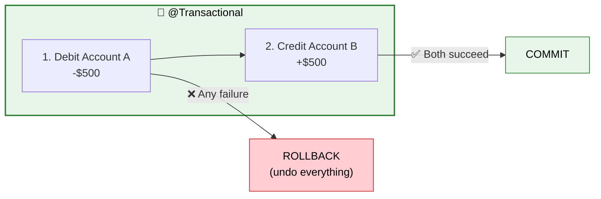
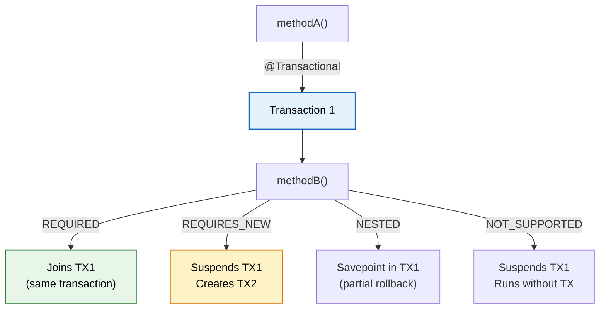
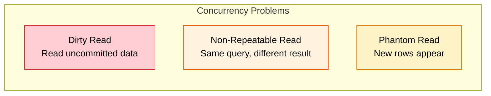
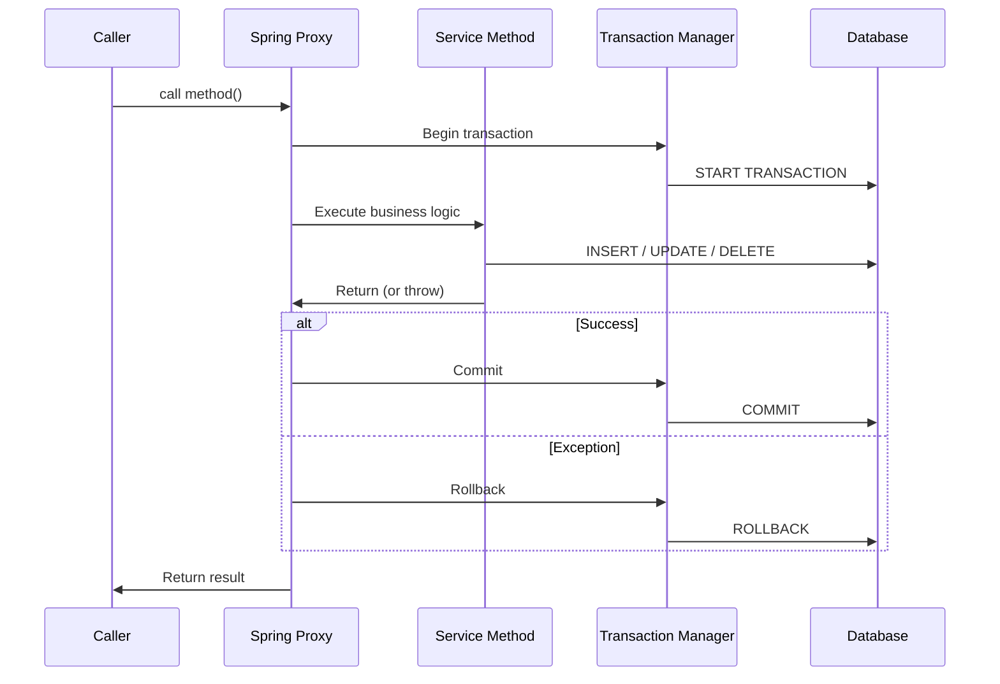

# 🔄 Transactions (@Transactional)

> **Ensure all-or-nothing database operations — if any step fails, everything rolls back to a consistent state.**

---

!!! abstract "Real-World Analogy"
    Think of a **bank transfer**. Moving $500 from Account A to Account B requires TWO operations: debit A, credit B. If the system crashes after debiting A but before crediting B, the money vanishes! A transaction ensures either BOTH happen or NEITHER happens.



---

## 🏗️ Basic Usage

```java
@Service
public class TransferService {

    @Transactional
    public void transfer(Long fromId, Long toId, BigDecimal amount) {
        Account from = accountRepository.findById(fromId).orElseThrow();
        Account to = accountRepository.findById(toId).orElseThrow();

        from.debit(amount);   // If this succeeds...
        to.credit(amount);    // ...but THIS throws an exception → BOTH rolled back
    }
}
```

---

## ⚙️ @Transactional Properties

```java
@Transactional(
    propagation = Propagation.REQUIRED,      // Default
    isolation = Isolation.READ_COMMITTED,    // Default
    timeout = 30,                            // Seconds
    readOnly = false,                        // Optimization hint
    rollbackFor = Exception.class,           // When to rollback
    noRollbackFor = BusinessWarning.class    // Don't rollback for this
)
```

---

## 🔀 Propagation Types

How should a transaction behave when another transaction already exists?



| Propagation | Behavior | Use Case |
|---|---|---|
| **REQUIRED** (default) | Join existing TX, or create new | Most service methods |
| **REQUIRES_NEW** | Always create new TX, suspend current | Audit logs that must persist even if main TX fails |
| **NESTED** | Savepoint within current TX | Partial rollback scenarios |
| **SUPPORTS** | Use TX if exists, else run without | Read-only operations |
| **NOT_SUPPORTED** | Suspend current TX, run without | External API calls |
| **MANDATORY** | Must run in existing TX, else throw | Methods that should never be called alone |
| **NEVER** | Must NOT have an active TX, else throw | Sanity check |

### REQUIRES_NEW Example

```java
@Service
public class OrderService {

    @Transactional
    public void placeOrder(OrderRequest request) {
        Order order = orderRepository.save(new Order(request));
        paymentService.charge(order);  // If this fails, order rolls back
        
        auditService.log("ORDER_PLACED", order.getId());  // Should persist regardless!
    }
}

@Service
public class AuditService {

    @Transactional(propagation = Propagation.REQUIRES_NEW)
    public void log(String action, Long entityId) {
        auditRepository.save(new AuditLog(action, entityId));
        // Commits in its own TX — survives even if calling TX rolls back
    }
}
```

---

## 🔒 Isolation Levels

How does this transaction see data modified by OTHER concurrent transactions?

| Level | Dirty Read | Non-Repeatable Read | Phantom Read | Performance |
|---|---|---|---|---|
| **READ_UNCOMMITTED** | ✅ possible | ✅ possible | ✅ possible | Fastest |
| **READ_COMMITTED** (default) | ❌ prevented | ✅ possible | ✅ possible | Good |
| **REPEATABLE_READ** | ❌ prevented | ❌ prevented | ✅ possible | Moderate |
| **SERIALIZABLE** | ❌ prevented | ❌ prevented | ❌ prevented | Slowest |



---

## ⚠️ Common Pitfalls

### 1. Self-Invocation (The #1 Mistake!)

```java
@Service
public class OrderService {

    public void processOrder(Order order) {
        validate(order);
        saveOrder(order);  // ❌ @Transactional is IGNORED here!
    }

    @Transactional
    public void saveOrder(Order order) {
        orderRepository.save(order);
    }
}
```

!!! warning "Why it fails"
    `@Transactional` works via **Spring AOP proxies**. When you call a method within the same class, you bypass the proxy — the annotation has no effect. Fix: move the transactional method to a separate bean, or inject self (`@Lazy private OrderService self`).

### 2. Checked Exceptions Don't Rollback

```java
@Transactional
public void riskyMethod() throws IOException {
    orderRepository.save(order);
    throw new IOException("file error");  // ❌ Transaction COMMITS! Not rolled back!
}

// Fix: explicitly specify rollback
@Transactional(rollbackFor = Exception.class)
public void safeMethod() throws IOException {
    orderRepository.save(order);
    throw new IOException("file error");  // ✅ Now rolls back
}
```

!!! tip "Rule"
    By default, `@Transactional` only rolls back on **unchecked exceptions** (RuntimeException) and Errors. For checked exceptions, use `rollbackFor = Exception.class`.

### 3. readOnly Optimization

```java
@Transactional(readOnly = true)
public List<Order> getRecentOrders() {
    return orderRepository.findByCreatedAtAfter(LocalDateTime.now().minusDays(7));
}
```

`readOnly = true` tells Hibernate to skip dirty checking (performance boost for read-heavy operations) and may use a read replica in some DB setups.

---

## 📐 Transaction Lifecycle



---

## 🎯 Interview Questions

??? question "1. Why doesn't @Transactional work on private methods or self-calls?"
    Spring implements `@Transactional` using **AOP proxies**. When a bean is called from outside, the proxy intercepts the call and manages the transaction. Private methods can't be proxied, and self-invocation (`this.method()`) bypasses the proxy entirely. Solution: call from a different bean or use `@Lazy` self-injection.

??? question "2. What's the default rollback behavior?"
    By default, `@Transactional` rolls back only on **unchecked exceptions** (RuntimeException and subclasses) and Errors. Checked exceptions (IOException, SQLException) cause a **commit**. Override with `rollbackFor = Exception.class`.

??? question "3. What is Propagation.REQUIRES_NEW?"
    It suspends the current transaction and creates a brand new one. The new transaction commits or rolls back independently. Use case: audit logs that must persist even if the calling method's transaction fails.

??? question "4. What does readOnly = true do?"
    Hints to the persistence provider to optimize: Hibernate skips dirty checking, some databases route to read replicas, and certain JDBC drivers enable optimizations. Always use it for pure read operations.

??? question "5. How do you handle long-running transactions?"
    Avoid them. Long transactions hold DB locks, reducing concurrency. Solutions: break into smaller transactions, use `@Transactional(timeout = 30)` to fail fast, or move heavy processing outside the transaction boundary (process data, then save in a short TX).

??? question "6. Explain optimistic vs pessimistic locking."
    **Optimistic**: uses a `@Version` column. No DB lock held. Checks version at commit time — fails if another TX modified the row. Good for low-contention scenarios. **Pessimistic**: uses `SELECT ... FOR UPDATE`. Holds a DB lock until TX completes. Guarantees exclusive access but reduces throughput.

