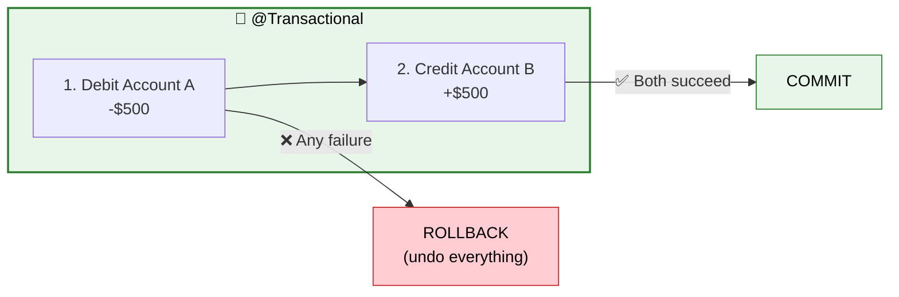
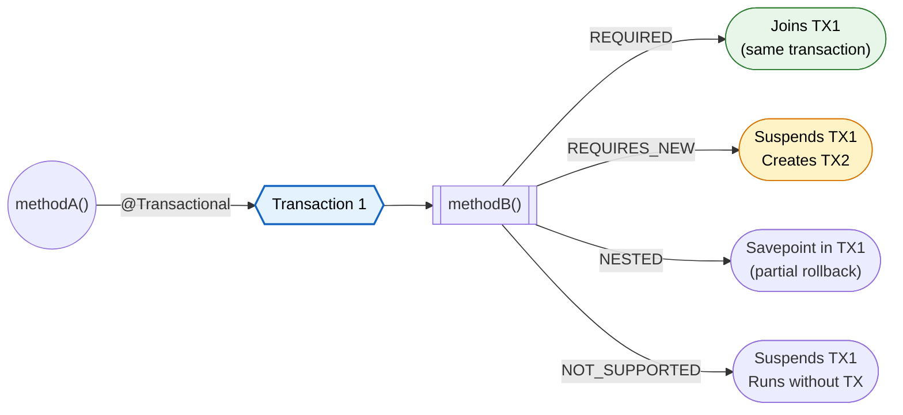
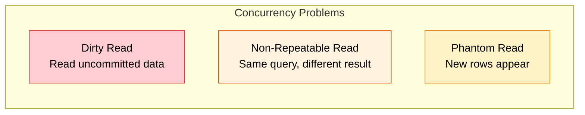
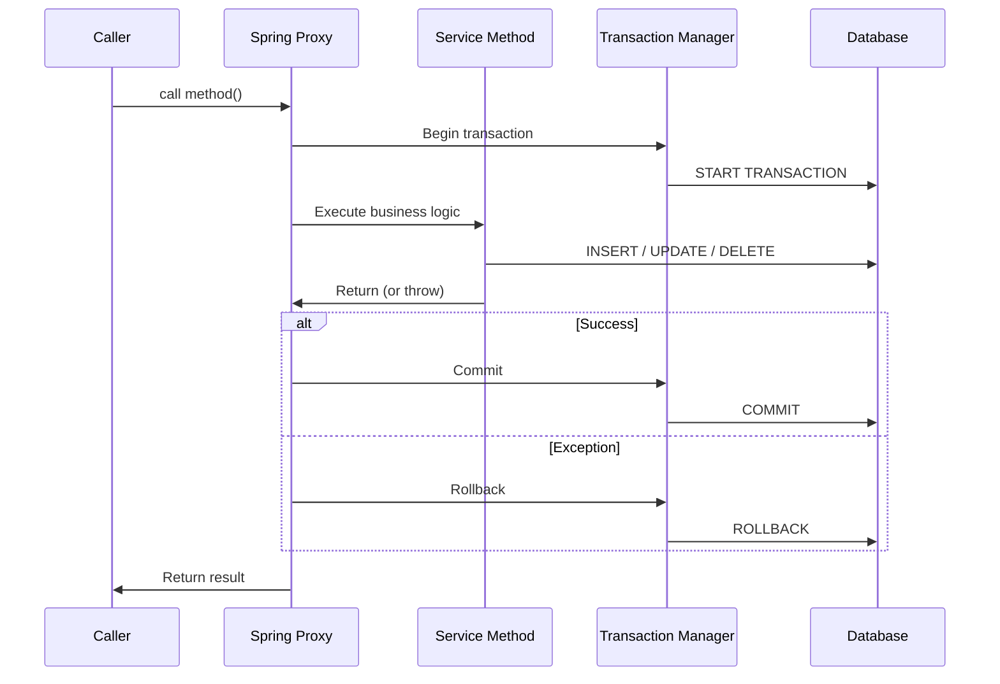

# Transactions (@Transactional)

> **Ensure all-or-nothing database operations — if any step fails, everything rolls back to a consistent state.**

---

!!! abstract "Real-World Analogy"
    Think of a **bank transfer**. Moving $500 from Account A to Account B requires TWO operations: debit A, credit B. If the system crashes after debiting A but before crediting B, the money vanishes! A transaction ensures either BOTH happen or NEITHER happens.



---

## How @Transactional Works Internally

Spring uses **proxy-based AOP** to implement declarative transactions. Understanding the proxy mechanism is critical.

### Proxy Creation Process

1. Spring scans for `@Transactional` annotations during bean initialization.
2. `BeanPostProcessor` (specifically `InfrastructureAdvisorAutoProxyCreator`) wraps the target bean in a proxy.
3. The proxy is either a **JDK dynamic proxy** (if the bean implements an interface) or a **CGLIB subclass proxy** (if no interface).
4. The proxy holds a reference to the `TransactionInterceptor`, which contains the transaction management logic.

```java
// What Spring generates behind the scenes (simplified CGLIB proxy)
public class TransferService$$EnhancerBySpringCGLIB extends TransferService {

    private TransactionInterceptor txInterceptor;
    private TransferService target;

    @Override
    public void transfer(Long fromId, Long toId, BigDecimal amount) {
        TransactionInfo txInfo = txInterceptor.createTransactionIfNecessary();
        try {
            target.transfer(fromId, toId, amount);  // actual method
            txInterceptor.commitTransactionAfterReturning(txInfo);
        } catch (Throwable ex) {
            txInterceptor.completeTransactionAfterThrowing(txInfo, ex);
            throw ex;
        }
    }
}
```

!!! info "Key Insight"
    The caller never holds a reference to the real bean. It holds a reference to the **proxy**. The proxy intercepts, manages the transaction, then delegates to the real bean.

---

## Basic Usage

```java
@Service
public class TransferService {

    @Transactional
    public void transfer(Long fromId, Long toId, BigDecimal amount) {
        Account from = accountRepository.findById(fromId).orElseThrow();
        Account to = accountRepository.findById(toId).orElseThrow();

        from.debit(amount);   // If this succeeds...
        to.credit(amount);    // ...but THIS throws an exception → BOTH rolled back
    }
}
```

---

## @Transactional Properties

```java
@Transactional(
    propagation = Propagation.REQUIRED,      // Default
    isolation = Isolation.READ_COMMITTED,    // Default
    timeout = 30,                            // Seconds
    readOnly = false,                        // Optimization hint
    rollbackFor = Exception.class,           // When to rollback
    noRollbackFor = BusinessWarning.class    // Don't rollback for this
)
```

---

## Propagation Types

How should a transaction behave when another transaction already exists?



| Propagation | Behavior | Use Case |
|---|---|---|
| **REQUIRED** (default) | Join existing TX, or create new | Most service methods |
| **REQUIRES_NEW** | Always create new TX, suspend current | Audit logs that must persist even if main TX fails |
| **NESTED** | Savepoint within current TX | Partial rollback scenarios |
| **SUPPORTS** | Use TX if exists, else run without | Read-only operations |
| **NOT_SUPPORTED** | Suspend current TX, run without | External API calls |
| **MANDATORY** | Must run in existing TX, else throw | Methods that should never be called alone |
| **NEVER** | Must NOT have an active TX, else throw | Sanity check |

### Bank Transfer Scenario: Propagation in Action

Consider an order service that calls a payment service. Payment fails. What happens to the order?

=== "REQUIRED (default)"

    ```java
    @Service
    public class OrderService {
        @Transactional  // TX1 created
        public void placeOrder(OrderRequest req) {
            orderRepo.save(new Order(req));        // part of TX1
            paymentService.charge(req.getAmount()); // joins TX1
        }
    }

    @Service
    public class PaymentService {
        @Transactional(propagation = Propagation.REQUIRED)  // joins TX1
        public void charge(BigDecimal amount) {
            paymentRepo.save(new Payment(amount));
            throw new InsufficientFundsException(); // TX1 rolls back EVERYTHING
        }
    }
    ```
    
    **Result:** Both order AND payment are rolled back. They share one transaction.

=== "REQUIRES_NEW"

    ```java
    @Service
    public class OrderService {
        @Transactional  // TX1 created
        public void placeOrder(OrderRequest req) {
            orderRepo.save(new Order(req));         // part of TX1
            try {
                paymentService.charge(req.getAmount()); // TX2 — independent
            } catch (PaymentException e) {
                orderRepo.updateStatus(req.getId(), PAYMENT_FAILED);
            }
        }
    }

    @Service
    public class PaymentService {
        @Transactional(propagation = Propagation.REQUIRES_NEW)  // TX2 created
        public void charge(BigDecimal amount) {
            paymentRepo.save(new Payment(amount));
            throw new InsufficientFundsException(); // only TX2 rolls back
        }
    }
    ```
    
    **Result:** Payment rolls back in TX2. Order survives in TX1 (if exception is caught). TX1 and TX2 are independent.

=== "NESTED"

    ```java
    @Service
    public class OrderService {
        @Transactional  // TX1
        public void placeOrder(OrderRequest req) {
            orderRepo.save(new Order(req));
            try {
                paymentService.charge(req.getAmount()); // savepoint inside TX1
            } catch (PaymentException e) {
                // savepoint rolled back, but TX1 continues
                notificationService.sendPaymentFailedEmail(req);
            }
        }
    }

    @Service
    public class PaymentService {
        @Transactional(propagation = Propagation.NESTED)  // savepoint in TX1
        public void charge(BigDecimal amount) {
            paymentRepo.save(new Payment(amount));
            throw new InsufficientFundsException(); // rolls back to savepoint
        }
    }
    ```
    
    **Result:** Payment rolls back to the savepoint. Order remains. Unlike REQUIRES_NEW, everything runs in the **same physical connection**. If the outer TX rolls back, the nested work is also lost.

### REQUIRES_NEW — Audit Log Example

```java
@Service
public class OrderService {

    @Transactional
    public void placeOrder(OrderRequest request) {
        Order order = orderRepository.save(new Order(request));
        paymentService.charge(order);  // If this fails, order rolls back
        
        auditService.log("ORDER_PLACED", order.getId());  // Should persist regardless!
    }
}

@Service
public class AuditService {

    @Transactional(propagation = Propagation.REQUIRES_NEW)
    public void log(String action, Long entityId) {
        auditRepository.save(new AuditLog(action, entityId));
        // Commits in its own TX — survives even if calling TX rolls back
    }
}
```

---

## Isolation Levels

How does this transaction see data modified by OTHER concurrent transactions?

| Level | Dirty Read | Non-Repeatable Read | Phantom Read | Performance |
|---|---|---|---|---|
| **READ_UNCOMMITTED** | Possible | Possible | Possible | Fastest |
| **READ_COMMITTED** (default) | Prevented | Possible | Possible | Good |
| **REPEATABLE_READ** | Prevented | Prevented | Possible | Moderate |
| **SERIALIZABLE** | Prevented | Prevented | Prevented | Slowest |



### Dirty Read

Transaction B reads data that Transaction A wrote but has NOT committed yet. If A rolls back, B has garbage data.

```sql
-- Transaction A
BEGIN;
UPDATE accounts SET balance = 200 WHERE id = 1;  -- was 1000
-- NOT YET COMMITTED

-- Transaction B (READ_UNCOMMITTED)
SELECT balance FROM accounts WHERE id = 1;  -- reads 200 (DIRTY!)

-- Transaction A
ROLLBACK;  -- balance is back to 1000
-- Transaction B now has stale, invalid data
```

!!! danger "Fix"
    Use `READ_COMMITTED` or higher. This is the default in PostgreSQL and Oracle.

### Non-Repeatable Read

Transaction B reads the same row twice and gets different values because Transaction A committed between the two reads.

```sql
-- Transaction B
BEGIN;
SELECT balance FROM accounts WHERE id = 1;  -- reads 1000

-- Transaction A
BEGIN;
UPDATE accounts SET balance = 500 WHERE id = 1;
COMMIT;

-- Transaction B (same transaction, second read)
SELECT balance FROM accounts WHERE id = 1;  -- reads 500 (DIFFERENT!)
COMMIT;
```

!!! danger "Fix"
    Use `REPEATABLE_READ`. The DB takes a snapshot at the start of the transaction.

### Phantom Read

Transaction B runs the same query twice and gets different row counts because Transaction A inserted/deleted rows in between.

```sql
-- Transaction B
BEGIN;
SELECT COUNT(*) FROM orders WHERE status = 'PENDING';  -- returns 5

-- Transaction A
BEGIN;
INSERT INTO orders (status) VALUES ('PENDING');
COMMIT;

-- Transaction B (same transaction)
SELECT COUNT(*) FROM orders WHERE status = 'PENDING';  -- returns 6 (PHANTOM!)
COMMIT;
```

!!! danger "Fix"
    Use `SERIALIZABLE`. The DB uses range locks or predicate locks to prevent new rows from matching existing queries.

### When to Use Each Level

```java
// Financial reports — must see consistent snapshot
@Transactional(isolation = Isolation.REPEATABLE_READ)
public FinancialReport generateMonthlyReport() { ... }

// Inventory check — cannot tolerate phantoms
@Transactional(isolation = Isolation.SERIALIZABLE)
public boolean reserveStock(Long productId, int qty) { ... }

// Dashboard stats — slight staleness acceptable
@Transactional(isolation = Isolation.READ_COMMITTED)
public DashboardStats getStats() { ... }
```

---

## Rollback Rules

| Exception Type | Default Behavior | Override |
|---|---|---|
| `RuntimeException` (unchecked) | Rollback | `noRollbackFor = SomeRuntimeEx.class` |
| `Error` | Rollback | Rarely overridden |
| `Exception` (checked) | **Commit** | `rollbackFor = Exception.class` |

```java
// Checked exception — WILL NOT rollback by default
@Transactional
public void riskyMethod() throws IOException {
    repo.save(entity);
    throw new IOException("disk full");  // TX commits! Data saved!
}

// Fixed: rollback on all exceptions
@Transactional(rollbackFor = Exception.class)
public void safeMethod() throws IOException {
    repo.save(entity);
    throw new IOException("disk full");  // TX rolls back
}

// Selective: rollback on everything EXCEPT business warnings
@Transactional(
    rollbackFor = Exception.class,
    noRollbackFor = BusinessWarningException.class
)
public void nuancedMethod() throws Exception { ... }
```

---

## Read-Only Optimization

```java
@Transactional(readOnly = true)
public List<Order> getRecentOrders() {
    return orderRepository.findByCreatedAtAfter(LocalDateTime.now().minusDays(7));
}
```

What `readOnly = true` does:

- **Hibernate**: Disables dirty checking. The persistence context won't flush changes. Saves CPU on large result sets.
- **JDBC Driver**: Some drivers set the connection to read-only mode, enabling optimizations.
- **Database Routing**: Spring's `AbstractRoutingDataSource` can route read-only transactions to **read replicas**.
- **PostgreSQL**: Sets `transaction_read_only = on`, preventing accidental writes.

!!! tip "Always use readOnly for queries"
    Even if you don't have read replicas, the dirty-checking skip alone is worth it for large datasets.

---

## The Self-Invocation Problem

This is the number one `@Transactional` pitfall.

```java
@Service
public class OrderService {

    public void processOrder(Order order) {
        validate(order);
        saveOrder(order);  // @Transactional is IGNORED here!
    }

    @Transactional
    public void saveOrder(Order order) {
        orderRepository.save(order);
    }
}
```

!!! warning "Why it fails"
    When `processOrder` calls `this.saveOrder()`, it calls the method directly on the target object — **not through the proxy**. The proxy never intercepts the call, so no transaction is created.

### The Fix: Three Options

=== "Option 1: Self-Injection"

    ```java
    @Service
    public class OrderService {

        @Lazy
        @Autowired
        private OrderService self;  // injects the PROXY, not this

        public void processOrder(Order order) {
            validate(order);
            self.saveOrder(order);  // goes through proxy — TX works!
        }

        @Transactional
        public void saveOrder(Order order) {
            orderRepository.save(order);
        }
    }
    ```

=== "Option 2: Separate Bean"

    ```java
    @Service
    public class OrderService {

        @Autowired
        private OrderPersistenceService persistenceService;

        public void processOrder(Order order) {
            validate(order);
            persistenceService.saveOrder(order);  // different bean = proxy call
        }
    }

    @Service
    public class OrderPersistenceService {

        @Transactional
        public void saveOrder(Order order) {
            orderRepository.save(order);
        }
    }
    ```

=== "Option 3: AspectJ Weaving (compile-time)"

    ```java
    // In build.gradle or pom.xml, enable AspectJ compile-time weaving
    // This modifies the bytecode directly — no proxy needed
    @EnableTransactionManagement(mode = AdviceMode.ASPECTJ)
    @Configuration
    public class TxConfig { }
    ```

    With AspectJ, `this.saveOrder()` works because the transaction logic is woven directly into the method bytecode at compile time.

---

## Transaction Lifecycle



---

## Transaction Managers

Spring abstracts transaction management behind the `PlatformTransactionManager` interface.

| Manager | When to Use |
|---|---|
| `DataSourceTransactionManager` | Plain JDBC, MyBatis. Manages transactions via `java.sql.Connection`. |
| `JpaTransactionManager` | JPA/Hibernate. Wraps `EntityManager` transactions. Also supports plain JDBC on the same datasource. |
| `JtaTransactionManager` | Distributed transactions across multiple resources (DB + JMS). Uses JTA/XA protocol. |
| `ChainedTransactionManager` | Best-effort across multiple datasources without XA. Not truly atomic — last resource commit. |

```java
// Spring Boot auto-configures the right one.
// For JPA projects, JpaTransactionManager is auto-created.
// Manual config example:
@Bean
public PlatformTransactionManager transactionManager(EntityManagerFactory emf) {
    return new JpaTransactionManager(emf);
}
```

!!! info "JpaTransactionManager vs DataSourceTransactionManager"
    `JpaTransactionManager` delegates to the EntityManager's underlying connection. It handles both JPA persistence context and raw JDBC in the same transaction. If you use JPA, always prefer `JpaTransactionManager`.

---

## Programmatic Transactions with TransactionTemplate

When `@Transactional` is too coarse-grained or you need conditional transaction logic.

```java
@Service
public class BatchProcessingService {

    private final TransactionTemplate txTemplate;

    public BatchProcessingService(PlatformTransactionManager txManager) {
        this.txTemplate = new TransactionTemplate(txManager);
        this.txTemplate.setIsolationLevel(TransactionDefinition.ISOLATION_READ_COMMITTED);
        this.txTemplate.setTimeout(10);
    }

    public void processBatch(List<Item> items) {
        for (Item item : items) {
            // Each item in its own transaction — one failure doesn't kill the batch
            txTemplate.executeWithoutResult(status -> {
                try {
                    processItem(item);
                } catch (Exception e) {
                    status.setRollbackOnly();  // explicit rollback
                    logFailure(item, e);
                }
            });
        }
    }

    // With return value
    public Order createOrder(OrderRequest req) {
        return txTemplate.execute(status -> {
            Order order = orderRepo.save(new Order(req));
            if (order.getTotal().compareTo(BigDecimal.ZERO) <= 0) {
                status.setRollbackOnly();
                return null;
            }
            return order;
        });
    }
}
```

!!! tip "When to use TransactionTemplate"
    - Loop where each iteration needs its own transaction
    - Conditional rollback logic
    - Need fine-grained control over transaction boundaries inside one method
    - Tests that need explicit transaction control

---

## Distributed Transactions

### JTA and Two-Phase Commit (2PC)

JTA coordinates transactions across multiple resources (e.g., two databases, or a database + JMS broker).

```java
@Transactional  // JtaTransactionManager coordinates both
public void transferBetweenBanks(TransferRequest req) {
    bankARepo.debit(req.getFromAccount(), req.getAmount());   // DB1
    bankBRepo.credit(req.getToAccount(), req.getAmount());    // DB2
    jmsTemplate.send("transfers", message);                    // JMS broker
}
```

**Why 2PC is avoided in microservices:**

- Requires all participants to be available simultaneously (fragile).
- Holding locks across network calls — latency amplifies contention.
- Single coordinator is a single point of failure.
- Not supported by many cloud-native databases.

### Saga Pattern (Preferred in Microservices)

Instead of one distributed transaction, use a sequence of local transactions with compensating actions.

```java
// Choreography-based saga
// Step 1: Order Service creates order (local TX)
// Step 2: Payment Service charges card (local TX)
// Step 3: Inventory Service reserves stock (local TX)
// If Step 3 fails → compensate: refund payment, cancel order

@Service
public class OrderSagaOrchestrator {

    public void placeOrder(OrderRequest req) {
        Order order = orderService.create(req);       // local TX
        try {
            paymentService.charge(order);              // local TX (remote call)
        } catch (PaymentException e) {
            orderService.cancel(order);               // compensating TX
            throw e;
        }
        try {
            inventoryService.reserve(order);           // local TX (remote call)
        } catch (InventoryException e) {
            paymentService.refund(order);              // compensating TX
            orderService.cancel(order);               // compensating TX
            throw e;
        }
    }
}
```

---

## @TransactionalEventListener

Process events only AFTER the transaction commits successfully.

```java
@Service
public class OrderService {

    @Autowired
    private ApplicationEventPublisher eventPublisher;

    @Transactional
    public Order placeOrder(OrderRequest req) {
        Order order = orderRepo.save(new Order(req));
        eventPublisher.publishEvent(new OrderPlacedEvent(order.getId()));
        return order;
        // Event is NOT delivered yet — waits for commit
    }
}

@Component
public class OrderEventHandler {

    @TransactionalEventListener(phase = TransactionPhase.AFTER_COMMIT)
    public void onOrderPlaced(OrderPlacedEvent event) {
        // This runs ONLY if the transaction committed successfully
        emailService.sendConfirmation(event.getOrderId());
        analyticsService.track("order_placed", event.getOrderId());
    }

    @TransactionalEventListener(phase = TransactionPhase.AFTER_ROLLBACK)
    public void onOrderFailed(OrderPlacedEvent event) {
        // Runs only if the transaction rolled back
        alertService.notifyTeam("Order creation failed: " + event.getOrderId());
    }
}
```

!!! warning "Default phase is AFTER_COMMIT"
    If you just use `@TransactionalEventListener` without specifying phase, it defaults to `AFTER_COMMIT`. The listener runs in a **new transaction context** (or no transaction, unless you annotate the listener with `@Transactional`).

| Phase | When it fires |
|---|---|
| `AFTER_COMMIT` | After successful commit (default) |
| `AFTER_ROLLBACK` | After rollback |
| `AFTER_COMPLETION` | After commit or rollback |
| `BEFORE_COMMIT` | Just before commit — still inside the transaction |

---

## Gotchas Summary

| Gotcha | Why | Fix |
|---|---|---|
| `@Transactional` on private method | CGLIB cannot override private methods. Silently ignored. | Make method `public` or `protected`. |
| Self-invocation (`this.method()`) | Bypasses proxy entirely. | Self-inject, separate bean, or AspectJ. |
| Checked exceptions commit | Spring only rolls back on unchecked exceptions by default. | Use `rollbackFor = Exception.class`. |
| `@Transactional` on interface method | Works only with JDK proxy, not CGLIB. | Put annotation on implementation class. |
| Long transactions | Hold DB locks, reduce throughput. | Shorter TX boundaries, timeout. |
| Lazy loading outside TX | `LazyInitializationException` after session closes. | Fetch eagerly, DTO projection, or OSIV (with caution). |
| Proxy vs AspectJ | Proxy: only external calls intercepted. AspectJ: all calls intercepted. | Choose based on requirements. |
| Mixed DB + external calls | Network call inside TX holds DB connection/lock. | Move external calls outside TX boundary. |

---

## Interview Questions

??? question "1. Why doesn't @Transactional work on private methods or self-calls?"
    Spring implements `@Transactional` using **AOP proxies** (CGLIB subclass or JDK dynamic proxy). Private methods cannot be overridden by CGLIB — the annotation is silently ignored. Self-invocation (`this.method()`) bypasses the proxy because the call goes directly to the target object, not through the proxy wrapper. Fix: call from a different bean, use `@Lazy` self-injection, or switch to AspectJ compile-time weaving.

??? question "2. How does Spring create a transaction proxy?"
    During bean initialization, `InfrastructureAdvisorAutoProxyCreator` (a `BeanPostProcessor`) detects `@Transactional` annotations. It creates either a JDK dynamic proxy (if the bean implements an interface and `proxyTargetClass=false`) or a CGLIB proxy (default in Spring Boot). The proxy wraps the bean and delegates to `TransactionInterceptor`, which consults the `TransactionAttributeSource` to determine transaction settings, then uses `PlatformTransactionManager` to begin/commit/rollback.

??? question "3. What happens if an inner method with REQUIRES_NEW throws an exception?"
    The inner method's transaction (TX2) rolls back independently. Control returns to the outer method. If the outer method catches the exception, TX1 can still commit. If it does NOT catch, the exception propagates up, and TX1 also rolls back. The two transactions are completely independent — TX2's rollback has no direct effect on TX1's state.

??? question "4. What's the difference between REQUIRED, REQUIRES_NEW, and NESTED?"
    **REQUIRED**: Joins the existing TX or creates a new one. Inner and outer share fate — if either fails (uncaught), both roll back. **REQUIRES_NEW**: Always creates a new physical TX. Inner and outer are independent. Inner can commit while outer rolls back. **NESTED**: Creates a savepoint within the existing TX. Inner rollback reverts to the savepoint but outer can continue. If outer rolls back, nested work is also lost. NESTED requires JDBC 3.0 savepoint support.

??? question "5. What is the default rollback behavior?"
    `@Transactional` rolls back only on **unchecked exceptions** (`RuntimeException` and subclasses) and `Error`. Checked exceptions (`IOException`, `SQLException`, custom checked exceptions) cause a **commit**. This matches EJB semantics. Override with `rollbackFor = Exception.class` to roll back on all exceptions.

??? question "6. What does readOnly = true actually do?"
    Multiple things: (1) Hibernate sets `FlushMode.MANUAL` — no dirty checking, no automatic flush. (2) JDBC driver may set connection to read-only. (3) Some databases (PostgreSQL) set `transaction_read_only = on`, rejecting writes. (4) `AbstractRoutingDataSource` can route to read replicas. It does NOT prevent writes at the application level — it's an optimization hint.

??? question "7. How do you handle transactions in a microservices architecture?"
    Avoid distributed transactions (2PC/XA). Use the **Saga pattern**: a sequence of local transactions with compensating actions on failure. Two styles: **choreography** (services publish events, others react) and **orchestration** (a central coordinator drives the flow). Use an outbox pattern for reliable event publishing.

??? question "8. When would you use TransactionTemplate over @Transactional?"
    When you need per-iteration transactions in a loop. When transaction boundaries depend on runtime conditions. When you need explicit `setRollbackOnly()` logic. When you need multiple transaction scopes in a single method without splitting into separate beans. It provides programmatic control that declarative annotations cannot express.

??? question "9. Explain the @TransactionalEventListener and why it matters."
    `@TransactionalEventListener` delays event processing until a specific transaction phase (default: `AFTER_COMMIT`). This prevents side effects (sending emails, publishing messages) when the transaction might still roll back. Without it, using `@EventListener` would fire the event immediately — if the TX later rolls back, you've sent a confirmation email for a non-existent order.

??? question "10. What is the difference between PlatformTransactionManager implementations?"
    `DataSourceTransactionManager`: manages JDBC connections directly. `JpaTransactionManager`: manages JPA `EntityManager` lifecycle, coordinates with the underlying JDBC connection. `JtaTransactionManager`: delegates to a JTA implementation for distributed transactions across multiple resources. Spring Boot auto-configures `JpaTransactionManager` when JPA is on the classpath, `DataSourceTransactionManager` when only JDBC is present.

??? question "11. Why should you avoid long-running transactions?"
    Long transactions hold database locks (row-level, table-level), blocking other transactions. They hold JDBC connections from the pool, potentially exhausting it. They accumulate undo/redo log entries. They increase the window for deadlocks. Solutions: break into smaller transactions, process data first then save in a short TX, use `timeout` attribute to fail fast.

??? question "12. What happens if you put @Transactional on an interface default method?"
    With JDK dynamic proxy: it works, because the proxy implements the interface. With CGLIB proxy (Spring Boot default): it depends on the version. Best practice: always put `@Transactional` on the **concrete implementation class**, not the interface. Spring documentation explicitly recommends this for portability.

??? question "13. Explain optimistic vs pessimistic locking in a transactional context."
    **Optimistic locking**: Uses a `@Version` column. No DB lock held during the transaction. At commit time, Hibernate checks if the version changed — if yes, throws `OptimisticLockException` and the TX rolls back. Best for low-contention, high-throughput scenarios. **Pessimistic locking**: Uses `SELECT ... FOR UPDATE`. Holds a row-level lock for the TX duration. Guarantees exclusive access but blocks other transactions. Use for high-contention, critical sections (e.g., inventory decrement).

??? question "14. Can @Transactional work with reactive/WebFlux applications?"
    No. `@Transactional` relies on `ThreadLocal`-bound transaction context. Reactive streams hop between threads. For reactive, use `TransactionalOperator` (programmatic) or `@Transactional` with R2DBC which uses Reactor Context instead of ThreadLocal. Spring Data R2DBC provides reactive transaction support.

??? question "15. What is transaction synchronization and when would you use it?"
    `TransactionSynchronization` lets you register callbacks on the current transaction: `beforeCommit()`, `afterCommit()`, `afterCompletion()`. Use `TransactionSynchronizationManager.registerSynchronization(...)`. Use case: clear a cache after commit, release a lock after completion, send a message only if the TX succeeds. `@TransactionalEventListener` is the higher-level abstraction over this mechanism.
