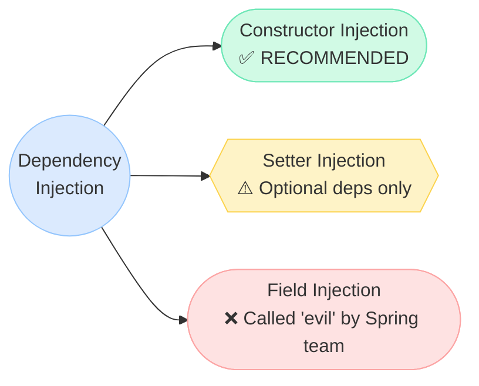
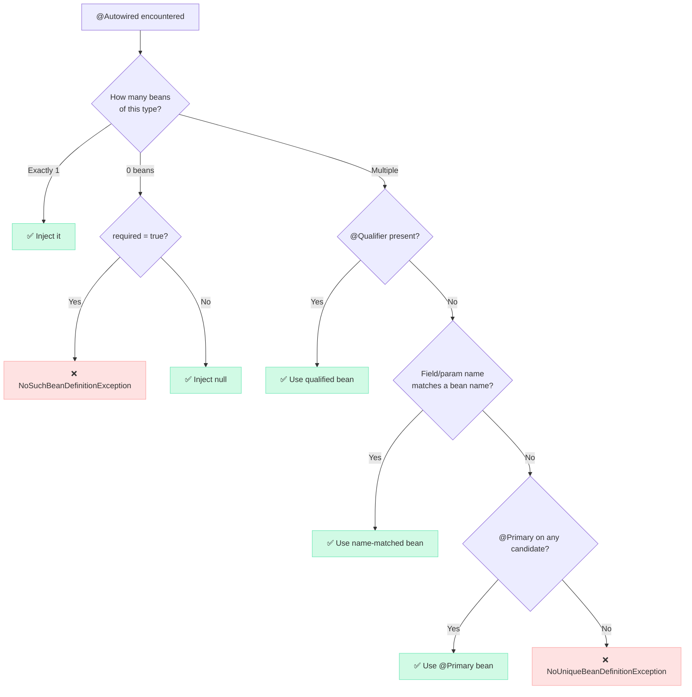
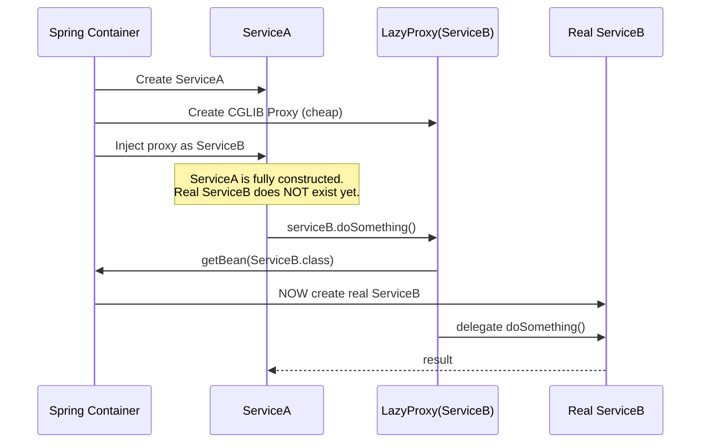
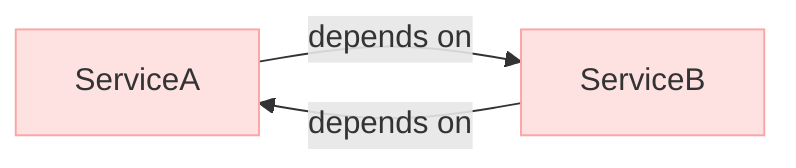
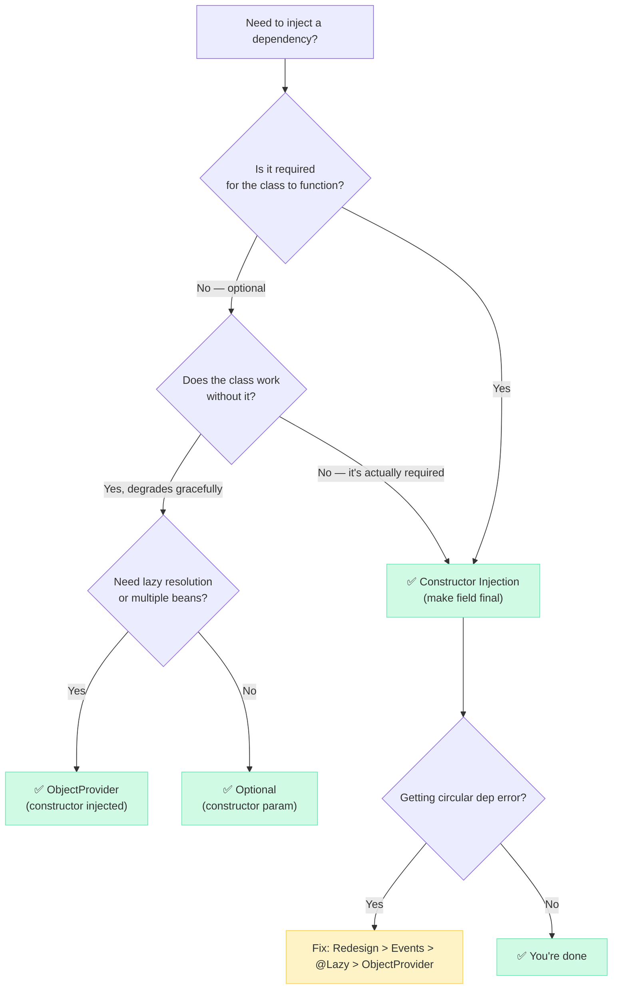

# Types of Dependency Injection in Spring

There are 3 ways to inject dependencies in Spring. One of them is recommended by the Spring team. One is acceptable in specific cases. And one... the Spring team themselves called "evil." Let me explain why.



---

## Constructor Injection — THE Recommended Approach

### What

Dependencies are passed through the constructor. The bean literally cannot exist without them. If Spring can't resolve a dependency, the application refuses to start. No surprises at 3 AM.

### Why It's Recommended

!!! tip "💡 One-liner for interviews"
    "Constructor injection gives you immutability, compile-time safety, framework-free testability, and acts as a natural SRP violation detector."

**Four pillars that make it superior:**

1. **Immutability** — Fields are `final`. Once set, they can never change. The Java Memory Model guarantees visibility across threads without synchronization.
2. **Required dependencies enforced at compile time** — Forgot a dependency? The compiler yells at you. Not a runtime NPE at 2 AM in production.
3. **Testability** — Just write `new OrderService(mockRepo, mockPayment, mockNotifier)` in your test. No Spring context. No `@SpringBootTest`. No 30-second startup. Pure unit tests.
4. **SRP signal** — Constructor has 8 parameters? That's not an injection problem. That's a design problem. Your class does too much. Constructor injection makes this pain visible.

### When

Always. This is your default. Every new class you write should use constructor injection unless you have a specific reason not to (and "I'm lazy" is not a reason).

### How — Full Production Example

**Scenario:** Multi-tenant e-commerce platform. `OrderService` orchestrates placing an order — it needs a repository, a payment gateway (Razorpay for India, Stripe for US), a notification sender, and an inventory checker.

```java
@Service
public class OrderService {

    private final OrderRepository orderRepository;
    private final PaymentGateway paymentGateway;
    private final NotificationSender notificationSender;
    private final InventoryService inventoryService;

    // Since Spring 4.3: single constructor = @Autowired is IMPLICIT
    public OrderService(OrderRepository orderRepository,
                        @Qualifier("razorpay") PaymentGateway paymentGateway,
                        NotificationSender notificationSender,
                        InventoryService inventoryService) {
        this.orderRepository = orderRepository;
        this.paymentGateway = paymentGateway;
        this.notificationSender = notificationSender;
        this.inventoryService = inventoryService;
    }

    public OrderConfirmation placeOrder(OrderRequest request) {
        // All dependencies guaranteed non-null. No defensive checks needed.
        inventoryService.reserve(request.getItems());

        PaymentResult result = paymentGateway.charge(
            request.getCustomerId(), request.getTotalAmount()
        );

        Order order = Order.from(request, result.getTransactionId());
        orderRepository.save(order);

        notificationSender.send(
            request.getCustomerId(),
            "Order " + order.getId() + " confirmed!"
        );

        return new OrderConfirmation(order.getId(), result.getTransactionId());
    }
}
```

**Testing without Spring — pure unit test:**

```java
class OrderServiceTest {

    private OrderRepository mockRepo = mock(OrderRepository.class);
    private PaymentGateway mockPayment = mock(PaymentGateway.class);
    private NotificationSender mockNotifier = mock(NotificationSender.class);
    private InventoryService mockInventory = mock(InventoryService.class);

    private OrderService service = new OrderService(
        mockRepo, mockPayment, mockNotifier, mockInventory  // just new — no Spring!
    );

    @Test
    void placeOrder_chargesPaymentAndSavesOrder() {
        when(mockPayment.charge(any(), any()))
            .thenReturn(new PaymentResult("txn-123", SUCCESS));

        OrderConfirmation result = service.placeOrder(sampleRequest());

        verify(mockRepo).save(any(Order.class));
        verify(mockNotifier).send(eq("customer-1"), contains("confirmed"));
        assertThat(result.getTransactionId()).isEqualTo("txn-123");
    }
}
```

No `@SpringBootTest`. No `@ExtendWith(SpringExtension.class)`. Test runs in **milliseconds**, not seconds.

### The Single-Constructor Rule (Spring 4.3+)

```java
// Before Spring 4.3: @Autowired REQUIRED
@Service
public class UserService {
    @Autowired  // mandatory
    public UserService(UserRepository repo) { ... }
}

// Spring 4.3+: single constructor = @Autowired is IMPLICIT
@Service
public class UserService {
    public UserService(UserRepository repo) { ... }  // just works
}
```

!!! example "🎯 Interview Tip"
    "If a class has only one constructor, Spring automatically uses it for injection since 4.3. If there are multiple constructors, you MUST annotate the one Spring should use with `@Autowired`."

### Lombok Shortcut

```java
@Service
@RequiredArgsConstructor  // generates constructor for ALL final fields
public class OrderService {
    private final OrderRepository orderRepository;
    private final PaymentGateway paymentGateway;
    private final NotificationSender notificationSender;
    private final InventoryService inventoryService;
    // Lombok generates the constructor at compile time. Spring detects it.
}
```

### Where It Breaks — Circular Dependencies

```java
@Service
public class ServiceA {
    public ServiceA(ServiceB b) { }  // needs B to exist first
}

@Service
public class ServiceB {
    public ServiceB(ServiceA a) { }  // needs A to exist first → DEADLOCK
}
```

!!! danger "⚠️ What breaks"
    ```
    BeanCurrentlyInCreationException: Error creating bean with name 'serviceA':
    Requested bean is currently in creation: Is there an unresolvable circular reference?
    ```
    This is actually a FEATURE, not a bug. Constructor injection forces you to fix circular dependencies instead of hiding them. Fix: redesign into a third shared service, use `@Lazy`, or use an event-driven approach.

---

## Setter Injection — For Optional Dependencies Only

### What

Dependencies are set via setter methods AFTER the object is constructed. The bean exists in a "half-alive" state between construction and setter invocation.

### Why It's NOT the Default

The bean is mutable. Between construction and setter call, it's in an invalid state. Another thread could access it. Fields can't be `final`. You lose all the guarantees constructor injection gives you.

### When to Use

!!! tip "💡 One-liner for interviews"
    "Setter injection is for optional dependencies — where the service can function without the dependency, just with degraded behavior."

Three legitimate cases:

1. **Optional dependencies** — Service works without it, degrades gracefully
2. **Reconfigurable dependencies** — Change at runtime (JMX beans, feature flags). Rare but valid.
3. **Breaking circular dependencies** — As an absolute last resort when redesign isn't feasible

### How — Full Production Example

**Scenario:** `ReportService` generates sales reports. PDF export is an optional premium feature. Without `PdfExporter`, it returns CSV. With it, it returns PDF.

```java
@Service
public class ReportService {

    private final SalesRepository salesRepository;
    private final ReportFormatter formatter;
    private PdfExporter pdfExporter;  // NOT final — optional dependency

    // Required deps via constructor
    public ReportService(SalesRepository salesRepository, ReportFormatter formatter) {
        this.salesRepository = salesRepository;
        this.formatter = formatter;
    }

    // Optional dep via setter
    @Autowired(required = false)
    public void setPdfExporter(PdfExporter pdfExporter) {
        this.pdfExporter = pdfExporter;
    }

    public ReportOutput generateMonthlyReport(YearMonth month) {
        List<SalesRecord> records = salesRepository.findByMonth(month);
        String formattedData = formatter.format(records);

        if (pdfExporter != null) {
            byte[] pdf = pdfExporter.export(formattedData);
            return new ReportOutput(pdf, "application/pdf");
        }

        // Graceful degradation — still works, just returns CSV
        return new ReportOutput(formattedData.getBytes(), "text/csv");
    }
}
```

### Where It Breaks

!!! danger "⚠️ What breaks"
    **Problem 1: NPE if method called before setter**
    ```java
    @Service
    public class AnalyticsService {
        private MetricsCollector collector;

        @Autowired
        public void setCollector(MetricsCollector collector) {
            this.collector = collector;
        }

        @PostConstruct
        public void init() {
            // DANGER: Is setCollector() called before @PostConstruct?
            // Order is NOT guaranteed between setter injection and lifecycle callbacks
            collector.recordStartup();  // potential NPE
        }
    }
    ```

    **Problem 2: Thread safety**
    ```java
    // Thread 1: Spring calls setFormatter(realFormatter)
    // Thread 2: generateReport() reads formatter — sees null or stale reference
    // No happens-before relationship without synchronization!
    ```

!!! question "❓ Counter-question: 'Why not just use setter injection everywhere?'"
    Because you lose compile-time guarantees. With constructor injection, if you forget to provide a dependency, the code won't compile (or Spring won't start). With setter injection, you get a `NullPointerException` at runtime — possibly in production, possibly at 3 AM, possibly in a code path that's only triggered on the 29th of February.

---

## Field Injection — The "Evil" Approach

### What

Spring directly sets the private field using reflection (`Field.setAccessible(true)`), bypassing both constructor and setter. No visible injection point in the API.

```java
@Service
public class UserService {
    @Autowired
    private UserRepository userRepository;

    @Autowired
    private PasswordEncoder passwordEncoder;

    @Autowired
    private EmailService emailService;
}
```

Looks clean, right? That's the trap.

### Why It's Considered Harmful

!!! tip "💡 One-liner for interviews"
    "Field injection hides dependencies, prevents immutability, couples you to Spring, and makes unit testing without the framework impossible."

**Four reasons the Spring team discourages it:**

1. **Can't instantiate without Spring** — Try writing `new UserService()` in a test. Where do the dependencies come from? You can't pass them. You need `@InjectMocks` or `ReflectionTestUtils` or a full Spring context.
2. **Hides dependencies** — The class looks simple (3 lines!) but has 3 hidden dependencies. Add 7 more fields? No constructor grows. No compilation error. The class silently becomes a God object.
3. **Can't make fields `final`** — Reflection sets them after construction. No immutability. No thread-safety guarantees from JMM.
4. **Tight coupling to Spring** — Your domain class now REQUIRES Spring's DI container to function. It's no longer a POJO.

### When You'll Still See It

- **Test classes** — `@Mock` / `@InjectMocks` (Mockito handles the reflection for you)
- **Quick prototypes** — When you're exploring an idea and will rewrite later
- **Legacy code** — Massive codebases that predate the "constructor injection" consensus
- **Spring configuration classes** — Sometimes acceptable in `@Configuration` classes

### Where It Breaks — The Testing Pain

!!! danger "⚠️ What breaks"
    Try to test `UserService` without Mockito's `@InjectMocks`:
    ```java
    @Test
    void testRegisterUser() {
        UserService service = new UserService();  // all fields are NULL

        // Option 1: Reflection (fragile, breaks on rename)
        ReflectionTestUtils.setField(service, "userRepository", mockRepo);
        ReflectionTestUtils.setField(service, "passwordEncoder", mockEncoder);
        ReflectionTestUtils.setField(service, "emailService", mockEmail);

        // Option 2: Full Spring context (slow — 10-30 seconds startup)
        // @SpringBootTest + @MockBean...

        // Option 3: Mockito's @InjectMocks (works but hides the problem)
        // @InjectMocks UserService service;
    }
    ```
    Compare to constructor injection: `new UserService(mockRepo, mockEncoder, mockEmail)`. Done. One line.

!!! danger "⚠️ GraalVM Native Image"
    Field injection relies on `setAccessible(true)`. GraalVM native compilation doesn't support arbitrary reflection without explicit configuration. Your app won't compile to native. Constructor injection works out of the box.

---

## @Autowired Resolution Mechanics — Deep Dive

When Spring encounters `@Autowired`, it doesn't just "magically find the bean." It follows a precise algorithm.

### Resolution Order



### Show This With Code — 3 Beans, 4 Resolution Strategies

**Setup:** Three implementations of `NotificationSender`:

```java
public interface NotificationSender {
    void send(String userId, String message);
}

@Component("emailSender")
@Primary  // default when no other hint is given
public class EmailNotificationSender implements NotificationSender {
    @Override
    public void send(String userId, String message) {
        // Send via SMTP
    }
}

@Component("smsSender")
public class SmsNotificationSender implements NotificationSender {
    @Override
    public void send(String userId, String message) {
        // Send via Twilio
    }
}

@Component("pushSender")
public class PushNotificationSender implements NotificationSender {
    @Override
    public void send(String userId, String message) {
        // Send via Firebase
    }
}
```

**Strategy 1: @Primary wins when no other hint given**

```java
@Service
public class AlertService {
    private final NotificationSender sender;

    public AlertService(NotificationSender sender) {
        // 3 candidates found → no @Qualifier → no name match → @Primary → EmailNotificationSender
        this.sender = sender;
    }
}
```

**Strategy 2: @Qualifier for explicit selection**

```java
@Service
public class OtpService {
    private final NotificationSender sender;

    public OtpService(@Qualifier("smsSender") NotificationSender sender) {
        // @Qualifier("smsSender") → SmsNotificationSender. Ignores @Primary.
        this.sender = sender;
    }
}
```

**Strategy 3: Parameter name matching**

```java
@Service
public class MobilePushService {
    private final NotificationSender pushSender;  // name matches "pushSender" bean

    public MobilePushService(NotificationSender pushSender) {
        // No @Qualifier → param name "pushSender" matches bean name → PushNotificationSender
        this.pushSender = pushSender;
    }
}
```

**Strategy 4: AMBIGUITY — nothing resolves**

```java
@Service
public class BrokenService {
    private final NotificationSender notifier;  // name matches NOTHING

    // If we REMOVE @Primary from EmailNotificationSender:
    // No @Qualifier, no name match, no @Primary → BOOM
    public BrokenService(NotificationSender notifier) {
        this.notifier = notifier;
    }
}
```

!!! danger "⚠️ What breaks"
    ```
    NoUniqueBeanDefinitionException: No qualifying bean of type 'NotificationSender' available:
    expected single matching bean but found 3: emailSender, smsSender, pushSender
    ```

!!! example "🎯 Interview Tip"
    "The resolution order is: Type → @Qualifier → field/param name → @Primary → exception. Note that @Qualifier beats @Primary. If both are present, @Qualifier wins because it's more specific."

---

## @Qualifier — Production Multi-DataSource Scenario

### The Problem

You have a multi-tenant e-commerce platform with three databases:

- **Primary DB** — Orders, customers, products (PostgreSQL, read-write)
- **Read Replica** — Same data, for heavy reports (PostgreSQL, read-only)
- **Analytics DB** — Clickstream, user behavior (ClickHouse)

All three are `DataSource` beans. Spring sees three beans of the same type. How do you tell it which one to inject where?

### Custom Qualifier Annotations (Production Best Practice)

```java
@Target({ElementType.FIELD, ElementType.PARAMETER, ElementType.METHOD})
@Retention(RetentionPolicy.RUNTIME)
@Qualifier
public @interface PrimaryDB { }

@Target({ElementType.FIELD, ElementType.PARAMETER, ElementType.METHOD})
@Retention(RetentionPolicy.RUNTIME)
@Qualifier
public @interface ReadReplica { }

@Target({ElementType.FIELD, ElementType.PARAMETER, ElementType.METHOD})
@Retention(RetentionPolicy.RUNTIME)
@Qualifier
public @interface AnalyticsDB { }
```

### DataSource Configuration

```java
@Configuration
public class DataSourceConfig {

    @Bean
    @PrimaryDB
    @Primary  // most code needs this one
    public DataSource primaryDataSource() {
        return DataSourceBuilder.create()
            .url("jdbc:postgresql://primary-db:5432/ecommerce")
            .username("app_user")
            .build();
    }

    @Bean
    @ReadReplica
    public DataSource readReplicaDataSource() {
        return DataSourceBuilder.create()
            .url("jdbc:postgresql://replica-db:5432/ecommerce")
            .username("readonly_user")
            .build();
    }

    @Bean
    @AnalyticsDB
    public DataSource analyticsDataSource() {
        return DataSourceBuilder.create()
            .url("jdbc:clickhouse://analytics-db:8123/clickstream")
            .username("analytics_user")
            .build();
    }
}
```

### Usage in Repository Classes

```java
@Repository
public class OrderRepository {
    private final JdbcTemplate jdbcTemplate;

    public OrderRepository(@PrimaryDB DataSource dataSource) {
        this.jdbcTemplate = new JdbcTemplate(dataSource);  // writes go to primary
    }
}

@Repository
public class ReportRepository {
    private final JdbcTemplate jdbcTemplate;

    public ReportRepository(@ReadReplica DataSource dataSource) {
        this.jdbcTemplate = new JdbcTemplate(dataSource);  // heavy reads on replica
    }
}

@Repository
public class ClickstreamRepository {
    private final JdbcTemplate jdbcTemplate;

    public ClickstreamRepository(@AnalyticsDB DataSource dataSource) {
        this.jdbcTemplate = new JdbcTemplate(dataSource);  // analytics on ClickHouse
    }
}
```

!!! question "❓ Counter-question: 'Why custom annotations instead of @Qualifier(\"primaryDB\")?'"
    1. **Type-safe** — Typos in `@Qualifier("primryDB")` fail at runtime. `@PrimaryDB` fails at compile time.
    2. **Refactorable** — IDE "find usages" works on annotations, not on magic strings.
    3. **Self-documenting** — Reading `@ReadReplica DataSource ds` is clearer than `@Qualifier("readReplicaDataSource") DataSource ds`.

---

## @Primary — The "Default Winner"

### What

Marks one bean as the preferred candidate when multiple beans of the same type exist and no `@Qualifier` is specified.

### When to Use

!!! tip "💡 One-liner for interviews"
    "Use @Primary when 80% of injection points need the same bean, and only 1-2 specialized services need a different one. The majority gets @Primary automatically; the minority uses @Qualifier explicitly."

### The Rule: @Qualifier Beats @Primary

```java
@Bean
@Primary
public PaymentGateway stripeGateway() {
    return new StripePaymentGateway();  // default for most services
}

@Bean
@Qualifier("razorpay")
public PaymentGateway razorpayGateway() {
    return new RazorpayPaymentGateway();  // India-specific
}
```

```java
@Service
public class USOrderService {
    // No @Qualifier → @Primary wins → StripePaymentGateway
    public USOrderService(PaymentGateway gateway) { ... }
}

@Service
public class IndiaOrderService {
    // @Qualifier("razorpay") → overrides @Primary → RazorpayPaymentGateway
    public IndiaOrderService(@Qualifier("razorpay") PaymentGateway gateway) { ... }
}
```

!!! example "🎯 Interview Tip"
    "If both `@Primary` and `@Qualifier` are present at the injection point, `@Qualifier` wins. `@Primary` is the fallback default; `@Qualifier` is the explicit override. Think of `@Primary` as the 'else' clause."

---

## @Lazy Injection — Defer Bean Creation

### What

Bean is NOT created at application startup. Instead, Spring injects a **CGLIB proxy**. The real bean is created only on the first method call to that proxy.

### When to Use

1. **Expensive initialization** — ML model loading (5 seconds), external service warm-up, large cache population
2. **Breaking circular dependencies** — Proxy injected immediately, real bean resolved later
3. **Conditional usage** — Bean may never be used in some request flows (why pay startup cost?)

### How It Works Internally



### Full Example — Breaking Circular Dependency

```java
@Service
public class ServiceA {
    private final ServiceB serviceB;

    // @Lazy on the parameter — proxy injected, real ServiceB created on first use
    public ServiceA(@Lazy ServiceB serviceB) {
        this.serviceB = serviceB;
    }

    public void doWork() {
        // First call triggers real ServiceB creation
        serviceB.execute();
    }
}

@Service
public class ServiceB {
    private final ServiceA serviceA;

    public ServiceB(ServiceA serviceA) {
        this.serviceA = serviceA;
    }

    public void execute() {
        // Can safely call back to ServiceA
    }
}
```

### Gotcha: Which Side Gets @Lazy?

!!! danger "⚠️ What breaks"
    `@Lazy` goes on the side that is created FIRST. If Spring creates A first and A depends on B, put `@Lazy` on A's dependency on B. If you put it on the wrong side, the cycle still breaks Spring.

    **Rule of thumb:** Put `@Lazy` on whichever dependency you call LATER in the application lifecycle.

### Expensive Initialization Example

```java
@Service
@Lazy  // on the class itself — entire bean is lazy
public class MachineLearningService {

    private final Model model;

    public MachineLearningService() {
        // Takes 10 seconds — loads 2GB model into memory
        this.model = ModelLoader.load("recommendation-model-v3.bin");
    }

    public List<Product> recommend(String userId) {
        return model.predict(userId);
    }
}

@Service
public class ProductService {
    private final MachineLearningService mlService;

    // Proxy injected instantly. 10-second model load deferred until first recommendation request.
    public ProductService(@Lazy MachineLearningService mlService) {
        this.mlService = mlService;
    }
}
```

---

## Optional Dependencies — Three Approaches Compared

### The Scenario

Your `AnalyticsService` is optional. In dev/test environments, there's no analytics infrastructure. The service should work without it.

=== "Optional<T> — Java 8 Style"

    ```java
    @Service
    public class CheckoutService {
        private final OrderRepository orderRepository;
        private final Optional<AnalyticsService> analyticsService;

        public CheckoutService(OrderRepository orderRepository,
                               Optional<AnalyticsService> analyticsService) {
            this.orderRepository = orderRepository;
            this.analyticsService = analyticsService;
        }

        public void checkout(Cart cart) {
            Order order = orderRepository.save(Order.from(cart));
            analyticsService.ifPresent(svc -> svc.trackPurchase(order));
        }
    }
    ```

=== "@Autowired(required = false)"

    ```java
    @Service
    public class CheckoutService {
        private final OrderRepository orderRepository;
        private AnalyticsService analyticsService;  // can't be final

        public CheckoutService(OrderRepository orderRepository) {
            this.orderRepository = orderRepository;
        }

        @Autowired(required = false)
        public void setAnalyticsService(AnalyticsService analyticsService) {
            this.analyticsService = analyticsService;
        }

        public void checkout(Cart cart) {
            Order order = orderRepository.save(Order.from(cart));
            if (analyticsService != null) {
                analyticsService.trackPurchase(order);
            }
        }
    }
    ```

=== "ObjectProvider<T> — THE BEST Approach"

    ```java
    @Service
    public class CheckoutService {
        private final OrderRepository orderRepository;
        private final ObjectProvider<AnalyticsService> analyticsProvider;

        public CheckoutService(OrderRepository orderRepository,
                               ObjectProvider<AnalyticsService> analyticsProvider) {
            this.orderRepository = orderRepository;
            this.analyticsProvider = analyticsProvider;
        }

        public void checkout(Cart cart) {
            Order order = orderRepository.save(Order.from(cart));
            analyticsProvider.ifAvailable(svc -> svc.trackPurchase(order));
        }

        // BONUS: ObjectProvider supports multiple beans with ordering!
        public void notifyAll(String event) {
            analyticsProvider.orderedStream()
                .forEach(svc -> svc.track(event));
        }
    }
    ```

### Comparison Table

| Feature | `Optional<T>` | `@Autowired(required=false)` | `ObjectProvider<T>` |
|---------|:-------------:|:----------------------------:|:-------------------:|
| Field can be `final` | **Yes** | No | **Yes** |
| Null-safe API | **Yes** (`ifPresent`) | No (manual null check) | **Yes** (`ifAvailable`) |
| Lazy resolution | No (resolved at startup) | No | **Yes** |
| Supports multiple beans | No | No | **Yes** (`orderedStream()`) |
| Works with prototypes | No | No | **Yes** (`getObject()` each time) |
| Framework dependency | None (java.util) | Spring | Spring |
| **Recommended for** | Constructor params | Legacy/setter injection | **Everything** |

!!! example "🎯 Interview Tip"
    "`ObjectProvider<T>` is the most powerful option — it's lazy, null-safe, supports multiple beans with ordering, and works beautifully with prototype-scoped beans. It's the approach the Spring team uses internally."

---

## Collection Injection — Inject ALL Implementations

When you need every bean of a type (strategy pattern, chain of responsibility, plugin system):

```java
@Service
public class NotificationBroadcaster {
    private final List<NotificationSender> senders;  // ALL implementations

    public NotificationBroadcaster(List<NotificationSender> senders) {
        this.senders = senders;  // ordered by @Order annotation
    }

    public void broadcast(String userId, String message) {
        senders.forEach(sender -> sender.send(userId, message));
    }
}
```

```java
@Component
@Order(1)
public class EmailNotificationSender implements NotificationSender { ... }

@Component
@Order(2)
public class SmsNotificationSender implements NotificationSender { ... }

@Component
@Order(3)
public class PushNotificationSender implements NotificationSender { ... }
```

**Map injection** — bean name as key:

```java
@Service
public class PaymentGatewayRouter {
    private final Map<String, PaymentGateway> gateways;  // beanName → instance

    public PaymentGatewayRouter(Map<String, PaymentGateway> gateways) {
        this.gateways = gateways;
    }

    public PaymentGateway forCountry(String country) {
        return switch (country) {
            case "IN" -> gateways.get("razorpayGateway");
            case "US" -> gateways.get("stripeGateway");
            default -> gateways.get("stripeGateway");
        };
    }
}
```

!!! tip "💡 One-liner for interviews"
    "Injecting `List<T>` gives you all beans of type T ordered by `@Order`. Injecting `Map<String, T>` gives you bean-name-to-instance mapping. If no beans exist, you get empty collections — not an exception."

---

## Circular Dependencies — The Complete Picture



### Constructor Injection: Fails Fast (By Design)

```
BeanCurrentlyInCreationException: Error creating bean with name 'serviceA':
Requested bean is currently in creation: Is there an unresolvable circular reference?
```

This is intentional. Circular dependencies are a design smell. Constructor injection surfaces the problem at startup so you fix it instead of hiding it.

### How Spring Resolves Circular Deps (Setter/Field) — Three-Level Cache

| Level | Internal Map | Contents |
|:-----:|-------------|----------|
| L1 | `singletonObjects` | Fully initialized beans |
| L2 | `earlySingletonObjects` | Partially constructed (deps not yet injected) |
| L3 | `singletonFactories` | `ObjectFactory` to produce early reference |

**Resolution flow:**

1. Create A (constructor). Put A's factory in L3.
2. Inject A's deps via setter → needs B.
3. Create B (constructor). Put B's factory in L3.
4. Inject B's deps via setter → needs A.
5. A found in L3 → factory called → early reference moved to L2.
6. B gets A's early reference. B fully completes → moved to L1.
7. Back to A: gets B (now fully done). A completes → moved to L1.

### Four Ways to Fix Circular Dependencies

=== "1. Redesign (Best)"

    ```java
    // Extract shared logic into a third service
    @Service
    public class SharedOrderLogic { /* shared code here */ }

    @Service
    public class ServiceA {
        public ServiceA(SharedOrderLogic shared) { }
    }

    @Service
    public class ServiceB {
        public ServiceB(SharedOrderLogic shared) { }
    }
    ```

=== "2. @Lazy (Quick Fix)"

    ```java
    @Service
    public class ServiceA {
        public ServiceA(@Lazy ServiceB b) { }
        // Proxy injected. Real B created on first method call.
    }
    ```

=== "3. Event-Driven (Decoupled)"

    ```java
    @Service
    public class OrderService {
        private final ApplicationEventPublisher publisher;

        public void completeOrder(Order order) {
            publisher.publishEvent(new OrderCompletedEvent(order));
            // No direct dependency on InventoryService!
        }
    }

    @Service
    public class InventoryService {
        @EventListener
        public void onOrderCompleted(OrderCompletedEvent event) {
            // React to event — no circular dep
        }
    }
    ```

=== "4. ObjectProvider (Runtime Resolution)"

    ```java
    @Service
    public class ServiceA {
        private final ObjectProvider<ServiceB> bProvider;

        public ServiceA(ObjectProvider<ServiceB> bProvider) {
            this.bProvider = bProvider;
        }

        public void doWork() {
            bProvider.getObject().execute();  // resolved lazily
        }
    }
    ```

!!! danger "⚠️ Spring Boot 2.6+"
    Circular dependencies are **banned by default**. Setting `spring.main.allow-circular-references=true` re-enables them, but fix your design instead. This property exists for migration, not as a permanent solution.

---

## Testing Each Injection Type — Side by Side

=== "Constructor (Milliseconds, No Framework)"

    ```java
    class OrderServiceTest {

        @Test
        void placeOrder_withValidPayment_savesOrder() {
            // Arrange — plain Java, no annotations, no framework
            var repo = mock(OrderRepository.class);
            var payment = mock(PaymentGateway.class);
            var notifier = mock(NotificationSender.class);
            var inventory = mock(InventoryService.class);

            when(payment.charge(any(), any()))
                .thenReturn(new PaymentResult("txn-1", SUCCESS));

            var service = new OrderService(repo, payment, notifier, inventory);

            // Act
            service.placeOrder(sampleRequest());

            // Assert
            verify(repo).save(any(Order.class));
            verify(notifier).send(eq("cust-1"), contains("confirmed"));
        }
    }
    ```

=== "Field Injection (Painful, Fragile)"

    ```java
    class UserServiceTest {

        @Test
        void registerUser_fieldInjection_pain() {
            var service = new UserService();
            // Can't pass dependencies! Fields are private, no constructor, no setter.

            // Option A: Reflection (breaks on field rename, no compile-time safety)
            ReflectionTestUtils.setField(service, "userRepository", mock(UserRepository.class));
            ReflectionTestUtils.setField(service, "passwordEncoder", mock(PasswordEncoder.class));
            ReflectionTestUtils.setField(service, "emailService", mock(EmailService.class));
            // Renamed "emailService" to "notificationService"? Test passes but NPE at runtime.

            // Option B: @InjectMocks (hides the problem)
            // @InjectMocks UserService service; // Mockito does the reflection for you
            // Still can't run without Mockito. Still coupled to framework.
        }
    }
    ```

---

## Method Injection — @Lookup (Niche but Important)

### The Problem

Singleton bean needs a **fresh** prototype instance on every method call:

```java
@Service  // singleton — created once
public class OrderProcessingService {
    private final OrderProcessor processor;  // prototype — WRONG! Same instance reused!

    public OrderProcessingService(OrderProcessor processor) {
        this.processor = processor;  // injected once at startup, never refreshed
    }
}
```

### Solution: @Lookup

```java
@Service
public abstract class OrderProcessingService {

    public void processOrder(OrderRequest request) {
        OrderProcessor processor = createProcessor();  // new instance every time!
        processor.process(request);
    }

    @Lookup
    protected abstract OrderProcessor createProcessor();
    // Spring generates a CGLIB subclass that overrides this to call getBean()
}
```

### Better Solution: ObjectProvider

```java
@Service
public class OrderProcessingService {
    private final ObjectProvider<OrderProcessor> processorProvider;

    public OrderProcessingService(ObjectProvider<OrderProcessor> processorProvider) {
        this.processorProvider = processorProvider;
    }

    public void processOrder(OrderRequest request) {
        processorProvider.getObject().process(request);  // new prototype each time
    }
}
```

!!! example "🎯 Interview Tip"
    "Prefer `ObjectProvider<T>` over `@Lookup` because it doesn't require an abstract class, is easier to test (you can mock the provider), and is more explicit about the prototype semantics."

---

## Complete Comparison Table

| Criteria | Constructor | Setter | Field | @Lookup |
|----------|:-----------:|:------:|:-----:|:-------:|
| Immutability (`final`) | **Yes** | No | No | N/A |
| Mandatory deps enforced | **Yes** | No | No | N/A |
| Optional deps | Via `Optional<T>` | **Yes** | Yes | No |
| Testable without Spring | **Yes** | Yes | **No** | No |
| Dependencies visible in API | **Yes** | Partial | **No** | N/A |
| Detects circular deps early | **Yes** (fail-fast) | No | No | No |
| GraalVM native compatible | **Yes** | Yes | **No** | Yes |
| Thread-safe by default | **Yes** | No | No | N/A |
| Design pressure (SRP signal) | **Yes** | No | **No** | N/A |
| Spring team recommendation | **Preferred** | Optional deps | **Avoid** | Niche |

---

## Interview Q&A — 12 Questions With Follow-Up Chains

??? question "1. Why is constructor injection preferred over field injection?"
    **Answer:** Four reasons: (1) Immutability — fields are `final`, thread-safe by JMM. (2) Completeness — bean can't exist in partial state. (3) Testability — `new Service(mock1, mock2)` without Spring. (4) Design pressure — many constructor params signal SRP violation.

    **Follow-up: "What about circular dependencies then?"**

    Constructor injection fails fast with `BeanCurrentlyInCreationException`. This is a feature — it forces you to fix the design. Solutions: extract shared logic into a third service, use `@Lazy` proxy, use events, or use `ObjectProvider`. Don't reach for setter injection just to hide the cycle.

??? question "2. What happens when two beans of the same type exist?"
    **Answer:** Spring follows resolution order: @Qualifier → field/param name match → @Primary → exception. If none of these resolve it, you get `NoUniqueBeanDefinitionException` at startup.

    **Follow-up: "What if neither has @Primary?"**

    Then Spring tries to match the parameter/field name to a bean name. `private NotificationSender emailSender` would match a bean named "emailSender". If that also fails → exception. You must add either `@Primary` on one bean or `@Qualifier` at the injection point.

??? question "3. Can you inject into a private field without a setter?"
    **Answer:** Yes, via `@Autowired` on the field. Spring uses `java.lang.reflect.Field.setAccessible(true)` to bypass Java's access control, then calls `field.set(bean, value)`.

    **Follow-up: "How does Spring access it? Isn't it private?"**

    Reflection. Specifically, `Field.setAccessible(true)` disables the access check. This is why field injection breaks with Java module system (needs `--add-opens`) and GraalVM native images (no arbitrary reflection at build time).

??? question "4. What's the difference between @Qualifier and @Primary?"
    **Answer:** `@Primary` marks the default winner — used when no other hint exists at the injection point. `@Qualifier` is an explicit override at the injection point. If both are present, `@Qualifier` wins because it's more specific. Use `@Primary` for the 80% case, `@Qualifier` for the specialized 20%.

??? question "5. Explain @Lazy injection. How does it work internally?"
    **Answer:** `@Lazy` tells Spring to inject a CGLIB proxy instead of the real bean. The proxy implements the same interface/extends the same class. On the first method call, the proxy calls `applicationContext.getBean()` to create the real instance, then delegates all calls to it.

    **Follow-up: "When would you use it?"**

    Three cases: (1) Expensive initialization you want to defer (ML model loading). (2) Breaking circular dependencies (proxy breaks the deadlock). (3) Beans that may never be used in certain flows (why waste startup time?).

??? question "6. How does Spring resolve circular dependencies with setter injection?"
    **Answer:** Three-level cache. L1: fully initialized beans. L2: early references (partially constructed). L3: object factories. When B needs A and A is mid-construction, Spring exposes A's early reference from L3→L2, gives it to B. B completes. Then A gets fully-initialized B and completes.

    **Follow-up: "Why doesn't this work with constructor injection?"**

    Because with constructor injection, the object doesn't exist yet — the constructor hasn't returned. There's no "early reference" to expose. The object literally hasn't been created.

??? question "7. Optional<T> vs @Autowired(required=false) vs ObjectProvider<T>?"
    **Answer:** All handle absent beans. `Optional<T>`: explicit, works with constructor injection, field can be final, but resolved eagerly at startup. `@Autowired(required=false)`: field is null if absent, can't be final, legacy approach. `ObjectProvider<T>`: lazy resolution, supports multiple beans via `orderedStream()`, null-safe via `ifAvailable()`, works with prototypes. **Prefer ObjectProvider for most cases.**

??? question "8. What happens if you access an @Autowired field inside the constructor?"
    **Answer:** `NullPointerException`. Field injection happens AFTER construction (Spring calls the constructor first, then uses reflection to set fields). The field is null during constructor execution.

    ```java
    @Service
    public class Broken {
        @Autowired private Config config;

        public Broken() {
            config.getValue();  // NPE! config is null here.
        }
    }
    ```

    This is another reason constructor injection is superior — dependencies are available inside the constructor.

??? question "9. How do you inject all beans of a type?"
    **Answer:** `List<T>` gives all implementations ordered by `@Order`. `Map<String, T>` gives bean-name-to-instance mapping. If no beans exist, you get empty collections (not an exception). This enables strategy pattern, chain of responsibility, and plugin architectures.

??? question "10. What is the single-constructor rule in Spring 4.3+?"
    **Answer:** If a bean class has exactly one constructor, Spring automatically uses it for dependency injection without requiring `@Autowired`. If there are multiple constructors, you must annotate the one Spring should use with `@Autowired`. This reduces boilerplate and works perfectly with Lombok's `@RequiredArgsConstructor`.

??? question "11. Can you change which bean is injected at runtime?"
    **Answer:** Not directly with standard injection — the wiring happens at startup. But you can achieve runtime routing using: (1) `Map<String, T>` injection + routing logic. (2) `ObjectProvider<T>` with `orderedStream()`. (3) Strategy pattern with a factory. (4) Spring Profiles for environment-based selection.

??? question "12. Why did Spring Boot 2.6 ban circular dependencies by default?"
    **Answer:** Circular dependencies indicate tight coupling and make the initialization order unpredictable. The three-level cache is a workaround, not a solution. Banning them forces developers to fix the design. You can re-enable with `spring.main.allow-circular-references=true` but should only do so during migration, not permanently.

    **Follow-up: "What's the recommended fix?"**

    In order of preference: (1) Redesign — extract shared logic into a third service. (2) Use events — `ApplicationEventPublisher` decouples the services. (3) `@Lazy` — injects a proxy, real bean resolved on first use. (4) `ObjectProvider` — defers resolution to method call time.

---

## Quick Reference — Decision Flowchart



---

## The Golden Rules

!!! tip "💡 TL;DR for interviews"
    1. **Constructor injection** for all required dependencies. Always. No exceptions.
    2. **`ObjectProvider<T>`** for optional/lazy/multiple-bean scenarios.
    3. **`@Primary`** for the default bean, **`@Qualifier`** for the specific override.
    4. **Never field injection** in production code. Test classes are the only acceptable exception.
    5. Circular dependency? **Redesign first.** `@Lazy` is a bandaid, not a cure.
    6. Custom `@Qualifier` annotations > string-based qualifiers. Type safety wins.
