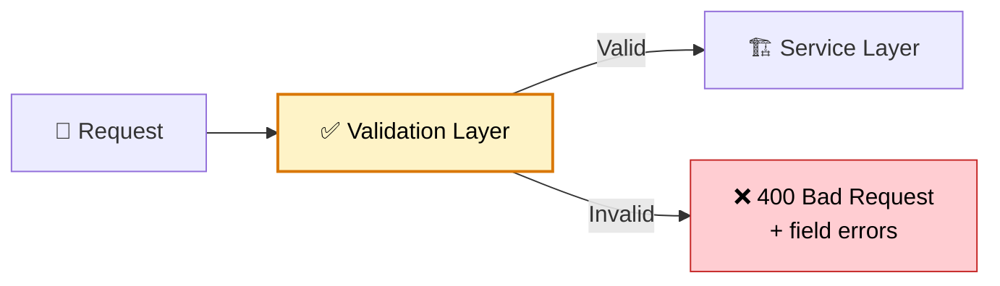

# Validation and Data Binding

> **Validate input at the boundary. Reject bad data before it reaches business logic using Bean Validation, custom validators, and Spring's binding infrastructure.**

---

!!! abstract "Real-World Analogy"
    Think of **airport security**. Before passengers board (enter your service), they pass through multiple checkpoints: ID check (type validation), baggage scan (content validation), size limits (constraint validation). Invalid passengers are rejected with clear reasons before they ever reach the gate.



---

## Bean Validation (JSR 380)

JSR 380 is the Java standard for declarative constraint validation. Spring Boot auto-configures a `Validator` when `spring-boot-starter-validation` is on the classpath. Hibernate Validator is the reference implementation.

**Dependency:**

```xml
<dependency>
    <groupId>org.springframework.boot</groupId>
    <artifactId>spring-boot-starter-validation</artifactId>
</dependency>
```

### Built-in Constraints

| Annotation | Target | Rule |
|---|---|---|
| `@NotNull` | Any type | Must not be null |
| `@NotBlank` | String | Not null, not empty, not whitespace-only |
| `@NotEmpty` | String, Collection, Map, Array | Not null and size > 0 |
| `@Size(min, max)` | String, Collection, Map, Array | Length/size within bounds |
| `@Min(value)` | Integer types, BigDecimal, BigInteger | >= value |
| `@Max(value)` | Integer types, BigDecimal, BigInteger | <= value |
| `@Positive` / `@PositiveOrZero` | Number | > 0 or >= 0 |
| `@Negative` / `@NegativeOrZero` | Number | < 0 or <= 0 |
| `@Email` | String | Valid email format (loose by default) |
| `@Pattern(regexp)` | String | Must match regex |
| `@Past` / `@PastOrPresent` | Date/Time types | Before now |
| `@Future` / `@FutureOrPresent` | Date/Time types | After now |
| `@DecimalMin` / `@DecimalMax` | Number | Decimal bounds with string value |
| `@Digits(integer, fraction)` | Number | Digit count constraints |
| `@Valid` | Object, Collection | Cascade into nested objects |

---

## @Valid vs @Validated

This is one of the most misunderstood distinctions in Spring validation.

| Feature | `@Valid` (Jakarta) | `@Validated` (Spring) |
|---|---|---|
| Package | `jakarta.validation` | `org.springframework.validation.annotation` |
| Validation groups | No | Yes |
| Cascading into nested objects | Yes | No |
| On method parameters | Yes | Yes |
| On class level | No effect | Enables method-level validation via AOP |
| On fields/properties | Triggers nested validation | Not applicable |

**Key rule:** Use `@Valid` on `@RequestBody` and on nested fields. Use `@Validated` on classes to enable method-level validation or to specify groups.

---

## Validation at the Controller Layer

The most common validation point. Annotate `@RequestBody` parameters with `@Valid`.

```java
@RestController
@RequestMapping("/api/users")
@Validated  // Required for path variable / query param validation
public class UserController {

    // Request body validation
    @PostMapping
    public ResponseEntity<UserResponse> register(
            @Valid @RequestBody UserRegistrationRequest request) {
        User user = userService.register(request);
        return ResponseEntity.status(HttpStatus.CREATED).body(UserResponse.from(user));
    }

    // Path variable validation — @Validated on class is REQUIRED
    @GetMapping("/{userId}")
    public UserResponse getUser(
            @PathVariable @Pattern(regexp = "^USR-\\d{8}$") String userId) {
        return userService.getById(userId);
    }

    // Query parameter validation
    @GetMapping
    public Page<UserResponse> search(
            @RequestParam @Min(0) int page,
            @RequestParam @Min(1) @Max(100) int size,
            @RequestParam(required = false) @Past LocalDate registeredAfter) {
        return userService.search(page, size, registeredAfter);
    }
}
```

When `@Valid` triggers on a `@RequestBody`, Spring throws `MethodArgumentNotValidException` on failure.
When `@Validated` enables method-level validation (path vars, query params), Spring throws `ConstraintViolationException`.

---

## Fun Example: Validating a User Registration Form

A complete registration DTO with built-in and custom constraints:

```java
@PasswordsMatch  // Custom cross-field validator
public record UserRegistrationRequest(

    @NotBlank(message = "Username is required")
    @Size(min = 3, max = 30, message = "Username must be 3-30 characters")
    @Pattern(regexp = "^[a-zA-Z0-9_]+$", message = "Username: letters, digits, underscore only")
    String username,

    @NotBlank(message = "Email is required")
    @Email(message = "Invalid email format")
    String email,

    @NotBlank(message = "Password is required")
    @Size(min = 8, max = 64, message = "Password must be 8-64 characters")
    @Pattern(regexp = "^(?=.*[a-z])(?=.*[A-Z])(?=.*\\d).*$",
             message = "Password must contain uppercase, lowercase, and digit")
    String password,

    @NotBlank(message = "Confirm password is required")
    String confirmPassword,

    @NotNull(message = "Date of birth is required")
    @Past(message = "Date of birth must be in the past")
    LocalDate dateOfBirth,

    @ValidPhoneNumber  // Custom validator
    String phoneNumber,

    @Valid  // Cascades validation into nested object
    @NotNull(message = "Address is required")
    AddressRequest address
) {}

public record AddressRequest(
    @NotBlank String street,
    @NotBlank String city,
    @NotBlank @Size(min = 2, max = 2) String state,
    @NotBlank @Pattern(regexp = "^\\d{5}(-\\d{4})?$") String zipCode,
    @NotBlank String country
) {}
```

---

## Custom Validators

### Building @ValidPhoneNumber from Scratch

**Step 1: Define the annotation.**

```java
@Target({FIELD, PARAMETER})
@Retention(RUNTIME)
@Constraint(validatedBy = PhoneNumberValidator.class)
@Documented
public @interface ValidPhoneNumber {
    String message() default "Invalid phone number format";
    Class<?>[] groups() default {};
    Class<? extends Payload>[] payload() default {};
}
```

Every constraint annotation **must** have `message()`, `groups()`, and `payload()`. These are required by the Bean Validation spec.

**Step 2: Implement the ConstraintValidator.**

```java
public class PhoneNumberValidator implements ConstraintValidator<ValidPhoneNumber, String> {

    private static final Pattern PHONE_PATTERN =
        Pattern.compile("^\\+?[1-9]\\d{6,14}$");  // E.164-ish

    @Override
    public void initialize(ValidPhoneNumber annotation) {
        // Access annotation attributes here if needed
    }

    @Override
    public boolean isValid(String value, ConstraintValidatorContext context) {
        if (value == null) return true;  // Let @NotNull handle null checks
        return PHONE_PATTERN.matcher(value).matches();
    }
}
```

**Step 3: Use it.**

```java
public record ContactRequest(
    @NotBlank String name,
    @ValidPhoneNumber String phone
) {}
```

### Custom Validator with Dependency Injection

Spring manages `ConstraintValidator` instances. Constructor injection works.

```java
public class UniqueEmailValidator implements ConstraintValidator<UniqueEmail, String> {

    private final UserRepository userRepository;

    public UniqueEmailValidator(UserRepository userRepository) {
        this.userRepository = userRepository;  // Spring injects this
    }

    @Override
    public boolean isValid(String email, ConstraintValidatorContext context) {
        if (email == null) return true;
        return !userRepository.existsByEmail(email);
    }
}
```

---

## Cross-Field Validation

Use a **class-level constraint** when validation depends on multiple fields.

### Example: Password Confirmation Match

**Annotation:**

```java
@Target(TYPE)
@Retention(RUNTIME)
@Constraint(validatedBy = PasswordsMatchValidator.class)
public @interface PasswordsMatch {
    String message() default "Passwords do not match";
    Class<?>[] groups() default {};
    Class<? extends Payload>[] payload() default {};
}
```

**Validator:**

```java
public class PasswordsMatchValidator
        implements ConstraintValidator<PasswordsMatch, UserRegistrationRequest> {

    @Override
    public boolean isValid(UserRegistrationRequest request, ConstraintValidatorContext context) {
        if (request.password() == null || request.confirmPassword() == null) {
            return true;  // Field-level @NotBlank handles nulls
        }

        boolean valid = request.password().equals(request.confirmPassword());

        if (!valid) {
            // Attach error to a specific field instead of class level
            context.disableDefaultConstraintViolation();
            context.buildConstraintViolationWithTemplate("Passwords do not match")
                   .addPropertyNode("confirmPassword")
                   .addConstraintViolation();
        }

        return valid;
    }
}
```

### Another Example: Date Range

```java
@ValidDateRange
public record ReportRequest(
    @NotNull LocalDate startDate,
    @NotNull LocalDate endDate
) {}

public class DateRangeValidator implements ConstraintValidator<ValidDateRange, ReportRequest> {
    @Override
    public boolean isValid(ReportRequest request, ConstraintValidatorContext context) {
        if (request.startDate() == null || request.endDate() == null) return true;
        return request.endDate().isAfter(request.startDate());
    }
}
```

---

## Validation Groups

Different operations need different validation rules. Groups solve this.

**Step 1: Define marker interfaces.**

```java
public interface OnCreate {}
public interface OnUpdate {}
```

**Step 2: Assign constraints to groups.**

```java
public record UserRequest(

    @Null(groups = OnCreate.class, message = "ID must not be set on create")
    @NotNull(groups = OnUpdate.class, message = "ID required for update")
    Long id,

    @NotBlank(groups = {OnCreate.class, OnUpdate.class})
    @Size(min = 2, max = 50, groups = {OnCreate.class, OnUpdate.class})
    String name,

    @NotBlank(groups = OnCreate.class)
    @Email(groups = OnCreate.class)
    String email  // Immutable after creation
) {}
```

**Step 3: Activate groups with @Validated.**

```java
@RestController
@RequestMapping("/api/users")
public class UserController {

    @PostMapping
    public UserResponse create(
            @Validated(OnCreate.class) @RequestBody UserRequest request) {
        return userService.create(request);
    }

    @PutMapping("/{id}")
    public UserResponse update(
            @Validated(OnUpdate.class) @RequestBody UserRequest request) {
        return userService.update(request);
    }
}
```

**Gotcha:** When you specify a group, constraints in the `Default` group are NOT evaluated. If you want both, extend `Default`:

```java
public interface OnCreate extends Default {}
```

Or list explicitly: `@Validated({OnCreate.class, Default.class})`.

---

## Validation at the Service Layer

Add `@Validated` to the service class. Spring wraps it in a validation proxy.

```java
@Service
@Validated  // Activates method-level validation via AOP
public class PaymentService {

    public PaymentResult processPayment(
            @Valid PaymentRequest request,       // Cascading validation
            @NotNull @Positive BigDecimal amount) {  // Simple constraints

        // Business validation (not expressible via annotations)
        if (isBlacklistedCard(request.cardNumber())) {
            throw new BusinessValidationException("Card is blacklisted");
        }

        return paymentGateway.charge(request, amount);
    }
}
```

Service-layer validation throws `ConstraintViolationException`, not `MethodArgumentNotValidException`.

---

## Validation on JPA Entities

Hibernate validates entities on `persist` and `update` events by default (if the validator is on the classpath).

```java
@Entity
@Table(name = "products")
public class Product {

    @Id
    @GeneratedValue(strategy = GenerationType.IDENTITY)
    private Long id;

    @NotBlank
    @Size(max = 200)
    @Column(nullable = false)
    private String name;

    @NotNull
    @Positive
    private BigDecimal price;

    @Size(max = 2000)
    private String description;

    @NotNull
    @Enumerated(EnumType.STRING)
    private ProductStatus status;
}
```

This is a **last line of defense**. You should still validate at the controller/service layers to provide better error messages.

---

## Error Handling

### MethodArgumentNotValidException (Controller @RequestBody)

```java
@RestControllerAdvice
public class ValidationExceptionHandler {

    @ExceptionHandler(MethodArgumentNotValidException.class)
    public ResponseEntity<ValidationErrorResponse> handleValidation(
            MethodArgumentNotValidException ex) {

        List<FieldErrorDetail> errors = ex.getBindingResult().getFieldErrors().stream()
            .map(fe -> new FieldErrorDetail(
                fe.getField(),
                fe.getDefaultMessage(),
                fe.getRejectedValue()
            ))
            .toList();

        return ResponseEntity.badRequest().body(new ValidationErrorResponse(
            "VALIDATION_FAILED",
            "Request validation failed",
            errors.size(),
            errors
        ));
    }

    @ExceptionHandler(ConstraintViolationException.class)
    public ResponseEntity<ValidationErrorResponse> handleConstraintViolation(
            ConstraintViolationException ex) {

        List<FieldErrorDetail> errors = ex.getConstraintViolations().stream()
            .map(cv -> new FieldErrorDetail(
                extractFieldName(cv.getPropertyPath()),
                cv.getMessage(),
                cv.getInvalidValue()
            ))
            .toList();

        return ResponseEntity.badRequest().body(new ValidationErrorResponse(
            "CONSTRAINT_VIOLATION",
            "Constraint violation",
            errors.size(),
            errors
        ));
    }

    private String extractFieldName(Path propertyPath) {
        String path = propertyPath.toString();
        // "methodName.paramName" → "paramName"
        return path.contains(".") ? path.substring(path.lastIndexOf('.') + 1) : path;
    }
}

public record ValidationErrorResponse(
    String code,
    String message,
    int errorCount,
    List<FieldErrorDetail> errors
) {}

public record FieldErrorDetail(
    String field,
    String message,
    Object rejectedValue
) {}
```

### Example JSON Response

```json
{
  "code": "VALIDATION_FAILED",
  "message": "Request validation failed",
  "errorCount": 3,
  "errors": [
    { "field": "username", "message": "Username is required", "rejectedValue": null },
    { "field": "email", "message": "Invalid email format", "rejectedValue": "not-an-email" },
    { "field": "confirmPassword", "message": "Passwords do not match", "rejectedValue": "xyz" }
  ]
}
```

---

## @ConfigurationProperties Validation

Validate configuration at startup. Fail fast if properties are invalid.

```java
@Validated  // Triggers validation on binding
@ConfigurationProperties(prefix = "app.payment")
public record PaymentProperties(

    @NotBlank
    String apiKey,

    @NotNull
    @Pattern(regexp = "^https://.*")
    String gatewayUrl,

    @Min(1) @Max(30)
    int timeoutSeconds,

    @Min(1) @Max(5)
    int maxRetries
) {}
```

```java
@SpringBootApplication
@EnableConfigurationProperties(PaymentProperties.class)
public class Application { }
```

If `app.payment.api-key` is blank at startup, the application fails immediately with a clear message. No silent misconfiguration.

---

## Gotchas and Pitfalls

| Gotcha | Explanation |
|---|---|
| `@Valid` vs `@Validated` for nested objects | Only `@Valid` cascades into nested objects. `@Validated` does NOT trigger nested validation on fields. |
| Path variable validation silently ignored | You must annotate the **controller class** with `@Validated` for `@PathVariable`/`@RequestParam` constraints to work. |
| Validation groups reset defaults | Specifying `groups = OnCreate.class` means `Default` group constraints are skipped unless `OnCreate extends Default`. |
| `@Email` is too permissive | `@Email` allows `x@y` (no TLD). Use `@Email(regexp = ".+@.+\\..+")` or a custom validator for stricter checking. |
| Null handling in custom validators | Always return `true` for null in custom validators. Compose with `@NotNull` for null rejection. Avoids double error messages. |
| `@Valid` on `List<Item>` parameter | `@Valid List<Item>` validates individual items. To validate the list itself (`@Size`, `@NotEmpty`), put constraints on the parameter AND `@Valid` on the type argument: `@NotEmpty List<@Valid Item>`. |
| Order of validation | Field-level constraints run first. Class-level constraints run after. If a field is null and the class-level validator accesses it, you get NPE. Always null-check in class-level validators. |

---

## Interview Questions

??? question "1. What is the difference between @Valid and @Validated?"
    `@Valid` (Jakarta) triggers cascading validation into nested objects. It works on fields, method parameters, and return values. It does NOT support validation groups. `@Validated` (Spring) enables method-level validation when placed on a class (via AOP proxy). It supports validation groups when placed on method parameters. Critical distinction: only `@Valid` cascades into nested fields.

??? question "2. How does Bean Validation (JSR 380) integrate with Spring Boot?"
    Spring Boot auto-configures a `LocalValidatorFactoryBean` when `spring-boot-starter-validation` is present. This wraps Hibernate Validator. The `MethodValidationPostProcessor` creates AOP proxies for `@Validated` classes. Spring MVC's argument resolvers call the validator for `@Valid @RequestBody` parameters automatically.

??? question "3. How do you implement cross-field validation?"
    Create a class-level constraint: define an annotation with `@Target(TYPE)` and `@Constraint(validatedBy = ...)`. The validator receives the entire object and can compare multiple fields. Example: `@PasswordsMatch` checks that `password.equals(confirmPassword)`. Use `context.buildConstraintViolationWithTemplate()` to attach errors to specific fields.

??? question "4. How do validation groups work? What is the Default group trap?"
    Groups are marker interfaces. Constraints declare `groups = {OnCreate.class}`. Use `@Validated(OnCreate.class)` to activate only those constraints. Trap: specifying a group excludes the `Default` group. Constraints without an explicit group belong to `Default`. Solution: make your group extend `jakarta.validation.groups.Default` or specify both groups explicitly.

??? question "5. Where should validation happen — controller, service, or entity?"
    Controller: input format validation (required fields, patterns, size). Reject garbage before deserialization completes. Service: business rules needing DB or external state (unique email, sufficient balance). Entity: last line of defense; Hibernate validates before persist. Each layer catches different categories of invalid data.

??? question "6. How do you validate path variables and query parameters?"
    Put `@Validated` on the controller class. Then annotate parameters: `@PathVariable @Pattern(regexp="...") String id`. Without `@Validated` on the class, these constraints are silently ignored. Violations throw `ConstraintViolationException`, not `MethodArgumentNotValidException`.

??? question "7. How do you build a custom constraint validator?"
    Three parts: (1) Annotation with `@Constraint(validatedBy = ...)`, `message()`, `groups()`, `payload()`. (2) Validator implementing `ConstraintValidator<A, T>` with `isValid()` method. (3) Return true for null — let `@NotNull` handle null. Spring manages validator lifecycle so DI works via constructor injection.

??? question "8. How does a custom validator access Spring beans (e.g., a repository)?"
    Spring instantiates `ConstraintValidator` implementations as beans. Use constructor injection directly. Example: `UniqueEmailValidator(UserRepository repo)`. This works because `LocalValidatorFactoryBean` uses `SpringConstraintValidatorFactory` which delegates to the ApplicationContext.

??? question "9. How do you validate @ConfigurationProperties?"
    Add `@Validated` to the `@ConfigurationProperties` class. Apply Bean Validation annotations to fields. If validation fails, the application context fails to start with a clear error. This ensures fail-fast behavior for misconfigured deployments.

??? question "10. What exception is thrown for @RequestBody validation vs method-level validation?"
    `@Valid @RequestBody` failures throw `MethodArgumentNotValidException` (extends `BindException`). Method-level validation on `@Validated` classes (path vars, service params) throws `ConstraintViolationException`. You need separate `@ExceptionHandler` methods for each.

??? question "11. How do you validate elements inside a collection?"
    Use type-argument annotations: `List<@Valid OrderItem> items`. This triggers validation on each element. For the list itself, add `@NotEmpty` or `@Size` on the parameter. Combined: `@NotEmpty @Size(max = 50) List<@Valid OrderItem> items`.

??? question "12. What is programmatic validation and when would you use it?"
    Inject `Validator` and call `validator.validate(object)` manually. Returns `Set<ConstraintViolation>`. Use when: (a) validation logic depends on runtime conditions not known at annotation time, (b) validating objects not created by Spring (e.g., deserialized from a queue), (c) conditional validation too complex for groups.

    ```java
    @Autowired Validator validator;

    public void process(Order order) {
        Set<ConstraintViolation<Order>> violations = validator.validate(order);
        if (!violations.isEmpty()) {
            throw new ConstraintViolationException(violations);
        }
    }
    ```

??? question "13. How do you handle validation in a reactive (WebFlux) application?"
    WebFlux does not auto-validate `@RequestBody`. Options: (1) Use `@Valid` — Spring WebFlux does support it since Spring 6, throwing `WebExchangeBindException`. (2) Use programmatic validation with the `Validator` bean. (3) Use `Mono`/`Flux` operators to validate in the reactive chain. The error handling differs from MVC — use `@ExceptionHandler` in `@ControllerAdvice` or `WebExceptionHandler`.

??? question "14. What happens if you put @Valid on a field but the field is null?"
    Nothing. `@Valid` does not imply `@NotNull`. If the field is null, cascading validation is skipped (no NPE). To require the nested object AND validate its contents, use both: `@NotNull @Valid AddressRequest address`.
