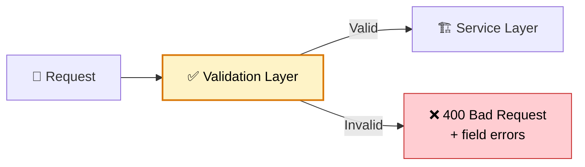

# ✅ Validation & Data Binding

> **Validate input at the boundary — reject bad data before it reaches business logic using Bean Validation, custom validators, and Spring's binding infrastructure.**

---

!!! abstract "Real-World Analogy"
    Think of **airport security**. Before passengers board (enter your service), they pass through multiple checkpoints: ID check (type validation), baggage scan (content validation), size limits (constraint validation). Invalid passengers are rejected with clear reasons before they ever reach the gate.



---

## 🏗️ Bean Validation (JSR 380)

### Common Constraints

```java
public record CreateOrderRequest(
    @NotBlank(message = "User ID is required")
    String userId,

    @NotEmpty(message = "At least one item required")
    @Size(max = 50, message = "Maximum 50 items per order")
    List<@Valid OrderItemRequest> items,

    @NotNull(message = "Shipping address is required")
    @Valid
    AddressRequest shippingAddress,

    @Email(message = "Invalid email format")
    String contactEmail,

    @DecimalMin(value = "0.01", message = "Amount must be positive")
    @DecimalMax(value = "999999.99", message = "Amount exceeds limit")
    BigDecimal totalAmount,

    @Pattern(regexp = "^[A-Z]{2}-\\d{6}$", message = "Invalid coupon format")
    String couponCode,

    @Future(message = "Delivery date must be in the future")
    LocalDate requestedDeliveryDate
) {}

public record OrderItemRequest(
    @NotBlank String productId,

    @Min(value = 1, message = "Quantity must be at least 1")
    @Max(value = 100, message = "Quantity cannot exceed 100")
    int quantity,

    @Positive(message = "Price must be positive")
    BigDecimal unitPrice
) {}

public record AddressRequest(
    @NotBlank String street,
    @NotBlank String city,
    @NotBlank @Size(min = 2, max = 2) String state,
    @NotBlank @Pattern(regexp = "^\\d{5}(-\\d{4})?$") String zipCode,
    @NotBlank String country
) {}
```

---

## 🎯 Controller Validation

```java
@RestController
@RequestMapping("/api/orders")
@Validated  // Enables method-level validation
public class OrderController {

    @PostMapping
    public ResponseEntity<OrderResponse> createOrder(
            @Valid @RequestBody CreateOrderRequest request) {  // @Valid triggers validation
        Order order = orderService.create(request);
        return ResponseEntity.status(HttpStatus.CREATED).body(OrderResponse.from(order));
    }

    // Path variable validation
    @GetMapping("/{orderId}")
    public OrderResponse getOrder(
            @PathVariable @Pattern(regexp = "^ORD-\\d{8}$") String orderId) {
        return orderService.getById(orderId);
    }

    // Query parameter validation
    @GetMapping
    public Page<OrderResponse> searchOrders(
            @RequestParam @Min(0) int page,
            @RequestParam @Min(1) @Max(100) int size,
            @RequestParam(required = false) @Past LocalDate fromDate) {
        return orderService.search(page, size, fromDate);
    }
}
```

---

## 🔧 Custom Validators

### Custom Annotation

```java
@Target({FIELD, PARAMETER})
@Retention(RUNTIME)
@Constraint(validatedBy = ValidCurrencyValidator.class)
@Documented
public @interface ValidCurrency {
    String message() default "Invalid currency code";
    Class<?>[] groups() default {};
    Class<? extends Payload>[] payload() default {};
}
```

### Validator Implementation

```java
public class ValidCurrencyValidator implements ConstraintValidator<ValidCurrency, String> {

    private static final Set<String> VALID_CURRENCIES = Set.of(
        "USD", "EUR", "GBP", "JPY", "CAD", "AUD"
    );

    @Override
    public boolean isValid(String value, ConstraintValidatorContext context) {
        if (value == null) return true;  // Use @NotNull for null checks
        return VALID_CURRENCIES.contains(value.toUpperCase());
    }
}
```

### Cross-Field Validation (Class-Level)

```java
@Target(TYPE)
@Retention(RUNTIME)
@Constraint(validatedBy = DateRangeValidator.class)
public @interface ValidDateRange {
    String message() default "End date must be after start date";
    Class<?>[] groups() default {};
    Class<? extends Payload>[] payload() default {};
}

@ValidDateRange
public record DateRangeRequest(
    @NotNull LocalDate startDate,
    @NotNull LocalDate endDate
) {}

public class DateRangeValidator implements ConstraintValidator<ValidDateRange, DateRangeRequest> {
    @Override
    public boolean isValid(DateRangeRequest request, ConstraintValidatorContext context) {
        if (request.startDate() == null || request.endDate() == null) return true;
        return request.endDate().isAfter(request.startDate());
    }
}
```

### Validator with Dependency Injection

```java
public class UniqueEmailValidator implements ConstraintValidator<UniqueEmail, String> {

    private final UserRepository userRepository;

    public UniqueEmailValidator(UserRepository userRepository) {
        this.userRepository = userRepository;  // Spring injects this
    }

    @Override
    public boolean isValid(String email, ConstraintValidatorContext context) {
        if (email == null) return true;
        return !userRepository.existsByEmail(email);
    }
}
```

---

## 🏷️ Validation Groups

Different validation rules for create vs update:

```java
public interface OnCreate {}
public interface OnUpdate {}

public record UserRequest(
    @Null(groups = OnCreate.class, message = "ID must not be set on create")
    @NotNull(groups = OnUpdate.class, message = "ID required for update")
    Long id,

    @NotBlank(groups = {OnCreate.class, OnUpdate.class})
    String name,

    @NotBlank(groups = OnCreate.class)
    @Email
    String email  // Can't change email on update
) {}

@RestController
public class UserController {

    @PostMapping("/api/users")
    public UserResponse create(
            @Validated(OnCreate.class) @RequestBody UserRequest request) {
        return userService.create(request);
    }

    @PutMapping("/api/users/{id}")
    public UserResponse update(
            @Validated(OnUpdate.class) @RequestBody UserRequest request) {
        return userService.update(request);
    }
}
```

---

## ❌ Error Response Handling

```java
@RestControllerAdvice
public class ValidationExceptionHandler {

    @ExceptionHandler(MethodArgumentNotValidException.class)
    public ResponseEntity<ValidationErrorResponse> handleValidation(
            MethodArgumentNotValidException ex) {

        List<FieldError> errors = ex.getBindingResult().getFieldErrors().stream()
            .map(fe -> new FieldError(
                fe.getField(),
                fe.getDefaultMessage(),
                fe.getRejectedValue()
            ))
            .toList();

        return ResponseEntity.badRequest().body(new ValidationErrorResponse(
            "Validation failed",
            errors.size(),
            errors
        ));
    }

    @ExceptionHandler(ConstraintViolationException.class)
    public ResponseEntity<ValidationErrorResponse> handleConstraintViolation(
            ConstraintViolationException ex) {

        List<FieldError> errors = ex.getConstraintViolations().stream()
            .map(cv -> new FieldError(
                cv.getPropertyPath().toString(),
                cv.getMessage(),
                cv.getInvalidValue()
            ))
            .toList();

        return ResponseEntity.badRequest().body(new ValidationErrorResponse(
            "Constraint violation",
            errors.size(),
            errors
        ));
    }
}

public record ValidationErrorResponse(
    String message,
    int errorCount,
    List<FieldError> errors
) {}

public record FieldError(
    String field,
    String message,
    Object rejectedValue
) {}
```

### Example Error Response

```json
{
  "message": "Validation failed",
  "errorCount": 3,
  "errors": [
    { "field": "userId", "message": "User ID is required", "rejectedValue": null },
    { "field": "items", "message": "At least one item required", "rejectedValue": [] },
    { "field": "contactEmail", "message": "Invalid email format", "rejectedValue": "not-an-email" }
  ]
}
```

---

## 🔄 Service-Layer Validation

```java
@Service
@Validated  // Enables validation at service boundary
public class PaymentService {

    public PaymentResult processPayment(
            @Valid PaymentRequest request,
            @NotNull @Positive BigDecimal amount) {

        // Additional business validation (not expressible via annotations)
        if (isBlacklistedCard(request.cardNumber())) {
            throw new BusinessValidationException("Card is blacklisted");
        }

        return paymentGateway.charge(request, amount);
    }
}
```

---

## 📊 Validation Annotations Reference

| Annotation | Applies To | Rule |
|---|---|---|
| `@NotNull` | Any | Must not be null |
| `@NotBlank` | String | Not null, not empty, not whitespace |
| `@NotEmpty` | String, Collection, Map, Array | Not null and not empty |
| `@Size(min, max)` | String, Collection | Length/size within range |
| `@Min` / `@Max` | Number | Numeric bounds |
| `@Positive` / `@Negative` | Number | Sign check |
| `@Email` | String | Valid email format |
| `@Pattern(regexp)` | String | Matches regex |
| `@Past` / `@Future` | Date/Time | Temporal constraint |
| `@Valid` | Object, Collection | Cascade validation into nested objects |
| `@Validated` | Class, Parameter | Enable validation (with groups support) |

---

## 🎯 Interview Questions

??? question "1. What is the difference between @Valid and @Validated?"
    `@Valid` (javax/Jakarta) — triggers cascading validation on nested objects, works on fields and method parameters. `@Validated` (Spring) — enables method-level validation on `@Service` classes AND supports validation groups. Use `@Valid` on request bodies and nested fields; use `@Validated` on class level for group support.

??? question "2. How do you validate across multiple fields (cross-field validation)?"
    Create a class-level constraint annotation with a validator that receives the entire object. Example: `@ValidDateRange` on a DTO that checks `endDate > startDate`. The validator implements `ConstraintValidator<ValidDateRange, YourDto>` and accesses all fields.

??? question "3. How do you apply different validation rules for create vs update?"
    Use **validation groups**. Define marker interfaces (`OnCreate`, `OnUpdate`). Annotate fields with `groups = OnCreate.class`. Use `@Validated(OnCreate.class)` on the controller method parameter. Different operations validate different subsets of rules.

??? question "4. Where should validation happen — controller, service, or both?"
    **Controller**: input format validation (required fields, types, formats) — reject garbage early. **Service**: business rule validation (sufficient balance, unique email, not blacklisted) — rules that need DB or external calls. Both layers serve different purposes.

??? question "5. How do you create a custom validator that needs Spring beans?"
    Implement `ConstraintValidator<YourAnnotation, FieldType>`. Spring manages validator instances, so you can use **constructor injection** to access repositories or services. Example: `UniqueEmailValidator` injects `UserRepository` to check if email already exists.

??? question "6. How do you validate collections of objects?"
    Use `List<@Valid OrderItem>` — the `@Valid` on the generic type parameter triggers validation for each element. For the list itself, use `@NotEmpty` or `@Size`. Spring 6+ fully supports this; earlier versions need `@Validated` on the class.
