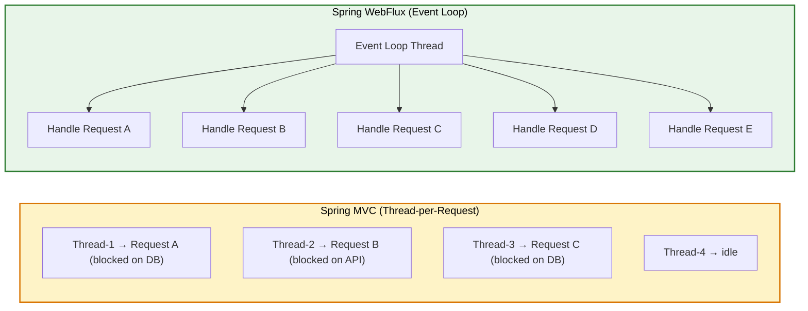
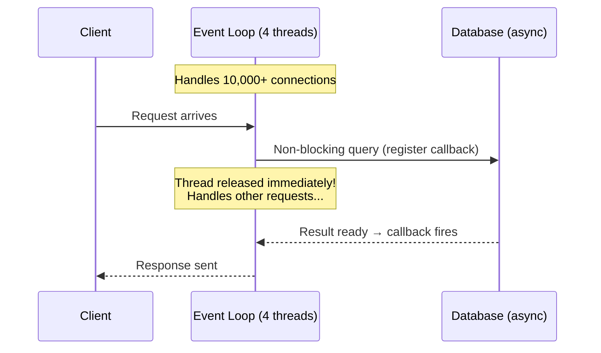
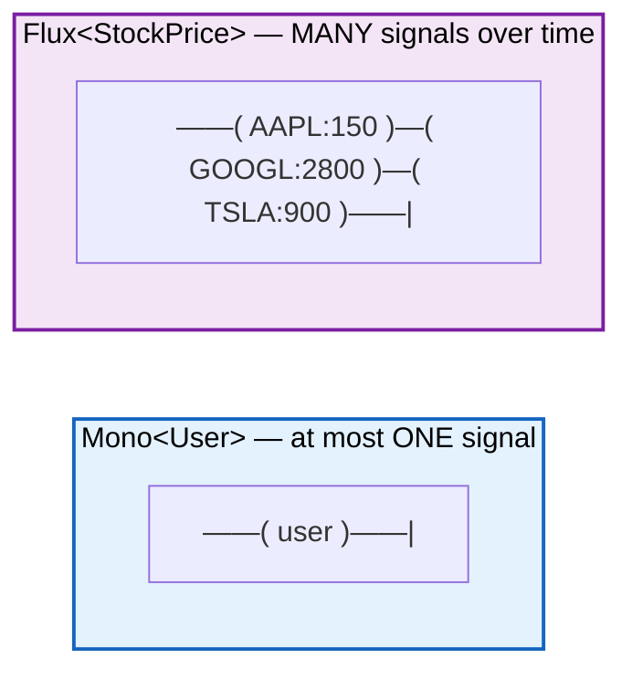
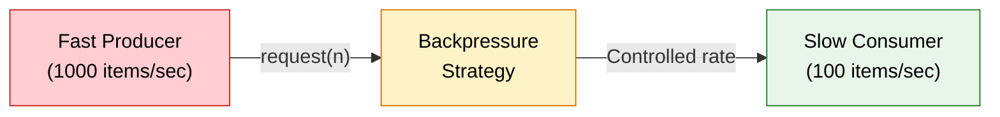
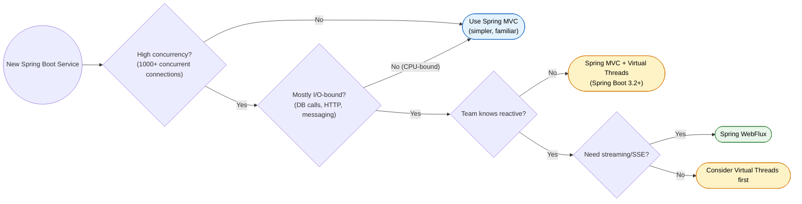

# Spring WebFlux & Reactive Programming

> Non-blocking, event-driven microservices. Thousands of concurrent connections on minimal threads. Built for I/O-bound workloads at scale.

---

## Reactive Manifesto

Four pillars define a reactive system:

| Pillar | Meaning | Analogy |
|---|---|---|
| **Responsive** | Always responds in a timely manner | A restaurant that never makes you wait 30 min for a menu |
| **Resilient** | Stays responsive under failure | Netflix still works when one microservice dies |
| **Elastic** | Stays responsive under varying load | Auto-scaling Kubernetes pods during Black Friday |
| **Message-Driven** | Async message passing between components | Slack messages vs. tapping someone on the shoulder |

!!! info "Message-Driven is the Foundation"
    The other three properties emerge FROM message-driven architecture. Async messages enable isolation (resilience), location transparency (elasticity), and non-blocking communication (responsiveness).

---

## Reactive Streams Specification

Four interfaces define the contract. Everything in reactive Java builds on these.

| Interface | Role |
|---|---|
| `Publisher<T>` | Produces data. Emits items to subscribers. |
| `Subscriber<T>` | Consumes data. Receives `onNext`, `onError`, `onComplete` signals. |
| `Subscription` | Link between publisher and subscriber. Subscriber calls `request(n)` to demand items. |
| `Processor<T,R>` | Both publisher and subscriber. Transforms items in a pipeline stage. |

The key insight: the subscriber controls the flow. It requests only what it can handle. This is backpressure.

```java
// The raw contract (you rarely implement this directly)
public interface Publisher<T> {
    void subscribe(Subscriber<? super T> s);
}

public interface Subscriber<T> {
    void onSubscribe(Subscription s);
    void onNext(T t);
    void onError(Throwable t);
    void onComplete();
}

public interface Subscription {
    void request(long n);  // Backpressure signal
    void cancel();
}
```

Project Reactor implements these interfaces with two concrete publishers: `Mono` and `Flux`.

---

## Thread Model: Event Loop (Netty)



### How Netty's Event Loop Works Internally

1. **Boss Group** (1-2 threads): Accepts incoming TCP connections via `ServerSocketChannel.accept()`.
2. **Worker Group** (N threads, default = CPU cores): Handles all I/O via `epoll` (Linux) or `kqueue` (macOS).
3. Each worker thread runs an infinite loop: poll for I/O events, execute handlers, repeat.
4. When I/O completes (DB result, HTTP response), a callback fires on the event loop thread.
5. No context switching. No thread pool exhaustion. No `Thread.sleep()` blocking anything.

!!! danger "Golden Rule"
    NEVER block an event loop thread. One `Thread.sleep(100)` in a handler blocks ALL requests assigned to that thread. This is the #1 cause of WebFlux performance disasters.



This means 4-8 threads can handle 10,000+ concurrent connections. The constraint shifts from thread pool size to memory and CPU.

---

## Project Reactor: Mono and Flux

| Publisher | Emits | Analogy |
|---|---|---|
| `Mono<T>` | 0 or 1 element | A Promise that resolves once (like ordering one coffee) |
| `Flux<T>` | 0 to N elements | A Netflix stream (items arrive over time, can pause/resume) |



Both are **lazy**. Nothing executes until someone subscribes. This is fundamentally different from `CompletableFuture` which starts immediately.

!!! tip "Mono vs CompletableFuture"
    `CompletableFuture` is eager (starts on creation) and cannot be cancelled cleanly. `Mono` is lazy (nothing happens until subscribe), supports cancellation, and integrates with backpressure. Think of `Mono` as a recipe vs. `CompletableFuture` as a microwave already running.

---

## Key Operators

### map — synchronous 1:1 transform

```java
Mono<String> name = userMono.map(User::getName);
Flux<Integer> lengths = namesFlux.map(String::length);
```

Does not change the container type. Cannot return a Publisher.

### flatMap — async transform (returns another Publisher)

```java
// Mono flatMap: Mono<A> -> (A -> Mono<B>) -> Mono<B>
Mono<Profile> profile = userMono
    .flatMap(user -> profileService.fetchProfile(user.getId()));

// Flux flatMap: subscribes eagerly, interleaves results (NO ordering guarantee)
Flux<Order> orders = userFlux
    .flatMap(user -> orderService.getOrders(user.getId()), 8); // concurrency = 8
```

Use `flatMap` when the transformation itself is asynchronous.

### zip — combine multiple publishers (wait for all)

```java
// Like Promise.all() — fire concurrently, wait for all results
Mono<DashboardDto> dashboard = Mono.zip(
    userService.findById(id),
    orderService.countByUserId(id),
    notificationService.unreadCount(id)
).map(tuple -> new DashboardDto(tuple.getT1(), tuple.getT2(), tuple.getT3()));
```

All sources execute concurrently. Result emits when ALL complete. If any fails, the zip fails.

### merge — combine publishers (interleave as they arrive)

```java
// Like listening to 3 radio stations at once — you hear whichever speaks first
Flux<Event> allEvents = Flux.merge(
    orderEvents,    // may emit first
    paymentEvents,  // may emit first
    shippingEvents
);
```

### concat — combine publishers (sequential, preserves order)

```java
// Like a playlist — song 2 starts only after song 1 finishes
Flux<User> allUsers = Flux.concat(
    cacheService.getCachedUsers(),      // Try cache first
    databaseService.getAllUsers()        // Then database
);
```

### switchIfEmpty — fallback when upstream emits nothing

```java
Mono<User> user = userRepository.findByEmail(email)
    .switchIfEmpty(Mono.error(new UserNotFoundException(email)));
```

### retry and timeout — resilience operators

```java
Mono<Response> resilient = webClient.get()
    .uri("/api/prices")
    .retrieve()
    .bodyToMono(Response.class)
    .timeout(Duration.ofSeconds(3))                           // Fail fast
    .retryWhen(Retry.backoff(3, Duration.ofMillis(500))      // Exponential backoff
        .maxBackoff(Duration.ofSeconds(5))
        .filter(ex -> ex instanceof WebClientResponseException.ServiceUnavailable));
```

### Other essential operators

```java
// flatMapMany: Mono -> Flux
Flux<Order> orders = userMono.flatMapMany(user -> orderService.streamOrders(user.getId()));

// concatMap: like flatMap but sequential (preserves order)
Flux<EnrichedOrder> enriched = orderFlux
    .concatMap(order -> enrichmentService.enrich(order)); // one at a time

// collectList: Flux -> Mono<List>
Mono<List<User>> userList = userFlux.collectList();

// distinct / take / skip
Flux<String> unique = namesFlux.distinct();
Flux<Order> firstTen = orderFlux.take(10);

// delayElements: throttle emission rate (useful for rate limiting)
Flux<Event> throttled = eventFlux.delayElements(Duration.ofMillis(100));
```

---

## Backpressure

Think of it like a highway on-ramp meter. Cars (data) want to enter the highway (subscriber). The meter light (backpressure) controls how many cars enter per cycle so the highway doesn't jam.



Without backpressure, a fast producer overwhelms a slow consumer. Result: `OutOfMemoryError` or dropped data.

### Strategies

| Strategy | Behavior | Use Case |
|---|---|---|
| `onBackpressureBuffer(n)` | Buffer up to N items. Error on overflow. | Bursty but bounded load |
| `onBackpressureDrop(consumer)` | Drop items subscriber cannot handle | Telemetry, metrics (latest matters) |
| `onBackpressureLatest()` | Keep only the most recent item | Real-time dashboards, stock tickers |
| `onBackpressureError()` | Signal error immediately if demand exceeded | Strict systems that cannot lose data |
| `limitRate(n)` | Pre-fetch N items at a time from upstream | Database result streaming |

### Real-World Example: IoT Sensor Data

```java
// IoT sensors emit 10,000 readings/sec. Your DB can write 500/sec.
public Flux<SensorReading> processSensorData(Flux<SensorReading> sensorFeed) {
    return sensorFeed
        .onBackpressureLatest()             // Keep latest if overwhelmed
        .limitRate(500)                     // Request 500 at a time
        .buffer(50)                         // Batch into groups of 50
        .flatMap(batch -> writeBatchToDb(batch), 4)  // 4 concurrent DB writes
        .doOnDiscard(SensorReading.class, reading ->
            metrics.increment("sensor.readings.dropped"));
}
```

### How Backpressure Works Over Different Transports

- **HTTP**: TCP flow control provides natural backpressure (TCP window fills up, sender pauses).
- **SSE/WebSocket**: Framework respects subscriber demand. Server buffers or applies configured strategy.
- **R2DBC**: Driver fetches rows in batches matching downstream demand.
- **Kafka**: Consumer controls poll batch size and commit offsets at its own pace.

---

## WebFlux vs Spring MVC



| Criteria | Spring MVC | Spring WebFlux |
|---|---|---|
| **Programming model** | Imperative, sequential | Declarative, reactive streams |
| **Thread usage** | Thread-per-request | Event loop (few threads) |
| **Blocking allowed?** | Yes | No (blocks event loop) |
| **Database access** | JDBC, JPA/Hibernate | R2DBC, reactive Mongo/Redis/Cassandra |
| **Debugging** | Easy (sequential stack traces) | Hard (async callback chains) |
| **Learning curve** | Low | High |
| **Server** | Tomcat (default) | Netty (default) |
| **Best for** | CRUD APIs, admin panels, CPU-bound work | API gateways, streaming, chat, IoT, high-concurrency I/O |
| **Transactions** | Full JPA/Hibernate support | Limited (no lazy loading, no entity graphs) |
| **Context propagation** | Thread-local works (MDC, SecurityContext) | Requires explicit Reactor `Context` |
| **Throughput at scale** | Plateaus at thread pool size | Scales to system resource limits |

!!! warning "WebFlux is NOT Always Better"
    For a CRUD app with moderate traffic, Spring MVC is simpler, easier to debug, and has a far more mature ecosystem. WebFlux shines at high concurrency with I/O-heavy workloads. Choosing WebFlux "because it's modern" is a common mistake.

---

## Annotated Controllers vs Functional Endpoints

### Annotated Controllers (familiar Spring style)

```java
@RestController
@RequestMapping("/api/users")
@RequiredArgsConstructor
public class UserController {

    private final UserService userService;

    @GetMapping("/{id}")
    public Mono<ResponseEntity<UserDto>> getUser(@PathVariable Long id) {
        return userService.findById(id)
            .map(user -> ResponseEntity.ok(UserDto.from(user)))
            .defaultIfEmpty(ResponseEntity.notFound().build());
    }

    @GetMapping
    public Flux<UserDto> getAllUsers() {
        return userService.findAll().map(UserDto::from);
    }

    @PostMapping
    @ResponseStatus(HttpStatus.CREATED)
    public Mono<UserDto> createUser(@Valid @RequestBody Mono<CreateUserRequest> request) {
        return request.flatMap(userService::create).map(UserDto::from);
    }

    @GetMapping(value = "/stream", produces = MediaType.TEXT_EVENT_STREAM_VALUE)
    public Flux<UserDto> streamUsers() {
        return userService.streamAllUsers().map(UserDto::from);
    }
}
```

### Functional Endpoints (RouterFunction + HandlerFunction)

No annotations. Pure functions. Easier to compose and unit-test.

```java
@Configuration
public class UserRouter {

    @Bean
    public RouterFunction<ServerResponse> userRoutes(UserHandler handler) {
        return RouterFunctions.route()
            .path("/api/users", builder -> builder
                .GET("/{id}", handler::getUser)
                .GET("", handler::getAllUsers)
                .POST("", handler::createUser)
            )
            .filter((request, next) -> {
                log.info("Request: {} {}", request.method(), request.path());
                return next.handle(request);
            })
            .build();
    }
}

@Component
@RequiredArgsConstructor
public class UserHandler {

    private final UserService userService;

    public Mono<ServerResponse> getUser(ServerRequest request) {
        Long id = Long.parseLong(request.pathVariable("id"));
        return userService.findById(id)
            .flatMap(user -> ServerResponse.ok()
                .contentType(MediaType.APPLICATION_JSON)
                .bodyValue(UserDto.from(user)))
            .switchIfEmpty(ServerResponse.notFound().build());
    }

    public Mono<ServerResponse> getAllUsers(ServerRequest request) {
        return ServerResponse.ok()
            .contentType(MediaType.APPLICATION_JSON)
            .body(userService.findAll().map(UserDto::from), UserDto.class);
    }

    public Mono<ServerResponse> createUser(ServerRequest request) {
        return request.bodyToMono(CreateUserRequest.class)
            .flatMap(userService::create)
            .flatMap(user -> ServerResponse.status(HttpStatus.CREATED)
                .bodyValue(UserDto.from(user)));
    }
}
```

!!! tip "When to Use Functional Endpoints"
    - Building a library/starter that exposes endpoints (no component scanning dependency)
    - Complex routing logic with conditional predicates
    - You want explicit composition over annotation magic
    - Micro-frameworks feel (like Vert.x or Ktor)

---

## Reactive Data Access

### R2DBC (Reactive SQL)

JDBC is blocking. Every `connection.query()` holds a thread. R2DBC is the non-blocking alternative.

```yaml
spring:
  r2dbc:
    url: r2dbc:postgresql://localhost:5432/orders_db
    username: app_user
    password: ${DB_PASSWORD}
    pool:
      initial-size: 10
      max-size: 50
      max-idle-time: 30m
```

```java
@Table("users")
public record User(
    @Id Long id,
    String email,
    String name,
    Instant createdAt
) {}

public interface UserRepository extends ReactiveCrudRepository<User, Long> {

    Mono<User> findByEmail(String email);

    @Query("SELECT * FROM users WHERE created_at > :since ORDER BY created_at DESC")
    Flux<User> findRecentUsers(Instant since);
}
```

### ReactiveMongoRepository

```java
public interface ProductRepository extends ReactiveMongoRepository<Product, String> {

    Flux<Product> findByCategory(String category);

    @Tailable  // For capped collections — streams new documents as they arrive
    Flux<Product> findWithTailableCursorBy();
}
```

!!! info "R2DBC Limitations"
    No lazy loading. No entity graphs. No JPA. No L2 cache. Simpler mapping than Hibernate. You trade ORM features for non-blocking I/O. For complex domain models, consider keeping JPA with Virtual Threads instead.

---

## WebClient: Reactive HTTP Client

`RestTemplate` is in maintenance mode. `WebClient` is non-blocking, supports streaming, and works in both reactive and servlet stacks.

### Configuration

```java
@Bean
public WebClient paymentServiceClient() {
    return WebClient.builder()
        .baseUrl("https://payment-service.internal")
        .defaultHeader(HttpHeaders.CONTENT_TYPE, MediaType.APPLICATION_JSON_VALUE)
        .filter(ExchangeFilterFunctions.basicAuthentication("user", "secret"))
        .codecs(config -> config.defaultCodecs().maxInMemorySize(2 * 1024 * 1024))
        .build();
}
```

### Usage Patterns

```java
// GET — single item
public Mono<User> fetchUser(String userId) {
    return webClient.get()
        .uri("/api/users/{id}", userId)
        .retrieve()
        .bodyToMono(User.class);
}

// GET — streaming multiple items
public Flux<User> searchUsers(String name) {
    return webClient.get()
        .uri(b -> b.path("/api/users").queryParam("name", name).build())
        .retrieve()
        .bodyToFlux(User.class);
}

// POST with error handling + retry
public Mono<PaymentResponse> charge(PaymentRequest request) {
    return webClient.post()
        .uri("/api/payments/charge")
        .bodyValue(request)
        .retrieve()
        .onStatus(HttpStatusCode::is4xxClientError, resp ->
            resp.bodyToMono(ErrorResponse.class)
                .flatMap(err -> Mono.error(new ValidationException(err.getMessage()))))
        .onStatus(HttpStatusCode::is5xxServerError, resp ->
            Mono.error(new ServiceUnavailableException()))
        .bodyToMono(PaymentResponse.class)
        .timeout(Duration.ofSeconds(5))
        .retryWhen(Retry.backoff(3, Duration.ofMillis(500))
            .filter(ex -> ex instanceof ServiceUnavailableException));
}
```

### WebClient vs RestTemplate

| | RestTemplate | WebClient |
|---|---|---|
| Blocking? | Yes | No |
| Streaming? | No | Yes (SSE, chunked) |
| Usable in MVC? | Yes | Yes (can `.block()` or return Mono) |
| Status | Maintenance mode | Active development |
| Connection pooling | Apache HttpClient | Reactor Netty connection pool |

---

## Server-Sent Events (SSE) and WebSocket

### SSE: One-Way Server Push

Think: stock ticker, live sports scores, deployment status updates. Simpler than WebSocket for one-way streaming.

```java
@GetMapping(value = "/api/stocks/ticker", produces = MediaType.TEXT_EVENT_STREAM_VALUE)
public Flux<ServerSentEvent<StockPrice>> streamPrices() {
    return Flux.interval(Duration.ofMillis(500))
        .map(i -> {
            String symbol = SYMBOLS[random.nextInt(SYMBOLS.length)];
            BigDecimal price = BigDecimal.valueOf(100 + random.nextDouble() * 200);
            return ServerSentEvent.<StockPrice>builder()
                .id(String.valueOf(i))
                .event("price-update")
                .data(new StockPrice(symbol, price, Instant.now()))
                .retry(Duration.ofSeconds(5))
                .build();
        });
}
```

Client-side (JavaScript):
```javascript
const es = new EventSource('/api/stocks/ticker');
es.addEventListener('price-update', (e) => {
    const price = JSON.parse(e.data);
    updateUI(price.symbol, price.price);
});
// Browser auto-reconnects on failure. That's the beauty of SSE.
```

### WebSocket: Bidirectional

Think: chat apps, multiplayer games, collaborative editing.

```java
@Configuration
@EnableWebFlux
public class WebSocketConfig {

    @Bean
    public HandlerMapping webSocketMapping(ChatWebSocketHandler handler) {
        Map<String, WebSocketHandler> map = Map.of("/ws/chat", handler);
        SimpleUrlHandlerMapping mapping = new SimpleUrlHandlerMapping();
        mapping.setUrlMap(map);
        mapping.setOrder(-1);
        return mapping;
    }
}

@Component
public class ChatWebSocketHandler implements WebSocketHandler {

    private final Sinks.Many<String> sink = Sinks.many().multicast().onBackpressureBuffer();

    @Override
    public Mono<Void> handle(WebSocketSession session) {
        // Receive messages from client → broadcast to all
        Mono<Void> input = session.receive()
            .map(WebSocketMessage::getPayloadAsText)
            .doOnNext(msg -> sink.tryEmitNext(msg))
            .then();

        // Send broadcast messages to this client
        Mono<Void> output = session.send(
            sink.asFlux().map(session::textMessage));

        return Mono.zip(input, output).then();
    }
}
```

!!! tip "SSE vs WebSocket Decision"
    - **SSE**: Server-to-client only. Auto-reconnect. Works over HTTP/1.1. Simple. Use for notifications, feeds, dashboards.
    - **WebSocket**: Bidirectional. Lower latency. Needs connection management. Use for chat, gaming, collaborative tools.

---

## Error Handling in Reactive Chains

You cannot use try-catch because execution is deferred. Use operators instead.

| Operator | Purpose | Recovers? |
|---|---|---|
| `onErrorReturn(value)` | Return static fallback | Yes |
| `onErrorResume(fn)` | Switch to alternative publisher | Yes |
| `onErrorMap(fn)` | Transform exception type | No (re-throws) |
| `doOnError(fn)` | Side effect (log/metrics) | No |
| `retry(n)` | Retry N times immediately | Yes (on success) |
| `retryWhen(spec)` | Retry with backoff/conditions | Yes (on success) |
| `timeout(duration)` | Error if no item within duration | No (throws TimeoutException) |

```java
public Mono<Order> placeOrder(OrderRequest request) {
    return validateOrder(request)
        .flatMap(this::saveOrder)
        .flatMap(order -> paymentClient.charge(order)
            .map(payment -> order.withPaymentId(payment.getId()))
            .onErrorResume(PaymentUnavailableException.class, ex -> {
                log.error("Payment down, queuing order: {}", order.getId());
                return queueForRetry(order).thenReturn(order.withStatus(PENDING));
            })
        )
        .retryWhen(Retry.backoff(3, Duration.ofSeconds(1))
            .maxBackoff(Duration.ofSeconds(10))
            .filter(ex -> ex instanceof TransientException))
        .doOnError(ex -> metrics.increment("order.failed"))
        .onErrorMap(ex -> new OrderProcessingException("Order failed", ex));
}
```

!!! danger "Common Mistake: doOnError Does NOT Recover"
    `doOnError` is for side effects (logging, metrics). The error STILL propagates downstream. Use `onErrorResume` or `onErrorReturn` to actually recover.

---

## Testing Reactive Code with StepVerifier

StepVerifier subscribes to a Publisher and asserts signals step by step.

### Unit Tests

```java
@Test
void findById_existingUser_returnsUser() {
    User user = new User(1L, "alice@test.com", "Alice", Instant.now());
    when(userRepository.findById(1L)).thenReturn(Mono.just(user));

    StepVerifier.create(userService.findById(1L))
        .assertNext(result -> assertThat(result.email()).isEqualTo("alice@test.com"))
        .verifyComplete();
}

@Test
void findById_nonExistent_completesEmpty() {
    when(userRepository.findById(99L)).thenReturn(Mono.empty());

    StepVerifier.create(userService.findById(99L))
        .verifyComplete();  // No items, just onComplete
}

@Test
void create_duplicateEmail_emitsError() {
    when(userRepository.findByEmail("alice@test.com")).thenReturn(Mono.just(existingUser));

    StepVerifier.create(userService.create(new CreateUserRequest("alice@test.com", "X")))
        .expectError(DuplicateEmailException.class)
        .verify();
}
```

### Virtual Time (testing delays without waiting)

```java
@Test
void retryWithBackoff_respectsDelay() {
    StepVerifier.withVirtualTime(() ->
            failingService.call()
                .retryWhen(Retry.backoff(3, Duration.ofSeconds(2)))
        )
        .expectSubscription()
        .thenAwait(Duration.ofSeconds(2))   // First retry
        .thenAwait(Duration.ofSeconds(4))   // Second retry (exponential)
        .expectNext(expectedResult)
        .verifyComplete();
}
```

### Integration Tests with WebTestClient

```java
@SpringBootTest(webEnvironment = RANDOM_PORT)
class UserControllerIT {

    @Autowired WebTestClient webTestClient;

    @Test
    void getUser_returns200() {
        webTestClient.get().uri("/api/users/1")
            .exchange()
            .expectStatus().isOk()
            .expectBody(UserDto.class)
            .value(user -> assertThat(user.email()).isEqualTo("alice@test.com"));
    }

    @Test
    void streamUsers_returnsSSE() {
        webTestClient.get().uri("/api/users/stream")
            .accept(MediaType.TEXT_EVENT_STREAM)
            .exchange()
            .expectStatus().isOk()
            .returnResult(UserDto.class)
            .getResponseBody()
            .as(StepVerifier::create)
            .expectNextCount(3)
            .thenCancel()
            .verify();
    }
}
```

---

## Common Pitfalls

### 1. Blocking in a reactive pipeline

The single worst mistake. One `Thread.sleep()` or JDBC call holds the event loop.

```java
// WRONG: blocks the event loop
Mono<User> user = Mono.fromCallable(() -> jdbcTemplate.queryForObject(...));

// RIGHT: offload to bounded elastic scheduler
Mono<User> user = Mono.fromCallable(() -> jdbcTemplate.queryForObject(...))
    .subscribeOn(Schedulers.boundedElastic());
```

### 2. Calling .block() in a reactive context

```java
// WRONG: IllegalStateException on Netty thread, or deadlock
@GetMapping("/user/{id}")
public Mono<User> getUser(@PathVariable Long id) {
    User user = userRepository.findById(id).block(); // NEVER
    return Mono.just(user);
}
```

`block()` is only acceptable in tests or at the application boundary (main method, CommandLineRunner).

### 3. Nothing happens without subscribe

```java
// WRONG: this does NOTHING — no subscriber
userRepository.save(user);

// RIGHT: return it so the framework subscribes
return userRepository.save(user);
```

### 4. Debugging reactive stack traces

Stack traces are useless by default. You see Reactor internals, not your code.

```java
// Development: enable debug agent (bytecode instrumentation, lower overhead)
ReactorDebugAgent.init(); // Call once at startup

// Targeted debugging: checkpoint()
Flux<Order> orders = orderService.getOrders()
    .checkpoint("after-getOrders")
    .filter(Order::isPaid)
    .checkpoint("after-filter-paid");
```

### 5. Context propagation (MDC, SecurityContext)

Thread-local does not work in reactive code because operators can switch threads.

```java
// Write context at subscription point
Mono<User> result = userService.findById(id)
    .contextWrite(ctx -> ctx.put("traceId", traceId));

// Read context inside the chain
Mono<String> trace = Mono.deferContextual(ctx -> Mono.just(ctx.get("traceId")));
```

For MDC logging: use Micrometer Context Propagation library (Spring Boot 3.x integrates this).

### 6. Shared mutable state

Event loop threads process many requests. No synchronization = race conditions. Use `AtomicReference`, `Sinks`, or Reactor `Context`.

---

## Virtual Threads vs WebFlux (Spring Boot 3.2+)

Java 21 introduced Virtual Threads (Project Loom). Spring Boot 3.2+ supports them natively.

| Aspect | WebFlux | Virtual Threads (MVC) |
|---|---|---|
| **Programming model** | Reactive (Mono/Flux chains) | Imperative (plain Java) |
| **Blocking calls** | Forbidden | Allowed (VTs are cheap) |
| **Learning curve** | Steep | Minimal (just enable a flag) |
| **Ecosystem** | R2DBC, reactive drivers only | JDBC, JPA, all existing libs |
| **Streaming/SSE** | Native support | Possible but less elegant |
| **Backpressure** | Built-in | Manual (if needed) |
| **Debugging** | Hard | Easy (normal stack traces) |
| **Memory per connection** | ~few KB (event loop) | ~few KB (virtual thread) |
| **Throughput** | Excellent for I/O | Excellent for I/O |

```yaml
# Enable virtual threads in Spring Boot 3.2+
spring:
  threads:
    virtual:
      enabled: true
```

!!! warning "When WebFlux Still Wins Over Virtual Threads"
    1. **Streaming data** (SSE, infinite Flux) — WebFlux handles this natively
    2. **Backpressure** — built into reactive streams, not available with VTs
    3. **Existing reactive codebase** — don't rewrite working code
    4. **Non-JVM integration** — reactive patterns work across polyglot systems

!!! tip "Pragmatic Recommendation (2024+)"
    Starting a NEW project with high concurrency? Try Virtual Threads first. Simpler code, familiar model, good enough for most cases. Reach for WebFlux only when you need streaming, backpressure, or your benchmarks prove VTs insufficient.

---

## Interview Questions

??? question "1. What is the difference between Mono and Flux?"
    `Mono<T>` emits 0 or 1 element. `Flux<T>` emits 0 to N elements. Both are lazy (nothing happens until subscribed). Use Mono for single-value operations (find by ID, save). Use Flux for collections and streams (query results, SSE). Key distinction: `Mono<List<T>>` delivers one list all at once. `Flux<T>` streams elements individually with backpressure. Prefer Flux when the dataset is large or unbounded.

??? question "2. How does the Netty event loop handle thousands of connections with few threads?"
    Netty uses `epoll`/`kqueue` for I/O multiplexing. A small pool (CPU cores) of event loop threads poll for I/O readiness. When a request arrives, the thread registers interest and moves on (no blocking). When I/O completes, a callback fires on the same thread. No thread-per-request. No context switching overhead. 4-8 threads handle 10,000+ connections. Constraints shift from thread count to memory/CPU.

??? question "3. What is backpressure and what strategies does Reactor provide?"
    Backpressure = subscriber tells publisher how much it can handle via `Subscription.request(n)`. Publisher must not exceed demand. Strategies: `onBackpressureBuffer(n)` buffers then errors on overflow. `onBackpressureDrop()` discards excess items. `onBackpressureLatest()` keeps only the newest item. `onBackpressureError()` errors immediately. `limitRate(n)` pre-fetches in batches. Over HTTP, TCP flow control provides natural backpressure.

??? question "4. What happens if you call .block() on a Netty event loop thread?"
    `IllegalStateException`: "block()/blockFirst()/blockLast() are blocking, which is not supported in thread reactor-http-nio-X". Even on other schedulers: potential deadlock. The thread waits for a signal that can only arrive on that same thread. It defeats reactive programming by occupying one of the few event loop threads. Only acceptable in tests or at the application boundary.

??? question "5. Explain map vs flatMap vs concatMap."
    `map`: synchronous 1:1 transform. Does not change container type. `flatMap`: async transform returning a Publisher. Subscribes eagerly to inner publishers. Results may interleave (no ordering). Configurable concurrency. `concatMap`: like flatMap but sequential. Waits for each inner publisher to complete before subscribing to the next. Order preserved. Use map for simple transforms, flatMap for max throughput, concatMap when ordering matters.

??? question "6. When should you NOT use WebFlux?"
    (1) CPU-bound work — no benefit from non-blocking I/O. (2) Blocking dependencies with no reactive alternative (JDBC, synchronous SDKs). (3) Team lacks reactive experience. (4) Need full JPA/Hibernate features. (5) Simple CRUD with moderate traffic. (6) Spring Boot 3.2+ with Virtual Threads covers the same concurrency gains with simpler code for most cases.

??? question "7. How does error handling differ in reactive vs imperative code?"
    Cannot use try-catch because execution is deferred. Use operators: `onErrorReturn(value)` for static fallback. `onErrorResume(fn)` to switch to alternative publisher. `onErrorMap(fn)` to translate exceptions. `retryWhen(Retry.backoff(...))` for transient failures. `doOnError(fn)` for side effects only (does NOT recover). Errors propagate downstream until handled. Unhandled errors reach `Subscriber.onError()`.

??? question "8. What is R2DBC and why not just use JDBC in WebFlux?"
    JDBC's `ResultSet.next()` blocks the calling thread. In WebFlux, that blocks the event loop = catastrophe. R2DBC provides non-blocking SQL access. Drivers exist for PostgreSQL, MySQL, H2, MSSQL. Spring Data R2DBC provides `ReactiveCrudRepository`. Trade-off: gain non-blocking I/O, lose lazy loading, entity graphs, L2 cache, and JPA features.

??? question "9. Explain hot vs cold publishers."
    Cold publisher: creates new data source per subscriber. Each gets all items from the beginning. Example: `Flux.fromIterable(list)`, database query. Hot publisher: data flows regardless of subscribers. Late subscribers miss earlier items. Example: mouse clicks, stock prices, `Sinks`. Convert cold to hot with `share()` or `publish().refCount()`. Use hot when historical data is irrelevant.

??? question "10. How do you propagate context (traceId, security) in reactive pipelines?"
    Thread-local fails because operators switch threads. Reactor provides `Context` — immutable key-value store attached to the subscriber. Write: `.contextWrite(ctx -> ctx.put("traceId", id))`. Read: `Mono.deferContextual(ctx -> ...)`. Spring Security: `ReactiveSecurityContextHolder.getContext()`. For MDC logging: use Micrometer Context Propagation (Spring Boot 3.x). Context flows upstream (from subscriber to publisher).

??? question "11. How do you test reactive code?"
    Primary tool: `StepVerifier` from `reactor-test`. `.create(publisher).expectNext(value).verifyComplete()` for happy path. `.expectError(Type.class).verify()` for errors. `StepVerifier.withVirtualTime()` for time-dependent tests without real waiting. Integration: `WebTestClient` for HTTP assertions including SSE. Critical: always call `.verify()` — without it the test subscribes to nothing.

??? question "12. What are Sinks and when do you use them?"
    `Sinks` are programmatic publishers. Push items imperatively; subscribers receive reactively. Types: `Sinks.one()` for single value. `Sinks.many().multicast()` for multiple subscribers sharing items. `Sinks.many().unicast()` for single subscriber. `Sinks.many().replay()` for historical items. Use case: bridging imperative code (event handlers, message listeners) into reactive streams. Common in SSE endpoints and chat systems.

??? question "13. Virtual Threads vs WebFlux — when to choose which?"
    Virtual Threads (Spring Boot 3.2+): simpler imperative code, works with JDBC/JPA, easy debugging, good for high-concurrency I/O without streaming needs. WebFlux: native streaming/SSE, built-in backpressure, better for infinite data streams and reactive ecosystems. Choose VTs for new projects unless you specifically need streaming or backpressure. Keep WebFlux for existing reactive codebases.

??? question "14. What is the difference between publishOn and subscribeOn?"
    `subscribeOn` affects the ENTIRE chain from subscription point upward. Sets which scheduler subscribes to the source. Only the first `subscribeOn` in a chain takes effect. `publishOn` affects operators DOWNSTREAM of where it appears. Switches thread for subsequent operators. Multiple `publishOn` calls work — each switches the thread for the segment below it. Use `subscribeOn(boundedElastic)` to offload blocking sources. Use `publishOn(parallel)` for CPU-intensive transforms.

??? question "15. What are the common mistakes that kill WebFlux performance?"
    (1) Blocking calls in reactive chain (JDBC, Thread.sleep, synchronized blocks). (2) Calling `.block()` on event loop thread. (3) Unbounded buffers causing OOM under load. (4) Not using `limitRate()` for large database results. (5) Forgetting to subscribe (nothing executes). (6) Using `Hooks.onOperatorDebug()` in production (huge overhead). (7) Shared mutable state without synchronization. (8) Not propagating context for tracing/security.
