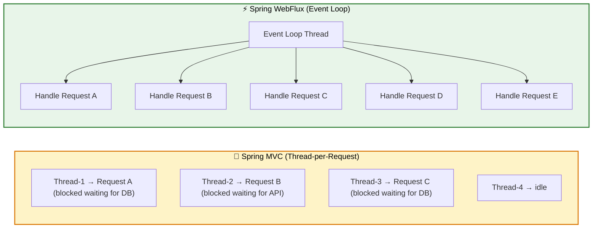
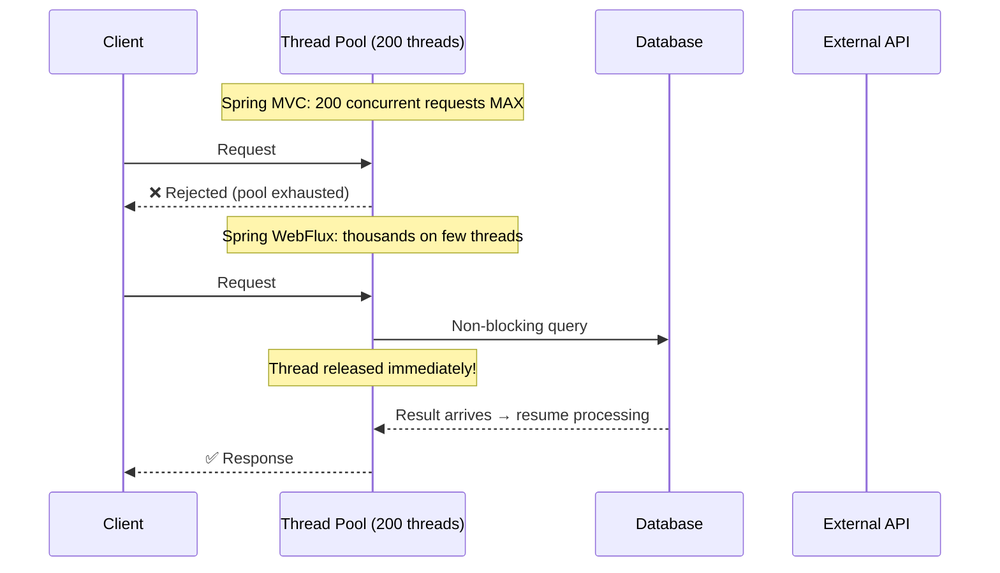
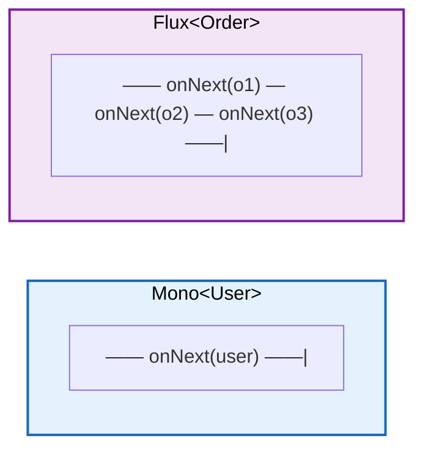
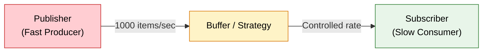
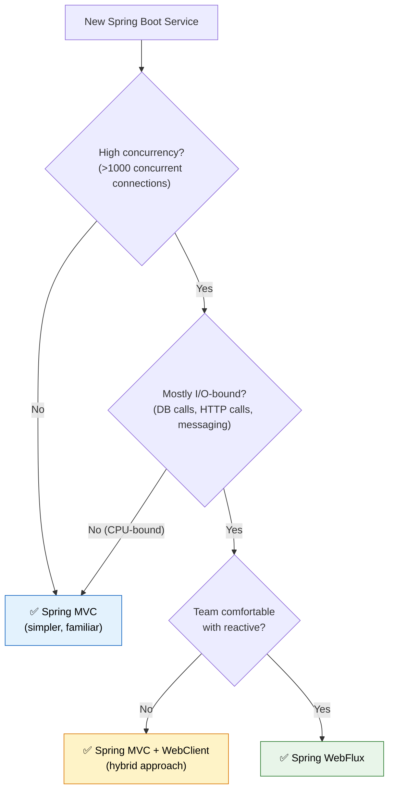

# ⚡ Spring WebFlux & Reactive Programming

> **Build non-blocking, event-driven microservices that handle thousands of concurrent connections with minimal threads — ideal for I/O-bound workloads at scale.**

---

!!! abstract "Real-World Analogy"
    Think of a **restaurant with one waiter** vs **one waiter per table**. In the traditional model (Spring MVC), each table gets a dedicated waiter who stands idle while the kitchen prepares food. In the reactive model (WebFlux), a single waiter takes orders from many tables, checks back only when food is ready, and never stands idle. Fewer waiters serve far more tables.



---

## 🔑 Why Reactive? The Problem with Blocking I/O



| Aspect | Thread-per-Request (MVC) | Event Loop (WebFlux) |
|---|---|---|
| **Threads needed** | 1 thread per request | Few threads (CPU cores) |
| **Blocking I/O** | Thread sits idle | Thread released instantly |
| **Max concurrency** | Limited by thread pool (200-500) | Limited by memory/CPU |
| **CPU-bound work** | Fine | No advantage |
| **Best for** | CRUD apps, simple APIs | High-concurrency I/O (gateways, streaming) |

---

## 🧱 Project Reactor: Mono and Flux

Reactor is the reactive library underpinning WebFlux. Two core publishers:

| Publisher | Emits | Analogy |
|---|---|---|
| `Mono<T>` | 0 or 1 element | `Optional<T>` but async |
| `Flux<T>` | 0 to N elements | `Stream<T>` but async |



### Essential Operators

```java
// map — synchronous 1:1 transform
Mono<String> name = userMono.map(User::getName);

// flatMap — async transform (returns another Publisher)
Mono<OrderSummary> summary = userMono
    .flatMap(user -> orderService.getLatestOrder(user.getId()));

// filter — conditional pass-through
Flux<Order> expensive = orderFlux.filter(o -> o.getTotal().compareTo(BigDecimal.valueOf(100)) > 0);

// zip — combine multiple publishers
Mono<Tuple2<User, List<Order>>> combined = Mono.zip(
    userService.findById(userId),
    orderService.findByUserId(userId).collectList()
);

// switchIfEmpty — fallback when upstream is empty
Mono<User> user = userRepository.findByEmail(email)
    .switchIfEmpty(Mono.error(new UserNotFoundException(email)));

// flatMapMany — Mono to Flux
Flux<Order> orders = userMono.flatMapMany(user -> orderService.streamOrders(user.getId()));
```

---

## 🌐 WebFlux Controllers

### Annotated Style (Familiar to MVC developers)

```java
@RestController
@RequestMapping("/api/users")
@RequiredArgsConstructor
public class UserController {

    private final UserService userService;

    @GetMapping("/{id}")
    public Mono<ResponseEntity<UserDto>> getUser(@PathVariable Long id) {
        return userService.findById(id)
            .map(user -> ResponseEntity.ok(UserDto.from(user)))
            .defaultIfEmpty(ResponseEntity.notFound().build());
    }

    @GetMapping
    public Flux<UserDto> getAllUsers() {
        return userService.findAll()
            .map(UserDto::from);
    }

    @PostMapping
    @ResponseStatus(HttpStatus.CREATED)
    public Mono<UserDto> createUser(@Valid @RequestBody Mono<CreateUserRequest> request) {
        return request
            .flatMap(userService::create)
            .map(UserDto::from);
    }

    @GetMapping(value = "/stream", produces = MediaType.TEXT_EVENT_STREAM_VALUE)
    public Flux<UserDto> streamUsers() {
        return userService.streamAllUsers()
            .map(UserDto::from);
    }
}
```

### Functional Router Style

```java
@Configuration
public class UserRouter {

    @Bean
    public RouterFunction<ServerResponse> userRoutes(UserHandler handler) {
        return RouterFunctions.route()
            .path("/api/users", builder -> builder
                .GET("/{id}", handler::getUser)
                .GET("", handler::getAllUsers)
                .POST("", handler::createUser)
            )
            .build();
    }
}

@Component
@RequiredArgsConstructor
public class UserHandler {

    private final UserService userService;

    public Mono<ServerResponse> getUser(ServerRequest request) {
        Long id = Long.parseLong(request.pathVariable("id"));
        return userService.findById(id)
            .flatMap(user -> ServerResponse.ok()
                .contentType(MediaType.APPLICATION_JSON)
                .bodyValue(UserDto.from(user)))
            .switchIfEmpty(ServerResponse.notFound().build());
    }

    public Mono<ServerResponse> getAllUsers(ServerRequest request) {
        Flux<UserDto> users = userService.findAll().map(UserDto::from);
        return ServerResponse.ok()
            .contentType(MediaType.APPLICATION_JSON)
            .body(users, UserDto.class);
    }

    public Mono<ServerResponse> createUser(ServerRequest request) {
        return request.bodyToMono(CreateUserRequest.class)
            .flatMap(userService::create)
            .flatMap(user -> ServerResponse.status(HttpStatus.CREATED)
                .contentType(MediaType.APPLICATION_JSON)
                .bodyValue(UserDto.from(user)));
    }
}
```

---

## 🔗 Reactive WebClient (Replacing RestTemplate)

!!! warning "RestTemplate is in maintenance mode"
    `RestTemplate` is blocking and thread-hogging. `WebClient` is non-blocking, supports streaming, and works in both reactive and servlet stacks.

```java
@Configuration
public class WebClientConfig {

    @Bean
    public WebClient paymentServiceClient() {
        return WebClient.builder()
            .baseUrl("https://payment-service.internal")
            .defaultHeader(HttpHeaders.CONTENT_TYPE, MediaType.APPLICATION_JSON_VALUE)
            .filter(ExchangeFilterFunctions.basicAuthentication("user", "secret"))
            .codecs(config -> config.defaultCodecs().maxInMemorySize(2 * 1024 * 1024))
            .build();
    }
}

@Service
@RequiredArgsConstructor
public class PaymentClient {

    private final WebClient paymentServiceClient;

    public Mono<PaymentResponse> chargeCustomer(PaymentRequest request) {
        return paymentServiceClient.post()
            .uri("/api/payments/charge")
            .bodyValue(request)
            .retrieve()
            .onStatus(HttpStatusCode::is4xxClientError, response ->
                response.bodyToMono(ErrorResponse.class)
                    .flatMap(error -> Mono.error(new PaymentValidationException(error.getMessage()))))
            .onStatus(HttpStatusCode::is5xxServerError, response ->
                Mono.error(new PaymentServiceUnavailableException()))
            .bodyToMono(PaymentResponse.class)
            .timeout(Duration.ofSeconds(5))
            .retryWhen(Retry.backoff(3, Duration.ofMillis(500))
                .filter(ex -> ex instanceof PaymentServiceUnavailableException));
    }

    public Flux<Transaction> streamTransactions(String accountId) {
        return paymentServiceClient.get()
            .uri("/api/accounts/{id}/transactions/stream", accountId)
            .accept(MediaType.TEXT_EVENT_STREAM)
            .retrieve()
            .bodyToFlux(Transaction.class);
    }
}
```

---

## 🗄️ Reactive Data Access: R2DBC with Spring Data

```xml
<dependency>
    <groupId>org.springframework.boot</groupId>
    <artifactId>spring-boot-starter-data-r2dbc</artifactId>
</dependency>
<dependency>
    <groupId>io.r2dbc</groupId>
    <artifactId>r2dbc-postgresql</artifactId>
    <scope>runtime</scope>
</dependency>
```

```yaml
# application.yml
spring:
  r2dbc:
    url: r2dbc:postgresql://localhost:5432/orders_db
    username: app_user
    password: ${DB_PASSWORD}
    pool:
      initial-size: 10
      max-size: 50
      max-idle-time: 30m
```

```java
@Table("users")
public record User(
    @Id Long id,
    String email,
    String name,
    Instant createdAt
) {}

public interface UserRepository extends ReactiveCrudRepository<User, Long> {

    Mono<User> findByEmail(String email);

    @Query("SELECT * FROM users WHERE created_at > :since ORDER BY created_at DESC")
    Flux<User> findRecentUsers(Instant since);

    @Query("SELECT * FROM users WHERE name ILIKE :pattern")
    Flux<User> searchByName(String pattern);
}

@Service
@RequiredArgsConstructor
public class UserService {

    private final UserRepository userRepository;
    private final ReactiveRedisTemplate<String, User> redisTemplate;

    public Mono<User> findById(Long id) {
        String cacheKey = "user:" + id;
        return redisTemplate.opsForValue().get(cacheKey)
            .switchIfEmpty(
                userRepository.findById(id)
                    .flatMap(user -> redisTemplate.opsForValue()
                        .set(cacheKey, user, Duration.ofMinutes(10))
                        .thenReturn(user))
            );
    }

    @Transactional
    public Mono<User> create(CreateUserRequest request) {
        return userRepository.findByEmail(request.email())
            .flatMap(existing -> Mono.<User>error(
                new DuplicateEmailException(request.email())))
            .switchIfEmpty(Mono.defer(() ->
                userRepository.save(new User(null, request.email(), request.name(), Instant.now()))
            ));
    }

    public Flux<User> findAll() {
        return userRepository.findAll();
    }

    public Flux<User> streamAllUsers() {
        return userRepository.findAll()
            .delayElements(Duration.ofMillis(100));  // Server-Sent Events throttle
    }
}
```

---

## 🚦 Backpressure Handling



Backpressure ensures a fast producer does not overwhelm a slow consumer.

```java
@Service
public class DataExportService {

    // Limit in-flight items (consumer controls pace)
    public Flux<Record> exportLargeDataset() {
        return recordRepository.findAll()
            .limitRate(100)        // Request 100 items at a time from upstream
            .buffer(50)            // Batch into groups of 50
            .flatMap(this::writeBatchToS3, 4)  // Max 4 concurrent writes
            .onBackpressureBuffer(500)  // Buffer up to 500 if downstream is slow
            .onBackpressureDrop(dropped ->
                log.warn("Dropped record due to backpressure: {}", dropped.getId()));
    }
}
```

| Strategy | Behavior | When to use |
|---|---|---|
| `onBackpressureBuffer(n)` | Buffer up to N items, error if overflow | Bursty but bounded load |
| `onBackpressureDrop()` | Drop items subscriber can't handle | Metrics/telemetry (latest matters) |
| `onBackpressureLatest()` | Keep only most recent item | Real-time dashboards |
| `limitRate(n)` | Pre-fetch N items from upstream | Database result streaming |

---

## 🛡️ Error Handling in Reactive Streams

```java
@Service
@RequiredArgsConstructor
public class OrderService {

    private final OrderRepository orderRepository;
    private final PaymentClient paymentClient;
    private final NotificationService notificationService;

    public Mono<Order> placeOrder(OrderRequest request) {
        return validateOrder(request)
            .flatMap(this::saveOrder)
            .flatMap(order -> paymentClient.chargeCustomer(order.toPaymentRequest())
                .map(payment -> order.withPaymentId(payment.getId()))
                // onErrorResume: substitute a fallback publisher on error
                .onErrorResume(PaymentServiceUnavailableException.class, ex -> {
                    log.error("Payment service down, queuing order: {}", order.getId());
                    return queueForRetry(order).thenReturn(order.withStatus(PENDING_PAYMENT));
                })
            )
            // onErrorReturn: return a static fallback value
            .onErrorReturn(ValidationException.class, Order.invalid(request))
            // retry with exponential backoff
            .retryWhen(Retry.backoff(3, Duration.ofSeconds(1))
                .maxBackoff(Duration.ofSeconds(10))
                .filter(ex -> ex instanceof TransientException)
                .onRetryExhaustedThrow((spec, signal) ->
                    new OrderProcessingException("Retries exhausted", signal.failure())))
            // doOnError: side effect (logging, metrics) — does NOT recover
            .doOnError(ex -> log.error("Order failed: {}", request, ex))
            // Global fallback
            .onErrorResume(ex -> Mono.error(
                new OrderProcessingException("Unable to process order", ex)));
    }

    private Mono<OrderRequest> validateOrder(OrderRequest request) {
        if (request.getItems().isEmpty()) {
            return Mono.error(new ValidationException("Order must have at least one item"));
        }
        return Mono.just(request);
    }
}
```

### Error Handling Cheat Sheet

| Operator | Purpose | Recovers? |
|---|---|---|
| `onErrorReturn(value)` | Return static fallback | Yes |
| `onErrorResume(fn)` | Switch to alternative publisher | Yes |
| `onErrorMap(fn)` | Transform error to different exception | No (re-throws) |
| `doOnError(fn)` | Side effect (log/metrics) | No |
| `retry(n)` | Retry N times immediately | Yes (on success) |
| `retryWhen(spec)` | Retry with backoff/conditions | Yes (on success) |
| `timeout(duration)` | Error if no item within duration | No (throws TimeoutException) |

---

## ⚖️ When to Use WebFlux vs Spring MVC



| Criteria | Spring MVC | Spring WebFlux |
|---|---|---|
| **Programming model** | Imperative, sequential | Declarative, reactive streams |
| **Thread usage** | Thread-per-request | Event loop (few threads) |
| **Blocking allowed?** | Yes | No (blocks event loop!) |
| **Database access** | JDBC (blocking) | R2DBC (non-blocking) |
| **Debugging** | Easy (sequential stack traces) | Hard (async callback chains) |
| **Learning curve** | Low | High |
| **Ecosystem maturity** | Very mature | Growing |
| **Best use cases** | CRUD APIs, admin panels | API gateways, streaming, chat, notifications |
| **Server** | Tomcat (default) | Netty (default) |

!!! tip "Hybrid Approach"
    You can use **WebClient** in a Spring MVC application without going full reactive. This gives you non-blocking HTTP calls while keeping your familiar imperative controllers.

---

## 🧪 Testing Reactive Code with StepVerifier

```java
@ExtendWith(MockitoExtension.class)
class UserServiceTest {

    @Mock
    private UserRepository userRepository;

    @InjectMocks
    private UserService userService;

    @Test
    void findById_existingUser_returnsUser() {
        User user = new User(1L, "alice@example.com", "Alice", Instant.now());
        when(userRepository.findById(1L)).thenReturn(Mono.just(user));

        StepVerifier.create(userService.findById(1L))
            .assertNext(result -> {
                assertThat(result.email()).isEqualTo("alice@example.com");
                assertThat(result.name()).isEqualTo("Alice");
            })
            .verifyComplete();  // Asserts onComplete signal
    }

    @Test
    void findById_nonExistentUser_returnsEmpty() {
        when(userRepository.findById(99L)).thenReturn(Mono.empty());

        StepVerifier.create(userService.findById(99L))
            .verifyComplete();  // No items emitted, just completes
    }

    @Test
    void create_duplicateEmail_returnsError() {
        User existing = new User(1L, "alice@example.com", "Alice", Instant.now());
        when(userRepository.findByEmail("alice@example.com")).thenReturn(Mono.just(existing));

        CreateUserRequest request = new CreateUserRequest("alice@example.com", "Alice2");

        StepVerifier.create(userService.create(request))
            .expectError(DuplicateEmailException.class)
            .verify();
    }

    @Test
    void findAll_multipleUsers_emitsAll() {
        User u1 = new User(1L, "a@test.com", "A", Instant.now());
        User u2 = new User(2L, "b@test.com", "B", Instant.now());
        when(userRepository.findAll()).thenReturn(Flux.just(u1, u2));

        StepVerifier.create(userService.findAll())
            .expectNextCount(2)
            .verifyComplete();
    }

    @Test
    void webClient_timeout_triggersRetry() {
        // Testing retry behavior with virtual time
        StepVerifier.withVirtualTime(() ->
                paymentClient.chargeCustomer(request)
            )
            .expectSubscription()
            .thenAwait(Duration.ofSeconds(5))  // Simulate timeout
            .thenAwait(Duration.ofMillis(500)) // First retry backoff
            .thenAwait(Duration.ofSeconds(1))  // Second retry backoff
            .expectNext(expectedResponse)
            .verifyComplete();
    }
}

// Integration test with WebTestClient
@SpringBootTest(webEnvironment = SpringBootTest.WebEnvironment.RANDOM_PORT)
class UserControllerIntegrationTest {

    @Autowired
    private WebTestClient webTestClient;

    @Test
    void getUser_returns200WithBody() {
        webTestClient.get()
            .uri("/api/users/1")
            .accept(MediaType.APPLICATION_JSON)
            .exchange()
            .expectStatus().isOk()
            .expectBody(UserDto.class)
            .value(user -> {
                assertThat(user.email()).isEqualTo("alice@example.com");
            });
    }

    @Test
    void createUser_invalidBody_returns400() {
        webTestClient.post()
            .uri("/api/users")
            .contentType(MediaType.APPLICATION_JSON)
            .bodyValue(new CreateUserRequest("", ""))  // Invalid
            .exchange()
            .expectStatus().isBadRequest();
    }

    @Test
    void streamUsers_returnsServerSentEvents() {
        webTestClient.get()
            .uri("/api/users/stream")
            .accept(MediaType.TEXT_EVENT_STREAM)
            .exchange()
            .expectStatus().isOk()
            .returnResult(UserDto.class)
            .getResponseBody()
            .as(StepVerifier::create)
            .expectNextCount(3)
            .thenCancel()
            .verify();
    }
}
```

---

## 🎯 Interview Questions

??? question "1. What is the difference between Mono and Flux, and when would you use each?"
    **Mono** represents an asynchronous sequence of 0 or 1 element — use it for single-value operations like finding a user by ID, saving an entity, or making a single HTTP call. **Flux** represents 0 to N elements — use it for collections, streaming data (SSE), or database result sets. Think of `Mono` as a reactive `Optional` and `Flux` as a reactive `Stream`. Both are lazy — nothing executes until subscribed. Key: `Mono<List<T>>` (single list) vs `Flux<T>` (streaming elements one by one) — prefer Flux for backpressure support.

??? question "2. Why should you never block inside a WebFlux handler, and what happens if you do?"
    WebFlux runs on a small fixed thread pool (typically CPU cores x 2, managed by Netty's event loop). If you call `Thread.sleep()`, a blocking JDBC query, or `.block()` on a Mono, you hold up the event loop thread. Since there are only a few threads, even a handful of blocking calls can starve the entire application — no new requests can be processed. This defeats the purpose of reactive programming. The fix: use non-blocking alternatives (R2DBC instead of JDBC, WebClient instead of RestTemplate) or offload blocking work to a dedicated scheduler: `Mono.fromCallable(blockingCall).subscribeOn(Schedulers.boundedElastic())`.

??? question "3. Explain backpressure in reactive streams. How does Spring WebFlux handle it?"
    Backpressure is a flow-control mechanism where the subscriber signals to the publisher how many items it can handle (via `Subscription.request(n)`). Without it, a fast producer overwhelms a slow consumer causing OOM or dropped data. In WebFlux: over HTTP, TCP flow control provides natural backpressure. For SSE/WebSocket, the framework respects subscriber demand. Programmatically, operators like `limitRate(n)`, `onBackpressureBuffer()`, `onBackpressureDrop()`, and `onBackpressureLatest()` give fine-grained control. Example: streaming 1M database rows — `limitRate(100)` ensures only 100 rows are fetched at a time from R2DBC.

??? question "4. How does error handling differ in reactive streams compared to imperative try-catch?"
    In imperative code, you wrap operations in try-catch blocks. In reactive streams, errors are signals propagated through the pipeline — you cannot use try-catch around reactive operators because execution is deferred. Instead: `onErrorReturn(fallbackValue)` for static fallback, `onErrorResume(ex -> alternativePublisher)` for dynamic recovery, `onErrorMap(ex -> newException)` for exception translation, and `retryWhen(Retry.backoff(...))` for transient failures. Errors propagate downstream until handled — if unhandled, the subscriber's `onError` callback receives them. Critical difference: `doOnError()` is a side-effect (logging) but does NOT recover — the error still propagates.

??? question "5. When would you choose Spring MVC over WebFlux, even for a high-traffic application?"
    Choose Spring MVC when: (1) your workload is CPU-bound (computation, not I/O waiting) — WebFlux gives no benefit here; (2) you rely on blocking libraries with no reactive alternatives (legacy JDBC drivers, synchronous SDKs); (3) your team lacks reactive experience — the debugging complexity and steep learning curve can reduce productivity; (4) you need simple transaction management — `@Transactional` with JPA is straightforward while reactive transactions with R2DBC are limited (no lazy loading, no entity graph); (5) you need thread-local context (MDC logging, SecurityContext) — reactive requires explicit context propagation via `Context`. The hybrid approach (MVC + WebClient) is often the pragmatic choice.

??? question "6. How do you test reactive code, and what is StepVerifier?"
    `StepVerifier` from Project Reactor's `reactor-test` module is the primary tool. It subscribes to a Publisher and lets you assert emitted elements, errors, and completion signals step by step. Key patterns: `StepVerifier.create(mono).expectNext(value).verifyComplete()` for happy path; `.expectError(ExceptionType.class).verify()` for errors; `.expectNextCount(n)` for bulk assertions. For time-dependent tests (timeouts, retries, delays), use `StepVerifier.withVirtualTime()` to manipulate time without actual waiting. For integration tests, `WebTestClient` provides a non-blocking test client that speaks HTTP and supports assertions on status, headers, and body — including streaming SSE responses with StepVerifier.
