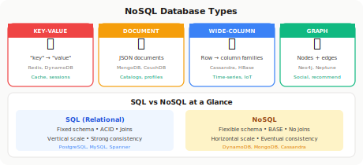
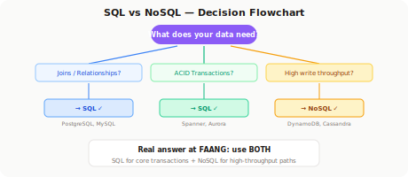
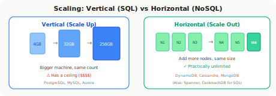

# SQL vs NoSQL

!!! danger "Real Incident: MongoDB + E-commerce, 2014"
    A startup stored orders in MongoDB. No transactions. A race condition during checkout: payment charged but order not saved. $47,000 lost in a weekend. They migrated back to PostgreSQL. **"Schemaless" means the schema is now YOUR problem.**

---

## The 30-Second Explanation

**There is no "best" database. There's only the right tool for the data shape, access patterns, and scale requirements.**

📊

<h4 style="margin: 0 0 0.5rem; color: #2563eb;">SQL (Relational)</h4>

Structured data, ACID transactions, complex queries, strong consistency

<strong>PostgreSQL, MySQL, Spanner</strong>

📄

<h4 style="margin: 0 0 0.5rem; color: #92400e;">NoSQL</h4>

Flexible schema, horizontal scale, high throughput, eventual consistency

<strong>DynamoDB, Cassandra, MongoDB</strong>

---

## Decision Framework (What FAANG Interviewers Want)

| If your data has... | Choose | Because |
|---|---|---|
| Relationships (joins needed) | **SQL** | NoSQL joins = application-level nightmare |
| ACID transactions needed | **SQL** | Money, inventory, bookings |
| Fixed schema, complex queries | **SQL** | SQL query planner >> manual indexing |
| High write throughput (100K+ wps) | **NoSQL** | Horizontal scaling without sharding pain |
| Flexible/evolving schema | **NoSQL** | No migrations, schema-per-document |
| Massive scale, simple access patterns | **NoSQL** | Designed for partition + replication |
| Time-series / event data | **NoSQL** (or specialized) | Append-heavy, range queries by time |
| Graph relationships | **Graph DB** (Neo4j) | Traversal is O(1) per hop vs O(n) joins |

---

## NoSQL Types

| Type | Data Model | Best For | Example |
|---|---|---|---|
| **Key-Value** | Simple key → value | Caching, sessions, config | Redis, DynamoDB |
| **Document** | JSON-like documents | Content, catalogs, user profiles | MongoDB, CouchDB |
| **Wide-Column** | Row key → column families | Time-series, IoT, analytics | Cassandra, HBase |
| **Graph** | Nodes + edges | Social networks, recommendations | Neo4j, Neptune |

---

## The Real Comparison

<table style="width: 100%; border-collapse: collapse;">
<thead>
<tr style="background: linear-gradient(135deg, #f8fafc, #f1f5f9);">
<th style="padding: 0.8rem; border-bottom: 2px solid #e2e8f0; text-align: left;">Aspect</th>
<th style="padding: 0.8rem; border-bottom: 2px solid #e2e8f0; text-align: left;">SQL</th>
<th style="padding: 0.8rem; border-bottom: 2px solid #e2e8f0; text-align: left;">NoSQL</th>
</tr>
</thead>
<tbody>
<tr><td style="padding: 0.7rem; border-bottom: 1px solid #f1f5f9;"><strong>Schema</strong></td><td style="padding: 0.7rem; border-bottom: 1px solid #f1f5f9;">Rigid (enforced)</td><td style="padding: 0.7rem; border-bottom: 1px solid #f1f5f9;">Flexible (schema-on-read)</td></tr>
<tr><td style="padding: 0.7rem; border-bottom: 1px solid #f1f5f9;"><strong>Scaling</strong></td><td style="padding: 0.7rem; border-bottom: 1px solid #f1f5f9;">Vertical (bigger machine) or hard sharding</td><td style="padding: 0.7rem; border-bottom: 1px solid #f1f5f9;">Horizontal (add nodes)</td></tr>
<tr><td style="padding: 0.7rem; border-bottom: 1px solid #f1f5f9;"><strong>Transactions</strong></td><td style="padding: 0.7rem; border-bottom: 1px solid #f1f5f9;">Full ACID</td><td style="padding: 0.7rem; border-bottom: 1px solid #f1f5f9;">Limited or none (varies)</td></tr>
<tr><td style="padding: 0.7rem; border-bottom: 1px solid #f1f5f9;"><strong>Consistency</strong></td><td style="padding: 0.7rem; border-bottom: 1px solid #f1f5f9;">Strong (default)</td><td style="padding: 0.7rem; border-bottom: 1px solid #f1f5f9;">Eventual (configurable)</td></tr>
<tr><td style="padding: 0.7rem; border-bottom: 1px solid #f1f5f9;"><strong>Joins</strong></td><td style="padding: 0.7rem; border-bottom: 1px solid #f1f5f9;">Native, optimized</td><td style="padding: 0.7rem; border-bottom: 1px solid #f1f5f9;">Application-level or denormalize</td></tr>
<tr><td style="padding: 0.7rem;"><strong>Query language</strong></td><td style="padding: 0.7rem;">SQL (universal)</td><td style="padding: 0.7rem;">Varies by system</td></tr>
</tbody>
</table>

---

## What FAANG Actually Uses (Both!)

| Company | SQL For | NoSQL For |
|---|---|---|
| **Google** | Spanner (global ACID) | Bigtable (analytics, search index) |
| **Amazon** | Aurora (orders, payments) | DynamoDB (cart, sessions, catalog) |
| **Netflix** | PostgreSQL (billing) | Cassandra (viewing history, 100M+ users) |
| **Uber** | PostgreSQL (trips, payments) | Custom (Schemaless) for high-write |
| **Meta** | MySQL (user data, social graph) | TAO cache + HBase (messages, analytics) |

> **Key insight for interviews:** The answer is almost always "use BOTH." SQL for transactional core, NoSQL for high-throughput read/write paths.

---

## ACID vs BASE

| | ACID (SQL) | BASE (NoSQL) |
|---|---|---|
| **A** | Atomicity | Basically Available |
| **C** | Consistency | Soft state |
| **I** | Isolation | Eventually consistent |
| **D** | Durability | — |
| **Guarantee** | All or nothing, always correct | Available even if slightly stale |
| **Best for** | Money, inventory, bookings | Feeds, analytics, sessions |

---

## Scaling Strategies

| Strategy | SQL | NoSQL |
|---|---|---|
| **Read replicas** | Master → N replicas | Built into most (Cassandra, DynamoDB) |
| **Sharding** | Hard (application-level routing) | Native (auto-partitioned) |
| **Caching** | Redis/Memcached in front | Sometimes built-in (DynamoDB DAX) |
| **Denormalization** | Painful (breaks normal forms) | Natural (store data as you query it) |

---

## The 3 Mistakes That Get You Rejected

!!! danger "Don't Say These"
    1. **"NoSQL is always faster"** — PostgreSQL with proper indexing beats unindexed MongoDB every time. Speed depends on data model + access pattern, not the label.
    2. **"SQL can't scale"** — Google Spanner is SQL and spans the globe. Amazon Aurora handles millions of transactions/sec. The scaling ceiling is very high.
    3. **"Use MongoDB for everything because it's flexible"** — Flexible schema = schema bugs in production. When you need joins, transactions, or complex queries, you'll regret it.

---

## Interview Answer Template

> "For [system], I'd use [SQL] for [transactional data: orders, payments, user accounts] because [ACID, joins, consistency]. For [high-throughput data: activity feeds, sessions, events], I'd use [NoSQL: DynamoDB/Cassandra] because [horizontal scale, flexible schema, write throughput]. The key is not SQL vs NoSQL — it's using each where its strengths match the access pattern."

---

## Quick Recall Card

| Question | Answer |
|---|---|
| When SQL? | Relationships, transactions, complex queries, strong consistency |
| When NoSQL? | Scale, flexible schema, simple access patterns, high throughput |
| Can SQL scale? | Yes (read replicas, Spanner, Aurora). Just harder to shard. |
| Does NoSQL have transactions? | Some do (MongoDB 4.0+, DynamoDB). But limited compared to SQL. |
| Most common pattern? | SQL for core + NoSQL for scale-out paths |
| ACID vs BASE? | ACID = correctness first. BASE = availability first. |
