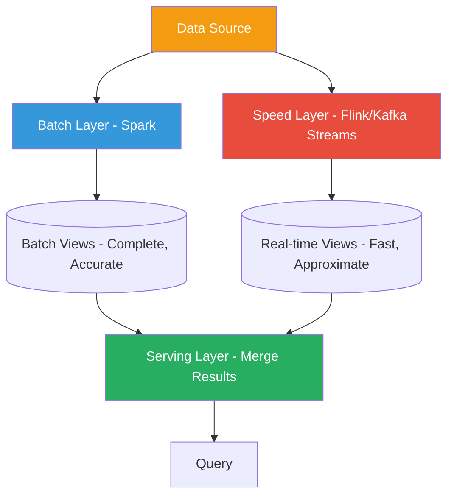
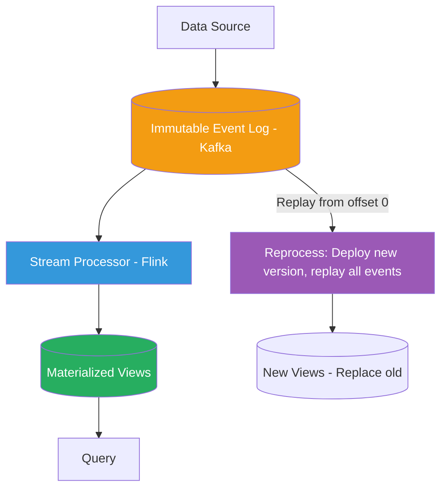

# Batch vs Stream Processing

!!! danger "Real Incident: LinkedIn Real-Time Activity Processing"
    In 2012, LinkedIn's batch-only pipeline processed user activity (profile views, connection requests, content engagement) overnight. Users posted content and waited **8-24 hours** to see engagement analytics. Feed recommendations were a day stale. They built Apache Kafka and Samza to create a unified real-time stream processing platform. The result: notifications delivered in seconds, feed personalization updated in real-time, and "Who Viewed Your Profile" went from daily email to instant push. **The shift from batch to stream reduced their data freshness from 24 hours to under 10 seconds — a 86,400x improvement.**

---

## Why This Comes Up in Interviews

Nearly every large-scale system generates data that needs processing — analytics, recommendations, fraud detection, ETL. Interviewers want to hear:

- When batch is still the right answer (it often is)
- The Lambda vs Kappa architecture debate
- Exactly-once semantics and why it's hard
- Windowing strategies for stream aggregation
- Concrete tool choices and their trade-offs

---

## Lambda Architecture

| Layer | Purpose | Tool Examples | Latency | Accuracy |
|---|---|---|---|---|
| **Batch** | Reprocess all historical data periodically | Spark, Hadoop MapReduce | Hours | Exact |
| **Speed** | Process real-time data for low-latency results | Flink, Kafka Streams, Storm | Seconds | Approximate |
| **Serving** | Merge batch + speed results for queries | Druid, Cassandra, Elasticsearch | Milliseconds | Combined |

**The promise:** Best of both worlds — accurate batch results AND real-time approximations.

**The reality:** You maintain TWO codebases computing the same thing differently. Bugs diverge. Testing doubles. Operational complexity explodes.

---

## Kappa Architecture

**Kappa simplification:** One processing path (streaming) handles both real-time AND historical reprocessing by replaying the log.

| Aspect | Lambda | Kappa |
|---|---|---|
| **Codebases** | Two (batch + stream) | One (stream only) |
| **Reprocessing** | Batch layer recomputes periodically | Replay stream from beginning |
| **Complexity** | High (maintain two systems) | Lower (one system, one logic) |
| **Correctness** | Batch corrects speed layer errors | Must get streaming right (exactly-once) |
| **Tool requirement** | Any batch + any stream tool | Stream tool must handle full replay (Kafka + Flink) |
| **Best for** | Existing batch infra, ML training pipelines | New greenfield systems, event-sourced architectures |

---

## Processing Paradigm Comparison

| Dimension | Batch | Micro-batch | Stream |
|---|---|---|---|
| **Latency** | Minutes to hours | Seconds (1-10s) | Milliseconds to seconds |
| **Throughput** | Very high (optimized for bulk) | High | High (with backpressure) |
| **Semantics** | Exact (reprocessable) | At-least-once (easy), exactly-once (harder) | Exactly-once (hardest) |
| **State** | Full dataset available | Windowed | Event-at-a-time + managed state |
| **Fault tolerance** | Restart job from beginning | Restart micro-batch | Checkpoint + replay |
| **Example tools** | Spark (batch), Hive, Presto | Spark Structured Streaming | Flink, Kafka Streams |
| **Use case** | Daily reports, ML training, ETL | Near-real-time dashboards | Fraud detection, alerting |

---

## Tool Landscape

| Tool | Type | Strengths | Weaknesses | Used By |
|---|---|---|---|---|
| **Apache Spark** | Batch + micro-batch | Unified API, SQL support, ML libraries | True streaming is micro-batch (seconds latency) | Netflix, Uber, Airbnb |
| **Apache Flink** | True stream + batch | Lowest latency, exactly-once, event-time processing | Steeper learning curve, smaller ecosystem | Alibaba, Uber, Netflix |
| **Kafka Streams** | Lightweight streaming | No separate cluster, library (runs in your app) | Limited to Kafka input/output | LinkedIn, Walmart |
| **Apache Beam** | Abstraction layer | Write once, run on Spark/Flink/Dataflow | Another abstraction = another thing to debug | Google (Dataflow) |
| **AWS Kinesis** | Managed streaming | Zero ops, auto-scaling | Vendor lock-in, limited vs Kafka | AWS-native shops |

---

## Exactly-Once Semantics — The Hard Problem

| Guarantee | What It Means | Complexity | Example Failure |
|---|---|---|---|
| **At-most-once** | Fire and forget. May lose messages. | Lowest | UDP, async fire-and-forget |
| **At-least-once** | Retry until ack. May duplicate. | Medium | Consumer crashes after processing but before committing offset |
| **Exactly-once** | Each message processed exactly once in output. | Highest | Consumer processes + commits atomically |

**Why exactly-once is hard:** Network partitions mean you can never be 100% sure if a message was processed. The receiver might have processed it but the ack was lost.

**How Flink achieves exactly-once:**

| Mechanism | How |
|---|---|
| **Checkpointing** | Periodically snapshot operator state + Kafka offsets atomically |
| **Barriers** | Inject checkpoint barriers into data stream; operators snapshot when barrier arrives |
| **Two-phase commit** | For sinks (e.g., Kafka producer): pre-commit on checkpoint, commit on checkpoint-complete |
| **Recovery** | On failure, restore latest checkpoint, replay from checkpointed Kafka offset |

**Kafka exactly-once (idempotent producer + transactions):**

- Producer ID + sequence number = broker deduplicates retries
- Transactions: atomically write to multiple partitions + commit consumer offsets
- End-to-end: consume → process → produce in a single atomic transaction

---

## Windowing Strategies

| Window Type | Description | Use Case |
|---|---|---|
| **Tumbling** | Fixed-size, non-overlapping (every 5 min) | Hourly aggregates, billing periods |
| **Sliding** | Fixed-size, overlapping (5 min window, slides every 1 min) | Moving averages, trend detection |
| **Session** | Dynamic, gap-based (closes after 30 min inactivity) | User session analytics, click streams |
| **Global** | Single window per key (entire stream) | Running totals, lifetime aggregates |

**Example — "Count clicks per user per 5-minute window":**

| Event Time | User | Tumbling [0-5) | Tumbling [5-10) | Sliding (5min, slide 1min) |
|---|---|---|---|---|
| 00:01 | Alice | Count: 1 | — | Window [00:00-00:05]: 1 |
| 00:03 | Alice | Count: 2 | — | Window [00:00-00:05]: 2 |
| 00:07 | Alice | — | Count: 1 | Window [00:03-00:08]: 2 |

---

## Watermarks — Handling Late Data

**The problem:** Events arrive out of order. An event with timestamp 10:01 arrives at 10:05. How do you know when a window is "complete"?

**Watermark:** A declaration that "no events with timestamp <= W will arrive anymore."

| Strategy | Behavior | Trade-off |
|---|---|---|
| **Strict (no late data)** | Watermark = max event time seen | Fast results, drops late events |
| **Bounded lateness** | Watermark = max event time - allowed lateness (e.g., 5 min) | Waits for late data, delays results |
| **Heuristic** | Track lateness distribution, set watermark at p99 | Adaptive, may still miss outliers |

**Late data handling (Flink/Beam):**

- **Drop:** Ignore events arriving after watermark (simplest)
- **Side output:** Route late events to a separate stream for reprocessing
- **Allowed lateness:** Keep window state open for N minutes past watermark; update results
- **Accumulating + retracting:** Emit updated result AND retraction of previous result

---

## Back-of-Envelope: Streaming Pipeline Sizing

**Scenario:** Processing 1 million events/second (e-commerce clickstream)

| Component | Sizing |
|---|---|
| Kafka brokers | 10 brokers (100K events/s each at 1KB = 100 MB/s per broker) |
| Kafka partitions | 100 partitions (10K events/s per partition) |
| Flink parallelism | 100 task slots (1 per partition for source parallelism) |
| Flink TaskManagers | 25 (4 slots each, 16 GB RAM each) |
| Checkpoint interval | 60 seconds |
| Checkpoint size | ~10 GB (windowed state across all operators) |
| State backend | RocksDB (for large state that exceeds memory) |
| End-to-end latency | <5 seconds (processing + checkpoint overhead) |

---

## When to Use What

| Scenario | Recommendation | Why |
|---|---|---|
| Daily reports / data warehouse ETL | **Batch (Spark)** | Simplicity, cost efficiency, exact results |
| ML model training | **Batch (Spark)** | Need full dataset, iterative algorithms |
| Real-time fraud detection | **Stream (Flink)** | Sub-second latency critical |
| Real-time dashboards | **Stream or micro-batch** | Depends on freshness SLA (seconds vs minutes) |
| User notifications | **Stream (Kafka Streams)** | Low-latency, event-driven, lightweight |
| Complex event processing | **Stream (Flink)** | Pattern detection, temporal joins |
| Log aggregation | **Either** | Batch for cost, stream for real-time alerting |
| Recommendation engine | **Lambda** | Batch for model, stream for real-time features |

---

## Interview Framework

**When data processing comes up in system design:**

> **Step 1:** "First, I'd clarify the latency requirement. If results can be minutes/hours stale, batch (Spark) is simpler, cheaper, and gives exact results. If sub-second freshness is needed, we need stream processing."
>
> **Step 2:** "For streaming, I'd use Flink with Kafka as the message bus. Flink gives us exactly-once semantics via checkpointing and handles event-time processing with watermarks for out-of-order data."
>
> **Step 3:** "For windowed aggregations, I'd use [tumbling/sliding/session] windows depending on the use case. I'd set watermarks with 5-minute allowed lateness and route truly late events to a side output for batch correction."
>
> **Step 4:** "For architecture, I'd start with Kappa (stream-only) for simplicity — one codebase, replay from Kafka for reprocessing. If we later need heavy batch ML training, we might add a batch layer (Lambda) for that specific use case."
>
> **Step 5:** "Exactly-once guarantee: Kafka idempotent producers + Flink checkpoints + transactional sinks ensure no duplicates or data loss end-to-end."

---

## Quick Recall

| Question | Answer |
|---|---|
| Lambda vs Kappa? | Lambda: batch + stream layers (two codebases). Kappa: stream-only (replay for reprocessing). |
| When is batch still better? | Daily ETL, ML training, exact results needed, cost-sensitive |
| Exactly-once how? | Checkpoint state + Kafka offsets atomically; two-phase commit to sinks |
| Watermark purpose? | Declare "no more events before time W" — triggers window computation |
| Tumbling vs sliding? | Tumbling: non-overlapping fixed windows. Sliding: overlapping (window > slide). |
| Flink vs Kafka Streams? | Flink: full cluster, complex processing. KStreams: library, simpler, Kafka-only. |
| Session window? | Dynamic window that closes after inactivity gap (e.g., 30 min no events) |
| LinkedIn's improvement? | 24-hour batch delay reduced to <10 second streaming with Kafka + Samza |
