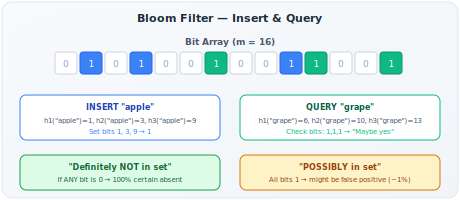

# Bloom Filters

!!! danger "Real Incident: Google Chrome Safe Browsing"
    Chrome checks every URL against millions of known malicious sites. Full list = 1GB+. Remote API call = latency on every click. Solution: a **25MB Bloom filter stored locally**. 99.99% of URLs get instant "definitely safe" response. Only the 0.01% "maybe unsafe" goes to the remote API. **2 billion Chrome users, near-zero latency, near-zero false negatives.**

---

## Why This Comes Up in Interviews

Bloom filters appear when you need to answer "is X in this large set?" at extreme scale with minimal memory. If you mention any of these in a design interview, the interviewer may ask about Bloom filters:

- "How do you avoid unnecessary database lookups?" → Bloom filter
- "How do you deduplicate at scale?" → Bloom filter
- "How do you check if a username exists without hitting the DB?" → Bloom filter
- "How does Cassandra avoid reading SSTables that don't contain a key?" → Bloom filter

---

## The Core Idea

**A Bloom filter trades a small, controlled false positive rate for massive memory savings.**

| Operation | Bloom Filter Answer | Meaning |
|---|---|---|
| `query("X")` → **NO** | "Definitely NOT in the set" | 100% certain. Skip the lookup. |
| `query("X")` → **YES** | "POSSIBLY in the set" | ~1% chance it's wrong (configurable). Do the actual check. |

**No false negatives. Ever.** If the filter says "no," the element was absolutely never inserted. This is the guarantee that makes it useful.

---

## How It Works — Step by Step



**Data structure:** A bit array of m bits, all initialized to 0. Plus k hash functions.

**Insert(element):**

1. Compute k hash values: h₁(element), h₂(element), ..., hₖ(element)
2. Each hash gives a position in the bit array (mod m)
3. Set all k positions to 1

**Query(element):**

1. Compute same k hashes: h₁(element), h₂(element), ..., hₖ(element)
2. Check all k positions
3. If ANY position is 0 → **definitely not in set** (if it was inserted, all k would be 1)
4. If ALL positions are 1 → **possibly in set** (those bits might have been set by OTHER insertions)

**Why false positives occur:** Different elements can set overlapping bits. After many insertions, enough bits are 1 that a query might find all k bits set by coincidence.

---

## The Math — Sizing a Bloom Filter

**Given:** n items to store, desired false positive rate p.

| Parameter | Formula | Meaning |
|---|---|---|
| **m (bits needed)** | m = -n × ln(p) / (ln2)² | More items or lower FP = more bits |
| **k (optimal hash functions)** | k = (m/n) × ln2 | Balances between too few and too many |
| **Fill ratio** | After n insertions, ~50% of bits are 1 (at optimal k) | Healthy filter |

**Practical numbers:**

| Items (n) | FP Rate (p) | Bits (m) | Memory | Hash Functions (k) |
|---|---|---|---|---|
| 1 million | 1% | 9.6M bits | 1.2 MB | 7 |
| 1 million | 0.1% | 14.4M bits | 1.8 MB | 10 |
| 1 billion | 1% | 9.6B bits | 1.2 GB | 7 |
| 1 billion | 0.1% | 14.4B bits | 1.8 GB | 10 |

**Comparison with exact data structures:**

| 1 million items | Bloom Filter (1% FP) | HashSet | Sorted Array |
|---|---|---|---|
| Memory | ~1.2 MB | ~40 MB | ~8 MB |
| Lookup time | O(k) = O(1) | O(1) | O(log n) |
| False positives | ~1% | 0% | 0% |
| **Memory savings** | **~33x less than HashSet** | Baseline | ~5x less |

---

## Back-of-Envelope Examples

### Example 1: Duplicate URL Detection for Web Crawler

**Problem:** Crawling 10 billion URLs. Don't recrawl visited URLs.

| Approach | Memory | Accuracy |
|---|---|---|
| HashSet (URLs in memory) | ~400 GB (40 bytes × 10B) | Exact |
| Bloom filter (1% FP) | ~12 GB | 99% accurate (1% recrawl — acceptable) |
| On-disk database | Unlimited | Exact but slow (disk I/O per check) |

**Verdict:** Bloom filter saves 388 GB of RAM at cost of 1% unnecessary recrawls.

### Example 2: Username Availability Check

**Problem:** 500M registered usernames. Check if "cooluser123" is taken.

| Approach | Latency | Cost |
|---|---|---|
| DB query every time | 5-10ms | High DB load |
| Redis set | <1ms but 20GB RAM | Expensive |
| Bloom filter (0.1% FP) | <0.1ms, 900 MB | Cheap |

**Flow:**
1. User types "cooluser123"
2. Check Bloom filter (local/cached): "Definitely available" → show green checkmark immediately
3. OR: "Maybe taken" → query DB to confirm (0.1% of cases)
4. On signup, add to Bloom filter + DB

---

## Where Real Systems Use Bloom Filters

| System | Use Case | Why | FP Handling |
|---|---|---|---|
| **Google Bigtable** | Skip SSTables that don't have a key | Avoid expensive disk reads (each SSTable has its own Bloom filter) | FP = one unnecessary disk read (acceptable) |
| **Apache Cassandra** | Check if SSTable might contain requested key | SSTables are immutable → perfect for Bloom filter (never delete) | FP = extra disk seek |
| **HBase** | Same as Cassandra | LSM-tree architecture | Same |
| **Chrome Safe Browsing** | Check URL against malicious list | 25MB local vs 1GB+ full list, instant response | FP = remote API call (rare) |
| **Medium** | Don't recommend articles user already saw | Set of already-shown article IDs per user | FP = user misses one article (harmless) |
| **Akamai CDN** | "One-hit-wonder" filter | Don't cache content accessed only once | FP = cache rarely-accessed item (minor waste) |
| **Bitcoin SPV** | Filter transactions relevant to wallet | Light nodes don't download full blockchain | FP = download irrelevant transaction |
| **Postgres (contrib)** | Lossy index scans | Skip heap pages that can't contain match | FP = check page that has no match |

---

## Limitations and Solutions

| Limitation | Problem | Solution |
|---|---|---|
| **Can't delete** | Clearing a bit might affect other elements | **Counting Bloom Filter** — use counters instead of bits |
| **Fixed capacity** | FP rate degrades as filter fills beyond n | **Scalable Bloom Filter** — chain multiple filters |
| **Can't enumerate** | Can't list what's in the set | Pair with a real set for retrieval |
| **No update** | Can only add, never modify | Rebuild periodically |
| **Size fixed at creation** | Must estimate n upfront | Over-estimate by 2x for safety |

### Counting Bloom Filter

Instead of 1-bit per position, use 4-bit counter:

- Insert: increment k positions
- Delete: decrement k positions
- Query: all k positions > 0 → "maybe yes"

**Trade-off:** 4x memory (4 bits vs 1 bit per position) but supports deletion.

### Cuckoo Filter (Alternative)

| Aspect | Bloom Filter | Cuckoo Filter |
|---|---|---|
| Deletion | No | Yes |
| Space (at same FP rate) | Baseline | ~15% less |
| Insertion | Always succeeds | Can fail (when full) |
| Performance | k hash lookups | 2 lookups |
| Complexity | Simple | More complex |

---

## Bloom Filter in System Design Patterns

### Pattern 1: Guard Before Expensive Operation

```
Request → [Bloom Filter] → "Definitely not" → Skip (fast path, 99% of cases)
                         → "Maybe yes" → [DB/API lookup] → Confirm (slow path, 1%)
```

**Use cases:** Cache miss reduction, duplicate detection, existence checks.

### Pattern 2: One-Hit-Wonder Filter (Akamai)

**Problem:** Most web content is accessed once and never again. Caching it wastes space.

**Solution:** Only cache on SECOND access:
1. First request → check Bloom filter → not seen → add to Bloom filter, serve from origin
2. Second request → check Bloom filter → "maybe seen before" → NOW cache it

**Result:** Cache only contains repeatedly-accessed content. Hit rate improves significantly.

### Pattern 3: Distributed Deduplication

**Problem:** 100 worker nodes processing events. Ensure no event processed twice.

**Solution:** Each worker has local Bloom filter of processed event IDs. Centralized Bloom filter for global dedup (periodically synced).

---

## Interview Framework

**When asked "How do you efficiently check if X exists in a large set?":**

> **Step 1 — Identify the scale:** "We have [N] items. Storing all in memory would take [X] GB. We can tolerate [P%] false positives because [reason — e.g., worst case is an extra DB lookup]."
>
> **Step 2 — Propose Bloom filter:** "A Bloom filter with [N] items at [P%] FP rate needs [M] MB — a [Y]x reduction in memory."
>
> **Step 3 — Describe the flow:** "On query: check Bloom filter first. If 'definitely not' → fast return (99% of cases). If 'maybe' → do the actual lookup (1% of cases)."
>
> **Step 4 — Address deletion:** "Standard Bloom filters don't support deletion. If we need that, I'd use a Counting Bloom Filter (4x space) or rebuild periodically."
>
> **Step 5 — Size calculation:** "For [N] items at [P%] FP: m = -N × ln(P) / (ln2)² ≈ [value]. That's [X] MB."

---

## Quick Recall

| Question | Answer |
|---|---|
| What guarantee? | "Definitely NOT in set" = 100% certain. "Maybe in set" = configurable FP rate. |
| False negatives? | NEVER. If it says no, it's absolutely no. |
| Memory savings? | ~30x less than HashSet for same data at 1% FP |
| Formula for size? | m = -n × ln(p) / (ln2)² |
| Optimal hash functions? | k = (m/n) × ln2 |
| Can you delete? | No (standard). Yes (counting variant, 4x memory). |
| Best use case? | Skip expensive lookups for non-existent keys (DB, disk, network) |
| Real examples? | Cassandra SSTable lookup, Chrome Safe Browsing, Akamai CDN |
| When NOT to use? | When false positives are unacceptable (security decisions, financial) |
