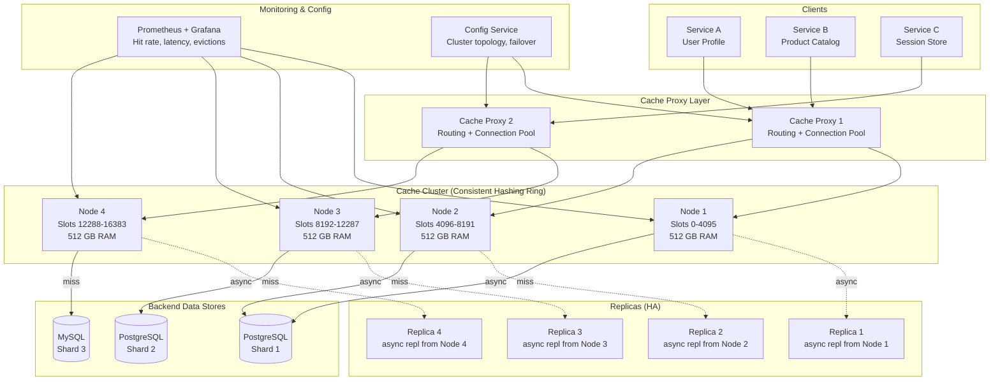
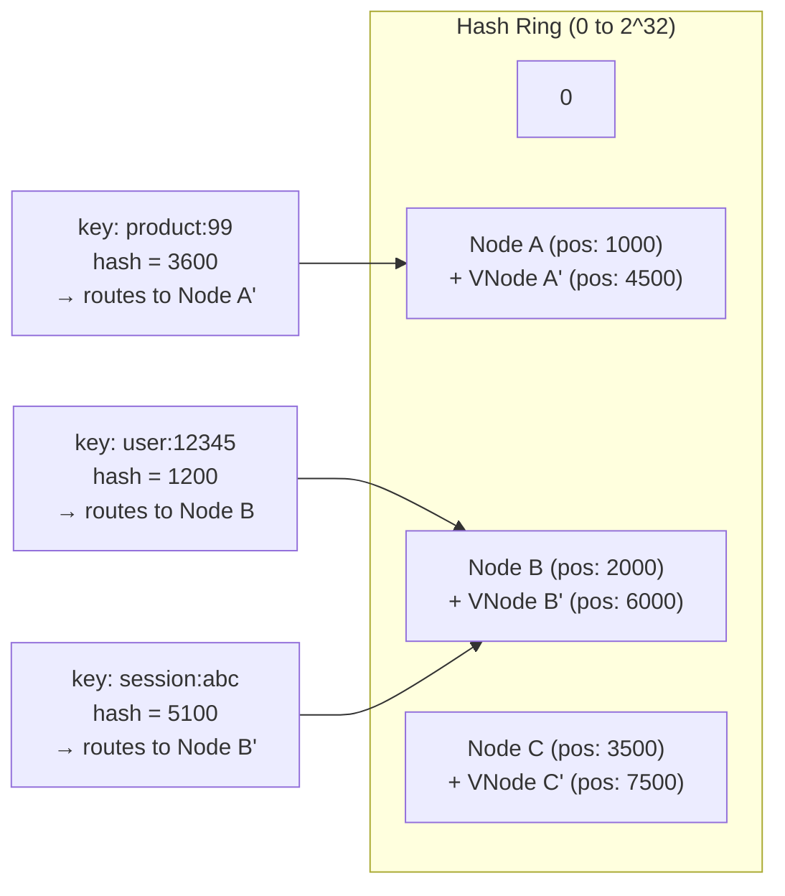

# Distributed Cache (Redis / Memcached)

!!! danger "Real Incident: Facebook Memcached Thundering Herd, 2010"
    Facebook's Memcached cluster served billions of requests per day. When a single popular cache key expired, hundreds of application servers simultaneously detected the miss and all queried the backend database for the same row — a **thundering herd**. The database shard handling that key was overwhelmed within milliseconds, triggering cascading timeouts across the entire request path. The outage lasted 2.5 hours and affected 500M+ users. The fix: a lease-based mechanism where only ONE server is allowed to regenerate a cache entry while others wait or serve stale data. **A distributed cache is the backbone of every large-scale system — its failure modes ARE the system's failure modes.**

---

## System Design Concepts Used

`Consistent Hashing` · `LRU / LFU Eviction` · `Cache-Aside Pattern` · `Write-Through / Write-Behind` · `Replication` · `Sharding` · `Thundering Herd Protection` · `Hot Key Mitigation` · `TTL Management` · `Gossip Protocol` · `Hash Slots (Redis Cluster)` · `Probabilistic Early Expiration`

---

## 1. Functional Requirements

1. **GET** — retrieve a value by key with sub-millisecond latency
2. **SET** — store a key-value pair with optional TTL
3. **DELETE** — explicitly invalidate a cached entry
4. **Bulk operations** — MGET/MSET for batch access (reduce round trips)
5. **Atomic operations** — increment/decrement, compare-and-swap (CAS)
6. **Eviction** — automatically remove entries when memory is full (LRU, LFU, or TTL-based)
7. **Pub/Sub notifications** — notify clients of key invalidation events

## 2. Non-Functional Requirements

| Requirement | Target | Rationale |
|---|---|---|
| **Read throughput** | 10M ops/sec cluster-wide | Backend databases cannot handle this load directly |
| **Write throughput** | 1M ops/sec cluster-wide | High-velocity writes for session stores, counters |
| **Read latency** | < 1ms p99 (within region) | Cache exists to be faster than any alternative |
| **Availability** | 99.99% (< 52 min/year) | Cache unavailability = database overload = cascading failure |
| **Data size** | 100 TB across cluster | Must scale horizontally as data grows |
| **Consistency** | Eventual (last-write-wins) | Strong consistency too expensive for cache; stale reads acceptable |
| **Partition tolerance** | Must survive network splits | Nodes in different racks/AZs will experience partitions |

---

## 3. Capacity Estimation

```text
/* --- NAPKIN MATH: Cluster Sizing --- */
Cluster-wide read QPS: 10,000,000 ops/sec
Cluster-wide write QPS: 1,000,000 ops/sec
Total QPS: 11M ops/sec

/* --- PER-NODE CAPACITY (Redis single-threaded) --- */
Single Redis node: ~100K ops/sec (with pipeline: ~500K)
Nodes needed for reads: 10M / 100K = 100 nodes (no pipelining)
With pipelining + io-threads: 10M / 300K = ~34 nodes
Safety margin (2x): 68 read-serving nodes

/* --- MEMORY --- */
Total data: 100 TB
Average value size: 1 KB
Average key size: 50 bytes
Entries: 100 TB / 1 KB = 100 billion entries
Per-node memory (100 nodes): 100 TB / 100 = 1 TB per node
Redis overhead (~2x raw data): need 2 TB RAM per node? Too expensive.
Better: 200 nodes × 512 GB RAM = 100 TB addressable

/* --- NETWORK BANDWIDTH --- */
Read bandwidth: 10M × 1 KB = 10 GB/sec cluster-wide
Per node (200 nodes): 50 MB/sec (well within 10 Gbps NIC)

/* --- REPLICATION OVERHEAD --- */
Replication factor: 2 (1 primary + 1 replica)
Total nodes: 200 primaries + 200 replicas = 400 nodes
Total RAM: 400 × 512 GB = 200 TB raw capacity (100 TB usable)

/* --- HOT KEY CONSIDERATION --- */
Power law: 1% of keys serve 30% of traffic
Hottest 1M keys: 30% × 10M = 3M ops/sec
Single node cannot handle 3M ops/sec → need hot key replication
```

!!! note "System Nature"
    **Extremely latency-sensitive.** Every microsecond counts. The entire architecture is optimized for memory-speed access with minimal network hops. A cache that is slow is worse than no cache — it adds latency without reducing database load.

---

## 4. "Why X, Not Y?" — Tradeoff Analysis

### Why Redis and not Memcached?

**Redis wins for most use cases because it offers data structures (hashes, sorted sets, lists), persistence (RDB/AOF), replication, and Lua scripting.** A session store needs hash fields. A leaderboard needs sorted sets. A rate limiter needs atomic Lua scripts. Redis provides all of these natively, eliminating application-layer complexity.

*Memcached advantage:* Multi-threaded architecture delivers higher throughput per node for pure key-value workloads. Facebook serves 5 billion requests/sec on Memcached because they only need `GET key → blob`. If your access pattern is strictly `GET/SET` with large values (>100 KB), Memcached's slab allocator avoids memory fragmentation better than Redis's jemalloc.

### Why consistent hashing and not hash slots (Redis Cluster)?

**Hash slots (Redis Cluster's 16,384 fixed slots) simplify resharding — you move discrete slot ranges between nodes rather than rebalancing a hash ring.** Slots are deterministic: any client can compute `CRC16(key) mod 16384` and know exactly which node owns it. No need for a centralized ring metadata service.

*Consistent hashing advantage:* More flexible weight distribution (virtual nodes), easier heterogeneous hardware support, and better for custom implementations where you control the routing layer (like Memcached with mcrouter). Consistent hashing is the interview-friendly answer; hash slots are what Redis actually uses.

### Why write-behind and not write-through for the database sync?

**Write-behind (write-back) decouples cache writes from database writes, giving sub-millisecond write latency.** Writes go to cache immediately; a background process asynchronously flushes to the database in batches. This is critical at 1M writes/sec — the database cannot sustain synchronous writes at that rate.

*Write-through advantage:* Guarantees cache and database are always consistent. Every write goes to both synchronously. Use when data loss is unacceptable (financial transactions). The trade-off: write latency increases to database latency (5-20ms), and the database must handle 1M writes/sec — requiring significant sharding.

### Why LRU eviction and not LFU?

**LRU (Least Recently Used) is simpler, has lower overhead (just a timestamp per entry), and works well for most access patterns.** Redis's approximated LRU samples 5 random keys and evicts the oldest — O(1) per eviction with no frequency counter overhead.

*LFU advantage:* Better for scan-resistant caching. A single full-table scan with LRU pollutes the entire cache with one-time-access keys, evicting genuinely popular entries. LFU tracks access frequency, so a key accessed 10,000 times survives even if not accessed in the last minute. Use LFU for CDN-like patterns where popularity is stable over hours.

---

## 5. High-Level Architecture



### Component Descriptions

**Cache Proxy Layer (mcrouter / Envoy / Twemproxy):** Sits between application services and cache nodes. Maintains persistent connection pools to all cache nodes, performs consistent hashing to route keys to the correct shard, handles automatic failover when a node becomes unreachable, and supports request coalescing (deduplication of identical in-flight requests).

**Cache Nodes (Primary Shards):** Each node owns a range of the hash space and stores key-value pairs entirely in RAM. Executes GET/SET/DEL operations in O(1). Runs eviction when memory pressure exceeds the configured `maxmemory` threshold. Single-threaded command execution ensures atomicity without locks.

**Replica Nodes:** Receive asynchronous replication streams from their primary. Serve read traffic to offload primaries (read replicas). Automatically promote to primary if the original primary fails (sentinel/cluster manager handles election).

**Config Service (ZooKeeper / etcd / Redis Sentinel):** Maintains the authoritative cluster topology — which nodes own which slots, which replicas map to which primaries. Detects node failures via heartbeats and orchestrates failover (replica promotion, slot reassignment). Publishes topology changes to proxy layers.

**Monitoring (Prometheus + Grafana):** Tracks hit rate, miss rate, eviction rate, memory utilization, replication lag, and p99 latency per node. Alerts on anomalies: hit rate drop > 5% (indicates cache pollution), eviction spike (memory pressure), replication lag > 1s (risk of data loss on failover).

---

## 6. Consistent Hashing Ring



**How it works:**

1. Each physical node is placed at multiple positions on a circular hash ring (virtual nodes). A 200-node cluster with 150 virtual nodes each = 30,000 points on the ring.
2. To find which node owns a key: hash the key, walk clockwise on the ring until you hit the first node position. That node owns the key.
3. When a node is added: it takes ownership of keys between its position and the previous node. Only ~1/N of keys are redistributed (where N = total nodes).
4. When a node is removed: its keys are redistributed to the next clockwise node. Again, only ~1/N of keys move.
5. Virtual nodes ensure even distribution — without them, 3 nodes could end up owning 10%, 60%, and 30% of the ring due to hash randomness.

---

## 7. Architecture Flow — A Cache Read for `user:12345`

**Service A** needs the profile for user 12345 to render a dashboard.

### Flow 1: Cache Hit (Happy Path)

**T+0.0ms:** Service A calls `cache.get("user:12345")`. The client library computes `CRC16("user:12345") mod 16384 = slot 7291`. Slot 7291 maps to Node 3 (slots 8192-12287? No — slot 7291 maps to Node 2: slots 4096-8191).

**T+0.1ms:** Client sends `GET user:12345` to Node 2 over a pre-established TCP connection (connection pool, no handshake).

**T+0.2ms:** Node 2 looks up the key in its hash table — O(1) lookup. The entry exists with 14 minutes remaining TTL. Node 2 updates the LRU access timestamp.

**T+0.3ms:** Node 2 returns the serialized JSON blob (800 bytes) to Service A.

```text
Service A → hash("user:12345") → Node 2 → HIT (0.3ms total)
```

### Flow 2: Cache Miss (Cold Key)

**T+0.0ms:** Same routing. `GET user:12345` reaches Node 2.

**T+0.2ms:** Node 2 returns `nil` — key not found (expired 2 hours ago, evicted by LRU).

**T+0.3ms:** Service A detects the miss. It acquires a **distributed lock** (`SET user:12345:lock NX EX 5`) to prevent thundering herd — only one caller regenerates the cache.

**T+0.5ms:** Lock acquired. Service A queries PostgreSQL: `SELECT * FROM users WHERE id = 12345`. Database responds in 4ms.

**T+4.5ms:** Service A writes the result back to cache: `SET user:12345 <json> EX 3600` (1-hour TTL).

**T+4.7ms:** Service A returns the profile to the caller.

**T+4.7ms (parallel):** Other Service A instances that also missed now retry the cache — this time it is a HIT. The lock prevented 50 simultaneous database queries.

```text
Service A → Node 2 (MISS) → acquire lock → PostgreSQL (4ms) → SET to cache → return (4.7ms)
Other instances → Node 2 (HIT after 4.7ms) → return (0.3ms)
```

### Flow 3: Cache Write (Profile Update)

**T+0.0ms:** User updates their bio. The Profile Service writes to PostgreSQL first (source of truth).

**T+5ms:** PostgreSQL confirms the write.

**T+5.1ms:** Profile Service invalidates the cache: `DEL user:12345`. (Cache-aside pattern: delete on write, let the next read repopulate.)

**T+5.2ms:** Alternatively, with write-through: `SET user:12345 <new_json> EX 3600` — update cache immediately so the next read is guaranteed fresh.

```text
Profile Service → PostgreSQL (write, 5ms) → DEL cache key → done
                                          or → SET cache key (write-through)
```

!!! tip "Why DEL instead of SET on writes?"
    **DEL (invalidate) is safer than SET (update) in cache-aside.** If Service A and Service B both update the same user concurrently, with SET you risk a stale write overwriting a fresh one (race condition). With DEL, the next reader always fetches the latest from the database. The cost: one extra cache miss after every write — acceptable when the read-write ratio is 10:1.

### Flow 4: Multi-Region Cache Sync

A user in Tokyo updates their profile. Users in New York must eventually see the update.

**T+0ms (Tokyo):** Write hits Tokyo PostgreSQL primary. Confirmed at T+5ms.

**T+5.1ms (Tokyo):** Tokyo cache cluster: `DEL user:12345`. Tokyo readers will repopulate from local DB.

**T+5.2ms (Tokyo):** Invalidation event published to cross-region message bus (Kafka MirrorMaker / AWS EventBridge).

**T+80ms (New York):** Invalidation event arrives at New York consumer. Consumer issues `DEL user:12345` to the New York cache cluster.

**T+80.5ms (New York):** Next read in New York misses cache, queries local read replica of PostgreSQL (which received the write via async replication at ~T+50ms). Fresh data is now served.

```text
Tokyo write → Tokyo cache DEL → Kafka cross-region (80ms) → NY cache DEL → NY read repopulates
```

**Window of staleness:** Between T+5ms (Tokyo invalidated) and T+80ms (New York invalidated), New York serves stale data. This 75ms window is acceptable for user profiles. For financial data, use synchronous cross-region invalidation (at the cost of write latency: 80ms added to every write).

---

## 8. Failure & Recovery Scenarios

### Node Crash (Primary Dies)

**Impact:** All keys owned by that node are temporarily unavailable. At 200 nodes, this affects 0.5% of the key space.

**Detection:** Sentinel/cluster manager detects no heartbeat for 3 consecutive checks (default: 3 x 1s = 3s).

**Recovery:** Replica promotes to primary in <5 seconds. Proxy layer updates its routing table. During the 3-5s gap, reads to this shard return misses — application falls through to the database. Because only 0.5% of keys are affected, the database sees a modest spike (50K extra QPS for 5 seconds), not a meltdown.

**Data loss:** Asynchronous replication means 0-2 seconds of writes may be lost on failover. For a cache, this is acceptable — the data exists in the source-of-truth database.

### Network Partition (Split Brain)

**Impact:** Clients connected to the minority partition continue writing to a node that is no longer authoritative. After the partition heals, those writes are lost.

**Mitigation:** Configure `min-replicas-to-write 1` — a primary refuses writes if it cannot reach at least one replica. This prevents the minority-side primary from accepting writes during a split. Clients receive errors and must fall through to the database.

### Thundering Herd (Hot Key Expires)

**Impact:** A cache key serving 100K reads/sec expires. All 100K requests simultaneously miss and hit the database.

**Mitigation stack (layered):**

1. **Lock-based protection:** Only one caller regenerates; others wait or serve stale.
2. **Probabilistic early expiration:** Each read recomputes whether to refresh early: `if (TTL_remaining < random() * BETA * compute_time)` then refresh proactively before actual expiry.
3. **Stale-while-revalidate:** Return the expired value immediately while one background thread refreshes it asynchronously.

### Hot Key Problem (Single Key Overloads One Node)

**Impact:** A celebrity's profile cached as `user:celebrity_123` receives 500K reads/sec — far beyond what a single node can handle (~100K ops/sec).

**Mitigation:**

1. **Local caching (L1):** Application servers cache the hottest 1,000 keys in process memory (10ms TTL). 90% of reads never leave the application.
2. **Key replication across shards:** Replicate hot keys to all N nodes with a suffix: `user:celebrity_123:shard1`, `user:celebrity_123:shard2`, etc. Client randomly picks a shard per request, distributing load.
3. **Read from replicas:** Route reads for detected hot keys to replica nodes, spreading load across primary + replicas.

### Cascading Failure (Cache Layer Completely Down)

**Impact:** Database receives 10M reads/sec — 100x its capacity. Total system failure within seconds.

**Mitigation:**

1. **Circuit breaker:** When cache error rate > 50%, immediately start returning cached stale data or degraded responses instead of hammering the database.
2. **Request shedding:** Load balancer drops excess traffic with `503 Service Unavailable` to protect the database.
3. **Warm-up strategy:** When bringing cache nodes back online, gradually shift traffic using weighted routing (10% → 25% → 50% → 100%) to avoid cold-cache stampede.

---

## 9. Data Model

### Key Structure Conventions

```text
/* --- KEY NAMING PATTERN: {entity}:{id}:{field} --- */

user:12345                    → full serialized user profile (JSON, 1-2 KB)
user:12345:settings           → user preferences subset (200 bytes)
session:abc-def-ghi           → session data (auth token, cart, 500 bytes)
product:99:inventory          → stock count (integer, 8 bytes)
rate:api_key_xyz:minute       → request count in current minute window
leaderboard:game42            → sorted set of player scores

/* --- TTL STRATEGY --- */
User profiles:    TTL = 1 hour    (changes infrequently)
Session data:     TTL = 30 min    (must expire for security)
Product inventory: TTL = 30 sec   (changes frequently, staleness = oversell)
Rate limit counters: TTL = 60 sec (window-aligned, auto-cleanup)
```

### Eviction Policies

| Policy | When to Use | Trade-off |
|---|---|---|
| **allkeys-lru** | General purpose (most common) | Simple, good default. Scan-vulnerable. |
| **allkeys-lfu** | Stable popularity distribution (CDN) | Better hit rate. Higher memory overhead (frequency counter per key). |
| **volatile-lru** | Mix of permanent + expirable keys | Only evicts keys with TTL set. Permanent keys are safe. |
| **volatile-ttl** | Evict soonest-to-expire first | Good when TTL correlates with importance (short TTL = disposable). |
| **noeviction** | Cache must never lose data (session store) | Returns errors when full. Requires careful capacity planning. |

### Memory Layout (Redis)

```text
/* --- PER-KEY OVERHEAD IN REDIS --- */
Key pointer:          8 bytes
Value pointer:        8 bytes
Expire pointer:       8 bytes (if TTL set)
LRU clock:            3 bytes
Ref count:            4 bytes
dictEntry overhead:   ~70 bytes total per key-value pair

/* --- EXAMPLE CALCULATION --- */
100 billion keys × 70 bytes overhead = 7 TB just for metadata
+ 100 billion × (50 byte key + 1 KB value) = ~100 TB for actual data
Total: ~107 TB across 400 nodes (267 GB/node)
Fits in 512 GB RAM nodes with room for fragmentation
```

---

## 10. Algorithms Under the Hood

### Consistent Hashing with Virtual Nodes

```text
/* --- HASH RING IMPLEMENTATION --- */
RING_SIZE = 2^32 (4 billion positions)
VNODES_PER_NODE = 150

function add_node(node):
    for i in 0..VNODES_PER_NODE:
        position = hash(node.id + ":" + i) % RING_SIZE
        ring.insert(position, node)   // sorted tree (TreeMap)

function remove_node(node):
    for i in 0..VNODES_PER_NODE:
        position = hash(node.id + ":" + i) % RING_SIZE
        ring.remove(position)

function get_node(key):
    position = hash(key) % RING_SIZE
    // Walk clockwise: find first node position >= key position
    entry = ring.ceiling(position)
    if entry == null:
        entry = ring.first()   // wrap around
    return entry.node

/* --- KEY REDISTRIBUTION ON NODE ADD --- */
// Adding Node D between Node B (pos 2000) and Node C (pos 3500):
// Node D takes position 2800.
// Keys with hash in [2001, 2800] move from Node C → Node D.
// Only ~1/N of total keys move (N = number of nodes).
```

### Approximated LRU Eviction (Redis Implementation)

```text
/* --- REDIS APPROXIMATED LRU --- */
// Redis does NOT maintain a true LRU linked list (too expensive).
// Instead: sample K random keys, evict the one with oldest access time.

function evict():
    candidates = random_sample(all_keys, K=5)  // default sample size
    oldest = candidates.min_by(key -> key.last_access_time)
    delete(oldest)

// Why approximated? True LRU requires O(N) linked list operations.
// With K=10 samples, approximated LRU achieves ~95% of true LRU hit rate
// at O(1) cost per eviction.

/* --- LRU CLOCK (24-bit) --- */
// Each key stores a 24-bit timestamp (seconds resolution, wraps every 194 days)
// On access: key.lru_clock = server.lru_clock (global clock updated each second)
// On eviction: idle_time = server.lru_clock - key.lru_clock
//              → evict key with largest idle_time among samples
```

### Cache-Aside Pattern (Application-Level)

```text
/* --- READ PATH --- */
function get(key):
    value = cache.GET(key)
    if value != null:
        return value                     // HIT: 0.3ms

    // MISS: fetch from source of truth
    value = database.query(key)          // 5-20ms
    if value != null:
        cache.SET(key, value, EX=3600)   // populate cache
    return value

/* --- WRITE PATH (Invalidate on Write) --- */
function update(key, new_value):
    database.write(key, new_value)       // source of truth first
    cache.DEL(key)                       // invalidate cache
    // Next read will repopulate from fresh DB data
```

### Write-Through Pattern

```text
/* --- WRITE-THROUGH: cache is always fresh --- */
function update(key, new_value):
    cache.SET(key, new_value, EX=3600)   // update cache first (fast)
    database.write(key, new_value)       // then persist (slower)
    // If DB write fails: cache has stale data → need compensation logic
    // Mitigation: wrap in a transaction or use outbox pattern
```

### Write-Behind (Write-Back) Pattern

```text
/* --- WRITE-BEHIND: async DB persistence --- */
function update(key, new_value):
    cache.SET(key, new_value, EX=3600)   // fast: only cache write
    write_queue.enqueue(key, new_value)  // buffer for async flush
    return SUCCESS                        // immediate response to client

// Background flusher (runs every 100ms or when queue > 1000 entries)
function flush():
    batch = write_queue.drain(max=1000)
    database.batch_write(batch)          // single round-trip for many writes
    // Risk: data loss if cache node crashes before flush
    // Mitigation: replicate the write queue OR use AOF persistence
```

### Probabilistic Early Expiration (Thundering Herd Prevention)

```text
/* --- XFetch Algorithm (Vattani et al., 2015) --- */
function get_with_early_refresh(key):
    value, ttl_remaining, compute_time = cache.GET_WITH_META(key)

    if value == null:
        return fetch_and_cache(key)      // true miss

    // Probabilistically refresh BEFORE expiry
    BETA = 1.0  // tuning parameter (higher = earlier refresh)
    random_threshold = compute_time * BETA * log(random())
    if ttl_remaining + random_threshold <= 0:
        // This request "volunteers" to refresh
        async { fetch_and_cache(key) }

    return value  // serve current (soon-to-expire) value immediately

// Effect: as TTL approaches 0, probability of refresh increases.
// One random request refreshes the key ~10s before expiry.
// Other requests never see the miss. No thundering herd.
```

---

## 11. Scaling Considerations

| Challenge | Solution | Numbers |
|---|---|---|
| Single node throughput limit | Shard across N nodes via consistent hashing | 200 nodes × 100K ops = 20M ops/sec capacity |
| Hot key overwhelms one shard | L1 local cache + key replication across shards | Celebrity key: 500K ops/sec → spread to 10 nodes = 50K each |
| Memory growth beyond single machine | Horizontal sharding (add nodes, rebalance ~1/N keys) | Add 10 nodes to 200-node cluster: only 5% of keys move |
| Cross-region latency | Regional cache clusters with async replication | us-east: 0.3ms, cross-region: 80ms → local clusters eliminate cross-region reads |
| Replication lag on failover | Semi-synchronous replication for critical data | Accept 0-1s data loss on failover for cache (source of truth is DB) |
| Cache warming after deploy | Pre-warm from database on startup; shadow traffic routing | New node warm-up: 10 min at 50% traffic before full promotion |
| Memory fragmentation | jemalloc allocator, periodic `MEMORY PURGE`, active defrag | Keep fragmentation ratio < 1.5 via `activedefrag yes` |
| Large value serialization | Compress values > 1 KB (LZ4: 3x compression, <0.1ms overhead) | 100 TB → 35 TB effective storage with compression |
| Connection storm on restart | Connection pooling at proxy layer (Twemproxy: 100 clients → 1 conn per shard) | 10,000 app servers × 200 shards = 2M connections → proxy reduces to 200 |
| Uneven data distribution | Weighted virtual nodes (more vnodes for larger machines) | 512 GB node: 200 vnodes. 256 GB node: 100 vnodes. Proportional. |

---

## 12. Monitoring & Observability

A distributed cache without observability is a ticking time bomb — you will not know it is degrading until the database collapses.

### Key Metrics to Track

| Metric | Healthy Range | Alert Threshold | What It Tells You |
|---|---|---|---|
| **Hit rate** | 95-99% | < 90% | Cache pollution, bad TTLs, or key space change |
| **Miss rate** | 1-5% | > 10% | Cold starts, eviction pressure, or application bug |
| **Eviction rate** | < 100/sec per node | > 1000/sec | Memory pressure — add nodes or increase RAM |
| **Memory utilization** | 60-80% | > 90% | Approaching eviction cliff |
| **p99 latency** | < 1ms | > 5ms | Network saturation, slow commands, or large values |
| **Replication lag** | < 100ms | > 1s | Risk of data loss on failover |
| **Connected clients** | Stable | Spike > 2x baseline | Connection leak or client misconfiguration |
| **Keyspace size** | Growing predictably | Sudden drop | Accidental mass eviction or FLUSHDB |

### Dashboard Layout

```text
/* --- OPERATIONAL DASHBOARD (Grafana) --- */
Row 1: [Hit Rate %] [Miss Rate %] [Ops/sec by command type] [Error Rate]
Row 2: [Memory Used vs Max] [Evictions/sec] [Key Count] [Expired Keys/sec]
Row 3: [p50/p95/p99 Latency] [Network In/Out MB/s] [Connected Clients]
Row 4: [Replication Lag per Replica] [Slow Log entries] [CPU per node]
Row 5: [Per-key-prefix hit rates] [Hot key detection (top-K)] [Cross-region sync lag]
```

### Alerting Rules

```text
CRITICAL: hit_rate < 85% for 5 minutes → page on-call (database will be overwhelmed)
CRITICAL: memory_used > 95% for 2 minutes → page on-call (eviction storm imminent)
WARNING:  eviction_rate > 500/sec for 10 minutes → capacity planning needed
WARNING:  replication_lag > 2s → failover will lose significant data
INFO:     slow_log_entries > 10/minute → investigate large key operations
```

---

## 13. Cache Patterns — Decision Matrix

Choosing the right caching pattern depends on your read/write ratio, consistency requirements, and tolerance for stale data.

| Pattern | How It Works | Best For | Risk |
|---|---|---|---|
| **Cache-Aside** | App checks cache → miss → fetches DB → populates cache | Read-heavy, tolerates stale | Race condition on concurrent writes |
| **Read-Through** | Cache itself fetches from DB on miss (transparent to app) | Simplify application code | Cache library must support DB integration |
| **Write-Through** | Every write goes to cache AND DB synchronously | Must-not-miss reads after writes | Write latency = cache + DB latency combined |
| **Write-Behind** | Write to cache → async flush to DB in batches | Extreme write throughput | Data loss if cache crashes before flush |
| **Refresh-Ahead** | Cache proactively refreshes keys before TTL expiry | Predictable access patterns | Wasted work if key is never read again |

### When to Combine Patterns

Most production systems use **Cache-Aside for reads** + **Write-Through or Invalidation for writes**:

```text
/* --- HYBRID PATTERN (most common in production) --- */

READ PATH:  Cache-Aside
  app → cache.GET(key) → hit? return : fetch DB → cache.SET → return

WRITE PATH: Invalidate-on-Write
  app → DB.write(key, value) → cache.DEL(key)
  // next read will repopulate with fresh data

ALTERNATIVE WRITE PATH: Write-Through (for latency-sensitive reads)
  app → cache.SET(key, value) → DB.write(key, value)
  // immediate read consistency, higher write latency
```

**Netflix's approach:** Cache-Aside with TTL-based refresh. All cache entries have TTLs between 30s and 24h depending on data freshness requirements. No explicit invalidation on writes — they accept the staleness window. This simplifies the write path enormously at the cost of serving stale data for up to TTL seconds.

**Facebook's approach:** Cache-Aside with lease-based invalidation. On write, the service sends a `delete` to Memcached AND a version marker. Readers who find a deleted key must present the correct lease token to repopulate, preventing stale sets from concurrent readers who started their DB query before the write.

---

## 14. What If the Interviewer Pushes Back?

??? question "Why not just use a database with an in-memory buffer pool? Isn't PostgreSQL's shared_buffers essentially a cache?"
    **Defend:** A database buffer pool serves a different purpose — it caches disk pages, not application-level objects. It cannot: (1) share cached data across multiple application instances, (2) set per-key TTLs, (3) evict based on application-level priority, or (4) survive a database restart without cold-cache penalty. A distributed cache is a **shared, explicitly managed, application-aware** caching layer that sits in front of the database and serves ALL application instances from a single warm dataset.

??? question "What happens when you need strong consistency, not eventual?"
    **Adapt:** For the rare cases requiring strong consistency (distributed locks, leader election), use **Redis with `WAIT` command** — after a write, the client blocks until N replicas acknowledge. This gives you synchronous replication on a per-operation basis. Alternatively, use a consensus-based store (etcd, ZooKeeper) for the small subset of keys requiring linearizability, and keep Redis for the 99.9% of keys where eventual consistency is fine.

??? question "Consistent hashing sounds great, but how do you handle the 'hot partition' problem where one section of the ring gets disproportionate traffic?"
    **Defend:** Virtual nodes largely solve uneven distribution (150 vnodes per physical node gives <5% variance). For traffic hotspots (one KEY is hot, not one partition), consistent hashing cannot help — you need application-level solutions: L1 local caching, key replication (store the same value under multiple keys on different nodes), or read-from-replica routing. The hot key problem is orthogonal to the partitioning strategy.

??? question "What if the cache cluster is in a different region than the application? Doesn't that defeat the purpose?"
    **Adapt:** Never put the cache farther from the application than the database. Deploy **regional cache clusters** — each region (us-east, eu-west, ap-south) has its own cache cluster serving local applications. Cross-region replication keeps caches warm via CRDT-based conflict resolution or last-write-wins. Reads are always local (<1ms). Writes propagate asynchronously (50-150ms cross-region). This is how Twitter's cache infrastructure works across 5 datacenters.

??? question "How do you prevent cache pollution from batch jobs or backfills that scan the entire dataset?"
    **Defend:** Three approaches: (1) **Separate cache pools** — batch jobs use a dedicated cache pool with `noeviction` policy, never touching the production LRU pool. (2) **LFU eviction** — scan patterns access each key once, giving frequency=1, which LFU evicts immediately while keeping genuinely popular keys (frequency=10,000+). (3) **Key prefixes with different TTLs** — batch-loaded keys get 60s TTL vs production keys with 1h TTL, so they self-evict quickly.

??? question "Redis is single-threaded. How can it possibly handle 10M ops/sec?"
    **Defend:** No single Redis instance handles 10M ops/sec — that is a CLUSTER metric. Each instance handles 100-300K ops/sec. With 200 shards, the cluster handles 20-60M ops/sec aggregate. Redis's single-threaded model is actually an advantage: no lock contention, no context switching, predictable latency. The bottleneck is network I/O, not CPU — which is why Redis 6+ added `io-threads` for multi-threaded I/O while keeping single-threaded command execution.

??? question "What about cache invalidation in a microservices architecture where 10 services share the same cache?"
    **Adapt:** Use **event-driven invalidation** via a message bus. When the User Service updates a profile, it publishes a `UserUpdated` event to Kafka. Every service that caches user data subscribes and invalidates its relevant keys. This decouples services — no service needs to know who else caches the data. For immediate consistency, combine with short TTLs (5 min) as a safety net in case an invalidation event is lost.

---

## 15. Quick Recall

| Question | Answer |
|---|---|
| Partitioning strategy? | Consistent hashing with 150 virtual nodes per physical node (or Redis hash slots: CRC16 mod 16384) |
| Replication? | Async replication to 1-2 replicas per primary. Accept 0-2s data loss on failover. |
| Eviction policy? | allkeys-lru (default). LFU for scan-resistant workloads. |
| Cache pattern for reads? | Cache-aside: check cache → miss → query DB → populate cache → return |
| Cache pattern for writes? | Invalidate (DEL) on write for cache-aside. SET on write for write-through. |
| Thundering herd fix? | Lock-based (only 1 caller regenerates) + probabilistic early expiration |
| Hot key fix? | L1 local cache (in-process, 10ms TTL) + replicate key across multiple shards |
| Node failure impact? | ~0.5% of keys temporarily miss (1/N nodes). Replica promotes in <5s. |
| Why not strong consistency? | Too expensive for cache. Source of truth is the database. Stale reads are acceptable. |
| Cluster sizing? | 200 primary + 200 replica nodes, 512 GB RAM each, 100 TB usable capacity |
| Write-behind risk? | Data loss if node crashes before async flush. Mitigate with AOF or replication. |
| Redis vs Memcached? | Redis: data structures, persistence, replication. Memcached: multi-threaded, pure KV, simpler. |
