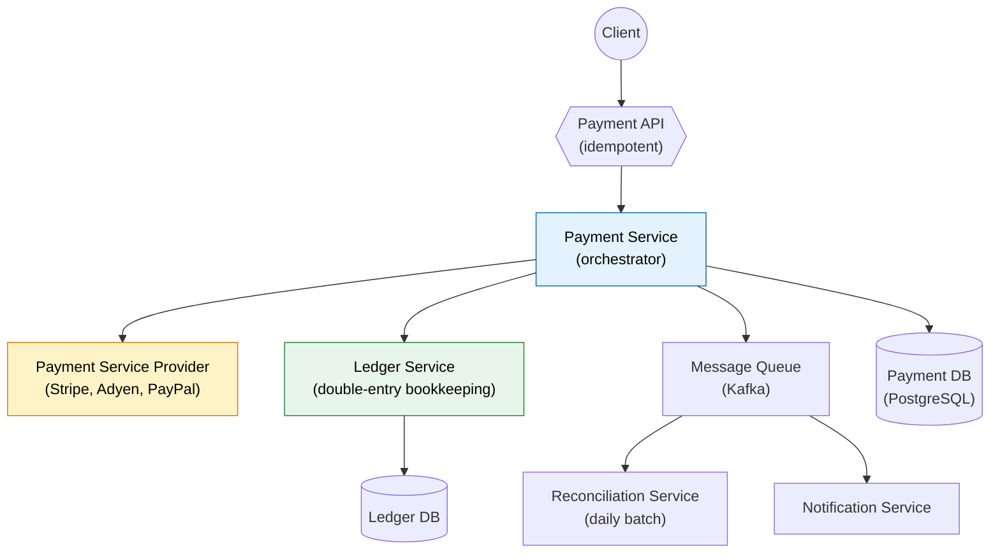
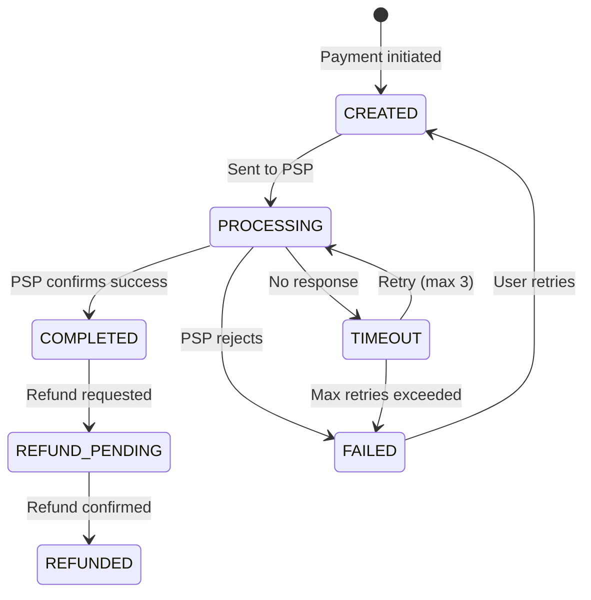
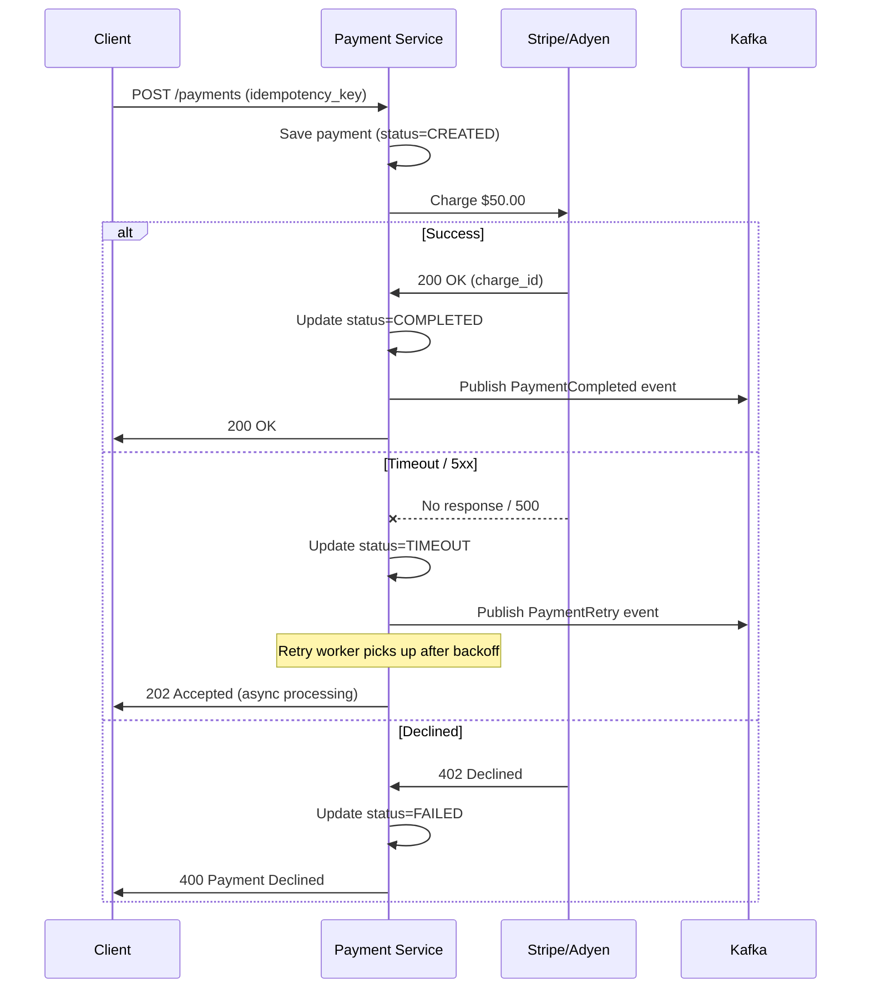
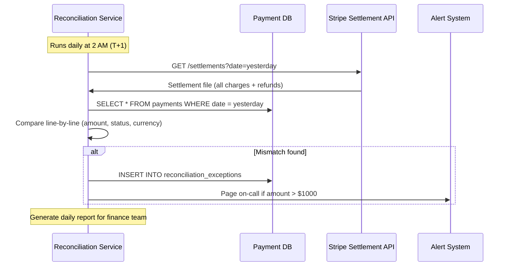
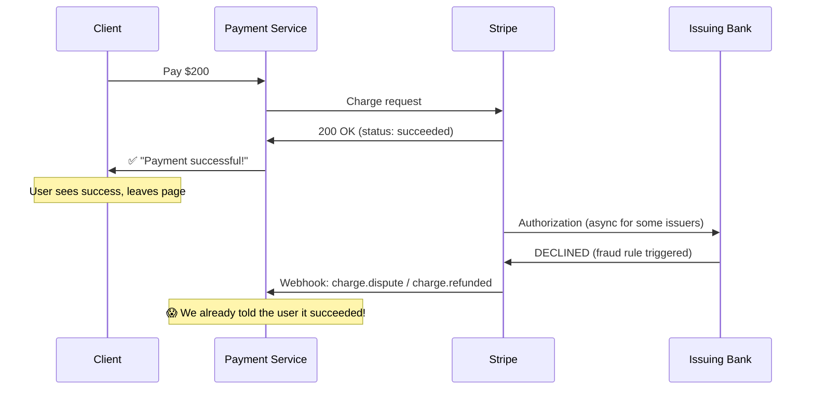

# Design a Payment System

> **Handle millions of transactions with exactly-once processing, multi-currency support, and zero tolerance for data loss — the most critical system in any e-commerce platform.**

---

!!! abstract "Why This Is Asked"
    Payment systems test your understanding of distributed transactions, idempotency, eventual consistency, security, and fault tolerance — all in one question. Every fintech, e-commerce, and marketplace interview includes this.

---

## Requirements

### Functional

- Process payments (credit card, debit, wallets, bank transfer)
- Support multiple currencies with real-time exchange rates
- Handle refunds (full and partial)
- Payment status tracking (pending → processing → completed/failed)
- Retry failed payments with exponential backoff
- Reconciliation with payment providers (Stripe, PayPal)

### Non-Functional

- **Exactly-once processing** — charge the customer exactly once (never double-charge)
- **High availability** — 99.99% uptime (4 min downtime/year)
- **Low latency** — < 500ms for payment initiation
- **Auditability** — full audit trail of every state change
- **Security** — PCI DSS compliance, tokenization, encryption at rest

### Scale

- 1 million transactions/day (~12 TPS average, 100+ TPS peak)
- $10 billion annual volume

---

## High-Level Architecture



---

## Key Design Decisions

### 1. Idempotency — The Most Critical Requirement

!!! danger "The Double-Charge Problem"
    User clicks "Pay" → request times out → user retries → server processed BOTH requests → charged twice. This is the #1 bug in payment systems.

```java
// Client sends an idempotency key with every request
POST /payments
Headers: Idempotency-Key: "pay_7f3a8b2c-unique-uuid"

// Server implementation
@Transactional
public PaymentResponse processPayment(String idempotencyKey, PaymentRequest request) {
    // Check if we've seen this key before
    Optional<Payment> existing = paymentRepository.findByIdempotencyKey(idempotencyKey);
    if (existing.isPresent()) {
        return existing.get().toResponse();  // return cached result, don't re-process!
    }

    // First time seeing this key — process normally
    Payment payment = createPayment(request);
    payment.setIdempotencyKey(idempotencyKey);
    paymentRepository.save(payment);
    return chargePaymentProvider(payment);
}
```

```sql
-- Idempotency key is UNIQUE — database guarantees no duplicates
CREATE TABLE payments (
    id UUID PRIMARY KEY,
    idempotency_key VARCHAR(255) UNIQUE NOT NULL,
    status VARCHAR(50) NOT NULL,
    amount DECIMAL(19,4) NOT NULL,
    currency VARCHAR(3) NOT NULL,
    created_at TIMESTAMP NOT NULL,
    updated_at TIMESTAMP NOT NULL
);
```

### 2. Payment State Machine



### 3. Double-Entry Ledger

Every payment creates TWO ledger entries (debit and credit). The sum of all entries must always be zero.

```sql
-- Ledger entries (immutable — never update, only append)
CREATE TABLE ledger_entries (
    id BIGSERIAL PRIMARY KEY,
    payment_id UUID NOT NULL,
    account_id VARCHAR(255) NOT NULL,    -- "customer:123" or "merchant:456"
    entry_type VARCHAR(10) NOT NULL,      -- 'DEBIT' or 'CREDIT'
    amount DECIMAL(19,4) NOT NULL,
    currency VARCHAR(3) NOT NULL,
    created_at TIMESTAMP NOT NULL
);

-- For a $100 payment from customer to merchant:
-- Entry 1: DEBIT  customer_account  $100  (money leaves customer)
-- Entry 2: CREDIT merchant_account  $100  (money enters merchant)
-- SUM of all entries = $0 (balanced!)
```

### 4. Handling PSP Failures



---

## Reconciliation

Daily batch job that compares your records with the PSP's records to catch discrepancies:

| Your System Says | PSP Says | Action |
|-----------------|----------|--------|
| COMPLETED | COMPLETED | ✅ Match — no action |
| COMPLETED | NOT FOUND | ⚠️ Phantom charge — investigate |
| TIMEOUT | COMPLETED | ⚠️ Update to COMPLETED, notify customer |
| TIMEOUT | NOT FOUND | ✅ Never charged — safe to retry or close |
| FAILED | COMPLETED | 🚨 Customer was charged but told it failed! Fix immediately |

### T+1 Batch Reconciliation Process



The settlement file from PSPs arrives T+1 (next business day). You cannot reconcile in real-time — PSPs batch their settlements. Your reconciliation service must handle:

- **Currency rounding** — PSP may round differently than you (match within ±$0.01)
- **Timezone mismatches** — your "yesterday" might span two days in the PSP's timezone
- **Partial settlements** — large merchants get multiple settlement files per day

### The Late-Arriving Webhook Problem

!!! danger "The Scariest Edge Case"
    Your system says **COMPLETED** → you show the user a success page → 30 seconds later, Stripe sends a webhook saying the charge was **declined** by the issuing bank. This happens with 3D Secure, bank-level fraud checks, and cross-border transactions where the issuer does async verification.



**How to handle it:**

```java
@PostMapping("/webhooks/stripe")
public ResponseEntity<Void> handleWebhook(@RequestBody StripeEvent event) {
    if (event.getType().equals("charge.failed") || event.getType().equals("charge.disputed")) {
        Payment payment = paymentRepo.findByPspChargeId(event.getChargeId());

        if (payment.getStatus() == PaymentStatus.COMPLETED) {
            // Late reversal — we already told the user it worked
            payment.setStatus(PaymentStatus.REVERSED);
            paymentRepo.save(payment);

            // Reverse the ledger entries
            ledgerService.reverseEntry(payment.getId());

            // Notify the user immediately
            notificationService.sendPaymentReversed(payment.getUserId(), payment);

            // If order was fulfilled, trigger compensation
            if (orderService.isShipped(payment.getOrderId())) {
                compensationService.createRecoveryCase(payment);
            }
        }
    }
    return ResponseEntity.ok().build();
}
```

**Design principles for late webhooks:**

| Principle | Implementation |
|-----------|---------------|
| Never treat PSP `200 OK` as final | Mark as `COMPLETED_PENDING_SETTLEMENT` internally |
| Webhook idempotency | Deduplicate by event ID, process at-least-once |
| Grace period before fulfillment | Wait 60s after payment before shipping/delivering |
| Compensation over prevention | You can't prevent all late reversals — design for recovery |

---

## Security Considerations

| Concern | Solution |
|---------|----------|
| Card number storage | **Never store** — use PSP tokenization |
| PCI DSS compliance | Use hosted payment pages (Stripe Elements) |
| Man-in-the-middle | TLS 1.3 everywhere |
| SQL injection | Parameterized queries, ORM |
| Internal fraud | Audit logs, 4-eyes principle for refunds |
| Amount tampering | Validate amount server-side, never trust client |

---

## Interview Tips

??? tip "How to approach this in a 45-min interview"

    1. **Clarify requirements** (2 min) — Scale? Multi-currency? Which payment methods?
    2. **High-level design** (10 min) — Draw the architecture diagram above
    3. **Deep dive: Idempotency** (10 min) — This is the most important part. Explain the double-charge problem and solution.
    4. **Deep dive: Reliability** (10 min) — State machine, retry, reconciliation
    5. **Discuss trade-offs** (8 min) — Sync vs async processing, consistency vs availability
    6. **Bonus: Ledger** (5 min) — Double-entry bookkeeping shows you understand financial systems
