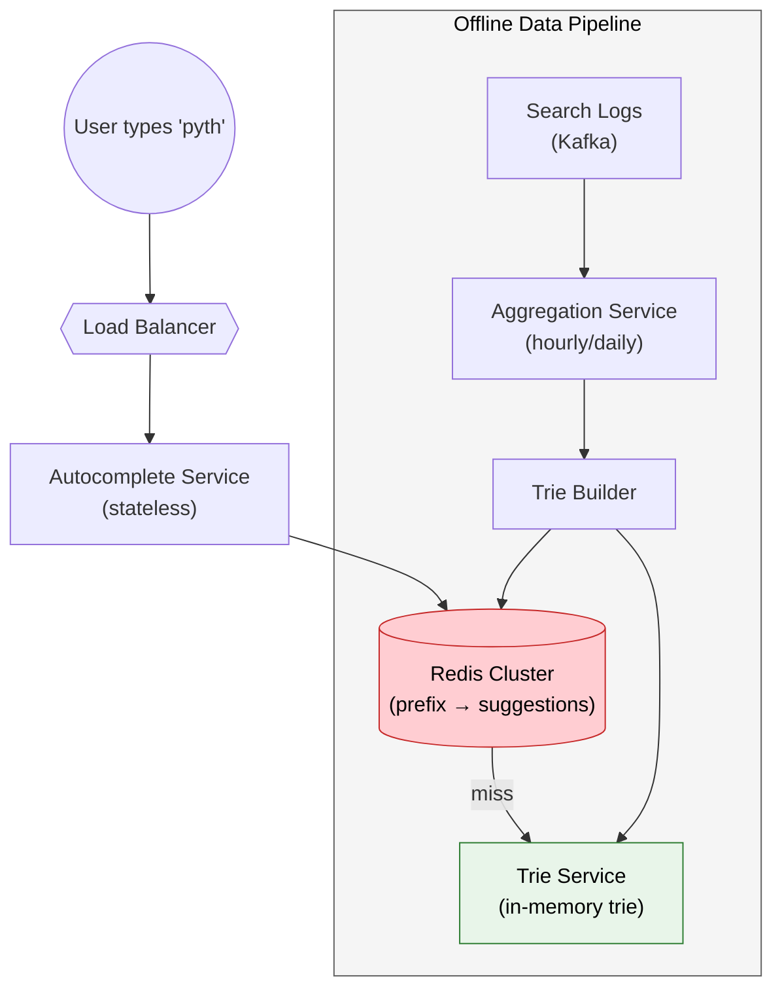
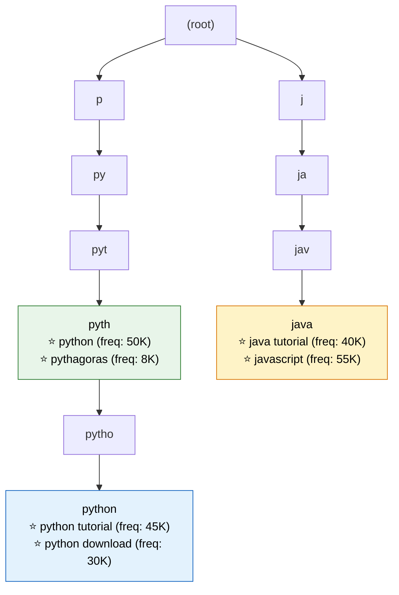
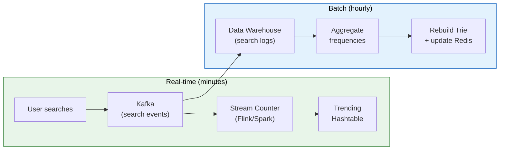

# Design a Search Autocomplete System

> **Return relevant suggestions in <100ms as the user types — the system behind every search bar at Google, Amazon, and YouTube.**

---

!!! abstract "Why This Is Asked"
    Tests your knowledge of: trie data structures, caching strategies, ranking algorithms, read-heavy optimization, and real-time data pipelines. Plus it has measurable latency constraints.

---

## Requirements

### Functional

- Return top 5-10 suggestions as the user types each character
- Suggestions ranked by popularity (search frequency)
- Support personalization (recent searches, user preferences)
- Handle typos/fuzzy matching
- Filter inappropriate content
- Multi-language support

### Non-Functional

- **Latency**: < 100ms p99 (users expect instant feedback)
- **Availability**: 99.99% (search is the primary entry point)
- **Scale**: 5 billion searches/day, 100K QPS for autocomplete
- **Freshness**: Trending topics appear within minutes

---

## High-Level Architecture



---

## Core Data Structure: Trie



### Trie Node Design

```java
public class TrieNode {
    Map<Character, TrieNode> children = new HashMap<>();
    // Top-K suggestions cached at each node (avoids traversal at query time)
    List<ScoredSuggestion> topSuggestions = new ArrayList<>(10);
    boolean isEndOfWord;
}

public record ScoredSuggestion(String text, long frequency) 
    implements Comparable<ScoredSuggestion> {
    @Override
    public int compareTo(ScoredSuggestion other) {
        return Long.compare(other.frequency, this.frequency);  // descending
    }
}
```

### Query Flow

```
User types: "pyth"
1. Traverse trie: root → p → py → pyt → pyth
2. At node "pyth", return pre-computed topSuggestions:
   ["python" (50K), "python tutorial" (45K), "python download" (30K), ...]
3. Return in < 1ms (O(length of prefix), no tree traversal needed)
```

---

## Caching Strategy

### Two-Layer Cache

```
Layer 1: Browser cache (client-side)
  - Cache "a", "ap", "app" responses for 5 minutes
  - Eliminates repeated requests for same prefix

Layer 2: Redis cluster (server-side)
  - Key: "prefix:pyth" → Value: ["python", "python tutorial", ...]
  - TTL: 1 hour (refreshed by offline pipeline)
  - 95%+ hit rate (most queries are popular prefixes)
```

```yaml
# Redis schema
prefix:p → ["python", "pizza near me", "paypal login", ...]
prefix:py → ["python", "python tutorial", "python download", ...]
prefix:pyt → ["python", "python tutorial", "python download", ...]
prefix:pyth → ["python", "python tutorial", "pythagoras", ...]
```

!!! tip "Optimization: Only Cache Short Prefixes"
    Cache prefixes of length 1-4 (covers 95% of queries). Longer prefixes are less frequent and can hit the trie directly. This keeps Redis memory manageable:
    - 26 one-char prefixes × 10 suggestions = 260 entries
    - 26² two-char = 6,760 entries
    - 26³ three-char = 175,760 entries
    - Total: ~200K entries → easily fits in memory

---

## Data Collection & Ranking Pipeline



### Ranking Formula

```
score = (search_frequency × recency_weight) + personalization_boost

where:
  recency_weight = decay_factor ^ hours_since_trending
  personalization_boost = user_history_match × 1.5
```

| Factor | Weight | Example |
|--------|--------|---------|
| Global frequency | 1.0x | "python" has 50K/day |
| Recency (trending) | 2.0x for last hour | Breaking news terms |
| Personalization | 1.5x | User searched "python" before |
| Geography | 1.2x | "pizza near me" in user's city |

---

## Handling Edge Cases

### Typo Tolerance / Fuzzy Matching

```
User types: "pythn" (missing 'o')
Solution: Edit distance matching (Levenshtein ≤ 2)
  - "pythn" → "python" (distance 1, insert 'o')
  
Implementation: 
  1. Try exact prefix match first (fast path)
  2. If no results, try BK-tree or SymSpell for fuzzy matches
  3. Return fuzzy matches with lower ranking score
```

### Filtering Inappropriate Content

```java
// Blocklist filter applied before returning suggestions
public List<String> filterSuggestions(List<String> suggestions) {
    return suggestions.stream()
        .filter(s -> !blocklist.contains(s.toLowerCase()))
        .filter(s -> !toxicityClassifier.isInappropriate(s))
        .limit(10)
        .toList();
}
```

---

## Scaling

| Component | Strategy |
|-----------|----------|
| Autocomplete API | Stateless, horizontal scaling behind LB |
| Redis cache | Redis Cluster (sharded by prefix hash) |
| Trie service | Replicated in-memory (each pod has full trie) |
| Data pipeline | Kafka + Flink for real-time, Spark for batch |
| Trie rebuild | Blue-green: build new trie, swap atomically |

### Memory Estimation

```
- Unique search terms: 100 million
- Average term length: 20 characters
- Trie overhead (pointers, metadata): ~5x raw text
- Total trie size: 100M × 20B × 5 = ~10GB per replica
- Fits in memory of a large instance (feasible)
```

---

## Interview Framework

??? tip "45-minute approach"

    1. **Requirements** (3 min): Confirm scale, latency SLA, personalization scope
    2. **High-level design** (8 min): Client → API → Cache → Trie, plus data pipeline
    3. **Trie deep dive** (10 min): Node structure, pre-computed top-K, query complexity
    4. **Caching** (8 min): Two-layer (browser + Redis), key design, TTL, hit rates
    5. **Data pipeline** (8 min): Real-time trending + batch frequency aggregation
    6. **Scaling** (5 min): Sharding, replication, blue-green trie rebuild
    7. **Trade-offs** (3 min): Memory vs freshness, personalization vs privacy
