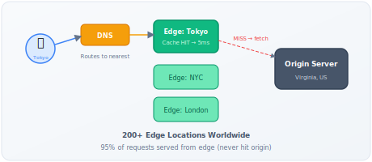

# CDN (Content Delivery Network)

!!! eli5 "In Simple Terms 🧒"
    A CDN is like having copies of a popular book in every city library instead of just one
    central warehouse. When someone wants to read it, they go to their nearest library (edge
    server) instead of driving across the country. If their local library doesn't have it yet,
    it borrows a copy from the warehouse and keeps it for the next person. This way, everyone
    gets their book fast, and the warehouse doesn't get overwhelmed.

!!! danger "Real Incident: Reddit Hug of Death"
    A blog goes viral on Reddit. Origin server in Virginia normally handles 50 req/s. Reddit sends 50,000 req/s. Server dies in 30 seconds. With a CDN: 95% of requests served from 300+ edge locations, origin sees 2,500 req/s — easily manageable. **A CDN is the difference between going viral and going down.**

---

## Why This Comes Up in Interviews

Any system design that serves static content, images, video, or has global users will require CDN discussion. Interviewers want to hear:

- How you reduce latency for global users
- How you protect your origin from traffic spikes
- Your cache invalidation strategy (one of the "two hard problems in CS")
- Trade-offs between consistency and performance

---

## How CDN Works — The Mental Model



**Without CDN:** User in Tokyo → request travels 12,000km to Virginia origin → 200ms latency (speed of light in fiber ≈ 200km/ms round trip)

**With CDN:** User in Tokyo → request goes to Tokyo edge (5km away) → 5ms latency (cache hit) OR edge fetches from origin, caches, then serves → subsequent requests instant

**The physics:** Light in fiber travels at ~2/3 speed of light = ~200,000 km/s. Round trip Tokyo→Virginia = ~24,000km / 200,000 = ~120ms minimum. No amount of engineering beats physics. CDN puts content close to users.

---

## Back-of-Envelope: CDN Economics

**Scenario:** Serving 1 billion images/day, average 200KB each.

| Metric | Without CDN | With CDN (95% hit rate) |
|---|---|---|
| Origin requests | 1B | 50M (5%) |
| Origin bandwidth | 200 TB/day | 10 TB/day |
| Origin servers needed (at 1Gbps each) | ~185 | ~10 |
| Avg latency (global users) | 200-400ms | 10-50ms |
| Monthly bandwidth cost (at $0.05/GB) | $300K | $15K origin + ~$50K CDN |

**Key insight:** CDN is CHEAPER than scaling your own origin globally, even with CDN fees.

---

## Push vs Pull: Two CDN Models

| Aspect | Pull (Origin-Pull) | Push (Origin-Push) |
|---|---|---|
| **How** | Edge fetches from origin on cache miss | You upload to CDN proactively |
| **First request** | Slow (cache miss → origin fetch) | Fast (already cached) |
| **Storage** | CDN stores what's requested | You manage what's stored |
| **Freshness** | Controlled by TTL + invalidation | Controlled by your uploads |
| **Best for** | Most websites, dynamic content | Predictable content (video releases, large assets) |
| **Cost** | Pay for cache misses + transfer | Pay for storage + transfer |

**90% of the time, pull is correct.** Push is for Netflix pre-positioning a new series on release day, or game patches ready at launch.

---

## Cache Invalidation Strategies (The Hard Part)

| Strategy | How | Freshness | Complexity | Best For |
|---|---|---|---|---|
| **TTL-based** | `Cache-Control: max-age=3600` | Stale up to TTL | Low | General content |
| **Versioned URLs** | `/app.a1b2c3.js` (content hash in URL) | Instant (new URL = new resource) | Low | JS, CSS, images |
| **Purge API** | `CDN.purge("/article/123")` | Instant | Medium | Breaking news, corrections |
| **Stale-while-revalidate** | Serve stale, fetch fresh in background | Slightly stale, always fast | Medium | High-traffic pages |
| **Surrogate keys/tags** | Tag content → purge by tag | Instant | High | Complex dependency invalidation |

**The winning answer for interviews:**

> "For static assets (JS, CSS, images), I'd use content-hashed URLs with infinite TTL — `bundle.a1b2c3.js`. The URL IS the version, so there's zero invalidation complexity. For dynamic content like article pages, I'd use short TTL (60s) with stale-while-revalidate, plus a purge API for immediate corrections."

**Why versioned URLs are superior:**

- Immutable: same URL always returns same content
- Infinite TTL: never expires, never stale
- Instant deployment: new build = new URL = new content
- Atomic: users get all-old or all-new, never mixed
- Zero purge calls: no coordination needed

---

## CDN Architecture in Depth

| Component | What | Why |
|---|---|---|
| **PoP (Point of Presence)** | Physical location with servers (city) | Geographic proximity |
| **Edge server** | Cache + compute within a PoP | Serves content |
| **Shield/Mid-tier cache** | Second-level cache between edge and origin | Reduces origin load further |
| **Origin** | Your actual servers/S3 | Source of truth |
| **Anycast** | Same IP address, multiple physical locations | DNS routes to nearest PoP automatically |

**Multi-tier caching (how Cloudflare/Akamai work):**

```
User → Edge (Tokyo PoP)
         ↓ cache miss
       Shield (Singapore regional)
         ↓ cache miss
       Origin (Virginia)
```

Shield layer means: if 50 edge PoPs all get cache miss simultaneously, only ONE request goes to origin (shield coalesces them). Without shield: 50 origin hits.

---

## What Gets Cached — Decision Framework

| Content | Cache? | TTL | Strategy |
|---|---|---|---|
| Static assets (JS/CSS/fonts) | Always | Infinite (versioned URL) | Content-hashed filenames |
| Images/video | Always | Hours to days | Versioned or purge on update |
| Public API responses | Usually | 5-60 seconds | `Vary` header by auth state |
| HTML pages | Depends | 0-60 seconds | `stale-while-revalidate` |
| Authenticated/personalized | **Never at CDN** | — | Must reach origin |
| POST/PUT/DELETE | **Never** | — | Only cache GET/HEAD |
| User-specific data | **Never at CDN** | — | Cache at application layer instead |

**Cache key composition:**

Default: URL path + query string. But sometimes you need:

- `Vary: Accept-Encoding` — different response for gzip vs brotli
- `Vary: Accept-Language` — different language versions
- Custom cache keys — strip tracking parameters (`utm_source`) from cache key

---

## Edge Compute — CDN as Application Platform

Modern CDNs aren't just caches — they run code at the edge:

| Platform | What | Latency | Use Case |
|---|---|---|---|
| **Cloudflare Workers** | V8 isolates at 300+ PoPs | <5ms cold start | A/B testing, auth, redirects |
| **Lambda@Edge** | AWS Lambda at CloudFront edges | 50-100ms cold start | Request/response transformation |
| **Fastly Compute** | Wasm at edge | <1ms cold start | Personalization, routing |

**Interview-relevant patterns:**

- **Edge-side auth:** Validate JWT at edge, reject invalid before reaching origin
- **Edge-side A/B:** Route 10% of traffic to variant at edge (no origin change)
- **Edge-side personalization:** Inject user name into cached HTML template
- **Edge-side rate limiting:** Block abusive IPs before they consume origin resources

---

## CDN + Security

| Attack | How CDN Helps |
|---|---|
| **Volumetric DDoS** | CDN absorbs (Cloudflare handles 100+ Tbps) — origin never sees traffic |
| **Application DDoS** | WAF rules at edge filter malicious patterns |
| **Origin IP exposure** | CDN masks origin IP. Attackers can't bypass. |
| **SSL/TLS** | CDN handles TLS termination (offloads CPU from origin) |
| **Bot traffic** | Challenge pages, rate limits at edge |

---

## Real-World CDN Decisions

| Company | CDN Choice | Interesting Detail |
|---|---|---|
| **Netflix** | Own CDN (Open Connect) | Places physical boxes in ISP datacenters. 95% of traffic served from within ISP network. |
| **GitHub** | Fastly | Instant purge (<150ms global) for code changes |
| **Shopify** | Cloudflare + custom | Edge-side storefront rendering |
| **Twitter** | Internal + Akamai | Multi-CDN for resilience |
| **Stripe** | Fastly | API responses cached at edge with smart invalidation |

---

## Multi-CDN Strategy

Large companies use multiple CDNs:

| Reason | How |
|---|---|
| **Resilience** | If one CDN has outage, DNS switches to another |
| **Performance** | Route to fastest CDN per-region |
| **Cost** | Negotiate between providers |
| **Compliance** | Some regions require specific providers |

**Implementation:** DNS-level routing (Route53/NS1) directs traffic based on latency, health checks, or geography.

---

## Interview Framework

**When designing any system with global users or static content:**

> **Step 1:** "For static assets (images, JS, CSS), I'd serve through a CDN with content-hashed URLs and infinite TTL. This gives us global low-latency access with zero cache invalidation complexity."
>
> **Step 2:** "For dynamic but cacheable content, I'd use short TTL (30-60s) with stale-while-revalidate. Most users get cached response; background refresh keeps it fresh."
>
> **Step 3:** "CDN also gives us DDoS protection and origin offload. At [X] requests/sec, origin only sees 5% (cache miss traffic)."
>
> **Step 4:** "For the write path and authenticated content, requests go directly to origin — CDN only helps the read path."
>
> **Back-of-envelope:** "[Y] daily requests × [Z]KB average × (1 - hit rate) = origin bandwidth needed."

---

## Quick Recall

| Question | Answer |
|---|---|
| What problem does CDN solve? | Latency (physics — speed of light), origin offload, spike absorption |
| Push vs pull? | Pull (origin-pull) for 90% of cases. Push for predictable large content. |
| Best cache invalidation? | Content-hashed URLs (immutable, infinite TTL, zero invalidation) |
| What's NOT cached? | Authenticated data, POST requests, personalized responses |
| Shield/mid-tier purpose? | Coalesce cache misses — 50 edges miss, only 1 origin request |
| Cache hit rate target? | 95%+ for static, 80%+ for semi-dynamic |
| CDN latency improvement? | 200-400ms → 10-50ms (serves from nearest PoP) |
| Edge compute use? | Auth validation, A/B routing, personalization, rate limiting |

---

## Quick Quiz

??? question "Q1: What is the best cache invalidation strategy for static assets like JavaScript and CSS files?"
    - [ ] A) Short TTL with stale-while-revalidate
    - [ ] B) Purge API calls on every deployment
    - [x] C) Content-hashed URLs with infinite TTL (e.g., `bundle.a1b2c3.js`)
    - [ ] D) No caching — always fetch from origin

    **Answer: C)** Content-hashed URLs are the gold standard for static assets. The URL IS the version — `bundle.a1b2c3.js` always returns the same content, so you can set an infinite TTL with zero invalidation complexity. A new build produces a new hash, which is a new URL, so browsers and CDNs automatically fetch the new version.

??? question "Q2: What is the difference between a Pull CDN and a Push CDN?"
    - [ ] A) Pull CDN requires the client to download content manually
    - [x] B) Pull CDN fetches from origin on cache miss; Push CDN requires you to upload content proactively
    - [ ] C) Push CDN is faster because it uses HTTP/2
    - [ ] D) Pull CDN does not cache content at all

    **Answer: B)** In a Pull (origin-pull) CDN, the edge server fetches content from your origin only when a request comes in and the cache is empty (cache miss). In a Push CDN, you proactively upload content to the CDN before users request it. Pull is correct for 90% of use cases. Push is for predictable large content like Netflix pre-positioning a new series on release day.

??? question "Q3: What is the purpose of a shield/mid-tier cache layer in a CDN architecture?"
    - [ ] A) To encrypt traffic between edge and origin
    - [ ] B) To serve as a backup origin server
    - [x] C) To coalesce cache misses so only one request reaches the origin even if many edges miss simultaneously
    - [ ] D) To store user authentication tokens

    **Answer: C)** The shield layer sits between edge PoPs and the origin. If 50 edge locations all get a cache miss for the same resource simultaneously, the shield coalesces them into a single request to the origin. Without a shield, the origin would get hammered with 50 identical requests during a cache miss storm.

??? question "Q4: Which type of content should NEVER be cached at the CDN layer?"
    - [ ] A) JavaScript files
    - [ ] B) Public API responses
    - [x] C) Authenticated, personalized responses (e.g., user dashboard data)
    - [ ] D) Images and videos

    **Answer: C)** Authenticated and personalized content must not be cached at the CDN because it is specific to individual users. Caching it could serve one user's data to another — a serious security and privacy violation. Only cache GET/HEAD requests for public, non-personalized content at the CDN layer. Personalized data should be cached at the application layer instead.
