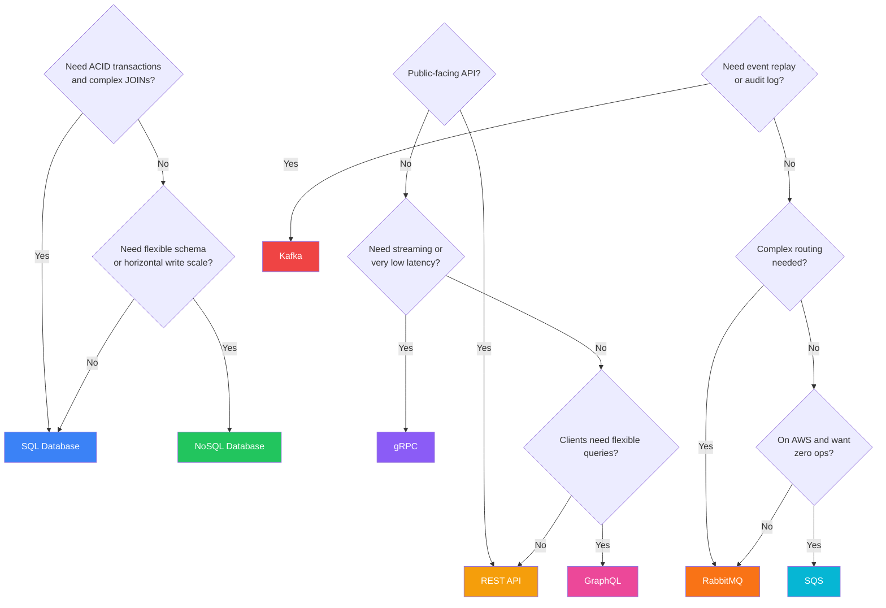

# System Design Comparisons — Quick Reference

> **The page interviewers wish you'd memorized.** Every system design decision is a trade-off. This page gives you the table to pull from memory when the interviewer asks "why X over Y?"

## Quick Navigation

| Category | Comparisons |
|----------|-------------|
| **Networking** | [TCP vs UDP](#tcp-vs-udp) | [Polling vs WebSocket vs SSE](#polling-vs-websocket-vs-sse) |
| **Data & Storage** | [SQL vs NoSQL](#sql-vs-nosql) | [Redis vs Memcached](#redis-vs-memcached) |
| **APIs & Communication** | [REST vs gRPC vs GraphQL](#rest-vs-grpc-vs-graphql) | [Kafka vs RabbitMQ vs SQS](#kafka-vs-rabbitmq-vs-sqs) |
| **Architecture** | [Monolith vs Microservices](#monolith-vs-microservices) | [Monolith vs Microservices vs Serverless](#monolith-vs-microservices-vs-serverless) |
| **Infrastructure** | [Horizontal vs Vertical Scaling](#horizontal-vs-vertical-scaling) | [L4 vs L7 Load Balancer](#load-balancer-l4-vs-l7) | [Docker vs Kubernetes](#docker-vs-kubernetes) |
| **Replication & Distribution** | [Leader-Follower vs Leader-Leader](#leader-follower-vs-leader-leader-replication) | [Consistent Hashing vs Range Partitioning](#consistent-hashing-vs-range-partitioning) | [Push vs Pull CDN](#push-vs-pull-cdn) |

---

## TCP vs UDP

| Aspect | TCP | UDP |
|---|---|---|
| **Connection** | Connection-oriented (3-way handshake) | Connectionless (fire and forget) |
| **Reliability** | Guaranteed delivery, retransmission | No guarantee, packets may be lost |
| **Ordering** | In-order delivery | No ordering guarantee |
| **Speed** | Slower (overhead of ACKs, flow control) | Faster (minimal overhead) |
| **Header size** | 20-60 bytes | 8 bytes |
| **Use cases** | HTTP, APIs, databases, SSH, file transfer | Video calls, DNS, gaming, live telemetry |

!!! tip "Interview Tip"
    "TCP when correctness matters (APIs, payments). UDP when speed matters more than perfection (video, gaming). Modern QUIC (HTTP/3) builds reliability ON TOP of UDP — best of both worlds."

---

## SQL vs NoSQL

| Aspect | SQL (Relational) | NoSQL (Non-Relational) |
|---|---|---|
| **Schema** | Fixed schema, migrations needed | Flexible/schema-less |
| **Scaling** | Vertical (scale up) + read replicas | Horizontal (scale out) natively |
| **ACID** | Full ACID transactions | Usually eventual consistency (BASE) |
| **Query** | SQL (powerful JOINs) | API-specific (key-value, document, graph) |
| **Relationships** | Excellent (JOINs, foreign keys) | Poor (denormalization needed) |
| **Best for** | Banking, e-commerce, ERP | Social feeds, IoT, caching, real-time |

!!! tip "Interview Tip"
    "SQL when you need transactions and complex queries (orders, inventory). NoSQL when you need horizontal scale and flexible schema (user profiles, activity feeds). Many systems use both — SQL for transactions, NoSQL for read-heavy views."

---

## REST vs gRPC vs GraphQL

| Aspect | REST | gRPC | GraphQL |
|---|---|---|---|
| **Protocol** | HTTP/1.1 or HTTP/2 | HTTP/2 (always) | HTTP (typically POST) |
| **Format** | JSON (text) | Protobuf (binary) | JSON |
| **Speed** | Moderate | Fast (10x smaller payloads) | Moderate |
| **Streaming** | No (needs WebSocket) | Bidirectional streaming | Subscriptions |
| **Contract** | OpenAPI/Swagger (optional) | .proto file (strict) | Schema (strict) |
| **Browser support** | Native | Needs grpc-web proxy | Native |
| **Best for** | Public APIs, CRUD | Internal microservices, low-latency | Mobile apps, BFF |

!!! tip "Interview Tip"
    "REST for public-facing APIs (universally understood). gRPC for internal service-to-service (fast, typed, streaming). GraphQL when clients need flexible queries and you want to avoid over-fetching (mobile apps)."

---

## Redis vs Memcached

| Aspect | Redis | Memcached |
|---|---|---|
| **Data types** | Strings, lists, sets, sorted sets, hashes, streams | Strings only |
| **Persistence** | RDB snapshots + AOF | None (pure cache) |
| **Clustering** | Redis Cluster (built-in) | Client-side sharding |
| **Pub/Sub** | Built-in | Not supported |
| **Memory efficiency** | Less efficient (metadata overhead) | More efficient for simple K/V |
| **Max value size** | 512MB | 1MB |
| **Best for** | Leaderboards, sessions, queues, pub/sub | Simple cache layer |

!!! tip "Interview Tip"
    "Redis for anything beyond simple caching — data structures, pub/sub, sorted sets for leaderboards. Memcached only if you need raw simplicity and maximum memory efficiency for string caching."

---

## Kafka vs RabbitMQ vs SQS

| Aspect | Kafka | RabbitMQ | SQS |
|---|---|---|---|
| **Model** | Distributed log (pull-based) | Message broker (push-based) | Managed queue (pull-based) |
| **Ordering** | Per-partition guaranteed | Per-queue (single consumer) | FIFO queues only (extra cost) |
| **Retention** | Configurable (days/forever) | Until consumed | 14 days max |
| **Throughput** | Millions/sec | Thousands/sec | Thousands/sec |
| **Replay** | Yes (offset-based) | No (consumed = gone) | No |
| **Ops complexity** | High (ZooKeeper/KRaft) | Medium | Zero (fully managed) |
| **Best for** | Event streaming, data pipelines, audit log | Task queues, RPC, routing | Simple cloud-native queues |

!!! tip "Interview Tip"
    "Kafka for event streaming and data pipelines (need replay, ordering, high throughput). RabbitMQ for complex routing and task distribution. SQS when you want zero ops and AWS-native simplicity."

---

## Monolith vs Microservices

| Aspect | Monolith | Microservices |
|---|---|---|
| **Deployment** | All-or-nothing | Independent per service |
| **Complexity** | Simple to start | Complex (networking, discovery, observability) |
| **Scaling** | Scale entire app | Scale individual services |
| **Data** | Shared database | Database per service |
| **Team size** | Works for <20 engineers | Needed for 50+ engineers |
| **Latency** | In-process calls (ns) | Network calls (ms) |
| **Best for** | Startups, MVPs, small teams | Large orgs, independent team scaling |

!!! tip "Interview Tip"
    "Start monolith, extract microservices when team/traffic demands it. Microservices solve organizational scaling (team autonomy), not technical scaling. A well-designed monolith handles millions of requests."

---

## Load Balancer: L4 vs L7

| Aspect | L4 (Transport) | L7 (Application) |
|---|---|---|
| **Layer** | TCP/UDP | HTTP/HTTPS |
| **Inspects** | IP + Port only | URL, headers, cookies, body |
| **Speed** | Faster (no payload parsing) | Slightly slower |
| **TLS** | Pass-through only | Can terminate TLS |
| **Routing** | Round robin, least connections | Path-based, header-based, A/B |
| **Health checks** | TCP connect / ping | HTTP status code |
| **Best for** | Databases, non-HTTP, raw TCP | APIs, web apps, microservices |

!!! tip "Interview Tip"
    "L7 for HTTP services (smart routing, TLS termination, observability). L4 only for non-HTTP protocols (databases, game servers) or when maximum throughput matters more than routing intelligence."

---

## Polling vs WebSocket vs SSE

| Aspect | Short Polling | Long Polling | SSE | WebSocket |
|---|---|---|---|---|
| **Direction** | Client → Server | Client → Server | Server → Client | Bidirectional |
| **Connection** | New each time | Held until data/timeout | Persistent HTTP | Persistent TCP |
| **Overhead** | ~800 bytes/req | ~800 bytes/reconnect | Minimal | 2-14 bytes/frame |
| **Latency** | Up to N seconds | Near-instant | Near-instant | Sub-millisecond |
| **Complexity** | Trivial | Low | Low | High |
| **Best for** | Simple dashboards | Chat (fallback) | Notifications, feeds | Chat, gaming, collaboration |

!!! tip "Interview Tip"
    "WebSocket for bidirectional real-time (chat, multiplayer). SSE for one-way server push (notifications, stock tickers). Polling only for very simple use cases or as a fallback."

---

## Horizontal vs Vertical Scaling

| Aspect | Vertical (Scale Up) | Horizontal (Scale Out) |
|---|---|---|
| **How** | Bigger machine (more CPU/RAM) | More machines |
| **Cost** | Exponential (2x RAM ≠ 2x price) | Linear (2x machines ≈ 2x price) |
| **Limit** | Hardware ceiling | Theoretically unlimited |
| **Complexity** | Zero (same code) | High (distributed systems) |
| **Downtime** | Usually yes (resize) | No (add nodes live) |
| **Data** | Single-machine consistency | Need distributed consensus |
| **Best for** | Databases, quick fixes | Stateless services, web tier |

!!! tip "Interview Tip"
    "Vertical scaling first (cheap, simple) until you hit the ceiling or need HA. Then horizontal for the stateless tier. Databases: vertical + read replicas before sharding."

---

## Leader-Follower vs Leader-Leader Replication

| Aspect | Leader-Follower | Leader-Leader (Multi-Master) |
|---|---|---|
| **Write path** | Leader only | Any node |
| **Conflict** | None (single writer) | Possible (concurrent writes to same key) |
| **Consistency** | Strong (read-your-writes from leader) | Eventual (conflict resolution needed) |
| **Failover** | Promote follower (seconds of downtime) | Automatic (other leader continues) |
| **Complexity** | Low | High (conflict resolution logic) |
| **Best for** | Most databases (PostgreSQL, MySQL) | Multi-region active-active (DynamoDB) |

!!! tip "Interview Tip"
    "Leader-follower for 90% of cases (simple, no conflicts). Leader-leader only for multi-region active-active where write latency in every region matters (global e-commerce, real-time collaboration)."

---

## Push vs Pull CDN

| Aspect | Pull (Origin-Pull) | Push (Origin-Push) |
|---|---|---|
| **How** | Edge fetches on cache miss | You upload to CDN proactively |
| **First request** | Slow (cache miss → origin) | Fast (pre-cached) |
| **Freshness** | TTL-controlled | You control updates |
| **Storage cost** | CDN manages | You pay for storage |
| **Best for** | Most websites (90% of cases) | Large media releases, game patches |

!!! tip "Interview Tip"
    "Pull for everything unless pre-positioning large content before a known event (Netflix show release, game patch launch)."

---

## Consistent Hashing vs Range Partitioning

| Aspect | Consistent Hashing | Range Partitioning |
|---|---|---|
| **Distribution** | Even (with virtual nodes) | Can be skewed (popular ranges) |
| **Hotspots** | Rare (hashing randomizes) | Common (e.g., recent dates) |
| **Range queries** | Not possible (hashing destroys order) | Efficient (adjacent keys on same node) |
| **Rebalancing** | Minimal (only 1/N keys move) | Expensive (split/merge ranges) |
| **Complexity** | Medium (virtual nodes, ring) | Low (range boundaries) |
| **Best for** | Caches, DynamoDB, Cassandra | Time-series, alphabetical lookups |

!!! tip "Interview Tip"
    "Consistent hashing when you need even distribution and elastic scaling (caches, DHT). Range partitioning when you need range scans (time-series data, lexicographic queries)."

---

## Docker vs Kubernetes

| Aspect | Docker | Kubernetes |
|---|---|---|
| **What it is** | Container runtime (build & run containers) | Container orchestrator (manage clusters of containers) |
| **Scope** | Single host | Multi-host cluster |
| **Scaling** | Manual (`docker run` more instances) | Automatic (HPA, replicas, auto-scaling) |
| **Networking** | Bridge network, port mapping | Service mesh, DNS-based service discovery |
| **Load balancing** | Not built-in (use external) | Built-in (Services, Ingress) |
| **Self-healing** | None (container dies = stays dead) | Auto-restart, reschedule on healthy nodes |
| **Rolling updates** | Manual | Declarative (zero-downtime deployments) |
| **Complexity** | Low (learn in a day) | High (weeks to master) |
| **Best for** | Local dev, single-server apps, CI/CD builds | Production orchestration at scale |

Docker builds and runs containers. Kubernetes decides *where* and *how many* containers run across a cluster, handles failures, scaling, networking, and deployments. You need Docker (or a container runtime) before you need Kubernetes. Think of Docker as "the engine" and Kubernetes as "the fleet manager."

!!! tip "Interview Tip"
    "Docker is necessary but not sufficient for production. Once you have more than a few services across multiple hosts, you need orchestration (Kubernetes) for scheduling, self-healing, service discovery, and rolling deployments. For small apps, Docker Compose on a single host is fine."

---

## Monolith vs Microservices vs Serverless

| Aspect | Monolith | Microservices | Serverless (FaaS) |
|---|---|---|---|
| **Deployment** | All-or-nothing | Independent per service | Per function |
| **Scaling** | Scale entire app | Scale individual services | Auto-scales per request (to zero) |
| **Cold start** | None (always running) | None (always running) | 100ms-10s (problematic for latency-sensitive) |
| **Cost model** | Always paying (servers running) | Always paying (servers running) | Pay per invocation (zero traffic = zero cost) |
| **Max execution time** | Unlimited | Unlimited | Limited (AWS Lambda: 15 min) |
| **State** | In-memory state easy | Stateless services + external state | Stateless only |
| **Complexity** | Low (one codebase) | High (distributed systems) | Medium (event wiring, vendor lock-in) |
| **Vendor lock-in** | None | Low | High (AWS Lambda, Azure Functions, GCP Cloud Functions) |
| **Best for** | Startups, MVPs, small teams | Large orgs, complex domains | Event-driven tasks, sporadic workloads, glue code |

The progression is not always linear. Many production systems use a **hybrid**: a monolith or microservices for core request handling, with serverless for async tasks (image processing, webhooks, scheduled jobs) where pay-per-use and auto-scaling to zero provide cost advantages.

!!! tip "Interview Tip"
    "Serverless shines for event-driven, bursty workloads (file processing, webhooks, cron jobs). It fails for long-running processes, low-latency requirements (cold starts), or high-throughput steady-state workloads (cheaper to run a server). Most teams use serverless alongside services, not instead of them."

---

## Decision Framework

---

## Quick Quiz

??? question "Q1: When should you choose Kafka over RabbitMQ for messaging?"
    - [ ] A) When you need complex routing logic like topic exchanges and headers-based routing
    - [x] B) When you need event replay, message retention, and millions of messages per second throughput
    - [ ] C) When you want zero operational complexity
    - [ ] D) When messages should be consumed exactly once without additional configuration

    **Answer: B)** Kafka is a distributed log that retains messages for configurable periods (days or forever), supports offset-based replay, and handles millions of messages per second. RabbitMQ is better for complex routing (exchanges, bindings) and traditional task queues where consumed messages are gone. Use Kafka for event streaming and data pipelines; RabbitMQ for task distribution and RPC patterns.

??? question "Q2: What is the primary advantage of horizontal scaling over vertical scaling?"
    - [ ] A) It requires no code changes
    - [ ] B) It is always cheaper per unit of capacity
    - [x] C) It has no theoretical upper limit and can scale without downtime
    - [ ] D) It provides better single-request latency

    **Answer: C)** Vertical scaling hits a hardware ceiling (there is a maximum machine size), and often requires downtime to resize. Horizontal scaling adds more machines — theoretically unlimited — and can be done live without downtime. The trade-off is distributed systems complexity (data consistency, networking, service discovery). Vertical is simpler; horizontal is necessary for true scale.

??? question "Q3: In what scenario would you choose a SQL database over NoSQL?"
    - [x] A) When you need ACID transactions, complex JOINs, and strong consistency
    - [ ] B) When you need horizontal write scalability across hundreds of nodes
    - [ ] C) When your schema changes frequently and is unpredictable
    - [ ] D) When storing time-series data with billions of append-only writes per day

    **Answer: A)** SQL databases excel at ACID transactions, referential integrity, and complex multi-table JOINs — essential for domains like banking, e-commerce orders, and inventory management. NoSQL is better when you need horizontal write scale, flexible schema, or specific access patterns (key-value, document, graph). Many systems use both: SQL for transactional data, NoSQL for read-heavy views.

??? question "Q4: What is the key difference between REST and gRPC for inter-service communication?"
    - [ ] A) REST uses HTTP while gRPC uses raw TCP sockets
    - [ ] B) gRPC only works with Java while REST is language-agnostic
    - [x] C) gRPC uses HTTP/2 with binary Protobuf encoding, making it faster with strict contracts, while REST uses JSON over HTTP
    - [ ] D) REST supports streaming but gRPC does not

    **Answer: C)** gRPC uses HTTP/2 (always) with Protocol Buffers (binary, 10x smaller payloads) and requires strict `.proto` contracts. REST typically uses JSON (text) over HTTP/1.1 or 2. gRPC is ideal for internal microservice communication (fast, typed, bidirectional streaming). REST is preferred for public-facing APIs (universally understood, browser-native, easy to debug with curl).
