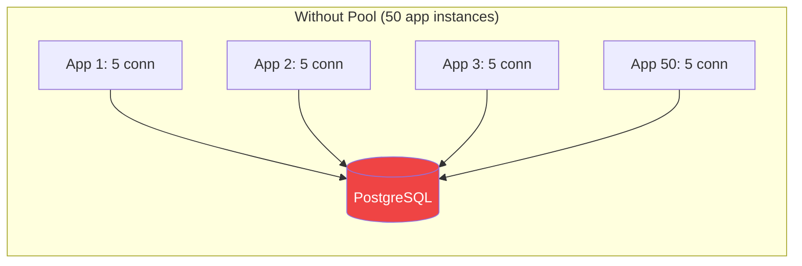
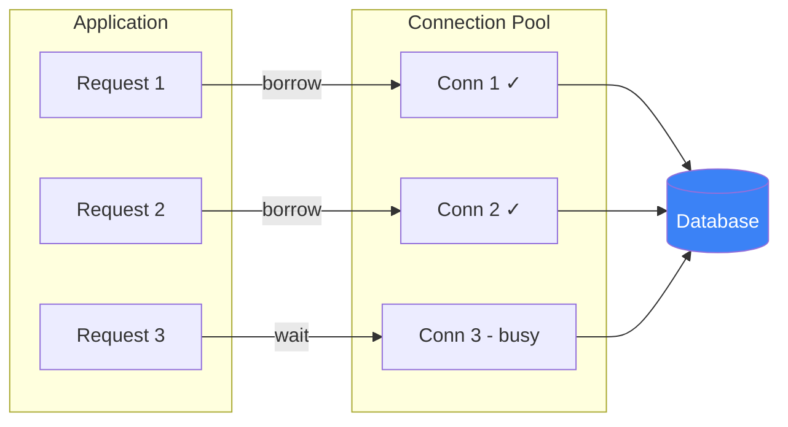

# Connection Pooling

!!! danger "Real Incident: Heroku's Connection Limit Crisis"
    A Rails app on Heroku scaled to 50 dynos, each opening 5 database connections = 250 connections. PostgreSQL's `max_connections` was 100. Result: `FATAL: too many connections` — **entire app went down**. Fix: PgBouncer connection pooler reduced actual DB connections to 20 while serving 250 application-level connections. **Without pooling, horizontal scaling kills your database.**

---

## Why This Comes Up in Interviews

Connection pooling is critical whenever your application talks to databases, caches, or external services. Interviewers want to hear:

- Why creating connections on every request is expensive
- How pooling solves the N-services × M-connections problem
- Pool sizing strategies (too small = contention, too large = resource waste)
- Connection pool exhaustion as a failure mode

---

## The Problem



**Creating a TCP + TLS + Auth connection takes 5-30ms.** For a query that takes 2ms, the connection setup is the bottleneck.

| Operation | Cost |
|---|---|
| TCP handshake | ~1ms |
| TLS handshake | ~5ms |
| PostgreSQL auth + startup | ~3ms |
| **Total per connection** | **~10ms** |
| Query execution | 2ms |

**10ms setup for a 2ms query = 83% overhead per request without pooling.**

---

## How Connection Pooling Works



1. **Pool creates N connections at startup** — already authenticated, ready to use
2. **Request borrows** a connection from the pool (near-instant, no setup cost)
3. **Request executes** queries using the borrowed connection
4. **Request returns** connection to the pool (available for next request)
5. **If all busy**: request waits in queue (with timeout) until one is returned

---

## Pool Sizing — The Formula

### PostgreSQL Rule of Thumb

```
Optimal connections = (CPU cores × 2) + effective_spindle_count
```

For a typical 4-core database server with SSD:
```
Optimal = (4 × 2) + 1 = 9-10 connections
```

**Counterintuitive:** More connections ≠ more throughput. Beyond optimal, connections compete for CPU/disk → context switching → performance degrades.

### HikariCP Benchmarks (Java)

| Pool Size | Throughput (queries/sec) | Avg Latency |
|---|---|---|
| 5 connections | 8,000 | 0.6ms |
| 10 connections | 9,500 | 0.5ms |
| 20 connections | 9,200 | 0.7ms |
| 50 connections | 7,800 | 1.2ms |
| 100 connections | 5,500 | 2.8ms |

**Peak throughput at 10 connections. 100 connections is 42% slower.**

---

## Pooling Modes

| Mode | How | Best For |
|---|---|---|
| **Session pooling** | One server connection per client session | Long-lived connections, prepared statements |
| **Transaction pooling** | Connection assigned per transaction, returned after | Most web apps (stateless requests) |
| **Statement pooling** | Connection assigned per query | Simple queries, maximum sharing |

**Transaction pooling** is the default for web applications — highest connection reuse.

---

## Connection Pool Architecture

### Application-Level Pool (HikariCP, c3p0)

```
App Instance → [HikariCP Pool (10 conn)] → Database
```

- Pool lives inside each application instance
- 50 app instances × 10 pool size = 500 connections to DB
- **Problem:** Still too many connections at scale

### External Connection Pooler (PgBouncer, ProxySQL)

```
50 App Instances → [PgBouncer (20 conn to DB)] → Database
```

- PgBouncer sits between apps and database
- Multiplexes hundreds of app connections into 20 real DB connections
- Database sees only 20 connections regardless of app scale
- **Solution:** Decouples app scaling from database connection limits

---

## Key Configuration Parameters

| Parameter | Meaning | Typical Value |
|---|---|---|
| **minIdle** | Connections kept ready when idle | 2-5 |
| **maxPoolSize** | Maximum connections in pool | 10-20 per instance |
| **connectionTimeout** | Max wait time to borrow connection | 5-30 seconds |
| **idleTimeout** | Close idle connections after | 10 minutes |
| **maxLifetime** | Force close connection after | 30 minutes |
| **validationQuery** | Health check query | `SELECT 1` |
| **leakDetectionThreshold** | Alert if connection not returned in | 60 seconds |

---

## Failure Modes

| Failure | Symptom | Fix |
|---|---|---|
| **Pool exhaustion** | Requests queue, then timeout | Increase pool size OR fix slow queries holding connections |
| **Connection leak** | Pool slowly empties, never recovers | Enable leak detection, ensure try-with-resources |
| **Stale connections** | Errors on borrowed connection | Set maxLifetime, enable validation on borrow |
| **Thundering herd** | All connections created simultaneously on startup | Set minIdle + slow ramp-up |
| **DNS change** | Pool holds connections to old IP | Set maxLifetime < DNS TTL |

---

## Interview Cheat Sheet

| Question | Answer |
|---|---|
| "Why connection pooling?" | "Connection setup costs 10-30ms (TCP + TLS + auth). Pooling amortizes this across thousands of requests. A 2ms query without pooling takes 12ms total; with pooling, it stays at 2ms." |
| "How to size the pool?" | "Start with (2 × CPU cores) + 1 for the database total. Per-app instance: 5-10. Use an external pooler (PgBouncer) to multiplex at scale." |
| "Pool exhaustion?" | "Slow queries or connection leaks starve the pool. Detection: monitor wait time + active count. Fix: add leak detection, optimize slow queries, increase pool size as last resort." |
| "Why not just increase max_connections?" | "Each PostgreSQL connection costs ~10MB RAM. 500 connections = 5GB just for connection overhead. Better to multiplex with PgBouncer." |
