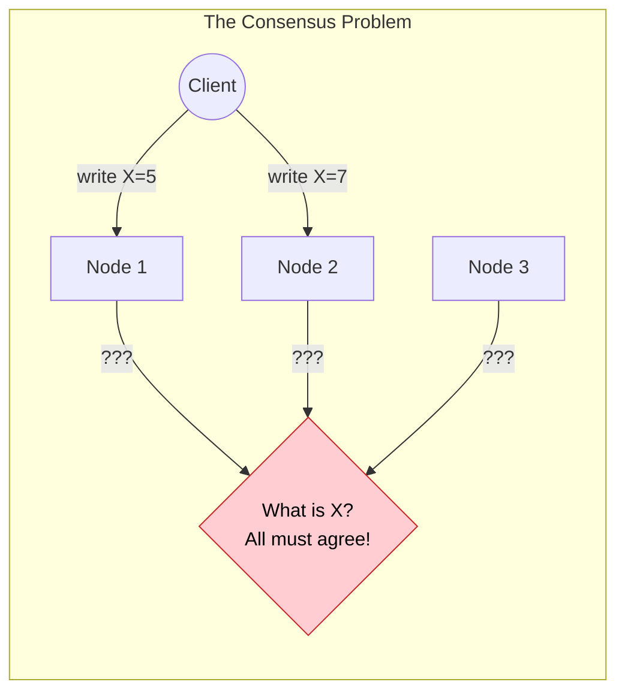
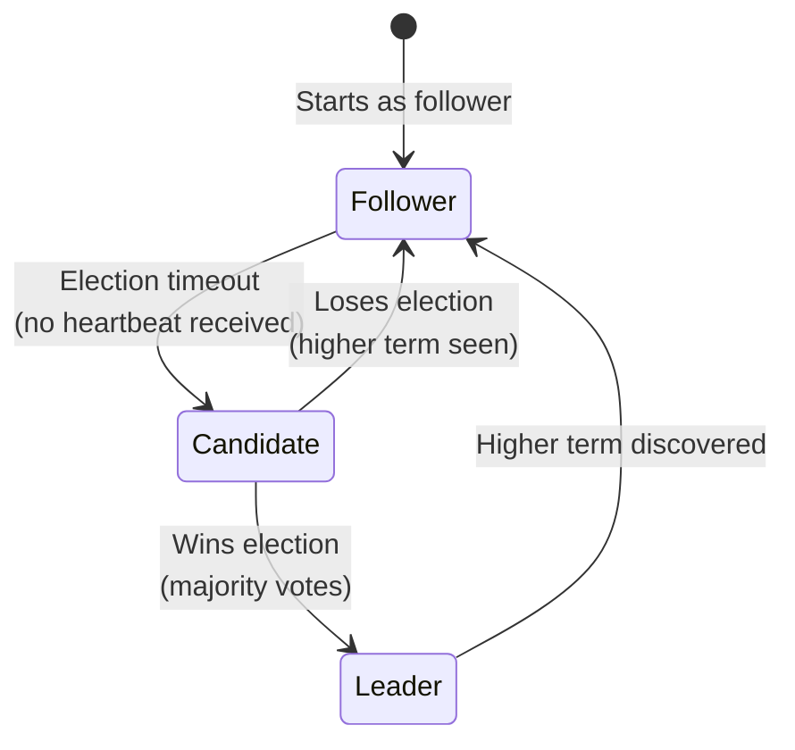
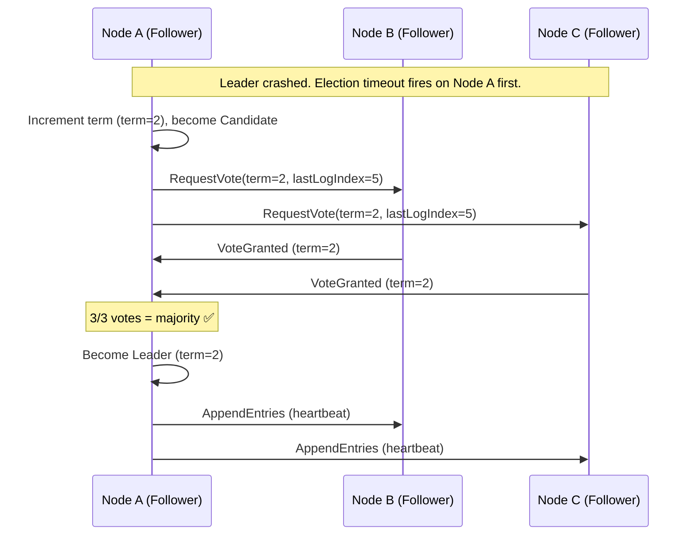
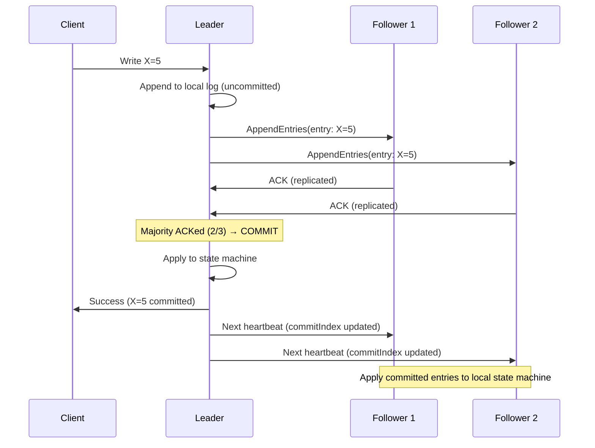
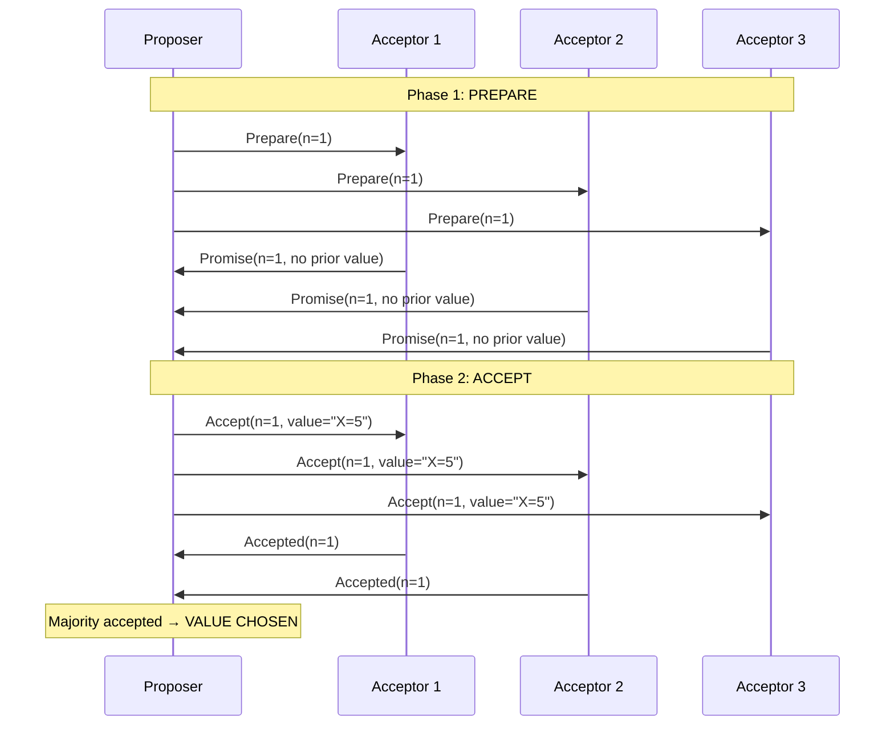
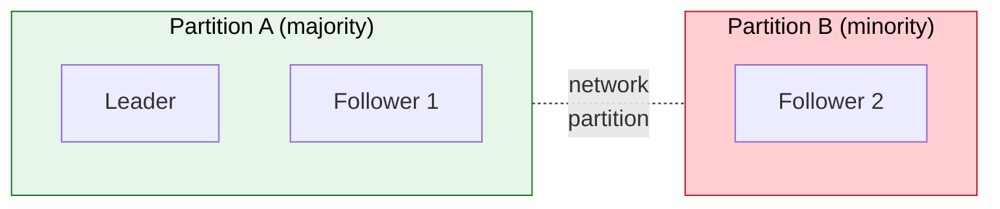

# Consensus Algorithms (Raft & Paxos)

> **How do distributed systems agree on a single truth when machines crash, networks partition, and messages get lost? Consensus is the hardest problem in distributed computing.**

---

!!! abstract "Real-World Analogy"
    Imagine a **jury deliberation** where jurors can't all be in the same room — they communicate via unreliable mail. Some jurors might be absent (crashed), letters might get lost (network failures), and they still need to reach a unanimous verdict that all present jurors agree on. That's consensus.

---

## Why Consensus Matters

Every distributed database, every replicated state machine, and every leader election mechanism needs consensus:

| System | Uses Consensus For |
|--------|-------------------|
| **etcd / ZooKeeper** | Distributed key-value agreement |
| **Kafka** | Partition leader election |
| **CockroachDB / Spanner** | Transaction commit across replicas |
| **Kubernetes** | etcd stores cluster state via Raft |
| **MongoDB** | Replica set leader election |

---

## The Problem Statement



**Requirements for valid consensus:**

| Property | Meaning |
|----------|---------|
| **Agreement** | All non-faulty nodes decide the same value |
| **Validity** | The decided value was proposed by some node |
| **Termination** | All non-faulty nodes eventually decide |
| **Integrity** | A node decides at most once |

!!! info "FLP Impossibility (1985)"
    Fischer, Lynch, and Paterson proved that in an asynchronous system with even ONE crash failure, deterministic consensus is **impossible**. Every practical algorithm "cheats" by using timeouts (partial synchrony), randomization, or failure detectors.

---

## Raft — Consensus Made Understandable

Raft was designed in 2014 explicitly to be **easier to understand** than Paxos while providing the same guarantees.

### Three Roles



| Role | Responsibility |
|------|---------------|
| **Leader** | Handles ALL client requests, replicates log to followers |
| **Follower** | Passively receives log entries, responds to leader |
| **Candidate** | Temporarily during election (requesting votes) |

### Leader Election



**Election rules:**
1. Follower's election timeout fires (randomized 150-300ms)
2. Becomes Candidate, increments term, votes for self
3. Sends `RequestVote` to all other nodes
4. Wins if receives majority votes (>N/2)
5. Each node votes at most ONCE per term
6. Candidate with stale log (lower lastLogIndex) gets rejected

### Log Replication



**Commit rule:** A log entry is committed when replicated to a **majority** of nodes. Even if the leader crashes after commit, the entry is safe (a new leader will have it).

### Safety Guarantee

```
If a log entry is committed in a given term, that entry will be present 
in the logs of ALL leaders for all higher-numbered terms.
```

This ensures: once you tell the client "write succeeded," that write survives any future leader changes.

---

## Paxos — The Original (Theoretical)

Paxos (1989, Lamport) is mathematically proven correct but notoriously difficult to implement.

### Roles in Paxos

| Role | Function |
|------|----------|
| **Proposer** | Proposes values (like Raft's leader) |
| **Acceptor** | Votes on proposals (like Raft's followers) |
| **Learner** | Learns the decided value (client/observer) |

### Basic Paxos (Single Value)



**Phase 1 (Prepare):**
- Proposer picks a unique proposal number `n`
- Sends `Prepare(n)` to all acceptors
- Acceptors promise not to accept proposals with number < n

**Phase 2 (Accept):**
- If majority promised, proposer sends `Accept(n, value)`
- Acceptors accept if they haven't promised a higher number
- If majority accepts, value is chosen

!!! note "Basic Paxos vs Multi-Paxos"
    Basic Paxos agrees on a **single value** — useful for theory but impractical alone. Production systems (Google Chubby, Spanner, etcd) use **Multi-Paxos** or Raft to agree on a **sequence of values** (a replicated log). Multi-Paxos elects a stable leader and skips Phase 1 for subsequent proposals, making it equivalent in structure to Raft. This is the form that actually matters in practice.

---

## Raft vs Paxos

| Aspect | Raft | Paxos |
|--------|------|-------|
| **Understandability** | Designed to be simple | Notoriously complex |
| **Leader** | Strong leader (all writes go through leader) | No explicit leader (any node can propose) |
| **Log structure** | Sequential, append-only | Can have gaps |
| **Membership changes** | Joint consensus (built-in) | Separate protocol needed |
| **Implementations** | etcd, Consul, CockroachDB | Chubby (Google), Spanner |
| **Learning curve** | Days | Weeks/months |
| **Correctness proofs** | Simpler (stronger invariants) | Harder (more general) |

!!! tip "For Interviews"
    Always explain Raft — it's designed to be explainable. Mention Paxos to show awareness, but dive deep on Raft's leader election and log replication. Interviewers rarely ask for Paxos details.

---

## Practical Considerations

### Quorum Size

```
For N nodes: quorum = ⌊N/2⌋ + 1 (majority)

3 nodes → quorum 2 → tolerates 1 failure
5 nodes → quorum 3 → tolerates 2 failures  
7 nodes → quorum 4 → tolerates 3 failures
```

!!! warning "Why Odd Numbers?"
    With 4 nodes, quorum is still 3 — same fault tolerance as 3 nodes! You pay for an extra node but gain nothing. Always use odd cluster sizes: 3, 5, or 7.

### Performance Implications

| Operation | Latency | Why |
|-----------|---------|-----|
| Read from leader | 1 RTT | Leader has latest committed state |
| Write | 1 RTT (client-perceived) | Client → leader, leader replicates to followers in parallel, majority ACK → responds to client. Internal leader-follower communication is pipelined within this single client RTT. |
| Read from follower | 1 RTT + staleness | May read uncommitted data (linearizability trade-off) |
| Leader election | 150-300ms | Election timeout + vote collection |

### Network Partitions



- **Partition A** (leader + 1 follower = majority): continues serving reads AND writes
- **Partition B** (1 follower = minority): cannot elect a new leader, becomes read-only (stale)
- When partition heals: follower in B catches up from leader's log

---

## Interview Questions

??? question "Explain how Raft leader election works."

    **Answer:** 
    
    1. Each node starts as a Follower with a randomized election timeout (150-300ms)
    2. If a follower doesn't receive a heartbeat before timeout → becomes Candidate
    3. Candidate increments its term, votes for itself, sends RequestVote to all others
    4. Other nodes grant vote if: (a) they haven't voted in this term yet, and (b) candidate's log is at least as up-to-date as theirs
    5. If candidate gets majority votes → becomes Leader, starts sending heartbeats
    6. If two candidates split the vote → both timeout, retry with new term (randomized timeout prevents infinite ties)

??? question "How does Raft handle a leader crash mid-replication?"

    **Answer:** If the leader crashes after sending AppendEntries to some but not all followers:
    
    - Entries NOT replicated to majority: will be overwritten by new leader's log
    - Entries replicated to majority: are committed and will survive
    
    The new leader (elected from the majority) will have all committed entries (election safety guarantee). It replays its log to followers, overwriting any uncommitted entries from the old leader.

??? question "Why can't you have consensus with just 2 nodes?"

    **Answer:** With 2 nodes, a majority is 2. If either node crashes, the remaining node can't form a majority alone — it can't distinguish between "the other node crashed" and "I'm network-partitioned from a healthy cluster." This leads to split-brain (both nodes think they're the leader) or deadlock (neither can proceed). Minimum viable consensus requires 3 nodes.
