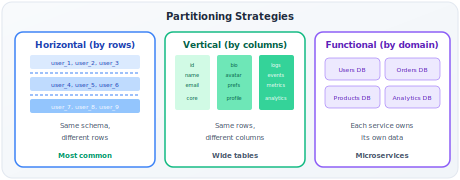

# Data Partitioning

!!! danger "Real Incident: Uber's Schemaless, 2014"
    Uber's trip data grew to billions of rows on PostgreSQL. Queries that took 5ms at 1M rows took 500ms at 1B rows. Backups took 18 hours. They built Schemaless — partitioned by city + time. Trip query in São Paulo only scans São Paulo's partition. Query time back to 5ms regardless of global data size. **Partitioning makes the impossible query fast by narrowing the search space.**

---

## Why This Comes Up in Interviews

Partitioning is more fundamental than sharding — it's the STRATEGY, while sharding is one implementation. It appears when:

- "How do you handle 1B+ rows efficiently?" → Partition
- "How do you design DynamoDB's key schema?" → Partition key + sort key
- "How do you avoid hot partitions in Kafka?" → Partition key design
- "How do you optimize time-series queries?" → Time-based partitioning

**Key distinction:** Partitioning = dividing data by some criteria. Sharding = partitioning across MACHINES. You can partition within one database.

---

## Partitioning vs Sharding vs Table Partitioning

| Concept | Where Data Lives | Who Manages | Example |
|---|---|---|---|
| **Table Partitioning** | Same machine, managed by DB | Database engine | PostgreSQL `PARTITION BY RANGE (created_at)` |
| **Partitioning (general)** | Any arrangement | Application or middleware | Kafka partitions, DynamoDB partitions |
| **Sharding** | Different machines | Application or proxy | Instagram's user_id-based PostgreSQL shards |

**Why it matters:** Table partitioning is free optimization (DB handles it). Sharding is an architectural decision with major trade-offs.

---

## Three Dimensions of Partitioning

### Horizontal Partitioning (Most Common)

**Split by rows:** Different rows in different partitions. Same schema everywhere.

| Method | How | Best For | Worst For |
|---|---|---|---|
| **Hash** | `partition = hash(key) % N` | Even distribution, point lookups | Range queries (must scan all) |
| **Range** | Partition by value ranges | Time-series, range scans | Hot partition on active range |
| **List** | Partition by explicit values | Geographic, categorical data | Uneven category sizes |
| **Composite** | Partition key (hash) + sort key (range) | Flexible (DynamoDB model) | Complex key design |

### Vertical Partitioning

**Split by columns:** Frequently-accessed columns separated from rarely-accessed ones.

| Example | Partition A (hot) | Partition B (cold) |
|---|---|---|
| User table | id, name, email, status | bio, avatar_url, preferences, settings |
| Product table | id, name, price, stock | description, reviews, specifications |

**Why:** If 95% of queries only need 4 columns, why load 40 columns from disk?

### Functional Partitioning

**Split by feature/domain:** Each bounded context gets its own database.

| Service | Database | Data |
|---|---|---|
| User service | users_db | Profiles, auth, preferences |
| Order service | orders_db | Orders, line items, payments |
| Inventory service | inventory_db | Stock levels, warehouses |
| Analytics service | analytics_db | Events, metrics, logs |

This is essentially the microservices "database per service" pattern.

---

## Partition Key Design — The DynamoDB Mental Model

DynamoDB's key model is the best framework for thinking about partition design in interviews:

**Partition Key (PK):** Determines WHICH partition. Must be high-cardinality, evenly distributed.
**Sort Key (SK):** Determines ORDER within a partition. Enables range queries.

### Design Patterns

| Access Pattern | Partition Key | Sort Key | Query |
|---|---|---|---|
| User's recent orders | user_id | order_timestamp | "Last 10 orders for user X" → single partition |
| Chat messages | conversation_id | message_timestamp | "Messages in convo Y since Z" → single partition |
| IoT sensor readings | device_id | reading_timestamp | "Device Z readings for today" → single partition |
| Product reviews | product_id | review_timestamp | "Latest reviews for product P" → single partition |

**The golden rule:** Design so that 95%+ of queries hit a SINGLE partition.

### Anti-Patterns (What NOT to Do)

| Bad Key | Why It Fails | Fix |
|---|---|---|
| `date` as PK | Today's partition gets ALL writes (hot) | Use `entity_id` as PK, `date` as SK |
| `status` as PK ("active"/"inactive") | Two partitions, 90% data in "active" | Use `user_id` as PK, query with filter |
| `country` as PK | US/India partition 100x larger than Iceland | Hash-based PK, country as attribute |
| Sequential `order_id` as PK | Recent orders all go to latest partition | Hash of order_id, or user_id as PK |

---

## The Hot Partition Problem — Deep Dive

**What makes a partition hot:**
- Celebrity account: one partition key gets 1000x traffic (Justin Bieber's timeline)
- Temporal hotspot: "today" partition gets all writes in time-series data
- Category skew: "electronics" category has 10x items vs "garden supplies"

**Back-of-envelope:**
- DynamoDB partition limit: ~3000 RCU / 1000 WCU per partition (baseline planning numbers — since 2018-2019, adaptive capacity and burst capacity allow individual partitions to temporarily exceed these limits, so they are no longer hard ceilings)
- Celebrity with 100M followers: follower fanout = 1M writes/sec during a post
- Single partition handles 1000 WCU → needs 1000 partitions for that ONE user

### Solutions by Pattern

| Pattern | Strategy | How | Trade-off |
|---|---|---|---|
| **Write sharding** | Add random suffix to PK | `celebrity_123#0` through `celebrity_123#9` | Reads scatter across 10 partitions → parallel read + merge |
| **GSI overloading** | Use multiple access patterns in one table | Different SK patterns for different queries | Complex schema |
| **Time bucketing** | Split hot time partition | `2024-01-15#0`, `2024-01-15#1` | Reads need multiple queries |
| **Separate table** | Hot data in dedicated table with higher capacity | VIP users → separate table | Operational overhead |
| **Caching** | Cache hot partition reads | Redis in front of hot partition | Cache invalidation |

**Instagram's approach:** For celebrity accounts, partition key = `user_id + random(0-9)`. Writes spread across 10 partitions. Reads: 10 parallel queries → merge → return. Works because read fanout (10 queries) is cheap, write hotspot (10,000 WCU on one partition) is impossible.

!!! warning "Read Fan-Out Tradeoff"
    Spreading writes across 10 partitions means reads now require scatter-gather across all 10, adding tail latency variance (p99 is bounded by the slowest partition). This is acceptable for write-heavy workloads (celebrity posts) but problematic for read-heavy patterns — if a key is read 1000x per second, you're paying 10,000 partition reads instead of 1,000. Only apply write sharding to genuinely write-hot keys.

---

## Secondary Indexes with Partitioned Data

**The core problem:** Primary data is partitioned by entity_id. But you also need to query by email, timestamp, or category.

| Index Type | Where It Lives | Read | Write | Consistency |
|---|---|---|---|---|
| **Local secondary index** | Same partition as data | Fast (same partition) | Fast (same partition) | Strong |
| **Global secondary index** | Separate partitions (by indexed attribute) | Fast (goes to right index partition) | Slow (async replication) | Eventually consistent |

### DynamoDB Example

- **Table:** PK = `user_id`, SK = `order_timestamp`
- **LSI:** Sort by `order_total` (same partition, different sort order)
- **GSI:** PK = `product_id`, SK = `order_timestamp` (query: "all orders for product X")

**GSI write amplification:** Every write to main table → also writes to GSI partitions. 3 GSIs = 4x write cost.

---

## Partitioning Strategies in Real Systems

| System | Partitioning | Key Design | Rebalancing |
|---|---|---|---|
| **DynamoDB** | Hash(PK) → partition | Composite key (PK + SK) | Automatic split on hot partition |
| **Cassandra** | Consistent hash ring | Partition key → token | Vnodes for even distribution |
| **Kafka** | Hash(message key) % partitions | Message key decides partition | Manual partition reassignment |
| **PostgreSQL** | Declarative (RANGE, LIST, HASH) | Any column(s) | Manual (attach/detach partitions) |
| **Elasticsearch** | Hash(doc_id) % shards | Document _id or custom routing | Shard allocation API |
| **BigQuery** | Time-based + clustering | Ingestion time or column | Automatic |
| **MongoDB** | Range or hash | Shard key field | Automatic chunk splitting + migration |

---

## PostgreSQL Table Partitioning (Free Performance)

**When:** Single table > 10M rows with identifiable access patterns (usually time-based).

| Benefit | How |
|---|---|
| **Query speed** | Partition pruning — DB skips irrelevant partitions entirely |
| **Vacuum speed** | Vacuum each partition independently (smaller tables) |
| **Bulk delete** | Drop old partition instead of DELETE (instant vs hours) |
| **Index size** | Smaller indexes per partition (fit in memory) |

**Common patterns:**

| Data Type | Partition By | Retention |
|---|---|---|
| Logs/events | Monthly or weekly | Drop partitions > 90 days |
| Orders | Monthly | Keep forever, archive old to cold storage |
| Time-series metrics | Daily | Drop partitions > 30 days |
| Audit trail | Yearly | Compress old partitions |

**Back-of-envelope benefit:**
- 1B row table, query needs last 7 days
- Without partitioning: index scan on 1B rows → seconds
- With daily partitions: only 7 partitions scanned, each ~3M rows → milliseconds
- Speedup: ~50x for time-bounded queries

---

## Partition Rebalancing

**When needed:** Partition grows too large, or load becomes uneven.

| Strategy | How | Downtime | Used By |
|---|---|---|---|
| **Fixed partitions** | Create many upfront, never change | None | Kafka (can't change partition count easily) |
| **Dynamic splitting** | Hot/large partition automatically splits | None | DynamoDB, HBase |
| **Consistent hashing** | Add node → steal ~1/N from all others | Minimal | Cassandra |
| **Manual rebalance** | Operator triggers migration | Depends | Elasticsearch (shard allocation) |

**DynamoDB auto-split:**
- Partition gets > 10GB or > 3000 RCU → automatically splits into two
- No downtime, no application awareness needed
- But: too many splits = too many partitions = metadata overhead

---

## Interview Framework

**When designing a data model:**

> **Step 1 — Identify access patterns:** "The primary queries are [per-user lookups / time-range scans / category filtering]. This tells me the partition key should be [entity that 95%+ queries filter by]."
>
> **Step 2 — Choose partition key:** "I'd partition by [user_id/device_id/conversation_id] because it's [high cardinality, immutable, matches access pattern]. Sort key would be [timestamp] for range queries within partition."
>
> **Step 3 — Hot partition mitigation:** "If any entity becomes disproportionately hot, I'd use write sharding — append random suffix to PK, reads do parallel scatter-gather across suffixes."
>
> **Step 4 — Secondary access:** "For queries not aligned with PK (e.g., 'all orders for product X'), I'd add a [GSI / Elasticsearch index / denormalized table]."
>
> **Step 5 — Rebalancing:** "I'd use [DynamoDB auto-split / logical partition indirection / over-provisioned partition count] so growth doesn't require manual intervention."

---

## Quick Recall

| Question | Answer |
|---|---|
| Partitioning vs sharding? | Partitioning = logical division. Sharding = across machines. |
| Hash vs range partition? | Hash = even distribution, no range queries. Range = range queries, hotspot risk. |
| Composite key model? | Partition key (hash → which partition) + Sort key (range within partition) |
| Hot partition fix? | Write sharding (random suffix), caching, separate table |
| DynamoDB auto-split? | Partition > 10GB or > 3000 RCU → splits automatically |
| Table partitioning benefit? | Partition pruning, faster vacuum, instant bulk delete |
| Secondary index trade-off? | Local = strong consistency. Global = eventual, async replication. |
| Golden rule? | 95%+ queries should hit single partition |
