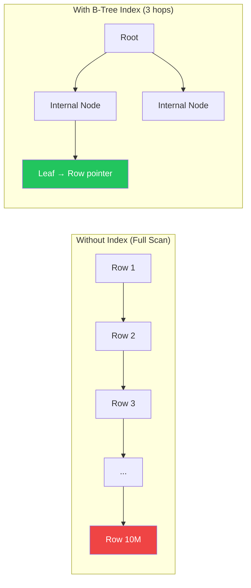
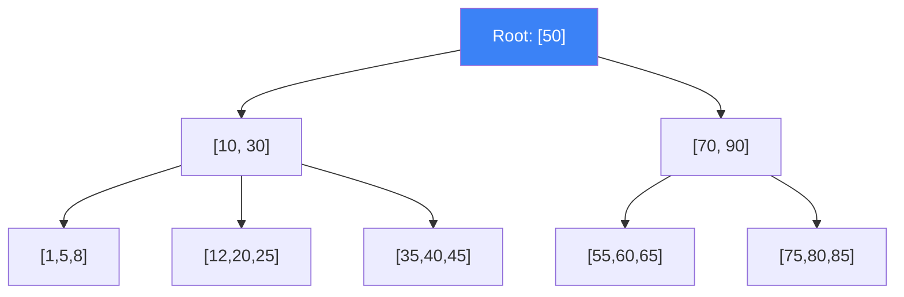

# Database Indexing Deep Dive

!!! danger "Real Incident: Shopify Black Friday 2020"
    A missing index on the `orders` table's `created_at` column caused a dashboard query to do a full table scan across 500M rows. Query time: 45 seconds. During Black Friday traffic surge, this query ran every 30 seconds, locking the database. Adding a single index dropped it to **3ms** — a 15,000x improvement from one line of DDL.

---

## Why This Comes Up in Interviews

Every system design involves databases, and indexes are the #1 performance lever. Interviewers want to hear:

- How indexes work internally (B-Tree vs Hash vs LSM)
- When to add an index vs when NOT to (write amplification trade-off)
- Composite index design and column ordering
- How to identify missing indexes from query patterns

---

## How Indexes Work — The Mental Model

**Without index:** Database reads every row to find matches (full table scan)
**With index:** Database jumps directly to matching rows (like a book's index)



| Without Index | With Index |
|---|---|
| O(N) — scan every row | O(log N) — tree traversal |
| 10M rows → 10M comparisons | 10M rows → ~23 comparisons |
| Gets worse as data grows | Stays fast regardless of size |

---

## Index Types

### B-Tree Index (Default — 90% of cases)



| Property | B-Tree |
|---|---|
| **Best for** | Equality (`=`) and range queries (`>`, `<`, `BETWEEN`) |
| **Ordered** | Yes — supports ORDER BY without extra sort |
| **Depth** | Usually 3-4 levels (even for billions of rows) |
| **Write cost** | Moderate (rebalance on insert) |
| **Use when** | Default choice for most columns |

### Hash Index

| Property | Hash Index |
|---|---|
| **Best for** | Exact equality (`=`) only |
| **Range queries** | Not supported |
| **Speed** | O(1) lookup (faster than B-Tree for equality) |
| **Use when** | Lookup by exact key (session tokens, cache keys) |

### Other Index Types

| Type | Use Case | Example |
|---|---|---|
| **GIN (Generalized Inverted)** | Full-text search, JSONB, arrays | `WHERE tags @> '{java}'` |
| **GiST (Generalized Search Tree)** | Geospatial, range types | `WHERE location <-> point(x,y) < 5km` |
| **BRIN (Block Range)** | Very large tables with natural ordering | Time-series data (ordered by timestamp) |
| **Partial index** | Index subset of rows | `WHERE status = 'active'` (skip 90% inactive) |
| **Covering index (INCLUDE)** | Avoid table lookup | Index contains all needed columns |

---

## Composite Index Design

**Rule: Left-to-right matching. Column order matters.**

```sql
CREATE INDEX idx_orders ON orders(customer_id, status, created_at);
```

| Query | Uses Index? | Why |
|---|---|---|
| `WHERE customer_id = 123` | Yes | Leftmost prefix |
| `WHERE customer_id = 123 AND status = 'active'` | Yes | First two columns |
| `WHERE customer_id = 123 AND status = 'active' AND created_at > '2024-01-01'` | Yes (full) | All three columns |
| `WHERE status = 'active'` | **No** | Skips first column |
| `WHERE customer_id = 123 AND created_at > '2024-01-01'` | Partial | Uses customer_id, skips status |

### Column Ordering Rules

1. **Equality conditions first** (`=`)
2. **Range conditions last** (`>`, `<`, `BETWEEN`, `LIKE 'prefix%'`)
3. **High-cardinality columns before low-cardinality** (user_id before status)

---

## The Write Amplification Trade-off

| More Indexes | Fewer Indexes |
|---|---|
| Faster reads | Slower reads (more scans) |
| Slower writes (update every index on INSERT/UPDATE) | Faster writes |
| More disk space | Less disk space |
| More memory (indexes in buffer pool) | More memory for data pages |

**Rule of thumb:** Each index adds ~10-20% write overhead. A table with 10 indexes means every INSERT updates 10 B-Trees.

---

## Identifying Missing Indexes

### From Query Patterns

```sql
-- Slow query log shows:
SELECT * FROM orders WHERE customer_id = ? AND created_at > ? ORDER BY created_at DESC LIMIT 20;

-- Solution: composite index
CREATE INDEX idx_orders_customer_date ON orders(customer_id, created_at DESC);
```

### Using EXPLAIN

```sql
EXPLAIN ANALYZE SELECT * FROM orders WHERE customer_id = 123;

-- Bad: "Seq Scan on orders" (full scan)
-- Good: "Index Scan using idx_orders_customer" 

-- Key metrics:
--   Actual rows: how many rows examined
--   Planning time vs Execution time
--   "Rows Removed by Filter" = wasted work
```

---

## Index Anti-Patterns

| Anti-Pattern | Problem | Fix |
|---|---|---|
| Index on every column | Write performance destroyed | Index only queried columns |
| Index on low-cardinality (`boolean`) | B-Tree scan is barely better than full scan | Use partial index instead |
| Unused indexes | Waste write performance + disk | Monitor `pg_stat_user_indexes` |
| Function on indexed column | `WHERE UPPER(email) = 'X'` bypasses index | Expression index or generated column |
| Leading wildcard | `WHERE name LIKE '%smith'` can't use B-Tree | Full-text search (GIN) or trigram index |

---

## Interview Cheat Sheet

| Question | Answer |
|---|---|
| "How do indexes speed up queries?" | "B-Tree: O(log N) lookup instead of O(N) scan. 10M rows → 23 comparisons instead of 10M. Tree depth rarely exceeds 4 levels." |
| "When NOT to index?" | "Write-heavy tables with few reads. Low-cardinality columns (boolean). Tiny tables (<1000 rows). Columns rarely in WHERE/JOIN." |
| "Composite index column order?" | "Equality columns first, range columns last. Matches left-to-right only — skipping the first column means the index isn't used." |
| "Covering index?" | "Index contains all columns the query needs (via INCLUDE). Database returns data from index without touching the table — index-only scan." |
| "How many indexes per table?" | "Typically 3-7 for OLTP. Each adds ~10-20% write cost. Monitor unused indexes and drop them." |

---

## Back-of-Envelope: Index Size

**Table:** 100M rows, indexed column is BIGINT (8 bytes)

| Component | Size |
|---|---|
| Key per entry | 8 bytes |
| Pointer per entry | 6 bytes |
| B-Tree overhead | ~40% |
| **Total index size** | ~100M × 14 × 1.4 ≈ **2 GB** |
| Tree depth | log(100M) / log(500) ≈ **3 levels** |
| Lookup IOs | 3 (one per tree level) |
