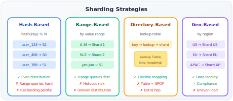

# Database Sharding

!!! danger "Real Incident: Instagram, 2012"
    Instagram hit 25M users on a single PostgreSQL instance. Write throughput maxed at 15K TPS. Vertical scaling hit $30K/month EC2 ceiling. They sharded by user_id — each shard holds a range of users. Scaled to 2B+ accounts. **Every large-scale system eventually shards. The question isn't IF but WHEN and HOW.**

---

## Why This Comes Up in Every Design Interview

When you say "I'll use PostgreSQL" in an interview, the natural follow-up is: "What happens at 100M users? 1B rows? 50K writes/sec?" The answer is sharding. Interviewers specifically test:

- Can you identify WHEN to shard (not too early, not too late)
- Can you choose a shard key that avoids hotspots
- Do you understand the problems sharding creates (joins, transactions, resharding)
- Can you reason about alternatives before jumping to sharding

---

## The Scaling Staircase — Shard LAST, Not First

| Stage | Strategy | Handles | Cost |
|---|---|---|---|
| 1 | **Optimize queries + indexes** | 10x current load | Free |
| 2 | **Vertical scaling** (bigger machine) | Up to ~$50K/month instance | Money |
| 3 | **Read replicas** (write to primary, read from replicas) | 5-10x read throughput | Replication lag complexity |
| 4 | **Caching** (Redis/Memcached in front of DB) | 100x read throughput | Cache invalidation |
| 5 | **Table partitioning** (within single instance) | Larger data, faster queries | DB-managed, limited |
| 6 | **Sharding** (data across multiple instances) | Near-unlimited scale | Significant complexity |

**Interview gold:** "I'd exhaust vertical scaling, read replicas, and caching before sharding. Sharding adds enormous complexity — cross-shard queries, distributed transactions, resharding operations. But when a single machine can't handle the write throughput or data volume, it's the only option."

---

## Back-of-Envelope: When to Shard

**PostgreSQL practical limits on a single instance (~$20K/month machine):**

| Resource | Practical Limit | Warning Sign |
|---|---|---|
| Table size | ~1-5 TB | Queries slow, vacuum takes hours |
| Write TPS | ~20-50K TPS | Write latency increasing |
| Connections | ~500-1000 | Connection pool exhaustion |
| Storage IOPS | ~50K IOPS (NVMe) | I/O wait increasing |

**Example calculation:** Social media platform, 500M users, 5 posts/user/day:

| Metric | Value | Calculation |
|---|---|---|
| Daily posts | 2.5B | 500M × 5 |
| Writes/sec | ~29K | 2.5B / 86400 |
| Peak writes/sec (10x) | ~290K | Well beyond single-instance |
| Storage/year | ~25 TB | 2.5B × 365 × ~30 bytes per row |
| **Verdict** | Must shard | Single instance maxes at ~50K writes/sec |

---

## Choosing a Shard Key (The Most Critical Decision)

The shard key determines everything: query routing, data distribution, hotspot risk. Once chosen, it's extremely expensive to change.

**Properties of a good shard key:**

| Property | Why | Example |
|---|---|---|
| **High cardinality** | Even distribution across many shards | user_id (millions of values) |
| **Even distribution** | No shard gets disproportionate load | UUID > sequential ID (sequential causes write hotspot on latest shard) |
| **Matches access pattern** | Queries hit one shard, not all | Shard by user_id if most queries are per-user |
| **Immutable** | Key change = data movement | user_id (never changes) > email (can change) |
| **Not correlated with time** | Avoids "hot newest shard" | Hash of user_id > creation_date |

**How to evaluate a shard key — the scatter/gather test:**

- "What % of my queries can be answered by a single shard?"
- Target: >95% single-shard queries
- If most queries need ALL shards (scatter-gather), your key is wrong

---

## Sharding Strategies Compared



### Hash-Based Sharding

```
shard = hash(user_id) % num_shards
```

| Pros | Cons |
|---|---|
| Even distribution | Range queries impossible (scan all shards) |
| Simple routing | Adding shards = rehash everything (unless consistent hashing) |
| No hotspots (with good hash) | Can't colocate related data |

**When:** Even distribution is priority, access is by primary key.

### Range-Based Sharding

```
Shard 1: user_id 1 - 1M
Shard 2: user_id 1M - 2M
...
```

| Pros | Cons |
|---|---|
| Range queries efficient | Hotspot on "active range" (newest users) |
| Easy to understand | Uneven distribution over time |
| Can add shards for new ranges | Requires manual rebalancing |

**When:** Data is naturally ordered and range queries are important (time-series, analytics).

### Directory-Based Sharding

| Key | Shard |
|---|---|
| user_1 - user_500K | shard_1 |
| user_500K - user_1.2M | shard_2 |
| user_1.2M - user_3M | shard_3 |

| Pros | Cons |
|---|---|
| Flexible mapping (any logic) | Directory = SPOF + bottleneck |
| Easy rebalancing | Extra network hop for lookup |
| Handles uneven data | Directory must be cached/replicated |

**When:** Need flexibility, or combining strategies (move hot users to dedicated shards).

---

## Compound Shard Keys (DynamoDB Pattern)

**Problem:** You need both even distribution AND range queries within an entity.

**Solution:** Compound key = Partition Key (hash distribution) + Sort Key (range within partition)

| Example | Partition Key | Sort Key | Query Pattern |
|---|---|---|---|
| User's posts | user_id | timestamp | "All posts by user in date range" |
| Order items | order_id | item_id | "All items in an order" |
| Chat messages | conversation_id | message_timestamp | "Recent messages in conversation" |

**Why this works:** All data for one entity (user, order, conversation) lives on the same shard. Range queries work within-shard. No scatter-gather needed.

---

## The Hard Problems Sharding Creates

### 1. Cross-Shard Queries (Scatter-Gather)

**Problem:** "Show all orders over $100 across all users"

- Must query EVERY shard, merge results
- Latency = slowest shard
- Can't use DB-level sorting/pagination across shards

**Mitigations:**

- Denormalize: duplicate data to enable single-shard queries
- Secondary index service: Elasticsearch indexes all data for complex queries
- Materialized views: Pre-compute aggregates

### 2. Cross-Shard Transactions

**Problem:** Transfer money from user on Shard 1 to user on Shard 3

- No single DB transaction spans shards
- Need distributed transaction (2PC) or eventual consistency

**Mitigations:**

| Approach | How | Trade-off |
|---|---|---|
| **Two-Phase Commit (2PC)** | Coordinator asks all shards to prepare, then commit | Slow, blocks on failures |
| **Saga pattern** | Sequence of local transactions + compensations | Eventually consistent, complex |
| **Co-locate** | Put related data on same shard | Limits flexibility |

### 3. Resharding (Adding Shards)

**Problem:** Started with 10 shards, now need 20. With `hash % N`, ALL keys remap.

**Solutions:**

| Strategy | How | Downtime |
|---|---|---|
| **Consistent hashing** | Only 1/N keys move | Minimal |
| **Logical shards** | Create 1000 logical shards, map to physical. Remap = move logical shards. | Minutes |
| **Double-write migration** | Write to old + new, read from new once caught up | Zero downtime |
| **Vitess/ProxySQL** | Middleware handles resharding transparently | Application unaware |

### 4. Unique Constraints Across Shards

**Problem:** "Email must be unique globally" but data is on different shards.

**Solutions:**

- Global unique index (separate service/table)
- Shard by the unique field (email)
- UUIDs instead of sequences (guaranteed unique without coordination)
- Snowflake IDs (Twitter): timestamp + machine_id + sequence = unique + sortable

### 5. JOINs Across Shards

**Problem:** `SELECT * FROM orders JOIN users ON...` when orders and users on different shards.

**Solutions:**

- **Denormalize:** Store user_name in orders table (duplicate data)
- **Application-level join:** Fetch from both shards, join in code
- **Co-locate:** Shard orders by user_id too (same shard)
- **Separate analytics DB:** ETL into data warehouse for complex queries

---

## Real-World Sharding Examples

| Company | Strategy | Shard Key | Details |
|---|---|---|---|
| **Instagram** | Hash (pgbouncer + custom) | user_id | Logical shards → physical mapping |
| **Uber** | Geo + hash | city_id | Trips sharded by city for locality |
| **Stripe** | Directory | merchant_id | Hot merchants on dedicated shards |
| **Discord** | Hash (Cassandra) | guild_id | Messages sharded per guild |
| **Vitess (YouTube)** | Hash (MySQL) | Configurable keyspace | Middleware manages sharding transparently |
| **Pinterest** | Hash (MySQL) | object_id | 8192 logical shards, ~100 physical |
| **Facebook** | Hash (MySQL + TAO) | user_id | Thousands of shards, custom routing |

---

## Logical vs Physical Shards (Pinterest/Uber Pattern)

**The trick:** Don't map keys directly to physical machines. Add an indirection layer.

```
Step 1: key → logical_shard_id (hash % 8192)
Step 2: logical_shard_id → physical_machine (lookup table)
```

**Why:** 

- Start with 8192 logical shards on 4 physical machines (2048 logical per physical)
- Need more capacity? Move 1024 logical shards to a new machine
- No key remapping, no data copying logic change
- Just update the mapping table

**Pinterest's approach:** Started with 8192 logical shards. Currently mapped to ~150 physical database instances. Never needed to rehash.

---

## Interview Framework

**When the interviewer asks about scaling your database:**

> **Step 1 — Delay sharding:** "First I'd add read replicas for read-heavy queries and a cache layer. This gets us to [X] scale without sharding complexity."
>
> **Step 2 — When to shard:** "Once we exceed [single-machine write capacity / storage], I'd introduce sharding. For this system, that's around [Y] users / [Z] writes/sec."
>
> **Step 3 — Shard key choice:** "I'd shard by [user_id/merchant_id/entity_id] because [95%+ of queries are per-entity, it's immutable, high cardinality, evenly distributed]."
>
> **Step 4 — Strategy:** "I'd use [hash-based with consistent hashing / logical shards mapped to physical] so resharding doesn't require data rehashing."
>
> **Step 5 — Address hard problems:** "For cross-shard queries, I'd [denormalize / use Elasticsearch]. For distributed transactions, I'd use the [saga pattern / co-locate]. For unique constraints, [global index / UUID]."

---

## Quick Recall

| Question | Answer |
|---|---|
| When to shard? | After exhausting vertical scaling + read replicas + caching |
| Best shard key properties? | High cardinality, even distribution, matches access pattern, immutable |
| Scatter-gather test? | >95% queries should hit single shard |
| Hash vs range? | Hash = even distribution. Range = efficient range queries. |
| Resharding without downtime? | Logical shard indirection OR consistent hashing |
| Cross-shard joins? | Denormalize, co-locate, or separate analytics service |
| Unique constraints across shards? | Global unique index, UUID, or shard by the unique field |
| Pinterest pattern? | 8192 logical shards → N physical machines. Remap mapping, not data. |
