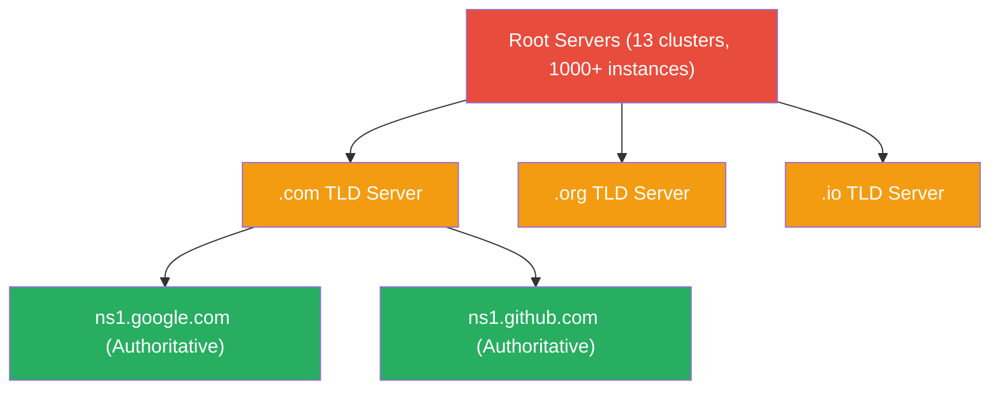
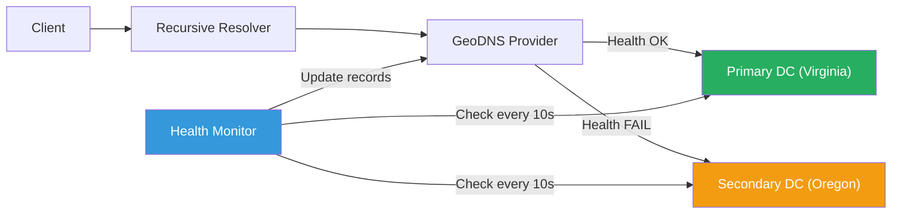

# DNS Deep Dive

!!! danger "Real Incident: Dyn DDoS Attack (October 2016)"
    On October 21, 2016, a massive DDoS attack targeted Dyn, a major DNS provider. The Mirai botnet — 100,000+ compromised IoT devices — flooded Dyn with 1.2 Tbps of traffic. Result: Twitter, GitHub, Netflix, Reddit, Spotify, and dozens of major sites went **completely unreachable** for hours. The sites themselves were fine — their servers were running. But nobody could resolve their domain names to IP addresses. **DNS is the single most critical piece of internet infrastructure, and a single provider failure took down half the internet.**

---

## Why This Comes Up in Interviews

Every system design begins with a user typing a URL. DNS is the entry point for all distributed systems. Interviewers want to hear:

- How DNS resolution actually works (not just "it translates names to IPs")
- How you design for DNS failover and redundancy
- How GeoDNS enables global load balancing
- TTL trade-offs between availability and freshness
- How DNS becomes a bottleneck or single point of failure

---

## DNS Hierarchy — The Tree Structure

| Level | What | Count | Example |
|---|---|---|---|
| **Root** | Starting point for all queries | 13 logical servers (1000+ physical via anycast) | `a.root-servers.net` |
| **TLD** | Manages a top-level domain | ~1500 TLDs | `.com`, `.org`, `.io`, `.dev` |
| **Authoritative** | Holds actual DNS records for a domain | Per-domain | `ns1.google.com` |
| **Recursive Resolver** | Caches and resolves on behalf of clients | ISPs, 8.8.8.8, 1.1.1.1 | Google Public DNS |

---

## Resolution Process — Step by Step

**Query: What is the IP address of `api.stripe.com`?**

| Step | Who | Action | Typical Latency |
|---|---|---|---|
| 1 | Browser | Check browser DNS cache | 0ms |
| 2 | OS | Check OS DNS cache (`/etc/hosts`, system cache) | 0ms |
| 3 | Recursive Resolver | Check resolver cache (ISP or 8.8.8.8) | 1-5ms |
| 4 | Resolver → Root | "Who handles `.com`?" → Returns TLD server IPs | 20-50ms |
| 5 | Resolver → TLD | "Who handles `stripe.com`?" → Returns authoritative NS | 20-50ms |
| 6 | Resolver → Authoritative | "What is `api.stripe.com`?" → Returns A record | 20-50ms |
| 7 | Resolver → Client | Caches answer (per TTL), returns to client | 1ms |

**Total uncached resolution:** ~100-200ms (3-4 network hops)
**Cached resolution:** <5ms (resolver already knows the answer)

**The math:** With a 300s TTL and 1000 req/s to the same domain, only 1 in 300,000 requests actually triggers full resolution. Cache hit rate: 99.9997%.

---

## DNS Record Types

| Record | Purpose | Example | Interview Relevance |
|---|---|---|---|
| **A** | Domain → IPv4 address | `stripe.com → 104.21.5.77` | Basic resolution |
| **AAAA** | Domain → IPv6 address | `stripe.com → 2606:4700::6812` | IPv6 support |
| **CNAME** | Domain → another domain (alias) | `www.stripe.com → stripe.com` | CDN integration, cannot coexist with other records at zone apex |
| **MX** | Mail server for domain | `stripe.com → mail.stripe.com (priority 10)` | Email routing |
| **NS** | Authoritative nameservers | `stripe.com → ns1.stripe.com` | Delegation |
| **TXT** | Arbitrary text (verification, SPF) | `stripe.com → "v=spf1 include:..."` | Domain verification |
| **SRV** | Service discovery (host + port) | `_http._tcp.api.stripe.com → 443 api1.stripe.com` | Microservices |
| **SOA** | Zone authority metadata | Contains serial, refresh, retry, expire | Zone transfers |

**CNAME trap (common interview gotcha):** You CANNOT have a CNAME at the zone apex (`stripe.com`). Why? CNAME must be the only record at a name, but apex needs SOA and NS records. Solution: use ALIAS/ANAME (provider-specific) or A records.

---

## TTL — The Critical Trade-off

| TTL Value | Pros | Cons | Use Case |
|---|---|---|---|
| **30-60s** | Fast failover, quick changes | High query load on authoritative servers | Active failover systems |
| **300s (5min)** | Good balance | 5min stale window | Most web services |
| **3600s (1hr)** | Low query load, high cache hit | Slow failover (up to 1hr stale) | Stable services |
| **86400s (1day)** | Minimal DNS traffic | Cannot change quickly | Rarely-changing records |

**Pre-migration trick:** Before a DNS migration, lower TTL to 60s 48 hours in advance. Old TTL (say 24hr) needs time to expire from all caches. Then migrate. Then raise TTL back.

---

## DNS Load Balancing

| Strategy | How | Pros | Cons |
|---|---|---|---|
| **Round-robin** | Return multiple A records, rotate order | Simple, no special infrastructure | No health awareness, uneven load |
| **Weighted** | Return records with weighted probability | Control traffic split (90/10 canary) | Limited granularity |
| **GeoDNS** | Return different IPs based on client location | Users hit nearest datacenter | Inaccurate for VPN users |
| **Latency-based** | Route to lowest-latency endpoint | Best user experience | Requires latency measurement |
| **Failover** | Health-check endpoints, remove unhealthy | High availability | TTL delay in failover |

**GeoDNS resolution example:**

| User Location | Query | Response | Datacenter |
|---|---|---|---|
| Tokyo, Japan | `api.company.com` | `103.21.x.x` | Tokyo DC |
| London, UK | `api.company.com` | `185.45.x.x` | London DC |
| New York, US | `api.company.com` | `104.16.x.x` | Virginia DC |

---

## DNS Failover Architecture

**Failover timing math:**

- Health check interval: 10s
- Failure threshold: 3 consecutive failures
- Detection time: 30s
- DNS TTL: 60s
- **Worst-case failover: 90s** (failure happens right after health check + TTL hasn't expired)

---

## DNS Security

| Threat | Attack | Mitigation |
|---|---|---|
| **Cache poisoning** | Attacker injects fake records into resolver cache | DNSSEC (cryptographic signing of records) |
| **DDoS on DNS** | Flood DNS servers (like Dyn attack) | Anycast, multiple providers, over-provisioning |
| **DNS hijacking** | Compromise registrar, change NS records | Registrar lock, DNSSEC, monitoring |
| **DNS tunneling** | Exfiltrate data encoded in DNS queries | Monitor query patterns, limit TXT record sizes |

---

## Interview Framework

**When DNS comes up in system design:**

> **Step 1:** "Users resolve our domain through DNS. I'd use a managed DNS provider (Route53/Cloudflare) with GeoDNS to route users to the nearest datacenter for lowest latency."
>
> **Step 2:** "For high availability, I'd configure health-check-based failover with a 60s TTL. If the primary datacenter goes down, DNS automatically routes to the secondary within 90 seconds worst-case."
>
> **Step 3:** "For global load balancing, GeoDNS returns different IPs based on user geography — Tokyo users hit Asia-Pacific servers, EU users hit Frankfurt."
>
> **Step 4:** "To avoid the Dyn-style single point of failure, I'd use multiple DNS providers (Route53 + Cloudflare) with the same zone data. If one provider goes down, the other still resolves."

---

## Quick Recall

| Question | Answer |
|---|---|
| How many root servers? | 13 logical (a through m), 1000+ physical instances via anycast |
| Full resolution hops? | Client → Resolver → Root → TLD → Authoritative (3-4 hops) |
| Why can't CNAME be at apex? | CNAME must be sole record; apex requires SOA + NS |
| GeoDNS purpose? | Route users to nearest datacenter based on IP geolocation |
| TTL trade-off? | Low = fast failover but high DNS load; High = low load but slow changes |
| DNS failover worst-case? | Detection time + TTL (typically 60-90 seconds) |
| How to prevent Dyn-style failure? | Multi-provider DNS (Route53 + Cloudflare with same zone) |
| DNSSEC purpose? | Cryptographically sign records to prevent cache poisoning |
