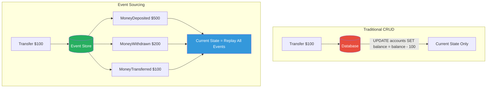
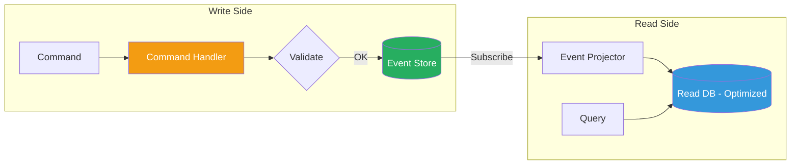

# Event Sourcing

!!! danger "Real Incident: LMAX Exchange — 6 Million Transactions/Second on a Single Thread"
    In 2010, LMAX Exchange needed to process financial trades with microsecond latency. Traditional CRUD with a database? 10,000 ops/s max. Their solution: event sourcing with an in-memory model, replaying events at startup. The result — a single-threaded business logic processor handling **6 million transactions per second** with deterministic replay for recovery. When a node crashes, it replays the event log and is back in service in seconds. **Event sourcing didn't just solve their consistency problem — it gave them 600x throughput over traditional architectures.**

---

## Why This Comes Up in Interviews

Event sourcing appears in designs for financial systems, audit-heavy domains, and any system needing "time travel." Interviewers want to hear:

- Why append-only is fundamentally different from update-in-place
- How you handle event replay and system recovery
- When CQRS is needed alongside event sourcing
- Concrete trade-offs: storage cost, complexity, query patterns
- How eventual consistency manifests and how you manage it

---

## Event Sourcing vs Traditional CRUD

| Aspect | Traditional CRUD | Event Sourcing |
|---|---|---|
| **Storage** | Current state only | Full history of changes |
| **What's saved** | `balance = 300` | `[deposited 500, withdrew 200, transferred 100]` |
| **Audit trail** | Must be bolted on (often incomplete) | Built-in, immutable, complete |
| **Recovery** | Restore from backup (point-in-time) | Replay events to any point in time |
| **Schema changes** | Migrate rows in-place | Old events preserved, new projections adapt |
| **Debugging** | "Why is balance 300?" — no idea | Replay shows exactly what happened and when |
| **Storage cost** | Lower (only current state) | Higher (every event stored forever) |

---

## Core Components

| Component | Role | Example |
|---|---|---|
| **Event** | Immutable fact that happened | `OrderPlaced { orderId: 123, items: [...], timestamp: ... }` |
| **Event Store** | Append-only log of events | Kafka topic, EventStoreDB, DynamoDB stream |
| **Aggregate** | Domain entity rebuilt from events | `Order` aggregate replayed from its event stream |
| **Projection** | Read-optimized view built from events | "All orders by customer" table |
| **Snapshot** | Cached state at a point to avoid full replay | `Order#123 state at event #5000` |

---

## Event Store Design

| Property | Requirement | Why |
|---|---|---|
| **Append-only** | Events are never updated or deleted | Immutability guarantees audit + replay correctness |
| **Ordered** | Events within a stream have strict ordering | Replay must be deterministic |
| **Durable** | Events survive crashes | They are the source of truth |
| **Partitioned** | Events grouped by aggregate ID | Efficient replay of single entity |

**Back-of-envelope: Storage sizing**

| Metric | Value |
|---|---|
| Events per order | ~10 (placed, confirmed, paid, picked, shipped, delivered...) |
| Orders per day | 1 million |
| Events per day | 10 million |
| Average event size | 500 bytes |
| Daily storage | 5 GB |
| Annual storage | 1.8 TB |
| With 3x replication | 5.4 TB/year |

At ~$0.02/GB/month for cold storage: **~$1,300/year** — cheap for a complete audit trail.

---

## Snapshots — Avoiding Full Replay

**The problem:** An aggregate with 100,000 events takes seconds to replay on every request.

**The solution:** Periodically save a snapshot of the current state.

| Strategy | How | When to Snapshot |
|---|---|---|
| **Every N events** | Snapshot after every 100 events | Simple, predictable |
| **Time-based** | Snapshot daily | Good for batch systems |
| **On demand** | Snapshot when replay > threshold | Adaptive |

**Replay with snapshot:**

1. Load latest snapshot (state at event #9500)
2. Replay only events #9501 through #9612 (112 events instead of 9612)
3. Latency: 2ms instead of 200ms

---

## CQRS Integration

| Aspect | Write Model | Read Model |
|---|---|---|
| **Optimized for** | Consistency, business rules | Query speed, denormalization |
| **Storage** | Event store (append-only) | SQL/NoSQL/Elasticsearch (per query need) |
| **Schema** | Events (immutable facts) | Projections (derived, rebuildable) |
| **Scaling** | Fewer writes than reads | Scale independently, multiple projections |
| **Consistency** | Strongly consistent | Eventually consistent (lag = projection delay) |

**Why CQRS + Event Sourcing pair naturally:** Events are great for writes (append-only, fast) but terrible for reads ("show all orders over $100 this month" requires replaying millions of events). CQRS lets you build query-optimized read models from the same event stream.

---

## Event Versioning — Schema Evolution

Events are stored forever, but your domain evolves. How do you handle old events?

| Strategy | How | Pros | Cons |
|---|---|---|---|
| **Upcasting** | Transform old events to new schema on read | Old events untouched, transparent | Upcast logic grows over time |
| **Versioned events** | `OrderPlacedV1`, `OrderPlacedV2` | Explicit, clear | Multiple handler versions |
| **Weak schema** | Store events as flexible JSON | Forward compatible | No compile-time safety |
| **Copy-transform** | Migrate event store to new schema | Clean slate | Expensive, risky for large stores |

**Best practice:** Use upcasting for minor changes, versioned events for breaking changes. Never modify stored events.

---

## Eventual Consistency — The Trade-off

| Scenario | Consistency Lag | Acceptable? |
|---|---|---|
| User places order, sees it in "My Orders" | 50-200ms projection lag | Usually yes (show optimistic UI) |
| Payment processed, inventory updated | 100-500ms | Yes (async is fine) |
| Admin views real-time dashboard | 1-5s | Yes (dashboards tolerate lag) |
| User withdraws money, checks balance | Must be immediate | **No — use read-your-own-writes pattern** |

**Read-your-own-writes pattern:** After a command succeeds, the response includes the new version number. Client passes this version to read queries. Read side either waits for projection to catch up or reads directly from event store.

---

## When to Use Event Sourcing

| Good Fit | Poor Fit |
|---|---|
| Financial systems (audit trail required) | Simple CRUD apps (blog, todo list) |
| Systems needing "time travel" / replay | Systems where history has no value |
| Complex domain with many state transitions | High-write, low-read systems with no audit needs |
| Regulatory compliance (GDPR right to explanation) | Teams unfamiliar with eventual consistency |
| Event-driven microservices | Tight latency requirements on reads (without CQRS) |

---

## Real-World Implementations

| System | How They Use Event Sourcing |
|---|---|
| **LMAX** | In-memory event sourcing, single-threaded replay, 6M tx/s |
| **Event Store (Greg Young)** | Purpose-built event store database with projections |
| **Kafka** | Append-only log as event store (with compaction trade-offs) |
| **Axon Framework** | Java framework for event sourcing + CQRS |
| **DynamoDB Streams** | Event stream from DynamoDB changes (CDC pattern) |

---

## Interview Framework

**When event sourcing is relevant in system design:**

> **Step 1:** "For this domain (e.g., banking, e-commerce orders), I'd use event sourcing because we need a complete audit trail and the ability to reconstruct state at any point in time."
>
> **Step 2:** "Every state change is stored as an immutable event in an append-only log. The current state is derived by replaying events. For performance, I'd snapshot every 100 events to avoid full replay."
>
> **Step 3:** "For reads, I'd use CQRS — project events into query-optimized read models. This gives us fast reads without compromising the write model's simplicity."
>
> **Step 4:** "The trade-off is eventual consistency between write and read sides (~100-200ms lag) and increased storage. But we gain: complete audit, easy debugging, ability to rebuild read models, and replay for recovery."

---

## Quick Recall

| Question | Answer |
|---|---|
| What is event sourcing? | Store state changes as immutable events; derive current state by replay |
| Why pair with CQRS? | Events are write-optimized; CQRS adds read-optimized projections |
| Snapshot purpose? | Avoid replaying entire event history; checkpoint state periodically |
| Biggest trade-off? | Eventual consistency on reads + storage growth + complexity |
| Event versioning? | Upcasting (transform old to new on read) or versioned event types |
| When NOT to use? | Simple CRUD, no audit needs, team inexperienced with async patterns |
| LMAX throughput? | 6 million tx/s single-threaded via in-memory event sourcing |
| Storage cost estimate? | ~1.8 TB/year for 1M orders/day at 10 events/order |
