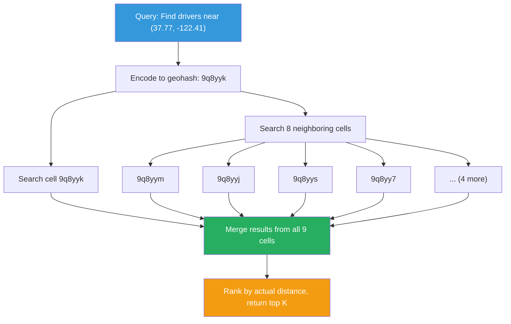
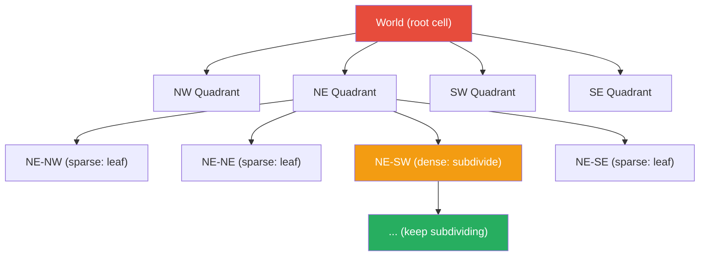

# Geohashing & Spatial Indexing

!!! danger "Real Incident: Uber Driver Matching at Scale"
    At peak hours, Uber processes 1 million active drivers and 500,000 ride requests simultaneously. The core challenge: "Find the 10 closest available drivers to this rider within 3 seconds." A naive approach — computing distance to all 1M drivers per request — requires 1M distance calculations x 500K requests = **500 billion operations per second.** Uber solved this with H3 hexagonal geohashing: partition the world into cells, index drivers by cell, and only search adjacent cells. The query goes from O(N) to O(k) where k is drivers in nearby cells (~50-200). **Geospatial indexing turned an impossible problem into a 10ms lookup.**

---

## Why This Comes Up in Interviews

Any system involving location — ride-sharing, food delivery, dating apps, store locators, real-time tracking — requires spatial indexing. Interviewers want to hear:

- Why latitude/longitude queries are inherently expensive without spatial indexing
- How geohashing converts 2D coordinates into 1D sortable strings
- Trade-offs between geohashing, quadtrees, and R-trees
- How precision levels map to real-world distances
- How systems like Uber/Lyft handle the "nearby" problem at scale

---

## The Problem: Why Naive Approaches Fail

**Query:** "Find all restaurants within 1km of me" (lat: 37.7749, lng: -122.4194)

| Approach | How | Why It Fails |
|---|---|---|
| **Full scan** | Check distance to every restaurant | O(N) per query — 10M restaurants = 10M calculations |
| **Bounding box + B-tree** | `WHERE lat BETWEEN x1 AND x2 AND lng BETWEEN y1 AND y2` | Two separate indexes don't compose efficiently |
| **Geospatial index** | Convert 2D → 1D prefix, use single index lookup | O(1) cell lookup + O(k) neighbors — fast |

---

## Geohashing Algorithm

**Core idea:** Recursively divide the world into grid cells. Encode each cell as a string. Nearby locations share common prefixes.

**Encoding process for (37.7749, -122.4194):**

| Step | Action | Result |
|---|---|---|
| 1 | Divide world: lat [-90, 90], lng [-180, 180] | Full map |
| 2 | Is lng (-122.4) in left [-180,0] or right [0,180]? | Left → bit 0 |
| 3 | Is lat (37.7) in bottom [-90,0] or top [0,90]? | Top → bit 1 |
| 4 | Continue subdividing, interleaving lng/lat bits | Binary string |
| 5 | Encode binary as base32 | `9q8yyk` |

**Result:** San Francisco = `9q8yyk...` — any location in the same neighborhood shares the prefix `9q8yy`.

---

## Precision Levels

| Geohash Length | Cell Width | Cell Height | Use Case |
|---|---|---|---|
| 1 | 5,009 km | 4,992 km | Continent-level |
| 2 | 1,252 km | 624 km | Large country region |
| 3 | 156 km | 156 km | State/province |
| 4 | 39.1 km | 19.5 km | City |
| 5 | 4.9 km | 4.9 km | Neighborhood |
| 6 | 1.2 km | 0.6 km | Street-level |
| 7 | 153 m | 153 m | Building block |
| 8 | 38 m | 19 m | Building |
| 9 | 4.8 m | 4.8 m | Parking spot |

**Interview rule of thumb:** For "find nearby" features, precision 5-6 (1-5km) is typical. Adjust based on expected search radius.

---

## Proximity Search Algorithm

**Why search neighbors?** A location near a cell boundary might have closest results in an adjacent cell. Searching the center cell alone misses edge cases (literally).

**Algorithm:**

1. Compute geohash of query point at desired precision
2. Find 8 neighboring cell hashes (well-defined algorithm)
3. Query all 9 cells from database (single prefix query per cell)
4. Compute actual Haversine distance for results
5. Return top-K by real distance

---

## Geohashing Edge Cases

| Problem | Cause | Solution |
|---|---|---|
| **Boundary problem** | Two nearby points in different cells | Always search 8 neighbors |
| **Non-uniform distribution** | Manhattan has 10,000 drivers per cell; rural has 2 | Adaptive precision or quadtrees |
| **Z-curve discontinuities** | Geohash uses Z-order curve; some adjacent cells have very different prefixes | Always compute actual neighbors, don't rely on prefix similarity alone |
| **Poles and antimeridian** | Wrapping at 180/-180 longitude | Special handling at boundaries |

---

## Quadtrees — Adaptive Spatial Indexing

| Property | Geohash | Quadtree | R-tree |
|---|---|---|---|
| **Structure** | Fixed-precision grid | Adaptive tree (subdivide dense areas) | Bounding-box tree |
| **Precision** | Uniform worldwide | Adapts to data density | Adapts to object shapes |
| **Best for** | Point data, proximity search | Non-uniform point distributions | Rectangles, polygons, ranges |
| **Storage** | Simple (string per point) | Tree in memory | Complex disk-based tree |
| **Update cost** | O(1) per point | O(log N) rebalancing | O(log N) with splits |
| **Used by** | Redis GEO, Elasticsearch | In-memory spatial services | PostGIS, MongoDB 2dsphere |

**When to use which:**

- **Geohash:** Distributed systems (easy to shard by prefix), Redis/DynamoDB, simple proximity
- **Quadtree:** In-memory indexes, non-uniform data (cities vs rural), game engines
- **R-tree:** Complex shapes (polygons), range queries, traditional databases

---

## Real-World Implementations

| System | Technology | How |
|---|---|---|
| **Uber H3** | Hexagonal hierarchical grid | Hexagons (equal-area, 6 equidistant neighbors). Avoids square grid distortion. |
| **Google S2** | Sphere-projected Hilbert curve cells | Maps sphere to cube faces, uses Hilbert curve. Cells have ~equal area at any level. |
| **Redis GEO** | Geohash in sorted set | `GEOADD`, `GEORADIUS` — stores geohash as score in sorted set |
| **Elasticsearch** | Geohash + BKD tree | `geo_distance` query uses geohash prefix filtering + exact distance |
| **PostGIS** | R-tree (GiST index) | `ST_DWithin` for proximity, handles complex polygons |

---

## Back-of-Envelope: Uber Driver Matching

| Parameter | Value |
|---|---|
| Active drivers (peak) | 1,000,000 |
| Ride requests/second | 10,000 |
| Search radius | 3 km |
| Geohash precision | 6 (1.2km cells) |
| Cells to search | 9 (center + 8 neighbors) |
| Avg drivers per cell (urban) | 50-200 |
| Candidates per query | ~500 |
| Distance calculations per query | 500 (not 1,000,000) |
| Query latency | <10ms |
| Driver location update frequency | Every 4 seconds |
| Location updates/second | 250,000 |

**Sharding strategy:** Partition by geohash prefix (first 3 chars = city-level). Each shard handles one metro area. Hot cities (NYC, SF) get dedicated shards.

---

## Interview Framework

**When designing location-based systems:**

> **Step 1:** "For the proximity search requirement, I'd use geohashing to convert 2D coordinates into 1D sortable strings. This lets us use standard database indexes for spatial queries."
>
> **Step 2:** "At precision level 6 (~1.2km cells), I'd search the target cell plus its 8 neighbors — 9 cells total. This guarantees we catch all points within our search radius."
>
> **Step 3:** "For non-uniform density (Manhattan vs suburbs), I'd consider Uber's H3 hexagonal grid — hexagons have equidistant neighbors and equal area, avoiding the square grid's corner-distance problem."
>
> **Step 4:** "For sharding, geohash prefixes are natural partition keys. Prefix `9q8` covers San Francisco — all SF drivers on the same shard for fast local queries."
>
> **Step 5:** "Driver locations update every 4 seconds. I'd use Redis GEO (geohash in sorted set) for real-time positions — O(log N) updates, O(log N + K) radius queries."

---

## Quick Recall

| Question | Answer |
|---|---|
| What does geohashing solve? | Converts 2D spatial problem into 1D prefix-searchable string |
| Why search 8 neighbors? | Points near cell boundaries may be closer than points in same cell |
| Precision 6 cell size? | ~1.2km x 0.6km (street/neighborhood level) |
| Geohash vs quadtree? | Geohash: uniform grid, easy sharding. Quadtree: adaptive density, in-memory. |
| What is Uber H3? | Hexagonal hierarchical grid — equal area, 6 equidistant neighbors |
| What is Google S2? | Sphere-to-cube projection with Hilbert curve — near-equal area cells on a sphere |
| Redis GEO internally? | Stores geohash as sorted set score; radius query = range scan + distance filter |
| Sharding strategy? | Geohash prefix = partition key (city-level shards) |
