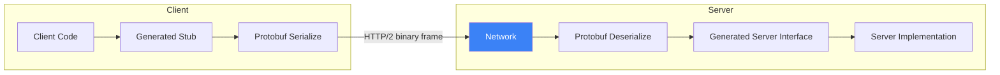
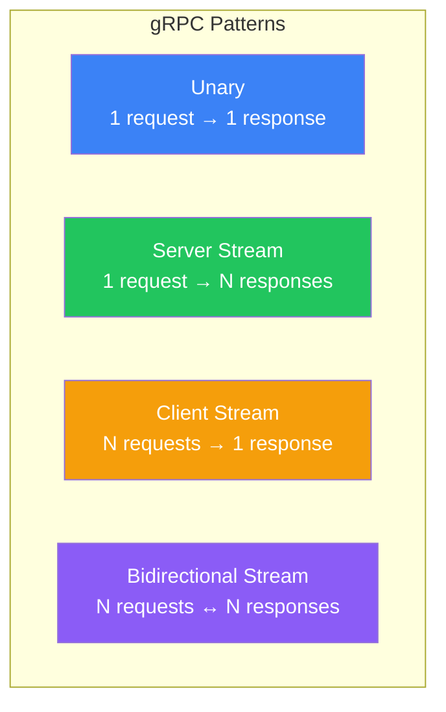

# gRPC & Protocol Buffers

!!! danger "Real Incident: Google's Internal Migration"
    Google's internal services were drowning in JSON serialization — 40% of CPU time on some services was spent parsing JSON. Protocol Buffers reduced payload sizes by 10x and serialization CPU by 90%. gRPC now handles **10 billion+ calls per second** across Google's infrastructure.

---

## Why This Comes Up in Interviews

Any system design with internal microservice communication should consider gRPC. Interviewers want to hear:

- When to use gRPC vs REST
- How Protocol Buffers achieve 10x smaller payloads
- How streaming enables real-time data flow between services
- Trade-offs: performance vs ecosystem/debugging complexity

---

## How gRPC Works



**The flow:**

1. Define service contract in `.proto` file (schema-first design)
2. Generate client stub and server interface in any language
3. Client calls stub method like a local function
4. Stub serializes to Protobuf binary, sends over HTTP/2
5. Server deserializes, executes, returns response the same way

---

## Protocol Buffers — Why 10x Smaller

```protobuf
// .proto definition
message User {
  int64 id = 1;
  string name = 2;
  string email = 3;
  repeated string roles = 4;
}
```

**JSON (95 bytes):**
```json
{"id":12345678,"name":"Alice","email":"alice@example.com","roles":["admin","user"]}
```

**Protobuf (38 bytes):** Binary encoding — field numbers instead of names, varint encoding for integers, no delimiters.

| Aspect | JSON | Protobuf |
|---|---|---|
| **Format** | Text (human-readable) | Binary (machine-optimized) |
| **Size** | 100% (baseline) | 30-50% of JSON |
| **Parse speed** | Slow (string parsing) | Fast (direct memory mapping) |
| **Schema** | Optional (OpenAPI) | Required (.proto file) |
| **Evolution** | Breaking changes easy to introduce | Backward/forward compatible by design |

---

## Four Communication Patterns



| Pattern | Use Case | Example |
|---|---|---|
| **Unary** | Simple request-response | GetUser(id) → User |
| **Server streaming** | Server pushes data over time | ListOrders(filter) → stream of Order |
| **Client streaming** | Client sends batch data | UploadChunks(stream of bytes) → UploadResult |
| **Bidirectional** | Real-time two-way flow | Chat(stream of Message) ↔ stream of Message |

---

## Service Definition Example

```protobuf
syntax = "proto3";

service OrderService {
  // Unary
  rpc GetOrder(GetOrderRequest) returns (Order);
  
  // Server streaming
  rpc ListOrders(ListOrdersRequest) returns (stream Order);
  
  // Client streaming
  rpc BatchCreateOrders(stream CreateOrderRequest) returns (BatchResult);
  
  // Bidirectional streaming
  rpc OrderUpdates(stream OrderSubscription) returns (stream OrderEvent);
}

message Order {
  string id = 1;
  string customer_id = 2;
  repeated LineItem items = 3;
  OrderStatus status = 4;
  google.protobuf.Timestamp created_at = 5;
}

enum OrderStatus {
  ORDER_STATUS_UNSPECIFIED = 0;
  PENDING = 1;
  CONFIRMED = 2;
  SHIPPED = 3;
  DELIVERED = 4;
}
```

---

## HTTP/2 Advantages

| Feature | HTTP/1.1 (REST) | HTTP/2 (gRPC) |
|---|---|---|
| **Multiplexing** | One request per connection | Multiple streams on one connection |
| **Header compression** | None | HPACK compression |
| **Server push** | Not possible | Built-in |
| **Binary framing** | Text-based | Binary (faster parsing) |
| **Connection reuse** | Keep-alive (limited) | Full multiplexing |

---

## gRPC vs REST — When to Use Which

| Factor | Choose gRPC | Choose REST |
|---|---|---|
| **Audience** | Internal services | Public/external APIs |
| **Performance** | Need low latency, high throughput | Acceptable latency |
| **Streaming** | Real-time data flow needed | Request-response suffices |
| **Schema** | Want strict contract enforcement | Want flexibility |
| **Debugging** | Tools: grpcurl, Postman gRPC | curl, any HTTP client |
| **Browser** | Needs grpc-web proxy | Native support |
| **Team** | Comfortable with Protobuf | Want quick iteration |

---

## Production Considerations

### Load Balancing

gRPC uses long-lived HTTP/2 connections. Standard L4 load balancers don't work well — all requests go to the same backend.

**Solutions:**
- **L7 load balancer** (Envoy, Linkerd) — inspects HTTP/2 frames, balances per-request
- **Client-side load balancing** — client discovers backends, round-robins itself
- **Service mesh** (Istio) — sidecar proxy handles routing

### Error Handling

gRPC uses status codes (not HTTP status codes):

| gRPC Code | Meaning | HTTP Equivalent |
|---|---|---|
| `OK` | Success | 200 |
| `NOT_FOUND` | Resource missing | 404 |
| `ALREADY_EXISTS` | Duplicate | 409 |
| `PERMISSION_DENIED` | Auth failed | 403 |
| `RESOURCE_EXHAUSTED` | Rate limited | 429 |
| `UNAVAILABLE` | Service down (retry) | 503 |
| `DEADLINE_EXCEEDED` | Timeout | 504 |

### Deadlines & Timeouts

```
Client sets deadline: 2 seconds
→ Service A (500ms) → Service B (800ms) → Service C (???)
```

Remaining deadline propagates through the call chain. If Service C gets 700ms remaining and can't finish — it returns `DEADLINE_EXCEEDED` immediately instead of wasting resources.

---

## Interview Cheat Sheet

| Question | Answer |
|---|---|
| "Why gRPC over REST?" | "10x smaller payloads (Protobuf), HTTP/2 multiplexing, bidirectional streaming, strict schema contracts. Use for internal service-to-service where performance matters." |
| "Downsides?" | "Not browser-native (needs grpc-web), harder to debug (binary), steeper learning curve, L4 LB doesn't work." |
| "Schema evolution?" | "Protobuf supports adding/removing fields without breaking existing clients — field numbers are stable identifiers." |
| "How to handle versioning?" | "Package versioning in .proto (v1, v2), or add new methods to existing service." |
