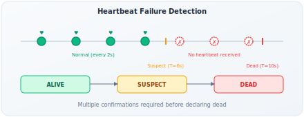
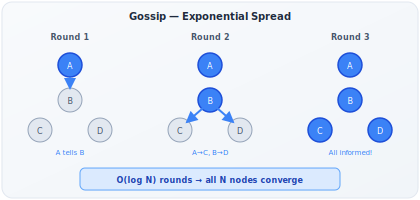

# Heartbeat & Gossip Protocol

!!! danger "Real Incident: Cassandra at Netflix, 2013"
    A Cassandra node silently ran out of disk space. No crash, no error — it just stopped writing. Without gossip-based failure detection, the token ring kept routing writes to a node that was silently dropping them. Data loss for 15 minutes before detection. After fixing: Phi Accrual failure detector + gossip protocol detects failures in **under 10 seconds**. **In distributed systems, you must actively prove you're alive — silence is death.**

---

## Why This Comes Up in Interviews

Every distributed system needs to answer: "How do you know if a node is alive or dead?" This appears in:

- Database replication (detect primary failure → trigger election)
- Service discovery (which instances are healthy?)
- Consistent hashing (which servers are in the ring?)
- Load balancing (stop routing to dead backends)
- Cluster membership (who's in the cluster right now?)

The interviewer wants to hear you reason about: detection speed vs false positive rate, centralized vs decentralized, and how state propagates.

---

## Heartbeat — The Foundation

**Concept:** Every node periodically sends "I'm alive" signal. If signal stops → suspect failure.

### Heartbeat Models

| Model | How | Messages | SPOF | Detection Speed |
|---|---|---|---|---|
| **Centralized** | All nodes → one monitor | O(N) | Yes (monitor) | Fast (direct) |
| **Ring** | Each node monitors next neighbor | O(N) | No | Slow (chain propagation) |
| **All-to-all** | Every node → every other node | O(N²) | No | Fastest |
| **Gossip-based** | Random peer exchange | O(N log N) | No | Fast (O(log N) rounds) |

### The Timeout Dilemma



**Too short timeout (e.g., 1 second):**
- Detects failures fast
- But: network blip (100ms packet loss) triggers false positive
- Result: healthy nodes declared dead → unnecessary failovers → instability

**Too long timeout (e.g., 60 seconds):**
- Very few false positives
- But: dead node serves traffic for 60 seconds before detection
- Result: client errors, data loss during that window

**The sweet spot:** Most systems use 5-30 second timeouts with multi-confirmation.

**Back-of-envelope impact:**
- 1000-node cluster, 5s timeout, 0.1% network blip rate
- Expected false positives per hour: 1000 × (3600/5) × 0.001 = 720 false alarms/hour (too many)
- With 3-confirmation rule: 1000 × (3600/5) × 0.001³ = 0.0007/hour (acceptable)

---

## Phi Accrual Failure Detector (What Cassandra Uses)

**Problem:** Fixed timeouts don't account for varying network conditions. A node on a loaded network might have 50ms heartbeat variance normally — a 100ms delay isn't suspicious. But a node with 5ms variance that's 50ms late IS suspicious.

**Solution:** Instead of binary (alive/dead), compute the **probability** that a node has failed based on its heartbeat history.

| Aspect | Fixed Timeout | Phi Accrual |
|---|---|---|
| Input | Expected interval | Historical arrival time distribution |
| Output | Binary (alive/dead) | Continuous phi value (suspicion level) |
| Threshold | Fixed time | Configurable phi threshold |
| Adaptation | None | Adapts to network conditions |
| False positives | Higher (ignores variance) | Lower (knows what's "normal" for this node) |

**How it works:**
1. Track history of heartbeat inter-arrival times (last 1000 samples)
2. Compute mean and variance of arrival times
3. When new heartbeat is "late," compute phi = -log₁₀(probability that it would be this late IF the node were alive)
4. phi > threshold (e.g., 8) → declare suspicious/dead

**phi = 1:** 10% chance of false positive
**phi = 5:** 0.001% chance of false positive
**phi = 8:** 0.000001% chance of false positive (Cassandra default threshold)

---

## Gossip Protocol — Epidemic Information Dissemination

**Core idea:** Instead of one node telling all others (centralized), each node tells a few random peers, who tell a few random peers... Information spreads like a virus.



### How Gossip Works

**Each gossip round (every 1-2 seconds):**

1. Node A picks 1-3 random peers
2. A sends its state (membership list + heartbeat counters + metadata)
3. Peer merges: for each entry, keep the one with higher heartbeat counter (= more recent)
4. Peer does the same in its next round

**Convergence speed:** In a cluster of N nodes, information reaches all nodes in O(log N) rounds.

| Cluster Size | Rounds to Full Convergence | Time (at 1s/round) |
|---|---|---|
| 10 | ~4 rounds | ~4 seconds |
| 100 | ~7 rounds | ~7 seconds |
| 1,000 | ~10 rounds | ~10 seconds |
| 10,000 | ~14 rounds | ~14 seconds |

**Key insight:** Gossip scales LOGARITHMICALLY. Going from 1,000 to 10,000 nodes only adds 4 rounds.

### What Gets Gossiped

| System | Gossipped State | Update Frequency |
|---|---|---|
| **Cassandra** | Token ownership, schema version, load, severity, heartbeat generation | Every 1 second |
| **Consul** | Service health, node status, KV metadata | Every 200ms (configurable) |
| **Redis Cluster** | Slot assignments, node flags, config epoch | Every 100ms |
| **DynamoDB** | Membership, partition assignments, failure state | Internal |
| **Serf (HashiCorp)** | Custom user events + membership | Every 200ms |

### Gossip Message Size

**Back-of-envelope:**

- Per-node state: ~100 bytes (heartbeat counter, IP, metadata)
- Cluster of 1000 nodes: gossip message = ~100KB
- If sending to 3 peers every 1 second: 300KB/s per node
- Total cluster gossip bandwidth: 1000 × 300KB/s = 300MB/s

**Optimization:** Don't send full state every time. Send only CHANGES (delta gossip) or DIGESTS (hashes of state — request full state only if digest differs).

---

## Failure Detection with Gossip

### Node State Machine

```
ALIVE → SUSPECT → DEAD → (removed from membership)
  ↑                         |
  └─── recovered ───────────┘
```

| State | How Entered | How Exited |
|---|---|---|
| **ALIVE** | Heartbeat counter incrementing | Stop incrementing → SUSPECT |
| **SUSPECT** | Heartbeat not updated for T₁ | Counter resumes → ALIVE, or T₂ expires → DEAD |
| **DEAD** | Multiple nodes agree unresponsive for T₂ | Never automatically (requires manual or rejoin) |

**Why SUSPECT state exists:** Prevents declaring healthy nodes dead due to network partitions.

### The SWIM Protocol (Scalable Weakly-consistent Infection-style Membership)

**Improvement over basic gossip for failure detection:**

1. **Ping:** A pings B directly
2. **Ping fails:** A picks K random peers, asks them to ping B (indirect ping)
3. **Indirect pings fail:** B is declared SUSPECT
4. **After T seconds in SUSPECT:** B declared DEAD (unless B's heartbeat arrives)

**Why indirect ping?** If A can't reach B, maybe it's A's network that's broken, not B. Asking C, D, E to check prevents false positives from asymmetric network failures.

---

## Gossip vs Centralized Coordination — When to Use Which

| Aspect | Gossip (Cassandra, Redis Cluster) | Central (ZooKeeper, etcd) |
|---|---|---|
| Consistency | Eventually consistent | Strongly consistent |
| SPOF | None | Leader node (but replicated) |
| Scale | 10,000+ nodes easily | ~hundreds of watchers |
| Detection speed | O(log N) rounds (seconds) | Immediate (direct connection) |
| State complexity | Simple KV / counters | Complex (sequences, ephemeral nodes, watches) |
| Use case | Membership, failure detection | Leader election, locks, config |
| Network overhead | O(N log N) per round | O(N) watches |
| Brain-split behavior | Graceful degradation | Majority partition wins |

**Key insight:** They're complementary, not competing. Many systems use BOTH:
- **Kafka:** ZooKeeper for leader election + gossip-like protocol for ISR tracking
- **Cassandra:** Gossip for membership + lightweight internal coordination
- **Consul:** Raft for KV store + SWIM/gossip for membership

---

## Anti-Entropy — Repairing Diverged State

**Problem:** Gossip is eventually consistent. During network partitions, nodes might diverge.

| Mechanism | How | When |
|---|---|---|
| **Read repair** | On read, if nodes disagree, update stale ones | Every read (Cassandra, DynamoDB) |
| **Anti-entropy (Merkle trees)** | Background comparison of data hash trees | Periodic (Cassandra, DynamoDB) |
| **Crdt-based state** | State designed to merge without conflicts | Always (Riak, Akka Cluster) |
| **Full state sync** | Periodically gossip full state | Fallback |

**Merkle tree anti-entropy (Cassandra/DynamoDB):**
1. Each node computes hash tree of its data ranges
2. Compare root hashes — if same, data is consistent
3. If different, walk tree to find exactly which keys differ
4. Transfer only differing keys

---

## Real-World Configuration Examples

| System | Heartbeat Interval | Failure Timeout | Gossip Fan-out | Convergence |
|---|---|---|---|---|
| **Cassandra** | 1 second | 8 seconds (phi=8) | 1-3 peers/round | ~10s for 1000 nodes |
| **Consul** | 200ms (LAN) / 1s (WAN) | 5s (LAN) / 30s (WAN) | 3 peers/round | ~3s (LAN) |
| **Redis Cluster** | 100ms | 15s (cluster-node-timeout) | 1 peer/100ms | ~5s |
| **Akka Cluster** | 1s | 5s | 3 peers | ~5s |
| **Kubernetes** | 10s (kubelet → API server) | 40s (node-monitor-grace-period) | Centralized | 40s |

---

## Interview Framework

**When asked "How do nodes in your cluster detect failures?":**

> **Step 1 — Mechanism:** "Each node sends heartbeats every [1-2] seconds. I'd use gossip-based dissemination rather than centralized monitoring — it scales to thousands of nodes without SPOF."
>
> **Step 2 — Detection:** "Rather than a fixed timeout, I'd use a phi accrual failure detector that adapts to each node's normal heartbeat variance. Phi threshold of 8 gives negligible false positive rate."
>
> **Step 3 — Confirmation:** "When a node is suspected, indirect pings via random peers confirm before declaring dead. This prevents false positives from asymmetric network issues."
>
> **Step 4 — Propagation:** "Failure state propagates via gossip in O(log N) rounds. For a 1000-node cluster, all nodes know within ~10 seconds."
>
> **Step 5 — Action:** "On confirmed failure: [remove from hash ring / trigger leader election / reassign partitions]. Depending on the system, this triggers [replication repair / failover / rebalancing]."

---

## Quick Recall

| Question | Answer |
|---|---|
| Heartbeat purpose? | Prove liveness. Absence = suspected failure. |
| Timeout too short? | False positives → unnecessary failovers → instability |
| Timeout too long? | Slow detection → data loss / errors during window |
| Phi accrual advantage? | Adapts to network conditions. Probability-based, not binary. |
| Gossip convergence? | O(log N) rounds. 1000 nodes = ~10 seconds. |
| Why not centralized? | SPOF + scalability bottleneck at 1000+ nodes |
| SWIM protocol? | Direct ping → indirect ping via peers → SUSPECT → DEAD |
| False positive prevention? | Multi-node confirmation (indirect pings), SUSPECT state buffer |
| Real systems? | Cassandra (gossip), Consul (SWIM), Redis Cluster, DynamoDB |
| Gossip + ZooKeeper? | Complementary: gossip for membership, ZK for strong-consistency tasks |
