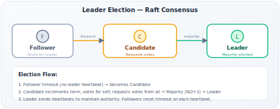

# Leader Election

!!! danger "Real Incident: Split-Brain at GitHub, 2018"
    GitHub's MySQL cluster experienced a network partition. Two nodes both believed they were the primary. Both accepted writes for 43 seconds. Result: data divergence across 100K+ repositories, 24 hours of manual reconciliation, and a postmortem that redesigned their entire failover mechanism. **Without proper leader election and fencing, distributed systems write themselves into irrecoverable states.**

---

## Why This Comes Up in Interviews

Any time you design a system with replication, the interviewer will ask: "What happens when the leader dies?" You need to reason about:

- How is a new leader elected?
- What prevents two nodes from both thinking they're leader (split-brain)?
- What happens to in-flight writes during failover?
- How fast is failover? What's the unavailability window?

This comes up in: database replication, distributed locks, scheduler design, message broker design, and any system that needs a single coordinator.

---

## Why You Need a Leader

| Problem | Without Leader | With Leader |
|---|---|---|
| Write conflicts | Multiple nodes accept conflicting writes | One node sequences all writes |
| Ordering | No global order of events | Leader provides total order |
| Decision making | Expensive consensus on every operation | Leader decides, others follow |
| Coordination | Every node must talk to every other node O(N²) | All coordinate through one node O(N) |

**Trade-off:** Leader = performance optimization (batch decisions) at the cost of availability (leader death = unavailability until new election).

---

## Election Algorithms Compared

| Algorithm | How | Partition-Safe? | Complexity | Used By |
|---|---|---|---|---|
| **Bully** | Highest ID wins | No (both partitions elect) | Simple | Educational |
| **Raft** | Term + majority vote | Yes (need N/2+1) | Medium | etcd, Consul, CockroachDB, Kafka (KRaft) |
| **Paxos** | Multi-phase consensus | Yes | Hard to implement | Google Chubby, Spanner |
| **ZAB** | Epoch + quorum | Yes | Medium | ZooKeeper |
| **Lease-based** | Time-limited ownership | Yes (with correct clocks) | Simple | DynamoDB, Chubby |

**For interviews:** Know Raft well. It's the modern standard and designed to be understandable.

---

## Raft Consensus (Deep Dive)

### Node States

Every node is in exactly one state:

| State | Behavior | Transitions To |
|---|---|---|
| **Follower** | Passive. Responds to leader's heartbeats. | → Candidate (if election timeout) |
| **Candidate** | Requests votes from all peers. | → Leader (if majority) or → Follower (if higher term seen) |
| **Leader** | Sends heartbeats, replicates log entries. | → Follower (if higher term discovered) |

### Election Process

1. **Trigger:** Follower doesn't receive heartbeat within election timeout (randomized 150-300ms)
2. **Candidate starts:** Increments term, votes for self, requests votes from all
3. **Voting rules:** Each node votes for at most ONE candidate per term. Votes for candidate only if candidate's log is at least as up-to-date.
4. **Win condition:** Receives votes from majority (N/2 + 1)
5. **Split vote:** If no majority, timeout → new election with higher term. Random timeout ensures convergence.

### Why Raft Prevents Split-Brain

**Mathematical guarantee:** In a cluster of N nodes, majority = N/2 + 1. Two majorities MUST overlap (pigeonhole principle). Therefore, at most ONE leader can be elected per term.

| Cluster Size | Majority | Tolerates Failures |
|---|---|---|
| 3 | 2 | 1 node |
| 5 | 3 | 2 nodes |
| 7 | 4 | 3 nodes |

**Why 5 is the sweet spot:** Tolerates 2 failures with only 5 nodes. Going to 7 gives marginal benefit (3 failures) at significant cost (more replication traffic).

### Log Replication (After Election)

1. Client sends write to leader
2. Leader appends to its log
3. Leader sends AppendEntries to all followers
4. Once majority ACK (2 of 3 in a 3-node cluster), entry is **committed**
5. Leader responds to client: "write successful"
6. Followers apply committed entries to state machine

**Key insight:** A write is durable once majority has it in their log, even before they apply it. If leader dies after commit, new leader WILL have this entry (because it got majority, and new leader needs majority vote — overlap guaranteed).

---

## The Split-Brain Problem — Deep Dive

**Scenario:** Network partition divides 5-node cluster into [A, B, C] and [D, E].

| Partition | Nodes | Can Elect? | Why |
|---|---|---|---|
| [A, B, C] | 3 nodes | Yes | 3 ≥ majority (3) |
| [D, E] | 2 nodes | No | 2 < majority (3) |

**Result:** Only one partition can elect a leader. The other is unavailable for writes. This is the correct behavior — availability sacrificed to prevent divergence (CP from CAP).

**But what if old leader is in the minority partition?**

- Old leader (say D) is in [D, E] partition
- D can't get heartbeat ACKs from majority → steps down
- New leader elected in [A, B, C]
- When partition heals, D discovers higher term → becomes follower

---

## Fencing — The Critical Safety Mechanism

**Problem:** Even with elections, brief windows exist where two nodes might both think they're leader (old leader hasn't realized it's been replaced).

**Fencing token:** Every leader gets a monotonically increasing number (epoch/term).

| Time | Node A (old leader) | Node B (new leader) | Storage |
|---|---|---|---|
| T=0 | Leader, token=5 | Follower | Accepts writes with token≥5 |
| T=1 | Network partition | Elected, token=6 | Accepts writes with token≥6 |
| T=2 | Tries write with token=5 | Active with token=6 | **Rejects** A's write (5 < 6) |

**How storage implements fencing:**

- Every write carries the leader's fencing token
- Storage remembers highest token seen
- Rejects any write with a lower token
- **Result:** Even if two leaders exist briefly, only one can write successfully

---

## Lease-Based Election

**Alternative to consensus-based election:** Use time-limited locks.

| Step | What |
|---|---|
| 1 | Node acquires lease from coordination service (ZooKeeper/etcd) |
| 2 | Lease = leadership for T seconds |
| 3 | Leader must renew before T expires |
| 4 | If leader fails to renew → lease expires → others compete |

**Advantage:** Simpler than full consensus. Good enough for many use cases.

**Danger — Clock Skew:**

- Leader thinks: "My lease is valid for 5 more seconds" (leader's clock is slow)
- Other nodes think: "Lease expired 2 seconds ago" (their clocks are faster)
- Both think they're leader

**Mitigation:** Leader stops doing work BEFORE lease expires (with safety margin). If lease is 10s, leader stops accepting writes at 7s and renews. This accounts for clock skew up to 3s.

---

## Failover — What Happens When Leader Dies

### Detection

| Method | Speed | False Positive Risk |
|---|---|---|
| Heartbeat timeout (fixed) | 5-30s | Medium (network blip = false alarm) |
| Phi accrual failure detector | Adaptive | Low (adjusts to network conditions) |
| Lease expiry | Predictable (lease duration) | None (time-based) |

### Failover Process (Raft)

1. **Detection:** Followers notice missing heartbeats (150-300ms timeout)
2. **Election:** Random timeout → first to timeout becomes candidate → requests votes
3. **New leader:** Wins majority → starts sending heartbeats
4. **Log reconciliation:** New leader identifies uncommitted entries, ensures consistency
5. **Client redirect:** Clients discover new leader (via redirect or service discovery)

**Total failover time:** Typically 1-5 seconds end-to-end.

### What About In-Flight Writes?

| Write Status | After Failover |
|---|---|
| Committed (majority ACKed) | Safe — new leader has it |
| Uncommitted (only on old leader) | LOST — wasn't replicated to majority |
| Sent but not ACKed to client | Unknown — client must retry (needs idempotency) |

**This is why idempotency matters:** Client doesn't know if write succeeded before leader died. Must be safe to retry.

---

## Real Systems

| System | Election Method | Failure Detection | Failover Time |
|---|---|---|---|
| **etcd** | Raft | Heartbeat + timeout | 1-3s |
| **ZooKeeper** | ZAB (Zookeeper Atomic Broadcast) | Session timeout | 2-10s |
| **Kafka (KRaft)** | Raft | Controller heartbeat | 1-5s |
| **Redis Sentinel** | Quorum voting | Heartbeat + configurable timeout | 5-30s (configurable) |
| **MongoDB** | Raft-like (replica set elections) | Heartbeat | 10-12s (default) |
| **PostgreSQL** | External (Patroni/etcd) | Health checks | 5-30s |
| **CockroachDB** | Raft (per range) | Liveness table + leases | 9s (default lease duration) |

---

## Leader Election in System Design Interviews

| When You're Designing... | Leader Election Applies To... |
|---|---|
| Replicated database | Primary that accepts writes |
| Distributed task scheduler | Coordinator that assigns tasks (prevents duplicates) |
| Kafka | Partition leader (accepts writes for that partition) |
| Distributed lock service | The lock service itself needs an elected leader |
| Rate limiter | Centralized counter or coordination |
| Configuration service | Single source of truth for configuration |

---

## Interview Framework

**When asked "What happens if the primary/leader fails?":**

> **Step 1 — Detection:** "Followers detect leader failure via heartbeat timeout. I'd use a randomized timeout (150-300ms for Raft) to avoid split votes."
>
> **Step 2 — Election:** "Using Raft consensus, a follower becomes candidate, requests votes. Needs majority (N/2 + 1 of N nodes). This guarantees only one leader per term."
>
> **Step 3 — Safety:** "Split-brain is prevented by the majority requirement — two majorities can't exist simultaneously. Additionally, fencing tokens ensure storage rejects writes from old leaders."
>
> **Step 4 — Data safety:** "Committed writes (ACKed by majority) survive failover. Uncommitted writes may be lost — clients handle this via idempotent retries."
>
> **Step 5 — Availability:** "Total failover takes 1-5 seconds. For stricter availability, I'd use multi-region deployment with leader in the primary region and fast failover to the secondary."

---

## Quick Recall

| Question | Answer |
|---|---|
| Why a leader? | Sequences operations, avoids conflicts, O(N) coordination |
| How does Raft elect? | Majority vote + term number. One leader per term guaranteed. |
| Split-brain prevention? | Majority quorum (pigeonhole: two majorities must overlap) |
| Fencing token? | Monotonic number — storage rejects writes from old leaders |
| Failover time? | 1-5 seconds (Raft). Up to 30s (some systems). |
| Committed writes safe? | Yes — majority has them, new leader must have them |
| Uncommitted writes? | May be lost — need idempotent client retries |
| Cluster size sweet spot? | 5 nodes (tolerates 2 failures, manageable replication) |
| Lease-based risk? | Clock skew — leader must stop early with safety margin |
