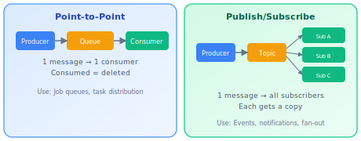
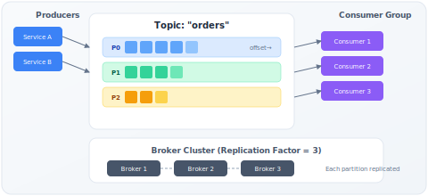

# Message Queues & Event Streaming

!!! danger "Real Incident: LinkedIn, 2010"
    LinkedIn's synchronous service calls created cascading failures — one slow service blocked 14 others. 30-minute outages weekly. They built Kafka to decouple services. **Today Kafka processes 7 trillion messages/day at LinkedIn.** The entire modern data infrastructure (real-time analytics, event sourcing, stream processing) exists because of this architectural shift.

---

## Why This Comes Up in Every Design Interview

The moment you say "Service A needs to tell Service B something," the interviewer expects you to reason about:

- Sync vs async trade-offs
- Delivery guarantees
- Ordering requirements
- What happens when consumers are slower than producers
- How to handle poison messages

If you just say "I'll use Kafka" without reasoning through WHY and what delivery guarantees you need, you've lost points.

---

## The Core Decision: Sync vs Async

| Aspect | Synchronous (HTTP/gRPC) | Asynchronous (Queue) |
|---|---|---|
| Coupling | Temporal + spatial (both up, both known) | Decoupled in time and space |
| Failure propagation | A fails if B fails | A succeeds even if B is down |
| Latency | Immediate response | Eventually processed |
| Throughput | Limited by slowest service | Burst absorbed by queue |
| Debugging | Simple request/response trace | Harder (async, delayed) |
| Data loss risk | Response confirms processing | Queue must be durable |

**When to choose async:**

- Producer doesn't need immediate confirmation of processing
- Consumer is slower than producer (rate mismatch)
- You need to survive downstream failures
- Fan-out to multiple consumers
- You need replay capability

**When to stay sync:**

- User expects immediate response (login, payment confirmation)
- Simple request/response (read a user profile)
- Low latency critical (< 10ms)

---

## Two Fundamental Models



### Point-to-Point (Queue)

- Message consumed by exactly ONE consumer
- Once consumed, message is gone
- **Use case:** Job distribution, task processing
- **Example:** "Process this image," "Send this email"
- **Systems:** RabbitMQ, SQS, Celery

### Publish/Subscribe (Topic)

- Message delivered to ALL subscribers
- Each subscriber gets its own copy
- **Use case:** Event broadcasting, multiple consumers need same event
- **Example:** "Order placed" → inventory service + notification service + analytics
- **Systems:** Kafka, SNS, Google Pub/Sub

### Kafka's Consumer Groups: The Hybrid

Kafka combines both: within a consumer group, each partition goes to one consumer (point-to-point). Across groups, all groups get all messages (pub/sub).

---

## Delivery Guarantees — The Most Important Trade-off

| Guarantee | How It Works | Trade-off | When to Use |
|---|---|---|---|
| **At-most-once** | Send and forget. No retry. | Fastest. May lose messages. | Metrics, logs (loss is tolerable) |
| **At-least-once** | Retry until consumer ACKs. May deliver duplicates. | Safe but requires idempotent consumers. | 95% of use cases. Standard. |
| **Exactly-once** | Transactional produces + idempotent consumers + offset commit in same transaction | Slowest, most complex. | Financial transactions, billing. |

**The practical answer for interviews:**

> "I'd use at-least-once delivery with idempotent consumers. Each message has a unique ID. Consumer checks if it's already processed (idempotency key in DB). This gives us effective exactly-once semantics without the complexity and throughput cost of true exactly-once."

**How idempotent consumers work:**

1. Message arrives with ID `msg-abc-123`
2. Consumer checks: "Have I processed `msg-abc-123`?"
3. If yes → ACK, skip. If no → process, record ID, ACK.
4. Safe to retry delivery — duplicate is harmless.

---

## Ordering — When It Matters and When It Doesn't

| Ordering Need | Solution | Example |
|---|---|---|
| **No ordering needed** | Any queue, multiple consumers | "Send welcome email" — order doesn't matter |
| **Per-entity ordering** | Partition by entity key | All events for user_123 in order (but user_456 can interleave) |
| **Total ordering** | Single partition/queue | Financial ledger, consensus log (slow — no parallelism) |

**Kafka's approach:** Ordering guaranteed WITHIN a partition. Use partition key to co-locate related messages.

```
Partition key = user_id
→ All messages for user_123 go to partition 7
→ Processed in order by one consumer
→ But user_456's messages in partition 3 are processed in parallel
```

**Back-of-envelope for partition count:**

- Target throughput: 100K messages/sec
- Single consumer processes: 5K messages/sec
- Partitions needed: 100K / 5K = 20 partitions minimum
- With headroom (2x): 40 partitions

---

## Kafka Architecture Deep Dive



| Component | What | Why |
|---|---|---|
| **Broker** | Server storing message log | Distributed storage |
| **Topic** | Named feed ("orders", "clicks") | Logical separation |
| **Partition** | Ordered, immutable log within topic | Unit of parallelism |
| **Offset** | Position of message in partition | Enables replay, exactly-once |
| **Consumer Group** | Set of consumers sharing partitions | Load balancing |
| **Replication Factor** | Copies per partition (usually 3) | Fault tolerance |
| **ISR (In-Sync Replicas)** | Replicas caught up to leader | Durability guarantee |

**Key design decisions:**

- **Log-based:** Messages are APPENDED, never deleted (until retention expires). This enables replay.
- **Pull-based consumers:** Consumers pull at their own pace (vs push). Natural backpressure.
- **Sequential I/O:** Appending to log = sequential disk writes = incredibly fast (even faster than random SSD).

**Why Kafka is fast (interview gold):**

1. Sequential disk I/O (600MB/s vs 100MB/s random)
2. Zero-copy (sendfile syscall — data goes from disk to network without copying to user space)
3. Batch compression (many messages compressed together)
4. Page cache utilization (OS caches frequently read segments)

---

## Back-of-Envelope: Kafka Capacity

**Scenario:** Design messaging for a social media platform, 500M daily active users, each generates ~20 events/day.

| Parameter | Calculation | Value |
|---|---|---|
| Daily messages | 500M × 20 | 10 billion |
| Messages/sec (average) | 10B / 86400 | ~115K/sec |
| Peak (10x average) | 115K × 10 | ~1.15M/sec |
| Message size | Average event payload | ~500 bytes |
| Daily data volume | 10B × 500B | ~5 TB/day |
| Retention (7 days) | 5TB × 7 | ~35 TB storage |
| Replication (RF=3) | 35TB × 3 | ~105 TB total |
| Brokers needed | 105TB / 10TB per broker | ~11 brokers |
| Partitions (for 1.15M/sec, 10K/partition) | 1.15M / 10K | ~115 partitions |

---

## Handling Failures: Dead Letter Queues & Retry

**What happens when processing fails?**

| Strategy | How | When |
|---|---|---|
| **Immediate retry** | Retry 3 times with backoff | Transient failures (network blip) |
| **Dead Letter Queue (DLQ)** | After N retries, move to separate queue | Poison messages, persistent failures |
| **Delay queue** | Retry after T seconds/minutes | Rate limits, temporary downstream outage |
| **Human review** | Alert + DLQ inspection tools | Business-critical failures |

**Poison message problem:** One bad message blocks the entire queue (head-of-line blocking). DLQ solves this — move it aside, continue processing.

---

## Backpressure — When Producers Outrun Consumers

| Strategy | How | Trade-off |
|---|---|---|
| **Queue depth limit** | Reject new messages when queue is full | Producer gets error, must handle |
| **Consumer scaling** | Auto-scale consumers based on lag | Cost, spin-up time |
| **Sampling/dropping** | Drop low-priority messages | Data loss (acceptable for metrics) |
| **Producer rate limiting** | Throttle producer | Producer blocked |
| **Kafka approach** | Consumers pull at own pace, messages retained for days | Need enough disk for retention |

---

## System Comparison: When to Use What

| Criteria | Kafka | RabbitMQ | SQS | Pulsar |
|---|---|---|---|---|
| **Throughput** | Millions/sec | 10-50K/sec | Unlimited (managed) | Millions/sec |
| **Ordering** | Per-partition | Per-queue | Best-effort (FIFO available) | Per-partition |
| **Retention** | Days/weeks (configurable) | Until consumed | 14 days max | Tiered (infinite) |
| **Replay** | Yes (offset reset) | No (consumed = gone) | No | Yes |
| **Delivery** | At-least-once (exactly-once available) | At-least-once | At-least-once | At-least-once |
| **Use case** | Event streaming, data pipeline | Task queue, RPC | AWS serverless, simple | Multi-tenant, geo-replicated |
| **Operations** | Complex (ZK/KRaft, brokers) | Moderate | Zero (managed) | Complex |

**Decision framework:**

- Need replay? → **Kafka** or **Pulsar**
- Simple job queue on AWS? → **SQS**
- Complex routing (priority, routing keys)? → **RabbitMQ**
- Multi-region, multi-tenant? → **Pulsar**
- Don't want to manage infrastructure? → **SQS** or managed Kafka (MSK, Confluent)

---

## Event Sourcing & CQRS (Advanced Pattern)

**Event Sourcing:** Store every state change as an immutable event, not just current state.

| Traditional | Event Sourced |
|---|---|
| `UPDATE account SET balance = 500` | Event: "Withdrawn $100 at 3:04pm" |
| Current state only | Full history, audit trail |
| Hard to debug "how did we get here?" | Replay events to reconstruct any point in time |

**CQRS (Command Query Responsibility Segregation):** Separate write model (events/commands) from read model (materialized views). Write to Kafka → materialize into read-optimized DB.

**Used by:** Banking systems, audit trails, collaborative editing, gaming (replay systems).

---

## Interview Framework

**When asked "How do services communicate in your design?":**

> **Step 1:** "For this interaction, I need to decide sync vs async. [Service B] doesn't need to respond in real-time to [Service A], and we need to survive B being down, so I'd use async messaging."
>
> **Step 2:** "I'd use [Kafka/SQS] with [at-least-once] delivery. Consumers are idempotent using a message ID stored in the processing DB."
>
> **Step 3:** "For ordering, I'd partition by [entity_id] so all events for one entity are strictly ordered. With [N] partitions, I can parallelize to [N] consumers."
>
> **Step 4:** "For failures — retry 3x with exponential backoff, then DLQ. We monitor DLQ depth and alert if it grows."
>
> **Step 5:** "Back-of-envelope: [X] messages/sec, [Y] bytes each, [Z] retention = [W] storage needed."

---

## Quick Recall

| Question | Answer |
|---|---|
| When async over sync? | Producer doesn't need immediate response, need to survive downstream failure, rate mismatch |
| Ordering guarantee? | Within partition only. Partition by entity key for per-entity ordering. |
| At-least-once vs exactly-once? | At-least-once + idempotent consumer is the practical standard |
| Kafka vs RabbitMQ? | Kafka = event streaming, replay, high throughput. RabbitMQ = task queue, routing. |
| Partition count? | Target throughput / per-consumer throughput (with 2x headroom) |
| Dead Letter Queue? | Where failed messages go after N retries — prevents head-of-line blocking |
| Why Kafka is fast? | Sequential I/O, zero-copy, batching, page cache |
| Consumer group? | Load-balances partitions across consumers. Max consumers = partition count. |
