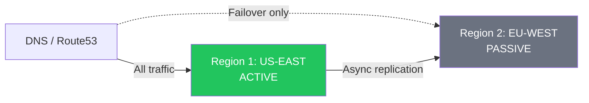
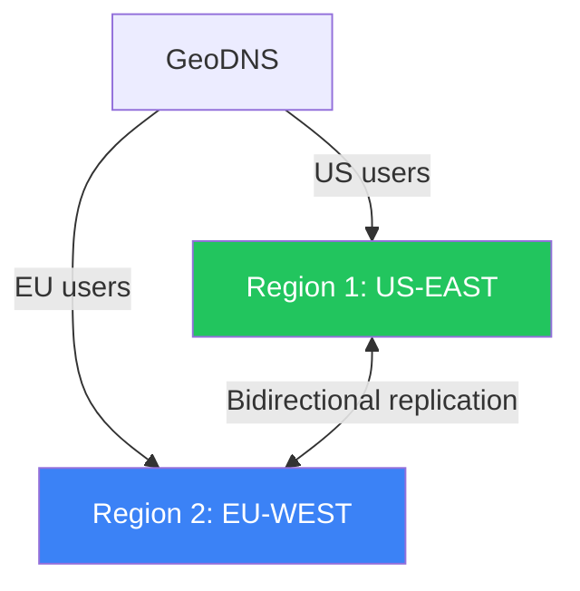
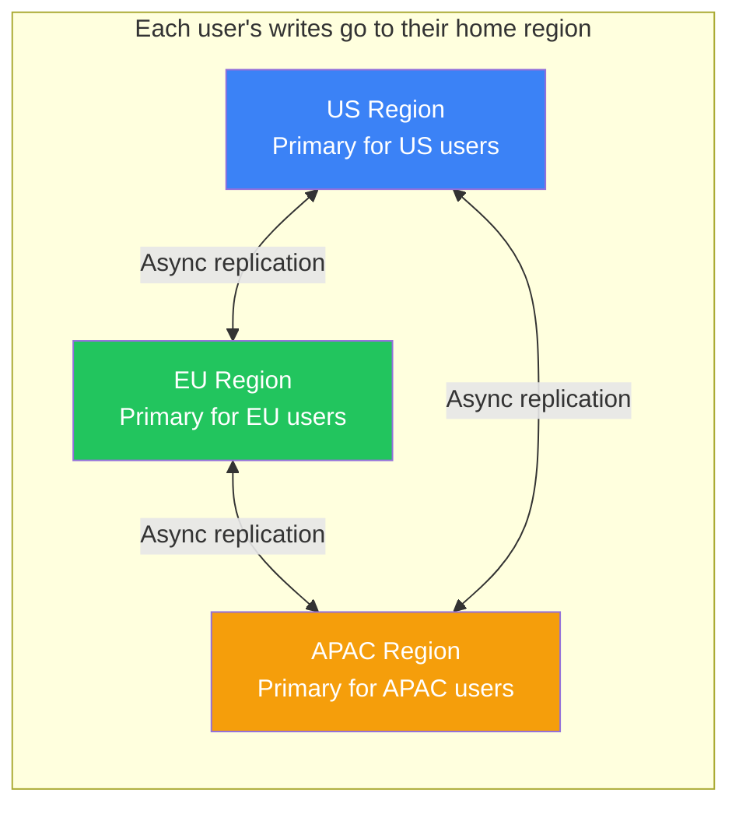
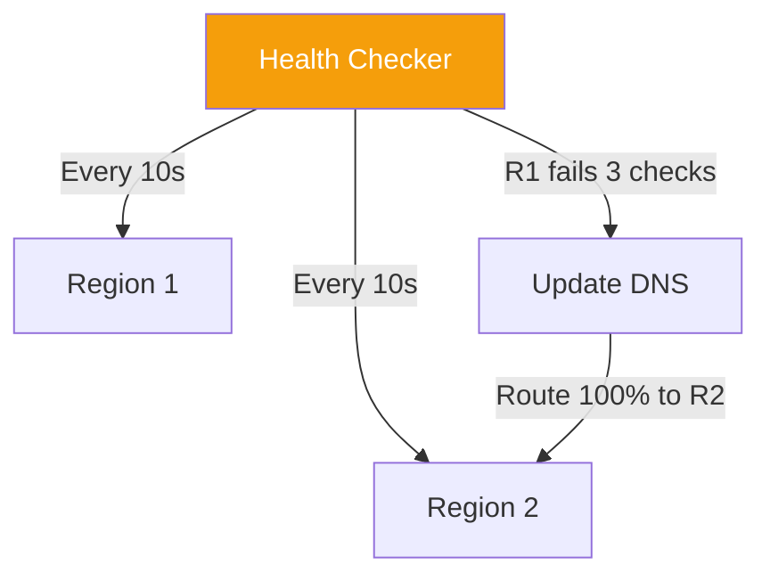

# Multi-Region Architecture

!!! danger "Real Incident: AWS US-EAST-1 Outage (December 2021)"
    A networking issue in AWS's primary region took down thousands of services for **7+ hours** — including Ring doorbells, Disney+, Tinder, and parts of AWS's own console. Companies with multi-region failover (Netflix, Slack) continued operating seamlessly. **Single-region = single point of failure. Multi-region is the only path to true high availability.**

---

## Why This Comes Up in Interviews

Any system design targeting 99.99%+ availability or serving global users needs multi-region discussion. Interviewers want to hear:

- Active-active vs active-passive trade-offs
- Data replication and consistency challenges across regions
- How you handle failover (DNS, traffic manager, health checks)
- Cost vs availability trade-off decisions

---

## Single-Region vs Multi-Region

| Aspect | Single Region | Multi-Region |
|---|---|---|
| **Availability** | 99.9% (8.7h downtime/year) | 99.99%+ (52 min/year) |
| **Latency** | High for distant users | Low for all users |
| **Blast radius** | Region outage = total outage | Region outage = graceful failover |
| **Complexity** | Simple | Significantly complex |
| **Cost** | 1x | 2-3x (duplicate infrastructure) |
| **Data** | Single source of truth | Replication + conflict resolution |

---

## Multi-Region Patterns

### 1. Active-Passive (Warm Standby)

| Aspect | Detail |
|---|---|
| **How** | Primary region handles all traffic; standby receives replicated data |
| **Failover** | DNS health check fails → route traffic to standby (30-120s) |
| **Data loss** | Possible (async replication lag) — RPO = seconds to minutes |
| **Cost** | ~1.5x (standby running but idle) |
| **Best for** | Cost-sensitive, can tolerate minutes of downtime |

### 2. Active-Active (Both Serving Traffic)

| Aspect | Detail |
|---|---|
| **How** | Both regions serve traffic simultaneously, data replicated bidirectionally |
| **Failover** | Automatic — healthy region absorbs failed region's traffic |
| **Data conflicts** | Possible — need conflict resolution (LWW, CRDTs, merge logic) |
| **Cost** | ~2x+ (both regions fully provisioned) |
| **Best for** | Global low-latency, 99.99% availability requirements |

### 3. Follow-the-Sun (Regional Primary)

Each user has a "home region" based on geography. Writes go to home region, reads can be served from any region (eventually consistent).

---

## Data Replication Strategies

| Strategy | Consistency | Latency | Data Loss Risk |
|---|---|---|---|
| **Synchronous replication** | Strong | High (cross-region RTT added to every write) | None |
| **Asynchronous replication** | Eventual | None (fire and forget) | Seconds of data on failover |
| **Semi-synchronous** | Strong for 1 replica | Moderate | None if at least 1 replica ACKs |

### Conflict Resolution (Active-Active)

| Strategy | How | Trade-off |
|---|---|---|
| **Last Writer Wins (LWW)** | Highest timestamp wins | Simple but can lose writes |
| **CRDTs** | Mathematically mergeable data types | Complex but lossless |
| **Application-level merge** | Custom logic per entity | Most flexible but most complex |
| **Avoid conflicts** | Route user's writes to single region | Simplest — no conflicts at all |

---

## Failover Mechanisms

| Mechanism | Failover Time | How |
|---|---|---|
| **DNS failover** (Route53) | 30-120s (DNS TTL) | Health checks → remove unhealthy IPs |
| **Global Load Balancer** (Cloudflare, GCP GLB) | 10-30s | Anycast — instant rerouting |
| **Traffic Manager** (Azure) | 30-60s | DNS-based with fast health checks |
| **Client-side failover** | <5s | Client knows both endpoints, retries on failure |

---

## What to Replicate vs What to Rebuild

| Replicate (stateful) | Rebuild on failover (stateless) |
|---|---|
| Database (users, orders) | Application servers |
| Object storage (S3 cross-region) | Load balancers |
| Cache warming data | Container orchestration |
| Message queue state | DNS entries |
| Configuration/secrets | CDN edge caches |

---

## Cost Analysis

**Scenario:** Web application serving 100K req/s

| Setup | Monthly Cost | Availability | Latency (global) |
|---|---|---|---|
| **Single region** | $50K | 99.9% (8.7h/year down) | 200ms for distant users |
| **Active-passive** | $75K (+50%) | 99.95% (4.4h/year) | 200ms (same, until failover) |
| **Active-active (2 regions)** | $110K (+120%) | 99.99% (52 min/year) | <50ms for 80% of users |
| **Active-active (3 regions)** | $160K (+220%) | 99.999% (5 min/year) | <50ms for 95% of users |

---

## Interview Cheat Sheet

| Question | Answer |
|---|---|
| "How to achieve 99.99% availability?" | "Multi-region active-active. GeoDNS routes users to nearest region. If a region fails, traffic shifts to remaining regions in <30s. Data replicated asynchronously with conflict resolution." |
| "Active-passive vs active-active?" | "Active-passive: simpler, cheaper, but 30-120s failover + possible data loss. Active-active: instant failover, better latency, but need conflict resolution for concurrent writes." |
| "How to handle data consistency?" | "Route each user's writes to their home region (avoid conflicts). Cross-region reads are eventually consistent. For critical data (payments): synchronous replication to at least one other region." |
| "What about cost?" | "Active-active is ~2x cost. Justified when downtime costs exceed infrastructure costs. For e-commerce doing $1M/hour, 1 hour downtime > yearly multi-region premium." |
| "Conflict resolution?" | "Avoid conflicts by design: user writes go to home region. If unavoidable: LWW for simple data, CRDTs for counters/sets, application merge for complex business logic." |
