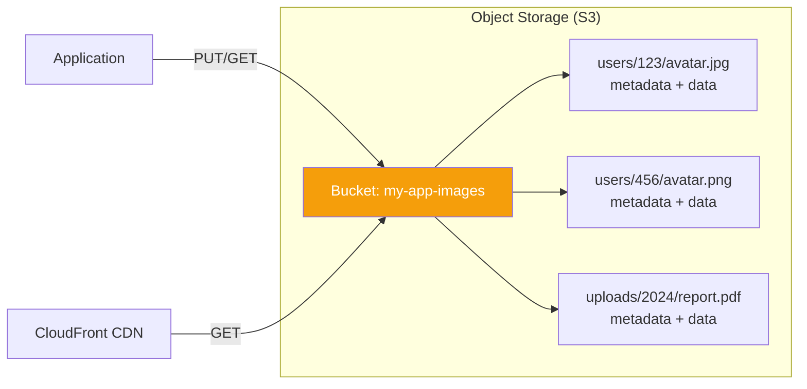
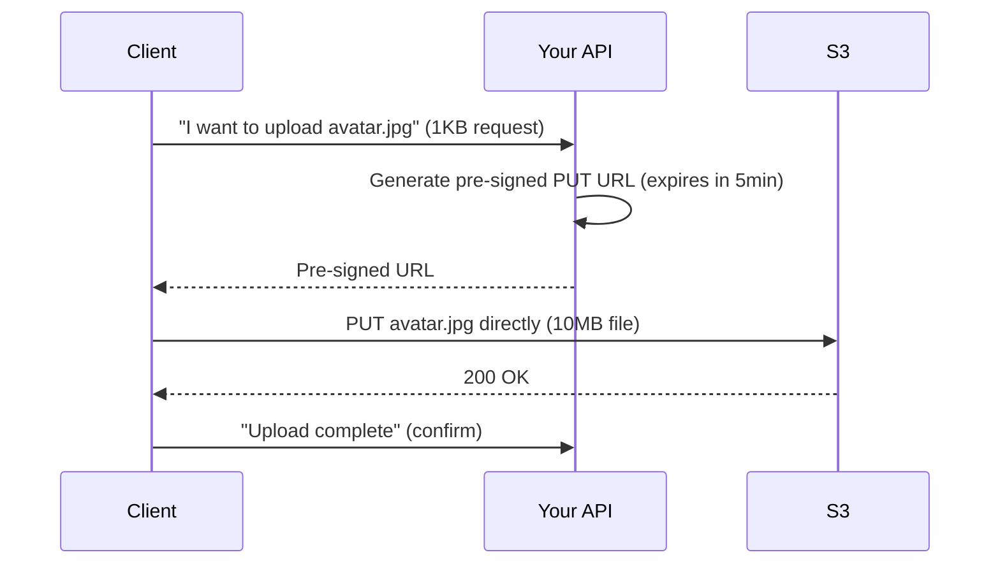
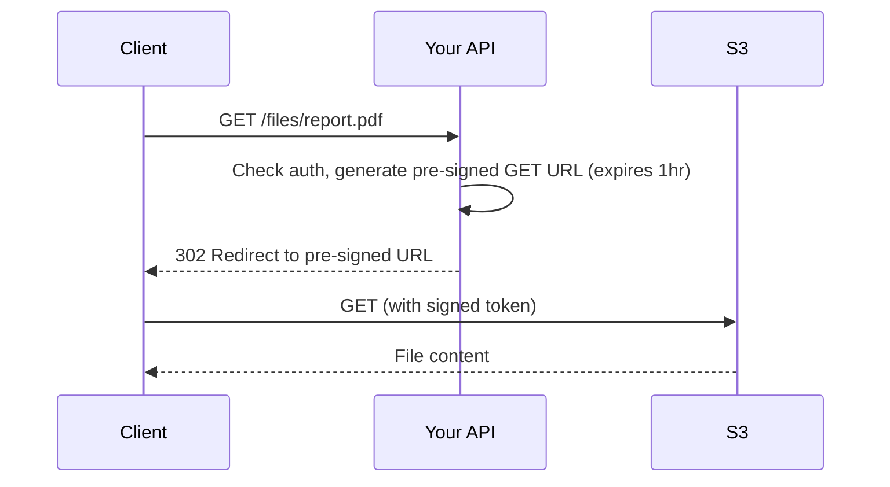

# Object Storage (S3 Patterns)

!!! danger "Real Incident: S3 Outage (February 2017)"
    An engineer running a routine debugging command accidentally removed a larger set of S3 servers than intended in the US-EAST-1 region. Result: **thousands of websites and services went down** — including Slack, Trello, and Quora. Even AWS's own health dashboard couldn't load (it depended on S3). **Object storage is invisible infrastructure until it isn't.**

---

## Why This Comes Up in Interviews

Any system that handles files (images, videos, documents, backups, logs) needs object storage. Interviewers want to hear:

- How you store and serve user-uploaded content at scale
- Pre-signed URL patterns for secure direct upload/download
- Multi-tier storage for cost optimization
- How to design a file/media service

---

## What Object Storage Is



| Aspect | Object Storage (S3) | File System (EBS/EFS) | Block Storage (EBS) |
|---|---|---|---|
| **Access** | HTTP API (PUT/GET by key) | POSIX (open/read/write) | Mount as disk |
| **Scale** | Unlimited (exabytes) | Limited by volume | Limited by volume |
| **Durability** | 99.999999999% (11 9's) | Depends on setup | 99.999% |
| **Latency** | 100-200ms first byte | <1ms | <1ms |
| **Cost (TB/month)** | ~$23 (Standard) | ~$100 | ~$100 |
| **Best for** | Static files, backups, data lakes | Application code, configs | Databases, OS |

---

## Core Patterns

### 1. Pre-Signed URLs (Direct Upload)



**Why:** Your API server never handles the file — no memory pressure, no bandwidth cost. Client uploads directly to S3.

### 2. Pre-Signed URLs (Secure Download)



**Why:** S3 bucket stays private. Access control lives in your API. URL expires — no permanent public links.

### 3. Multi-Part Upload (Large Files)

| File Size | Strategy |
|---|---|
| < 5MB | Single PUT |
| 5MB - 5GB | Multi-part upload (parallel chunks) |
| > 5GB | Multi-part required (max part: 5GB, max parts: 10,000) |

Multi-part uploads allow resumable uploads — if a chunk fails, retry only that chunk.

---

## Storage Tiers (Cost Optimization)

| Tier | Access Pattern | Cost (TB/mo) | Retrieval | Use Case |
|---|---|---|---|---|
| **S3 Standard** | Frequent | $23 | Instant | Active user files |
| **S3 Infrequent Access** | Monthly | $12.50 | Instant | Older uploads |
| **S3 Glacier Instant** | Quarterly | $4 | Instant | Archives, compliance |
| **S3 Glacier Deep Archive** | Yearly | $1 | 12-48 hours | Legal holds, backups |

**Lifecycle rules automate transitions:**
```
After 30 days → Move to Infrequent Access
After 90 days → Move to Glacier Instant
After 365 days → Move to Deep Archive
After 7 years → Delete (compliance period over)
```

---

## Key Design Decisions

### Naming / Key Strategy

| Pattern | Example | Pros |
|---|---|---|
| **Flat with UUID** | `uploads/a1b2c3d4.jpg` | No hotspots, unique |
| **Date-partitioned** | `2024/06/02/a1b2c3d4.jpg` | Easy lifecycle rules |
| **User-scoped** | `users/123/avatars/current.jpg` | Logical grouping |
| **Content-addressed** | `sha256-abcdef12.jpg` | Deduplication |

!!! warning "Avoid sequential prefixes"
    S3 partitions by key prefix. Sequential keys like `0001.jpg`, `0002.jpg` create hotspots. Use random prefixes or UUIDs.

### CDN Integration

```
User Request → CloudFront (edge cache) → S3 (origin)
```

- Set `Cache-Control: max-age=31536000` for immutable content-addressed files
- Use CloudFront signed cookies for private content (video streaming)
- Origin Access Identity (OAI): only CDN can access S3, not direct public access

---

## Interview Cheat Sheet

| Question | Answer |
|---|---|
| "How to handle file uploads?" | "Pre-signed URLs for direct client→S3 upload. API server generates URL, never touches file bytes. Scales infinitely." |
| "How to serve images globally?" | "S3 + CloudFront CDN. Content-hashed keys with infinite TTL. Edge serves 95%+ of requests." |
| "Cost optimization?" | "Lifecycle policies: Standard → IA after 30d → Glacier after 90d. Saves 70%+ on older content." |
| "Durability?" | "S3 offers 11 9's durability (99.999999999%). Cross-region replication for critical data." |
| "Security?" | "Bucket is private. Access via pre-signed URLs (time-limited) or CloudFront signed cookies. IAM policies for service access." |

---

## Back-of-Envelope: Media Service

**Scenario:** 10M users, each uploads 5 photos/month (average 2MB each)

| Metric | Calculation | Result |
|---|---|---|
| Monthly new data | 10M × 5 × 2MB | 100 TB/month |
| Annual storage | 100 TB × 12 | 1.2 PB/year |
| Monthly cost (Standard) | 100 TB × $23 | $2,300/month new data |
| With lifecycle (avg) | 1.2 PB × $8 avg | ~$9,600/month total |
| Upload throughput | 50M uploads/month ÷ 2.6M sec | ~19 uploads/sec avg |
| CDN serves reads | 95% cache hit rate | Origin handles only 5% |
