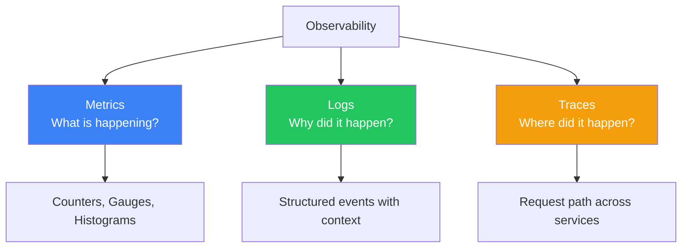
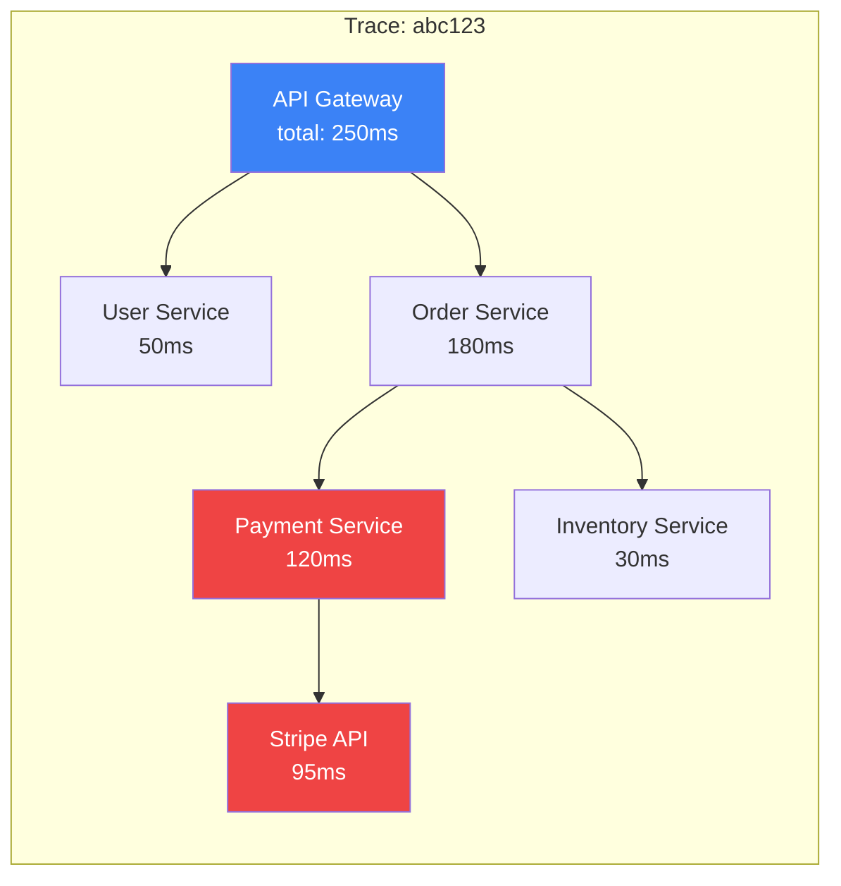
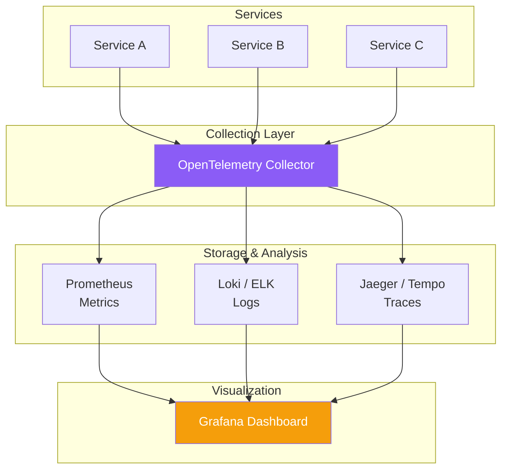

# Observability (Metrics, Logs, Traces)

!!! danger "Real Incident: Uber's 2019 Payment Outage"
    Uber's payment service started failing silently — no errors in logs, no alerts fired. The issue? A downstream dependency increased latency from 50ms to 2s, causing cascading timeouts that looked like "normal" failures. Without distributed tracing, it took **4 hours** to identify the root cause. After deploying Jaeger tracing, similar issues get diagnosed in **minutes**. **You can't fix what you can't see.**

---

## Why This Comes Up in Interviews

Every production system design needs an observability story. Interviewers want to hear:

- How you detect issues before users notice
- How you trace a request across 10+ microservices
- Your strategy for metrics vs logs vs traces (the three pillars)
- How you balance observability cost with coverage

---

## The Three Pillars



| Pillar | What | When to Use | Tools |
|---|---|---|---|
| **Metrics** | Numeric time-series data | Dashboards, alerts, capacity planning | Prometheus, Datadog, CloudWatch |
| **Logs** | Detailed event records | Debugging specific incidents | ELK, Loki, CloudWatch Logs |
| **Traces** | Request path across services | Finding latency bottlenecks in distributed systems | Jaeger, Zipkin, X-Ray, Tempo |

---

## Metrics — The First Line of Defense

### The Four Golden Signals (Google SRE)

| Signal | What It Measures | Alert When |
|---|---|---|
| **Latency** | Time to serve a request | p99 > 500ms for 5 minutes |
| **Traffic** | Requests per second | Sudden drop > 50% (service may be down) |
| **Errors** | Failed requests / total requests | Error rate > 1% for 2 minutes |
| **Saturation** | How full your resources are | CPU > 80%, memory > 90%, disk > 85% |

### RED Method (for request-driven services)

- **R**ate — requests per second
- **E**rrors — failed requests per second  
- **D**uration — distribution of request latency (p50, p95, p99)

### USE Method (for infrastructure/resources)

- **U**tilization — % of resource busy
- **S**aturation — queue depth / backlog
- **E**rrors — error count

---

## Logs — Structured Over Unstructured

**Bad (unstructured):**
```
[2024-06-02 10:15:23] ERROR: Payment failed for user 12345
```

**Good (structured JSON):**
```json
{
  "timestamp": "2024-06-02T10:15:23Z",
  "level": "ERROR",
  "service": "payment-service",
  "trace_id": "abc123def456",
  "user_id": "12345",
  "order_id": "ord-789",
  "error": "gateway_timeout",
  "latency_ms": 5000,
  "downstream": "stripe-api"
}
```

**Why structured:** Query by any field. Correlate with traces via `trace_id`. Aggregate into metrics. Build dashboards.

### Log Levels

| Level | Use For | Alert? |
|---|---|---|
| **ERROR** | Something failed, needs attention | Yes |
| **WARN** | Degraded but functioning | Maybe (if sustained) |
| **INFO** | Important business events | No |
| **DEBUG** | Development-time detail | Never in production |

---

## Distributed Tracing — Following a Request



**How it works:**

1. First service generates a **trace ID** (e.g., `abc123`) and attaches it to the request
2. Each service creates a **span** (its own execution context) and propagates the trace ID
3. Spans are sent to a tracing backend (Jaeger, Tempo)
4. Backend assembles spans into a complete request timeline

**Context propagation headers:**
```
traceparent: 00-abc123def456-span789-01
```

---

## Observability Architecture



**OpenTelemetry** is the industry standard — vendor-neutral SDK that exports metrics, logs, and traces to any backend.

---

## Alerting Best Practices

| Principle | Do | Don't |
|---|---|---|
| **Alert on symptoms** | "Error rate > 1%" | "CPU > 80%" (may be fine) |
| **Actionable** | Every alert has a runbook | Alert fatigue from noise |
| **Layered** | Warning → Page → Escalate | Single threshold for everything |
| **SLO-based** | "Burning error budget too fast" | Arbitrary thresholds |

### SLO-Based Alerting

```
SLO: 99.9% availability (43 minutes downtime/month budget)

Alert: "At current error rate, you'll exhaust your monthly 
        error budget in 6 hours" → Page oncall

Better than: "5xx count > 100" (which might be 100 out of 1M requests = fine)
```

---

## Cost vs Coverage Trade-offs

| Strategy | Coverage | Cost | When |
|---|---|---|---|
| **Log everything** | 100% | Very high ($$$) | Small scale / debugging phase |
| **Sample logs (10%)** | Partial | Moderate | High-traffic production |
| **Metrics + sampled traces** | Good | Low | Standard production |
| **Head-based sampling (1%)** | Low but consistent | Very low | Extremely high traffic |
| **Tail-based sampling** | Captures errors + slow requests | Moderate | Best balance |

**Tail-based sampling:** Collect all spans, but only store traces that are interesting (errors, slow, specific user). Best of both worlds.

---

## Interview Cheat Sheet

| Question | Answer |
|---|---|
| "How do you monitor microservices?" | "Three pillars: metrics (Prometheus) for dashboards/alerts, structured logs (ELK/Loki) for debugging, distributed traces (Jaeger) for request flow. OpenTelemetry as the unified SDK." |
| "How do you find a latency issue?" | "Trace the request — find which service/span is slow. Check that service's metrics (CPU, memory, DB connection pool). Logs for error details." |
| "What do you alert on?" | "Four golden signals: latency p99, error rate, traffic (sudden drops), saturation. SLO-based alerting to avoid noise." |
| "How to handle log volume?" | "Structured logging + tail-based sampling. Keep 100% of error traces, sample 1-10% of success traces. Costs drop 90%." |
