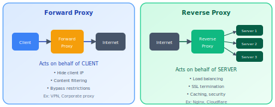

# Proxies

!!! danger "Real Incident: Cloudflare Outage, July 2019"
    A single regex rule deployed to Cloudflare's reverse proxy caused CPU to spike to 100% across all edge servers globally. 20% of the internet went dark for 27 minutes — including Discord, Reddit, and Amazon services behind Cloudflare. **When your proxy IS the internet for millions of sites, one bad deploy is a global outage.**

---

## Why This Comes Up in Interviews

Proxies are rarely the main topic, but they appear in EVERY system design:

- "How do clients reach your services?" → Reverse proxy / API gateway
- "How do you do TLS termination?" → Reverse proxy
- "How do services communicate in your mesh?" → Sidecar proxy (Envoy)
- "How do you rate limit / load balance?" → Proxy layer
- "How do you do canary deployments?" → Proxy-based traffic splitting

Understanding L4 vs L7 proxy capabilities is essential for making correct architectural decisions.

---

## Forward vs Reverse — The Key Distinction

| | Forward Proxy | Reverse Proxy |
|---|---|---|
| **Acts for** | Client (outbound) | Server (inbound) |
| **Client aware?** | Yes (explicitly configured) | No (transparent) |
| **Hides** | Client's identity from server | Server's identity from client |
| **Position** | Between client and internet | Between internet and servers |
| **Examples** | VPN, corporate proxy, Tor | Nginx, Cloudflare, HAProxy, Envoy |
| **Interview relevance** | Rarely discussed | In EVERY design |

**In system design interviews, you almost always mean reverse proxy.** Forward proxy is a client-side concept (VPN, corporate firewall).

---

## Reverse Proxy — What It Actually Does in Production

| Capability | What | Why It Matters |
|---|---|---|
| **Load balancing** | Distribute across backend instances | Horizontal scaling |
| **TLS termination** | Handle HTTPS at proxy, HTTP internally | Simpler backends, centralized cert management |
| **Request routing** | `/api` → service A, `/static` → CDN | Microservice decomposition |
| **Caching** | Cache responses for repeated requests | Reduce backend load |
| **Compression** | Gzip/Brotli responses | Faster client experience |
| **Rate limiting** | Block abusive traffic | Protect backends |
| **Authentication** | Validate JWT/session at edge | Reject bad requests early |
| **Circuit breaking** | Stop sending to failing backend | Prevent cascade failure |
| **Request transformation** | Add headers, rewrite URLs | Compatibility, routing metadata |
| **Observability** | Access logs, metrics, distributed tracing | Debugging, monitoring |
| **DDoS protection** | Absorb attack traffic | Keep origin alive |
| **IP hiding** | Attackers can't reach origin directly | Security |

---

## L4 vs L7 Proxy — The Critical Difference

| Aspect | L4 (Transport Layer) | L7 (Application Layer) |
|---|---|---|
| **Sees** | TCP/UDP packets (IP, port) | Full HTTP request (URL, headers, cookies, body) |
| **Routing decisions** | Source/dest IP and port | URL path, host header, cookies, custom headers |
| **Performance** | Faster (no request parsing) | Slower (must parse HTTP) |
| **TLS** | Passes through (doesn't terminate) | Terminates TLS (can inspect content) |
| **Use case** | Database LB, gaming, raw TCP | API routing, web apps, microservices |
| **Connection handling** | Transparent passthrough | Can pool, multiplex, retry |
| **Examples** | HAProxy (TCP mode), AWS NLB | Nginx, Envoy, AWS ALB |

**When to use L4:**
- Backend is not HTTP (databases, Redis, custom protocols)
- Maximum performance (millions of connections)
- Don't need content-based routing

**When to use L7:**
- Need to route by URL, header, or cookie
- TLS termination required
- Want connection pooling to backends
- A/B testing, canary routing
- WAF (Web Application Firewall) rules

---

## Real Proxy Software Compared

| Tool | Strength | Throughput | Use Case |
|---|---|---|---|
| **Nginx** | Battle-tested, low memory, simple config | 100K+ RPS | Web serving + reverse proxy |
| **HAProxy** | TCP + HTTP LB, health checks | 2M+ connections | Pure load balancing |
| **Envoy** | Observability, service mesh, xDS API | High | Cloud-native, sidecar proxy |
| **Traefik** | Auto-discovery, Docker/K8s native | Moderate | Container orchestration |
| **Caddy** | Auto-HTTPS (Let's Encrypt), simple | Moderate | Small-medium deployments |

---

## Proxy Patterns in System Design

### Pattern 1: API Gateway

The entry point for all client requests. Combines multiple proxy responsibilities:

| Responsibility | What |
|---|---|
| Authentication | Validate tokens before reaching services |
| Rate limiting | Per-user, per-endpoint |
| Request routing | URL path → correct microservice |
| Protocol translation | REST (external) → gRPC (internal) |
| Response aggregation | Combine responses from multiple services |
| Caching | Cache GET responses at gateway level |
| API versioning | Route /v1/ vs /v2/ to different backends |

**Real examples:** Kong, AWS API Gateway, Apigee, custom Nginx/Envoy config.

### Pattern 2: Service Mesh (Sidecar Proxy)

Every service gets its own proxy (Envoy sidecar):

| Without Mesh | With Mesh (Istio/Envoy) |
|---|---|
| Each service implements retry logic | Proxy handles retries |
| Each service manages TLS certs | Proxy auto-manages mTLS |
| No visibility into service-to-service traffic | Proxy exports metrics automatically |
| Circuit breaking in application code | Proxy handles circuit breaking |
| Manual traffic splitting for canaries | Proxy handles canary routing |

**Key insight:** Move cross-cutting concerns (retries, auth, observability, traffic management) from application code to infrastructure (proxy).

### Pattern 3: BFF (Backend For Frontend)

Different clients (web, iOS, Android) need different API shapes:

| Client | BFF Proxy | Backend Services |
|---|---|---|
| Web app | BFF-Web: aggregates, filters for web | Same microservices |
| iOS app | BFF-iOS: different payload, smaller responses | Same microservices |
| Android | BFF-Android: offline-optimized responses | Same microservices |

**Why:** Mobile clients need smaller payloads, different pagination, offline support. One-size-fits-all API serves nobody well.

---

## Back-of-Envelope: Proxy Capacity

**Nginx performance characteristics:**

| Metric | Value | Notes |
|---|---|---|
| Connections (L7 proxy) | 100K-500K concurrent | Depends on worker_connections and memory |
| Requests/sec | 100K-200K RPS (simple proxy) | CPU-bound at this point |
| Memory per connection | ~256 bytes (L4) to ~4KB (L7) | L7 needs request buffering |
| TLS termination | 10K-50K handshakes/sec | RSA = slower, ECDSA = faster |

**Scaling proxy layers:**

| Scale | Setup |
|---|---|
| < 50K RPS | Single Nginx/HAProxy (with hot standby) |
| 50K - 500K RPS | Multiple proxy instances behind DNS/L4 LB |
| 500K - 5M RPS | Multiple tiers (L4 → L7) or cloud LB (ALB/NLB) |
| > 5M RPS | Anycast + distributed edge (CDN-level) |

---

## Connection Pooling — Why Proxies Make Backends Faster

**Without proxy:**
- 10,000 clients each open a connection to backend
- Backend manages 10,000 connections (memory, file descriptors)
- Each request = TCP handshake (if not keepalive)

**With proxy (connection multiplexing):**
- 10,000 clients connect to proxy
- Proxy maintains 100 persistent connections to backend
- Multiplexes 10,000 client requests over 100 backend connections
- Backend is happy (low connection count)

**Real impact:** PostgreSQL handles ~500 connections well. With pgbouncer (proxy): 10,000+ client connections mapped to 100 backend connections.

---

## Proxy vs Load Balancer vs API Gateway vs CDN

| Component | Primary Job | Layer | Added Features |
|---|---|---|---|
| **Reverse Proxy** | Forward requests | L7 | Caching, compression, TLS |
| **Load Balancer** | Distribute traffic | L4 or L7 | Health checks, failover |
| **API Gateway** | API management | L7 | Auth, rate limiting, transformations |
| **CDN** | Cache at edge | L7 | Global distribution, DDoS protection |
| **Service Mesh** | Service-to-service | L7 (sidecar) | mTLS, observability, traffic management |

**In practice these overlap:** Nginx can be all of the first three. Cloudflare is CDN + reverse proxy + WAF. Envoy is proxy + LB + mesh. The distinction is about PRIMARY INTENT, not capability.

---

## Interview Framework

**When discussing how clients reach your services:**

> **Step 1 — Edge layer:** "Client requests hit a [CDN for static / reverse proxy for API]. This handles TLS termination, rate limiting, and request routing."
>
> **Step 2 — Routing:** "The proxy routes based on URL path: `/api/users/*` → user service, `/api/orders/*` → order service. This is an L7 decision."
>
> **Step 3 — L4 vs L7:** "I'd use L7 proxy (Nginx/Envoy) because we need content-based routing. For database connections, I'd use L4 (NLB/HAProxy TCP mode) since it's not HTTP."
>
> **Step 4 — Service mesh (if microservices):** "For service-to-service communication, each service has an Envoy sidecar handling mTLS, retries, and circuit breaking. This keeps cross-cutting concerns out of application code."
>
> **Step 5 — Scaling:** "The proxy layer scales horizontally. At [X] RPS, we'd need [N] proxy instances behind a DNS-level load balancer."

---

## Quick Recall

| Question | Answer |
|---|---|
| Forward vs reverse? | Forward = acts for client (VPN). Reverse = acts for server (Nginx). |
| L4 vs L7? | L4 = IP/port routing (fast, blind). L7 = HTTP routing (smart, slower). |
| Why never expose servers directly? | No TLS termination, no load distribution, attackers see server IPs |
| API Gateway vs reverse proxy? | Gateway adds auth, rate limiting, request transformation. Proxy is simpler. |
| Service mesh proxy? | Envoy sidecar per service — mTLS, retries, circuit breaking, observability |
| Connection pooling benefit? | 10K client connections → 100 backend connections via proxy multiplexing |
| When L4 over L7? | Non-HTTP protocols (DB, Redis, gaming), maximum throughput needed |
| Nginx throughput? | 100K-200K RPS (L7), 500K+ connections (L4 mode) |
