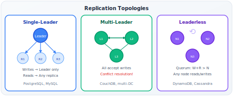

# Replication

!!! danger "Real Incident: GitLab Database Loss, 2017"
    GitLab's primary PostgreSQL went down. Their replica had 6 hours of replication lag. The backup was also stale. Result: 6 hours of production data lost — merge requests, comments, CI pipelines, issues. 300GB gone. **Replication without monitoring replication lag is a ticking time bomb disguised as safety.**

---

## Why This Comes Up in Every Interview

Every system design interview involves a database. The moment you say "we need high availability" or "we need to scale reads," replication is the mechanism. Interviewers test:

- Do you understand sync vs async trade-offs (the core tension)?
- Can you handle replication lag problems (read-after-write, causality)?
- Do you know when to use which topology (single-leader vs multi-leader vs leaderless)?
- Can you calculate the consistency implications of your choices?

---

## The Three Reasons to Replicate

| Goal | How Replication Helps | Without It |
|---|---|---|
| **High availability** | Primary dies → replica promoted in seconds | Hours of downtime while restoring from backup |
| **Read scaling** | Spread reads across N replicas | Single machine handles all traffic |
| **Latency reduction** | Replica in each region → local reads | All users hit a single-region database |

**Back-of-envelope for read scaling:**

- Single PostgreSQL instance: ~10K reads/sec
- With 5 read replicas: ~50K reads/sec (for eventually-consistent reads)
- With caching layer: ~500K reads/sec (but adds complexity)

---

## Replication Topologies

### Single-Leader (Master-Slave)

| Property | Detail |
|---|---|
| **Write path** | All writes → single leader |
| **Read path** | Read from leader (consistent) OR replicas (may be stale) |
| **Failover** | Replica promoted to leader (election) |
| **Consistency** | Strong on leader reads, eventual on replica reads |
| **Used by** | PostgreSQL, MySQL, MongoDB, Redis |

**When to use:** 95% of cases. Simple, well-understood, sufficient for most workloads.

### Multi-Leader (Master-Master)

| Property | Detail |
|---|---|
| **Write path** | Multiple nodes accept writes |
| **Replication** | Leaders replicate to each other asynchronously |
| **Challenge** | Same data modified on two leaders → CONFLICT |
| **Used by** | CouchDB, multi-datacenter setups, collaborative editing |

**When to use:** Multi-datacenter writes (each DC has a leader for low-latency local writes). Collaborative editing (Google Docs).

### Leaderless (Dynamo-Style)

| Property | Detail |
|---|---|
| **Write path** | Write to W nodes (any nodes) |
| **Read path** | Read from R nodes, take most recent |
| **Consistency** | Tunable via W + R > N |
| **Used by** | DynamoDB, Cassandra, Riak |

**When to use:** High availability critical (no single leader = no SPOF). Tunable consistency needed.

---

## Synchronous vs Asynchronous — The Core Trade-off

| Aspect | Synchronous | Asynchronous |
|---|---|---|
| **How** | Leader waits for replica ACK before confirming to client | Leader confirms immediately, replica catches up later |
| **Latency** | Higher (add replica RTT to every write) | Lower (just local write) |
| **Durability** | No data loss on leader failure | Possible data loss (un-replicated writes) |
| **Availability** | If replica is slow/down, writes BLOCK | Writes always succeed regardless of replica state |

**The math for sync replication latency:**

- Local disk write: ~0.1ms
- Network RTT to replica (same region): ~1ms
- Network RTT (cross-region): ~50-200ms
- Sync replication cost: local_write + replica_RTT = noticeable

**Real systems choose:**

| System | Default | Reasoning |
|---|---|---|
| PostgreSQL | Async | Performance. Accepts brief data loss window. |
| MySQL | Async | Same. Semi-sync available. |
| DynamoDB | Sync to 2 of 3 | Durability guaranteed for committed writes |
| Spanner | Sync (Paxos) | Strong consistency globally at any cost |
| MongoDB | Configurable (writeConcern) | Application decides per-write |

**Semi-synchronous (common production pattern):**

- Write synced to ONE replica (guaranteed no data loss)
- Other replicas async (for performance)
- If the sync replica dies, another is promoted to sync role
- Trade-off: tolerable latency hit + durability guarantee

---

## Replication Lag — The Problems It Creates

When using async replication, there's always a window where replicas are behind. This creates real user-facing bugs:

### Problem 1: Read-After-Write Inconsistency

**Scenario:** User posts a comment → immediately refreshes → reads from replica → comment not there yet.

| Fix | How | Trade-off |
|---|---|---|
| **Read from leader** for own writes | After writing, read from leader for T seconds | Leader gets more load |
| **Sticky sessions** | Route user to same replica always | Less load distribution |
| **Client-side tracking** | Client sends last-write timestamp, replica waits if behind | Added complexity |

### Problem 2: Monotonic Read Violations

**Scenario:** User loads feed from Replica A (up-to-date) → refreshes → hits Replica B (behind) → content DISAPPEARS.

**Fix:** Sticky sessions — same user always reads from same replica. Or: client sends last-seen version, replica B redirects to leader if it's behind.

### Problem 3: Causal Ordering Violations

**Scenario:** User A posts "Who wants pizza?" → User B replies "Me!" → Reader sees "Me!" before the question (different replicas, different lag).

**Fix:** Causal ordering via vector clocks or lamport timestamps. Or: keep related data on same partition.

---

## Leaderless Replication — Quorum Deep Dive

**The quorum formula:** W + R > N guarantees at least one node in the read set has the latest write.

| N | W | R | Behavior |
|---|---|---|---|
| 3 | 2 | 2 | Standard (W+R=4 > 3). Balanced. |
| 3 | 3 | 1 | Write to all, read from one. Fast reads, slow writes. |
| 3 | 1 | 3 | Write to one, read all. Fast writes, slow reads. |
| 3 | 1 | 1 | W+R=2 ≤ 3. NOT consistent. Eventual only. |

**What "quorum" actually guarantees:**

- If W=2 and we wrote to nodes A, B
- Then read from R=2 nodes. At least ONE of our read nodes is A or B.
- We'll see the latest write.
- BUT: during write propagation, a read might hit the one stale node → stale read (brief window)

**Sloppy quorum (DynamoDB pattern):**

- During partition, write to ANY W available nodes (not necessarily the "home" nodes)
- Handed off later when home nodes recover
- Improves availability at cost of consistency during partitions

**Read repair:**

- During read, if nodes disagree, update stale nodes
- Lazy consistency — eventually heals itself
- Not sufficient alone (what if stale data is never read?)

**Anti-entropy (background repair):**

- Background process compares all replicas
- Copies missing data
- Eventual consistency guarantee

---

## Conflict Resolution (Multi-Leader / Leaderless)

When two nodes accept conflicting writes:

| Strategy | How | Data Loss? | Used By |
|---|---|---|---|
| **Last Writer Wins (LWW)** | Highest timestamp wins | Yes (silently drops "loser") | Cassandra, DynamoDB |
| **Custom merge function** | Application-specific logic | Depends | CouchDB |
| **CRDT (Conflict-free Replicated Data Types)** | Mathematical merge guarantee | No | Riak, Redis (CRDT types) |
| **Operational Transformation** | Transform concurrent operations | No | Google Docs |
| **Show both to user** | Let user resolve | No | Git (merge conflicts) |

**LWW dangers:** Two users edit same document. One wins, one loses work silently. Acceptable for "last update wins" data (sessions, counters), dangerous for "all updates matter" data (edits, comments).

---

## Back-of-Envelope: Replication Lag Calculation

**Given:**
- Write throughput: 10K writes/sec
- Each write: 1KB
- Network bandwidth to replica: 100 Mbps (12.5 MB/s)
- Replication stream: 10K × 1KB = 10 MB/s

**Normal operation:** 10 MB/s stream on 12.5 MB/s link = 80% utilization. Lag = milliseconds.

**During traffic spike (3x):** 30 MB/s stream on 12.5 MB/s link = OVERWHELMED. Lag grows rapidly.

**During replica maintenance (VACUUM, backup):** Replica I/O saturated → can't keep up → lag grows.

**GitLab's problem:** Their replication lag was 6 hours. That's 6 hours × 10K writes/sec × 1KB = ~216 GB of un-replicated data. When primary died, all of it was lost.

**Lesson:** MONITOR replication lag. Alert if > N seconds. LinkedIn alerts at 30 seconds.

---

## Failover — When the Primary Dies

### Automatic Failover Process

1. **Detect failure:** Heartbeat timeout (typically 5-30 seconds)
2. **Choose new leader:** Most up-to-date replica (least replication lag)
3. **Reconfigure clients:** Point writes to new leader
4. **Reconcile old leader (when it returns):** Discard unreplicated writes, rejoin as replica

### Failover Dangers

| Problem | What Happens | Mitigation |
|---|---|---|
| **Data loss** | Async replication → un-replicated writes lost | Semi-sync replication |
| **Split-brain** | Old leader comes back, both accept writes | Fencing (STONITH — Shoot The Other Node In The Head) |
| **Client cached routing** | Clients still send writes to old leader | Short DNS TTL, smart client with discovery |
| **Cascading failure** | New leader overwhelmed by traffic it wasn't scaled for | Pre-warm replicas to handle full load |

---

## Real Systems — Replication Details

| System | Topology | Sync/Async | Consistency | Failover |
|---|---|---|---|---|
| **PostgreSQL** | Single-leader | Async default, sync optional | Strong on leader, eventual on replicas | External tool (Patroni) |
| **MySQL** | Single-leader | Async/Semi-sync | Configurable | MySQL Group Replication / Orchestrator |
| **DynamoDB** | Leaderless | Sync (W=2/3) | Tunable (strongly consistent reads optional) | Automatic |
| **Cassandra** | Leaderless | Tunable (W, R, N) | Tunable per query | No leader to fail |
| **CockroachDB** | Single-leader (Raft per range) | Sync (Raft consensus) | Strong (serializable) | Automatic (Raft) |
| **Spanner** | Single-leader (Paxos per split) | Sync | Strong + external consistency | Automatic (Paxos) |
| **MongoDB** | Single-leader (replica set) | Async default | Configurable per-operation | Automatic (raft-like) |

---

## Interview Framework

**When the interviewer asks about your data layer availability:**

> **Step 1 — Topology:** "I'd use single-leader replication with [N] replicas. Writes go to the leader, reads distributed across replicas."
>
> **Step 2 — Sync/Async:** "For this use case, [sync to one replica for durability / async for performance]. The trade-off is [latency vs data loss risk]."
>
> **Step 3 — Consistency:** "Reads from replicas are eventually consistent. For read-after-write consistency, I'd route a user's reads to the leader for [T] seconds after they write."
>
> **Step 4 — Failover:** "If the leader dies, [Patroni/etcd/Raft] detects via heartbeat and promotes the most up-to-date replica. Total failover: [T] seconds. In-flight uncommitted writes may be lost — clients retry with idempotency keys."
>
> **Step 5 — Monitoring:** "I'd alert on replication lag > [X] seconds. If lag grows, we're at risk of data loss proportional to the lag window."

---

## Quick Recall

| Question | Answer |
|---|---|
| Sync vs async? | Sync = no data loss, higher latency. Async = fast, possible loss. |
| Semi-sync? | Sync to ONE replica, rest async. Best of both worlds. |
| Read-after-write fix? | Route user's reads to leader for T seconds after write |
| Quorum formula? | W + R > N guarantees overlap |
| Failover time? | 5-30 seconds depending on system and detection config |
| Data loss on failover? | Async: lose uncommitted writes. Sync: zero loss. |
| Split-brain fix? | Fencing (STONITH) + majority-based election |
| Monitor what? | Replication lag — alert if > seconds, investigate if > minutes |
| LWW danger? | Silent data loss — concurrent writer's data discarded without notice |
