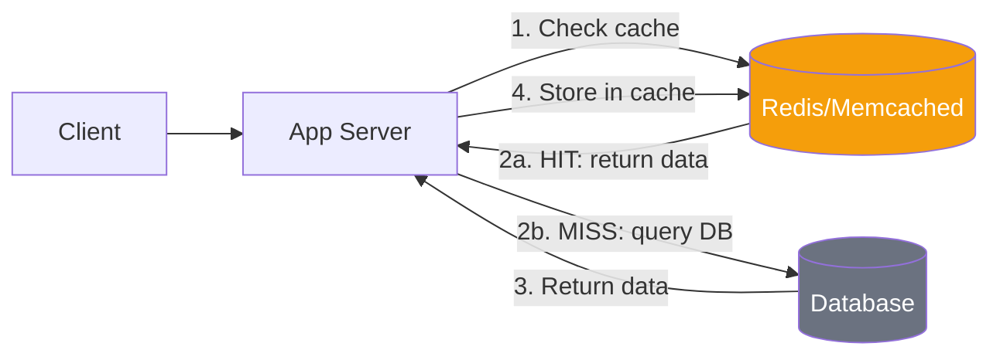

# Distributed Caching in 5 Minutes

!!! danger "Real Incident: Facebook Memcached Failure (2010)"
    A single misconfigured cache invalidation caused a thundering herd — millions of cache misses hit the database simultaneously. MySQL cluster collapsed under 10x normal load. **Cache isn't optional at scale — it's load-bearing infrastructure.**

---

## The One-Liner

A cache stores frequently-accessed data in fast memory (RAM) so you don't hit the slow database for every request.

---

## How It Works

- **Cache Hit**: Data found in cache → return instantly (sub-ms)
- **Cache Miss**: Not in cache → query database → store result in cache → return
- Typical hit rate target: **95-99%** — means 95-99% of reads never touch the DB
- Cache lives in RAM — orders of magnitude faster than disk-based databases

---

## Caching Strategies

| Strategy | Write Path | Read Path | Consistency | Best For |
|---|---|---|---|---|
| **Cache-Aside** | App writes to DB only | App checks cache, fills on miss | Eventual | General purpose (most common) |
| **Write-Through** | App writes to cache + DB | Always from cache | Strong | Read-heavy, consistency matters |
| **Write-Behind** | App writes to cache; async flush to DB | Always from cache | Weak | Write-heavy, can tolerate loss |
| **Read-Through** | Cache loads from DB transparently | Always from cache | Eventual | Simplifies app logic |

---

## Key Trade-offs

| Concern | Impact |
|---|---|
| **Stale data** | Cache may serve outdated results until TTL expires |
| **Cache stampede** | Many requests hit DB simultaneously on cache miss |
| **Memory cost** | RAM is 10-30x more expensive than disk |
| **Invalidation complexity** | "One of the two hard problems in CS" |
| **Cold start** | Empty cache after deploy = all requests hit DB |

---

## Interview Cheat Sheet

- "Cache-aside with TTL of 5 minutes for user profiles — tolerable staleness, simple invalidation"
- "For cache stampede protection: lock on miss — first request fetches, others wait"
- "Redis over Memcached because we need data structures (sorted sets for leaderboards)"
- "Cache invalidation on write — when user updates profile, delete cache key"
- "Consistent hashing to distribute cache keys across a Redis cluster"

---

## When to Use / When NOT to Use

| Use When | Don't Use When |
|---|---|
| Read-heavy workload (>10:1 read:write) | Write-heavy with strong consistency needs |
| Database is the bottleneck | Data changes every request |
| Same data requested repeatedly | Data is unique per request (no reuse) |
| Can tolerate slight staleness | Stale data causes money loss (payments) |

---

## Go Deeper

[Full Distributed Caching Deep Dive →](../../distributedCaching.md)
