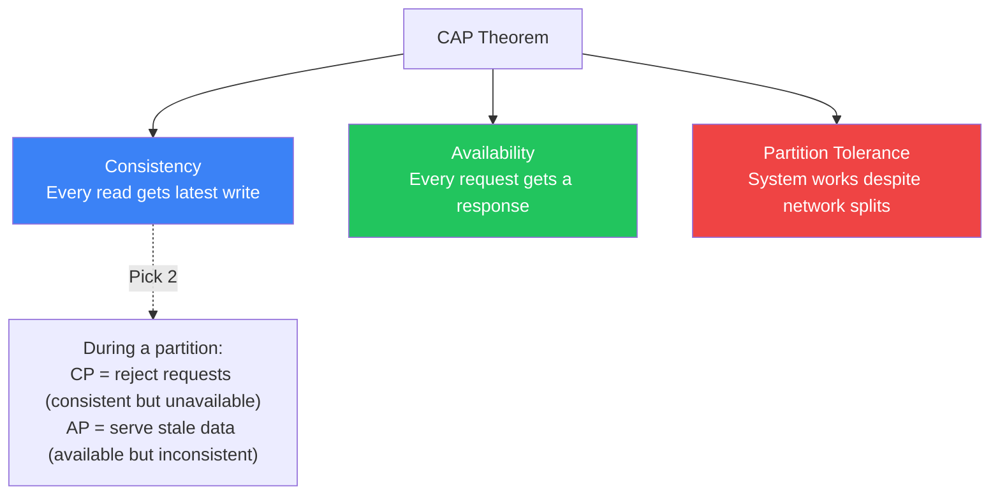

# CAP Theorem in 5 Minutes

!!! danger "Real Incident: Amazon DynamoDB Choice (2007)"
    Amazon's internal systems needed to survive network partitions during peak shopping (Black Friday). They chose AP (Available + Partition-tolerant) — DynamoDB always accepts writes, even during network splits, resolving conflicts later with vector clocks. **The CAP choice defined the architecture of one of the world's largest e-commerce platforms.**

---

## The One-Liner

In a distributed system, when a network partition occurs, you must choose between **Consistency** (all nodes see the same data) and **Availability** (every request gets a response).

---

## How It Works

- **P is not optional** — network partitions WILL happen in distributed systems
- The real choice is: **CP** (consistent but may reject requests) vs **AP** (available but may serve stale data)
- This choice is made **per-operation**, not per-system — a system can be CP for payments, AP for product catalog

---

## Real Systems Classified

| System | Choice | Behavior During Partition |
|---|---|---|
| **ZooKeeper** | CP | Minority partition stops accepting writes |
| **MongoDB** (default) | CP | Primary unavailable → no writes until election |
| **Cassandra** | AP | All nodes accept writes, resolve conflicts later |
| **DynamoDB** | AP | Always writable, last-writer-wins or vector clocks |
| **PostgreSQL** (single) | CA | No partition tolerance (single node) |
| **etcd / Consul** | CP | Raft consensus — majority needed for writes |

---

## Key Trade-offs

| CP System | AP System |
|---|---|
| Strong consistency guaranteed | Eventual consistency |
| May return errors during partition | Always responds |
| Simpler application logic | App must handle conflicts |
| Good for: payments, inventory, locks | Good for: feeds, caches, metrics |
| Example: "Sorry, can't process right now" | Example: "Here's data (might be 5s stale)" |

---

## Interview Cheat Sheet

- "CAP is about behavior DURING network partitions — normally you get all three"
- "P is not a choice — partitions happen. The real decision is C vs A during failure"
- "Most systems choose AP for reads (serve stale) and CP for critical writes (reject if unsure)"
- "PACELC extends CAP: during Partition choose A or C; Else (normal) choose Latency or Consistency"
- "Banking: CP — better to reject a transaction than process it twice. Social feed: AP — stale post is fine"

---

## When to Use Each

| Choose CP When | Choose AP When |
|---|---|
| Financial transactions | Social media feeds |
| Inventory (avoid overselling) | Product catalog / search |
| Distributed locks | User sessions / preferences |
| Leader election | Metrics / analytics |
| Configuration management | Shopping cart (merge later) |

---

## Go Deeper

[Full CAP Theorem Deep Dive →](../../capTheorem.md)
