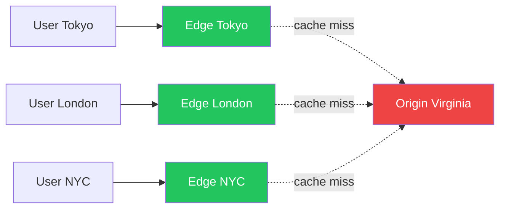

# CDN in 5 Minutes

!!! danger "Real Incident: Reddit Hug of Death"
    A blog goes viral — origin server handles 50 req/s normally, Reddit sends 50,000 req/s. Server dies in 30 seconds. With CDN: 95% served from edge, origin sees 2,500 req/s. **CDN is the difference between going viral and going down.**

---

## The One-Liner

A CDN caches your content on servers spread worldwide so users get data from a nearby location instead of your distant origin server.

---

## How It Works

- **Without CDN**: Tokyo user → 12,000km to Virginia origin → 200ms latency
- **With CDN**: Tokyo user → Tokyo edge (5km) → 5ms latency
- Physics: light in fiber ≈ 200,000 km/s. No engineering beats physics. CDN puts content close.
- Typical cache hit rate: **95%+** — origin only handles 5% of traffic

---

## Push vs Pull

| Aspect | Pull (Origin-Pull) | Push (Origin-Push) |
|---|---|---|
| **How** | Edge fetches on cache miss | You upload proactively |
| **First request** | Slow (miss → origin fetch) | Fast (pre-cached) |
| **Best for** | Most websites (90% of cases) | Netflix pre-positioning, game patches |
| **Cost** | Pay for misses | Pay for storage |

---

## Cache Invalidation

| Strategy | Freshness | Complexity | Best For |
|---|---|---|---|
| **Versioned URLs** (`app.a1b2c3.js`) | Instant | Low | JS, CSS, images |
| **TTL-based** (`max-age=3600`) | Stale up to TTL | Low | General content |
| **Purge API** | Instant | Medium | Breaking news, corrections |
| **Stale-while-revalidate** | Slightly stale, always fast | Medium | High-traffic pages |

---

## Interview Cheat Sheet

- "Static assets with content-hashed URLs + infinite TTL — URL IS the version, zero invalidation"
- "Dynamic content: short TTL (60s) + stale-while-revalidate + purge API for corrections"
- "CDN also terminates TLS, absorbs DDoS, and reduces origin bandwidth costs by 95%"
- "Pull model for everything unless we're pre-positioning large content (video releases)"
- "Multi-CDN (Cloudflare + Fastly) for resilience — DNS failover between them"

---

## When to Use / When NOT to Use

| Use When | Don't Use When |
|---|---|
| Global user base | All users in one region near origin |
| Static/semi-static content | Highly personalized, per-user content |
| High traffic volume | Low traffic (< 1000 req/day) |
| Need DDoS protection | Internal-only services |

---

## Go Deeper

[Full CDN Deep Dive →](../cdn.md)
