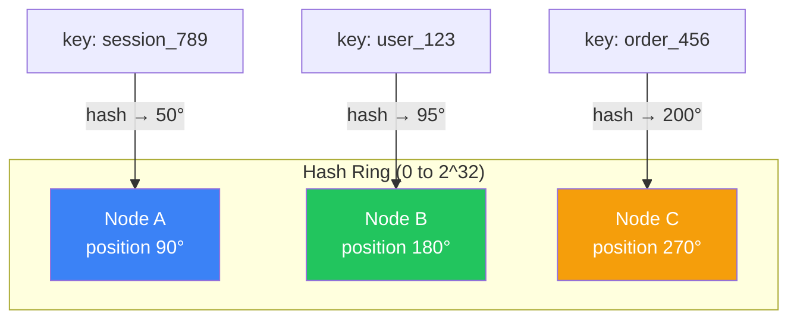

# Consistent Hashing in 5 Minutes

!!! danger "Real Incident: Memcached Cluster Resize at Facebook"
    Adding one server to a 10-node memcached cluster with modulo hashing (`key % N`) invalidated ~90% of the cache. Thundering herd hit the database. With consistent hashing: adding a node moves only **~10% of keys** (1/N). **The difference between a smooth scale-up and a self-inflicted DDoS.**

---

## The One-Liner

Consistent hashing distributes data across nodes using a virtual ring, so adding or removing a node only moves a minimal fraction of keys instead of reshuffling everything.

---

## How It Works

- Both **keys** and **nodes** are hashed onto a circular ring (0 to 2^32)
- Each key is assigned to the **first node clockwise** from its position on the ring
- Add a node: only keys between the new node and its predecessor move (~1/N of total)
- Remove a node: only that node's keys move to the next node clockwise

---

## The Problem It Solves

| Operation | Modulo Hash (`key % N`) | Consistent Hashing |
|---|---|---|
| Add 1 node (10→11) | ~90% keys move | ~9% keys move (1/N) |
| Remove 1 node (10→9) | ~90% keys move | ~11% keys move (1/N) |
| Node failure | Massive cache miss storm | Minimal redistribution |

---

## Virtual Nodes (The Fix for Imbalance)

| Without Virtual Nodes | With Virtual Nodes (150-200 per node) |
|---|---|
| 3 nodes might get 60/20/20 split | 3 nodes get ~33/33/33 split |
| Adding node creates one large gap | Load distributes evenly |
| Simple but unfair | Slightly more memory for ring |

Each physical node maps to 100-200 positions on the ring. More positions = more even distribution.

---

## Interview Cheat Sheet

- "Consistent hashing for any distributed cache, database sharding, or load balancing across dynamic node sets"
- "Virtual nodes (vnodes) solve the imbalance problem — 150-200 vnodes per physical node"
- "Used by: DynamoDB, Cassandra, Memcached, Akamai CDN, Discord"
- "When a node goes down, its load is spread across ALL remaining nodes (not just one neighbor)"
- "Replication: store each key on N consecutive nodes clockwise for fault tolerance"

---

## When to Use / When NOT to Use

| Use When | Don't Use When |
|---|---|
| Nodes join/leave frequently (elastic scaling) | Fixed number of nodes (just use modulo) |
| Cache clusters (Memcached, Redis) | Need range queries (use range partitioning) |
| Distributed hash tables | Small data set that fits on one node |
| CDN edge server selection | Need strict ordering of data |

---

## Go Deeper

[Full Consistent Hashing Deep Dive →](../../consistenthashing.md)
