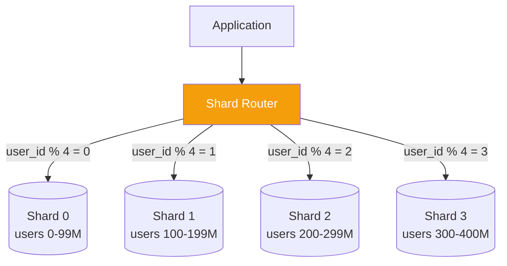

# Database Sharding in 5 Minutes

!!! danger "Real Incident: Instagram's Growth Crisis (2012)"
    Instagram hit 25M users on a single PostgreSQL instance. Write latency spiked from 5ms to 500ms. Emergency sharding of the users table by user_id — 64 logical shards mapped to physical servers. They went from "database on fire" to handling 400M users. **Sharding is painful, but the alternative is hitting a wall.**

---

## The One-Liner

Sharding splits a large database table across multiple machines (shards), each holding a subset of the data, so no single machine becomes the bottleneck.

---

## How It Works

- Pick a **shard key** (e.g., user_id) — determines which shard holds each row
- **Shard router** directs queries to the correct shard based on the key
- Each shard is a fully independent database instance (own CPU, RAM, disk)
- Adding shards = adding capacity (horizontal scaling)

---

## Sharding Strategies

| Strategy | How | Pros | Cons |
|---|---|---|---|
| **Hash-based** | `shard = hash(key) % N` | Even distribution | Resharding is painful |
| **Range-based** | `A-M → shard1, N-Z → shard2` | Easy range queries | Hotspots (popular ranges) |
| **Directory-based** | Lookup table maps key → shard | Flexible | Lookup table = single point of failure |
| **Consistent Hashing** | Hash ring, minimal redistribution | Easy to add/remove shards | More complex implementation |

---

## Key Trade-offs

| Gained | Lost |
|---|---|
| Horizontal write scaling | Cross-shard JOINs (expensive/impossible) |
| Smaller indexes per shard | Cross-shard transactions (2PC needed) |
| Fault isolation (one shard fails ≠ all fail) | Operational complexity (N databases to manage) |
| Better cache efficiency per shard | Resharding is a major migration effort |

---

## Interview Cheat Sheet

- "Shard by user_id — most queries are user-scoped, so single-shard queries"
- "Consistent hashing to minimize data movement when adding shards"
- "Start with logical shards (64-256) mapped to fewer physical machines — scale by splitting mappings"
- "Cross-shard queries: fan out to all shards + merge results (scatter-gather), or denormalize"
- "Avoid sharding until you've exhausted vertical scaling, read replicas, and caching"

---

## When to Use / When NOT to Use

| Use When | Don't Use When |
|---|---|
| Single DB can't handle write volume | Read replicas + caching haven't been tried |
| Data exceeds single machine disk | Table has <100M rows |
| Need fault isolation by tenant | Most queries need cross-shard JOINs |
| Multi-tenant SaaS (shard per tenant) | Strong cross-entity transactions required |

---

## Go Deeper

[Full Database Sharding Deep Dive →](../database-sharding.md)
