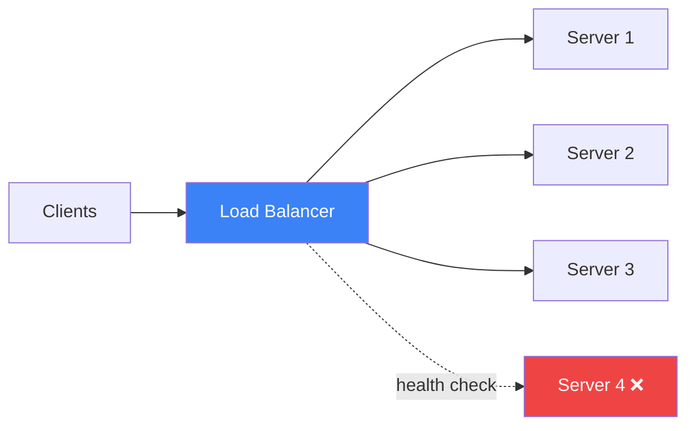

# Load Balancing in 5 Minutes

!!! danger "Real Incident: Reddit, 2023"
    A misconfigured load balancer rule sent 80% of traffic to 2 of 50 servers. Cascading failure brought down all of Reddit for 3 hours. **One bad rule = total outage.**

---

## The One-Liner

A load balancer distributes incoming requests across multiple servers so no single server gets overwhelmed, dies, and takes down your service.

---

## How It Works

- Sits between clients and servers, routing each request to a healthy backend
- Runs **health checks** — removes dead servers from rotation automatically
- Can operate at **Layer 4** (TCP — fast, no inspection) or **Layer 7** (HTTP — smart routing by URL/header)
- Enables **zero-downtime deploys** — drain connections from old servers while routing to new ones

---

## Key Algorithms

| Algorithm | How It Works | Best For |
|---|---|---|
| **Round Robin** | Next server in line | Equal-capacity servers |
| **Least Connections** | Server with fewest active requests | Varying request durations |
| **Weighted** | More traffic to stronger servers | Mixed hardware |
| **IP Hash** | Same client → same server | Session affinity |
| **Random Two Choices** | Pick 2, send to less busy one | Large clusters (Netflix) |

---

## Key Trade-offs

| Concern | L4 Load Balancer | L7 Load Balancer |
|---|---|---|
| **Speed** | Faster (no packet inspection) | Slightly slower |
| **Intelligence** | Blind to content | Route by URL, header, cookie |
| **TLS** | Passes through | Can terminate TLS |
| **Cost** | Cheaper | More expensive |
| **Use case** | TCP/UDP services, databases | HTTP APIs, microservices |

---

## Interview Cheat Sheet

- "I'd put an L7 load balancer (ALB/Nginx) in front of my API servers with least-connections routing"
- "Health checks every 5s — 3 failures removes a server from the pool"
- "For global traffic, DNS-based load balancing first, then regional L7 LBs"
- "Sticky sessions only if absolutely needed — they break horizontal scaling"
- "Auto-scaling group behind the LB adds/removes servers based on CPU/request count"

---

## When to Use / When NOT to Use

| Use When | Don't Use When |
|---|---|
| Multiple backend servers | Single server (just add more RAM) |
| Need high availability | Traffic is below 100 req/s on one box |
| Zero-downtime deploys needed | Service is stateless and behind a CDN |
| Traffic is unpredictable/bursty | All requests go to same database anyway |

---

## Go Deeper

[Full Load Balancing Deep Dive →](../../loadbalancer.md)
