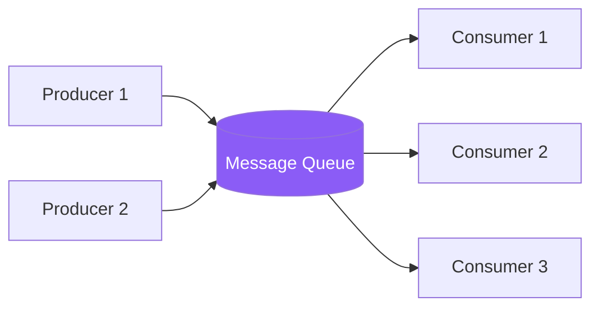

# Message Queues in 5 Minutes

!!! danger "Real Incident: Amazon Prime Day 2018"
    Order service overwhelmed payment service with 300K req/s (10x normal). Direct synchronous calls caused cascading timeouts. Fix: queue between order and payment — orders accepted instantly, payments processed at payment service's own pace. **Queues turn "overwhelming spike" into "manageable stream."**

---

## The One-Liner

A message queue decouples producers from consumers — the sender drops a message and moves on; the receiver processes it when ready.

---

## How It Works

- **Producer** publishes a message to the queue and immediately gets an acknowledgment
- **Queue** durably stores the message until a consumer picks it up
- **Consumer** pulls (or gets pushed) the message, processes it, then acknowledges
- If consumer crashes mid-processing, message goes back to queue (at-least-once delivery)

---

## Queue vs Pub/Sub vs Stream

| Model | Delivery | Consumers | Replay | Example |
|---|---|---|---|---|
| **Queue** | One consumer gets each message | Competing consumers | No | SQS, RabbitMQ |
| **Pub/Sub** | All subscribers get every message | Fan-out | No | SNS, Redis Pub/Sub |
| **Stream** | Consumer groups, offset-based | Competing + fan-out | Yes (retention) | Kafka, Kinesis |

---

## Key Guarantees

| Guarantee | Meaning | Trade-off |
|---|---|---|
| **At-most-once** | Fire and forget | Fast but may lose messages |
| **At-least-once** | Retry until ACK'd | May get duplicates (need idempotency) |
| **Exactly-once** | Deduplicated delivery | Expensive, complex (Kafka transactions) |
| **Ordering** | FIFO within partition | Limits parallelism |

---

## Interview Cheat Sheet

- "Queue between any two services with different throughput capacities — absorbs spikes"
- "At-least-once + idempotent consumers — safest default for most systems"
- "Dead letter queue (DLQ) for messages that fail N times — prevents infinite retry loops"
- "Kafka for event streaming (replay, high throughput); SQS for simple task queues"
- "Visibility timeout: if consumer doesn't ACK within X seconds, message becomes available again"

---

## When to Use / When NOT to Use

| Use When | Don't Use When |
|---|---|
| Services have different throughput | Need synchronous response (user waiting) |
| Spiky/unpredictable traffic | Latency must be <10ms end-to-end |
| Need retry/failure isolation | Simple request-response API call suffices |
| Want to decouple teams/services | Single monolith (just call the method) |

---

## Go Deeper

[Full Message Queues Deep Dive →](../message-queues.md)
