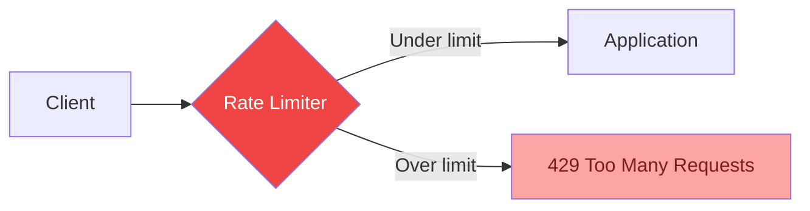

# Rate Limiting in 5 Minutes

!!! danger "Real Incident: GitHub API Abuse (2023)"
    A misconfigured CI pipeline sent 50,000 API requests/minute to GitHub from a single token. Without rate limiting, it would have degraded the API for all users. GitHub's rate limiter returned `429 Too Many Requests` after 5,000/hour, protecting the platform. **Rate limiting is the immune system of your API.**

---

## The One-Liner

Rate limiting controls how many requests a client can make in a given time window, protecting your service from abuse, bugs, and overload.

---

## How It Works

- Client sends request → rate limiter checks counter for that client/IP/API key
- **Under limit**: forward request to application, increment counter
- **Over limit**: reject immediately with `429` + `Retry-After` header
- Counters stored in fast in-memory store (Redis) for distributed systems

---

## Algorithms

| Algorithm | How | Pros | Cons | Best For |
|---|---|---|---|---|
| **Fixed Window** | Count per time window (e.g., per minute) | Simple | Burst at window edges (2x spike) | Simple APIs |
| **Sliding Window Log** | Store timestamp of each request | Accurate | Memory-heavy (stores all timestamps) | Low-volume, precise |
| **Sliding Window Counter** | Weighted average of current + previous window | Good accuracy, low memory | Slight approximation | Most APIs (best default) |
| **Token Bucket** | Tokens refill at steady rate, request costs 1 token | Allows controlled bursts | Slightly complex | AWS, Stripe, most cloud APIs |
| **Leaky Bucket** | Requests queue and drain at fixed rate | Smooth output rate | No bursts allowed | Steady-rate processing |

---

## Key Trade-offs

| Strict Limiting | Lenient Limiting |
|---|---|
| Protects backend aggressively | Better user experience |
| May reject legitimate spikes | Risk of overload during abuse |
| Simple to reason about | Needs burst allowance logic |
| `429` frustrates good clients | Bad actors get more runway |

---

## Interview Cheat Sheet

- "Token bucket for most APIs — allows short bursts while enforcing average rate"
- "Sliding window counter for the best accuracy-to-memory trade-off"
- "Distributed rate limiting: Redis + Lua script for atomic increment-and-check"
- "Rate limit by: API key (per-customer), IP (anonymous), user_id (authenticated)"
- "Return headers: `X-RateLimit-Remaining`, `X-RateLimit-Reset`, `Retry-After`"

---

## When to Use / When NOT to Use

| Use When | Don't Use When |
|---|---|
| Public API (protect from abuse) | Internal service-to-service (use circuit breakers) |
| Shared resource (DB, external API) | Single-user local application |
| Need fair multi-tenant access | Latency-critical path (adds ~1ms) |
| DDoS/bot protection | Already behind a WAF/CDN with rate limiting |

---

## Go Deeper

[Full Rate Limiting Deep Dive →](../../ratelimiting.md)
