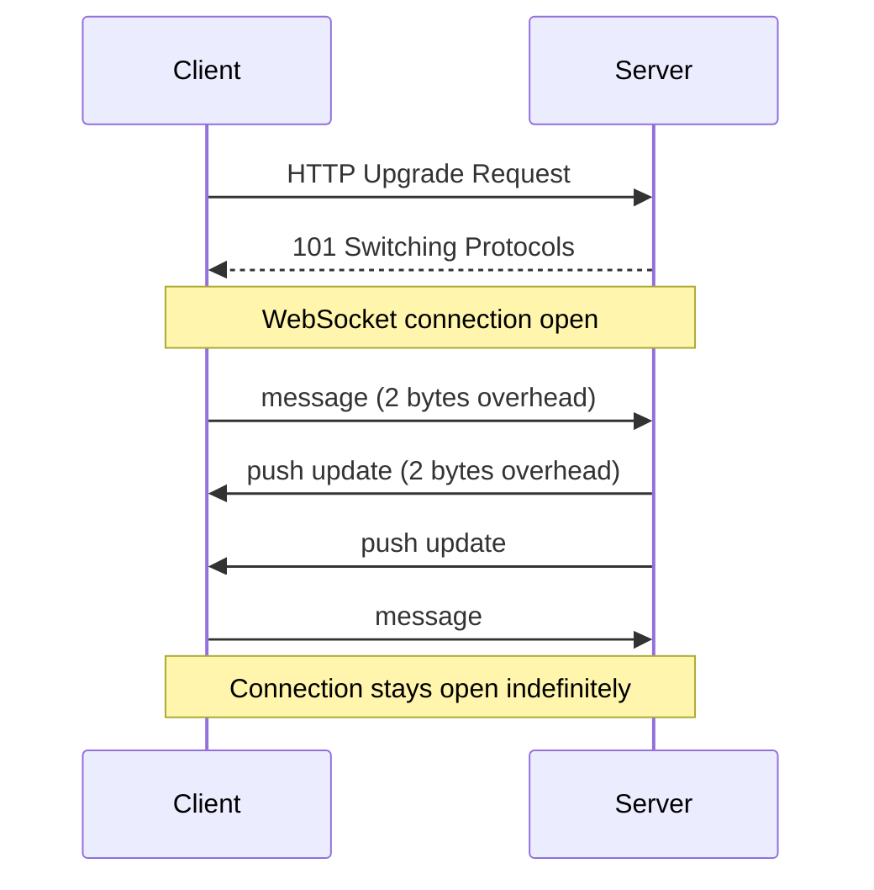

# WebSockets & Real-Time in 5 Minutes

!!! danger "Real Incident: Slack's Architecture Evolution"
    Slack v1 used long polling — 1M users each holding connections open for 30s, then reconnecting. Constant connection churn, brutal server costs. Switch to WebSockets: persistent connections, **40% less infrastructure**, instant message delivery.

---

## The One-Liner

WebSocket is a persistent, bidirectional connection between client and server — both sides can send data anytime without creating new HTTP requests.

---

## How It Works

- Starts as normal HTTP request, then **upgrades** to WebSocket protocol
- After upgrade: full-duplex communication over a single TCP connection
- Frame overhead: **2-14 bytes** (vs ~800 bytes per HTTP request)
- Connection stays open until explicitly closed by either side

---

## The Real-Time Spectrum

| Method | Direction | Overhead | Latency | Best For |
|---|---|---|---|---|
| **Short Polling** | Client → Server | High (new request every N sec) | Up to N seconds | Simple dashboards |
| **Long Polling** | Client → Server | Medium (hold connection) | Near-instant | Notifications |
| **SSE** | Server → Client only | Low (single HTTP stream) | Near-instant | Live feeds, stock tickers |
| **WebSocket** | Bidirectional | Minimal (2-byte frames) | Sub-millisecond | Chat, gaming, collaboration |

---

## Key Trade-offs

| WebSocket | SSE (Server-Sent Events) |
|---|---|
| Bidirectional | Server → Client only |
| Custom protocol (harder to debug) | Standard HTTP (curl-friendly) |
| Manual reconnection logic | Auto-reconnect built-in |
| Works over HTTP/1.1 only | Works over HTTP/2 (multiplexed) |
| Best for: chat, gaming, collaboration | Best for: notifications, live scores |

---

## Interview Cheat Sheet

- "WebSocket for bidirectional real-time (chat, multiplayer). SSE for one-way server push (notifications, feeds)"
- "Connection management at scale: 1M WebSockets = 1M open file descriptors — need connection servers"
- "Horizontal scaling: sticky sessions or a pub/sub backbone (Redis) to route messages to correct server"
- "Heartbeat every 30s to detect dead connections — both client and server should ping"
- "Fallback: if WebSocket blocked by corporate proxy, fall back to long polling"

---

## When to Use / When NOT to Use

| Use When | Don't Use When |
|---|---|
| Real-time bidirectional (chat, gaming) | Simple CRUD API |
| Sub-second latency required | Updates every 30s+ (just poll) |
| High-frequency server pushes | One-way server push only (use SSE) |
| Collaborative editing (Google Docs) | Client behind restrictive proxy/firewall |

---

## Go Deeper

[Full WebSockets & SSE Deep Dive →](../websockets-sse.md)
