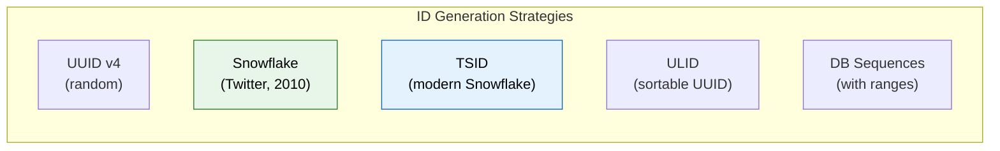
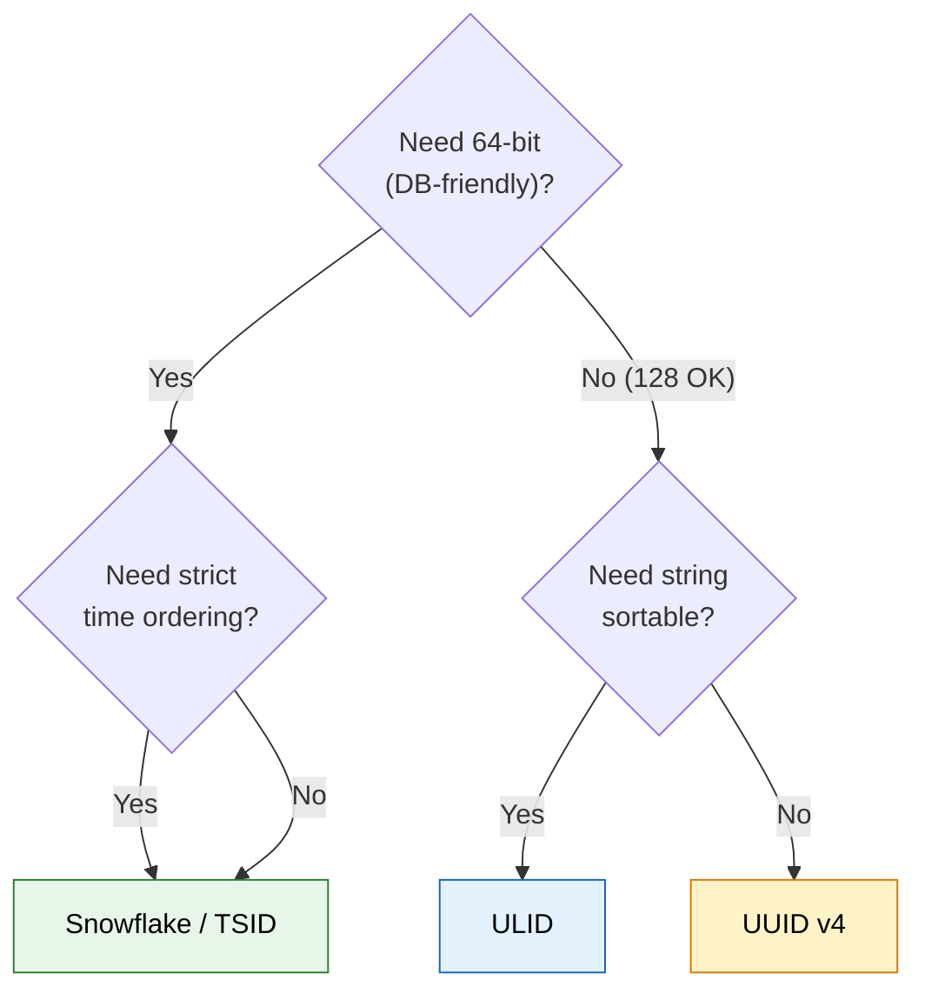

# Unique ID Generation in Distributed Systems

> **Generate 10,000+ unique, sortable, non-colliding IDs per second across hundreds of servers — without any coordination.**

---

!!! abstract "Real-World Analogy"
    Think of **license plates**. Each state (server) has its own prefix (machine ID), the year (timestamp) provides ordering, and the sequential number ensures uniqueness within that state. No two states need to "call each other" to avoid duplicates — the system is coordination-free by design.

---

## Why Auto-Increment Doesn't Work

| Problem | Why |
|---------|-----|
| Single point of failure | One DB generates all IDs → bottleneck |
| Scalability | Can't distribute across multiple servers |
| Predictable | Competitors can guess your user count, order volume |
| No time-ordering | IDs don't indicate when something was created |
| Cross-service | Different services can't generate IDs independently |

---

## Approaches Compared



| Strategy | Length | Sortable? | Coordination-Free? | Collision Risk | Throughput |
|----------|--------|-----------|--------------------|--------------|-----------| 
| **UUID v4** | 128 bit | No | Yes | ~negligible | Unlimited |
| **Snowflake** | 64 bit | Yes (time) | Yes | Zero (by design) | 4096/ms/machine |
| **TSID** | 64 bit | Yes (time) | Yes | Zero | 4096/ms/machine |
| **ULID** | 128 bit | Yes (time) | Yes | ~negligible | Unlimited |
| **DB Range** | Variable | Yes | No (needs DB) | Zero | Batch-limited |

---

## Twitter Snowflake (The Gold Standard)

### Bit Layout (64 bits total)

```
┌────────────────────────────────────────────────────────────────────────┐
│ 0 │ Timestamp (41 bits)          │ Machine ID (10 bits) │ Sequence (12 bits) │
│   │ milliseconds since epoch     │ 0-1023 machines      │ 0-4095 per ms      │
└────────────────────────────────────────────────────────────────────────┘
  1         41 bits                      10 bits              12 bits
```

| Component | Bits | Range | Purpose |
|-----------|------|-------|---------|
| Sign bit | 1 | Always 0 | Keeps ID positive |
| Timestamp | 41 | ~69 years from epoch | Time-ordering |
| Machine ID | 10 | 1024 machines | No coordination needed |
| Sequence | 12 | 4096 per millisecond | Uniqueness within same ms |

### Implementation

```java
public class SnowflakeIdGenerator {
    private static final long EPOCH = 1704067200000L;  // 2024-01-01 00:00:00 UTC
    private static final long MACHINE_ID_BITS = 10;
    private static final long SEQUENCE_BITS = 12;
    private static final long MAX_MACHINE_ID = (1L << MACHINE_ID_BITS) - 1;  // 1023
    private static final long MAX_SEQUENCE = (1L << SEQUENCE_BITS) - 1;       // 4095

    private final long machineId;
    private long lastTimestamp = -1;
    private long sequence = 0;

    public SnowflakeIdGenerator(long machineId) {
        if (machineId < 0 || machineId > MAX_MACHINE_ID) {
            throw new IllegalArgumentException("Machine ID must be 0-" + MAX_MACHINE_ID);
        }
        this.machineId = machineId;
    }

    public synchronized long nextId() {
        long timestamp = System.currentTimeMillis();

        if (timestamp == lastTimestamp) {
            sequence = (sequence + 1) & MAX_SEQUENCE;
            if (sequence == 0) {
                // Sequence exhausted in this millisecond — wait for next ms
                timestamp = waitNextMillis(lastTimestamp);
            }
        } else {
            sequence = 0;
        }

        if (timestamp < lastTimestamp) {
            throw new RuntimeException("Clock moved backwards!");
        }

        lastTimestamp = timestamp;

        return ((timestamp - EPOCH) << (MACHINE_ID_BITS + SEQUENCE_BITS))
             | (machineId << SEQUENCE_BITS)
             | sequence;
    }

    private long waitNextMillis(long lastTs) {
        long ts = System.currentTimeMillis();
        while (ts <= lastTs) {
            ts = System.currentTimeMillis();
        }
        return ts;
    }
}
```

### Properties

```java
// Generated IDs are:
// 1. Unique — machineId prevents collisions across servers
// 2. Roughly time-sorted — later IDs have higher timestamps
// 3. 64-bit — fits in a long, efficient for indexing
// 4. Decentralized — no coordination between machines

// Example IDs (decimal):
// 7189234567890001  (server 1, time T)
// 7189234567890002  (server 1, time T, next sequence)
// 7189234572340001  (server 2, time T+5ms)
```

---

## ULID — Universally Unique Lexicographically Sortable Identifier

```
01ARZ3NDEKTSV4RRFFQ69G5FAV
└──────────┘└────────────────┘
 Timestamp     Randomness
  (48 bits)    (80 bits)
  10 chars     16 chars
```

```java
// Using ulid-creator library
import com.github.f4b6a3.ulid.UlidCreator;

String ulid = UlidCreator.getMonotonicUlid().toString();
// "01HXYZ3NDEKTSV4RRFFQ69G5FAV"
// Lexicographically sortable — string comparison = time ordering!
```

| ULID Advantage | Explanation |
|---------------|-------------|
| String-sortable | `"01H..." < "01J..."` → alphabetical = chronological |
| 128 bits | Same size as UUID, drop-in replacement |
| URL-safe | Base32 encoding, no special characters |
| Monotonic option | Guarantees ordering within same millisecond |

---

## UUID — When to (Still) Use It

```java
// UUID v4 — random, no ordering
UUID id = UUID.randomUUID();  // "550e8400-e29b-41d4-a716-446655440000"

// UUID v7 (Java 21+ draft) — time-ordered, random tail
// Not yet in standard Java, but coming
```

| Use UUID When | Use Snowflake/TSID When |
|-------------|------------------------|
| No ordering needed | Need time-sorted IDs |
| Low throughput (< 1K/s) | High throughput (> 10K/s) |
| Don't care about size (128 bits) | Need compact 64-bit IDs |
| No machine coordination possible | Can assign machine IDs |
| Database supports UUID type well | Need B-tree friendly ordering |

!!! warning "UUID v4 and Database Performance"
    Random UUIDs as primary keys cause **B-tree fragmentation** in PostgreSQL/MySQL. Each insert goes to a random page → no locality → slow writes at scale. Time-sorted IDs (Snowflake, ULID, UUID v7) insert sequentially → B-tree stays compact.

---

## Machine ID Assignment

| Strategy | How | Trade-off |
|----------|-----|-----------|
| Manual configuration | Env var or config file per server | Simple but error-prone |
| ZooKeeper / etcd | Lease-based sequential assignment | Reliable but adds dependency |
| Database sequence | Each server claims a range | Simple, requires DB at startup |
| Kubernetes pod ordinal | StatefulSet pod index | Perfect for K8s deployments |
| MAC address hash | Hash last 10 bits of MAC | No coordination but collision possible |

---

## Clock Skew Problem

!!! danger "What Happens When the Clock Goes Backwards?"
    NTP corrections can move the system clock backwards. If `currentTime < lastTimestamp`, Snowflake would generate duplicate IDs or throw an error.
    
    **Solutions:**
    
    1. **Refuse to generate** — throw exception, let caller retry (Twitter's approach)
    2. **Wait** — spin until clock catches up (works for small skews)
    3. **Use logical clock** — increment a counter regardless of wall clock
    4. **Hybrid** — tolerate small skews (< 5ms), alert on large ones

---

## Choosing the Right Strategy



---

## Interview Questions

??? question "Why not just use auto-increment across all services?"

    **Answer:** Auto-increment requires a single authority (one database sequence). In distributed systems this creates a bottleneck and single point of failure. Even with multi-master replication (odd/even IDs), it doesn't scale beyond a handful of nodes and creates coordination overhead. Snowflake-style IDs are generated locally with zero network calls.

??? question "How does Snowflake guarantee uniqueness without coordination?"

    **Answer:** The 10-bit machine ID is assigned once at startup (via config, ZooKeeper, or K8s ordinal). Within a single machine, the combination of `timestamp + sequence` is unique because: same millisecond uses incrementing sequence (0-4095), different milliseconds reset the sequence. Since no two machines share a machine ID, and no single machine generates more than 4096 IDs per millisecond, global uniqueness is guaranteed mathematically.

??? question "What's the problem with UUID v4 as a primary key in PostgreSQL?"

    **Answer:** UUID v4 is random — inserts scatter across the B-tree index instead of appending at the end. This causes:
    
    - **Page splits** — existing pages must be split to accommodate random inserts
    - **Cache misses** — no locality, random pages pulled from disk
    - **Write amplification** — more I/O per insert
    - **Index bloat** — fragmented B-tree wastes space
    
    Solution: Use time-sorted IDs (ULID, UUID v7, Snowflake) that insert sequentially.
